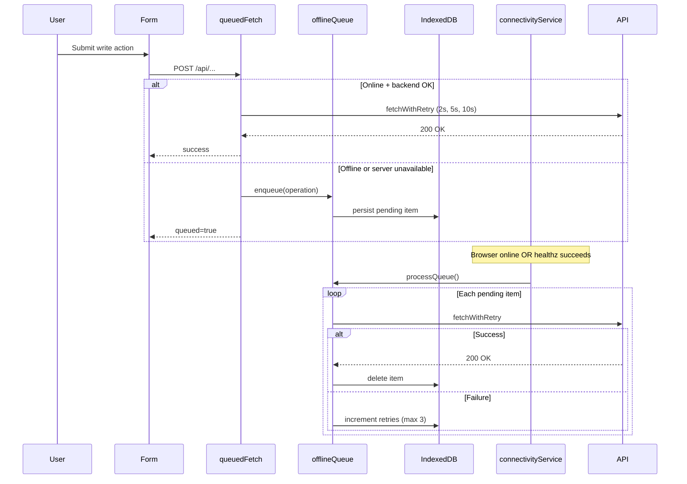

# Connectivity & Offline Architecture

Production refactor replacing the global blocking `OfflineScreen` with non-blocking connectivity awareness, offline write queue, and local draft preservation.

## Architecture Diagram

```mermaid
flowchart TB
  subgraph UI
    Banner[ConnectivityBanner]
    Sync[SyncStatusIndicator]
    Pages[All App Pages]
    SysStatus[System Status Admin]
  end

  subgraph Services
    Ctx[ConnectivityProvider]
    Conn[connectivityService]
    Queue[offlineQueue]
    Retry[fetchWithRetry]
    Draft[draftService]
    QApi[queuedFetch]
  end

  subgraph Storage
    IDB[(IndexedDB cwp-offline)]
    LS[(localStorage fallback)]
  end

  subgraph External
    Browser[navigator.onLine events]
    API[/api/healthz + REST API]
    SW[Service Worker / PWA]
  end

  Browser --> Conn
  Conn -->|poll + events| API
  Conn --> Ctx
  Queue --> Ctx
  Ctx --> Banner
  Ctx --> Sync
  Ctx --> SysStatus
  Pages --> QApi
  QApi --> Retry
  QApi --> Queue
  QApi --> API
  Queue --> IDB
  Draft --> IDB
  Queue -.-> LS
  Draft -.-> LS
  Conn -->|online| Queue
  SW -.-> Pages
```

## Queue Sync Flow



---

## Files Removed

| File | Reason |
|------|--------|
| `artifacts/cwp-platform/src/components/pwa/OfflineScreen.tsx` | Global full-screen blocking overlay |

## Files Added

| File | Purpose |
|------|---------|
| `src/services/idb.ts` | IndexedDB helper |
| `src/services/connectivityService.ts` | Connectivity state machine |
| `src/services/ConnectivityContext.tsx` | React context provider |
| `src/services/apiRetry.ts` | Exponential backoff retry (2s, 5s, 10s) |
| `src/services/offlineQueue.ts` | Offline write queue + auto-sync |
| `src/services/draftService.ts` | Form draft persistence |
| `src/services/queuedApi.ts` | Queue-aware fetch wrapper |
| `src/hooks/useFormDraft.ts` | Auto-save/restore form hook |
| `src/lib/moduleErrors.ts` | Module-specific error copy |
| `src/components/connectivity/ConnectivityBanner.tsx` | Non-blocking top banner |
| `src/components/connectivity/SyncStatusIndicator.tsx` | Synced / Syncing / Pending pill |
| `src/pages/admin/SystemStatus.tsx` | Admin diagnostics panel |

## Components Modified

| File | Change |
|------|--------|
| `App.tsx` | `ConnectivityProvider` + banner; removed `OfflineScreen`; added `/admin/settings/system` route |
| `PanelShell.tsx` | Mobile header sync indicator |
| `AdminSidebar.tsx` | System Status nav + desktop sync indicator |
| `CustomerLayout.tsx` | Sync indicator in app bar |
| `pages/admin/Expenses.tsx` | `queuedFetch`, drafts, module errors |
| `pages/customer/BookService.tsx` | Draft preservation, module errors |
| `vite.config.ts` | Comment update (PWA unchanged) |

---

## IndexedDB Schema

**Database:** `cwp-offline` (version 1)

### Store: `queue`

| Field | Type | Notes |
|-------|------|-------|
| `id` | string (key) | UUID |
| `type` | `booking \| customer \| expense \| invoice \| inventory \| note` | Operation category |
| `label` | string | Human-readable label |
| `url` | string | Absolute API URL |
| `method` | string | HTTP method |
| `headers` | Record<string, string> | Includes auth when queued |
| `body` | string \| null | JSON payload |
| `createdAt` | ISO string | Enqueue time |
| `retries` | number | Sync attempts |
| `status` | `pending \| syncing \| failed` | Queue state |
| `lastError` | string? | Last sync error |

**Indexes:** `status`, `createdAt`

### Store: `drafts`

| Field | Type | Notes |
|-------|------|-------|
| `key` | string (key) | e.g. `admin-expense-form` |
| `data` | unknown | Serialized form state |
| `updatedAt` | ISO string | Last save time |

**Fallback:** `localStorage` keys `cwp_offline_queue_fallback`, `cwp_draft_{key}` when IndexedDB unavailable.

---

## Connectivity States

| State | Trigger | Banner copy |
|-------|---------|-------------|
| `online` | Browser online + `/api/healthz` OK | Hidden |
| `offline` | `navigator.onLine === false` | No Internet Connection |
| `server_unavailable` | Online but health check fails | Server temporarily unavailable |
| `recovering` | Reconnect / cold start in progress | Starting server… |

Health check timeout: **30s** (Render cold-start tolerant). Poll interval: **45s**. No page reloads.

---

## Migration Notes

1. **Deploy frontend only** — no backend or DB migration required.
2. **Existing PWA installs** — service worker auto-updates via `registerType: "autoUpdate"`. Users may need one refresh after deploy.
3. **`offline.html`** — kept for Workbox precache; no longer used as navigation fallback. App shell always loads; banner handles degraded states.
4. **IndexedDB** — created lazily on first queue/draft write. Clearing site data removes queued ops and drafts.
5. **Integrating more modules** — use `queuedFetch()` for writes and `useFormDraft()` for forms. Import messages from `@/lib/moduleErrors`.
6. **Admin diagnostics** — Settings → System Status (`/admin/settings/system`).

### Example: queued write

```ts
import { queuedFetch } from "@/services/queuedApi";
import { moduleError, queuedSuccessMessage } from "@/lib/moduleErrors";

const result = await queuedFetch("/api/expenses", {
  method: "POST",
  headers: { "Content-Type": "application/json" },
  body: JSON.stringify(payload),
}, { operationType: "expense", label: "Record expense" });

if (result.queued) {
  toast({ title: queuedSuccessMessage("Expense") });
} else if (!result.ok || !result.response.ok) {
  toast({ title: moduleError("expenses", "save"), variant: "destructive" });
}
```

### Example: form draft

```ts
const { value, setValue, clearDraft } = useFormDraft("my-form-key", defaultValues);
// setValue auto-saves to IndexedDB after 400ms debounce
```

---

## PWA Features Retained

- `vite-plugin-pwa` + Workbox precache
- Manifests (customer, staff, admin, franchisee)
- Install banners (`PwaInstallBanner`)
- Icons, splash, service worker registration
- Static `offline.html` asset (non-blocking)
