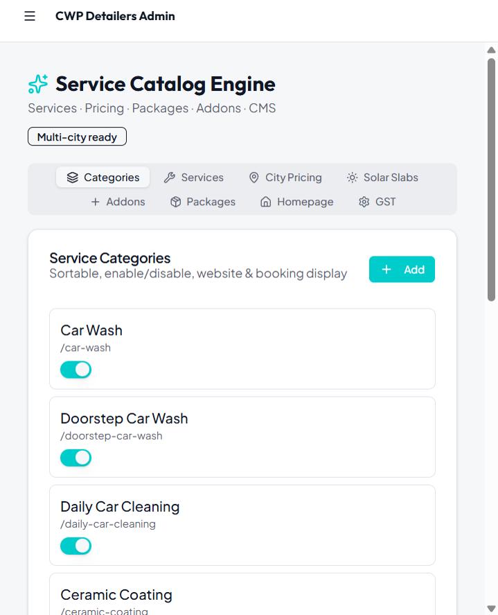
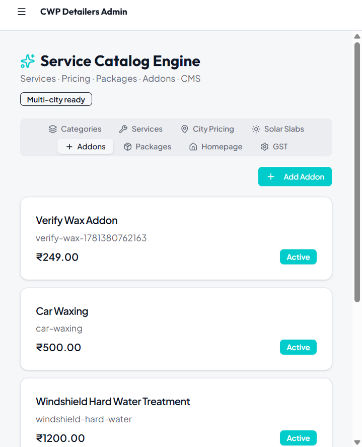
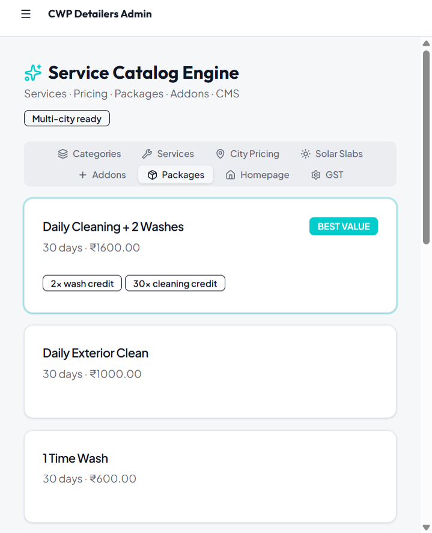
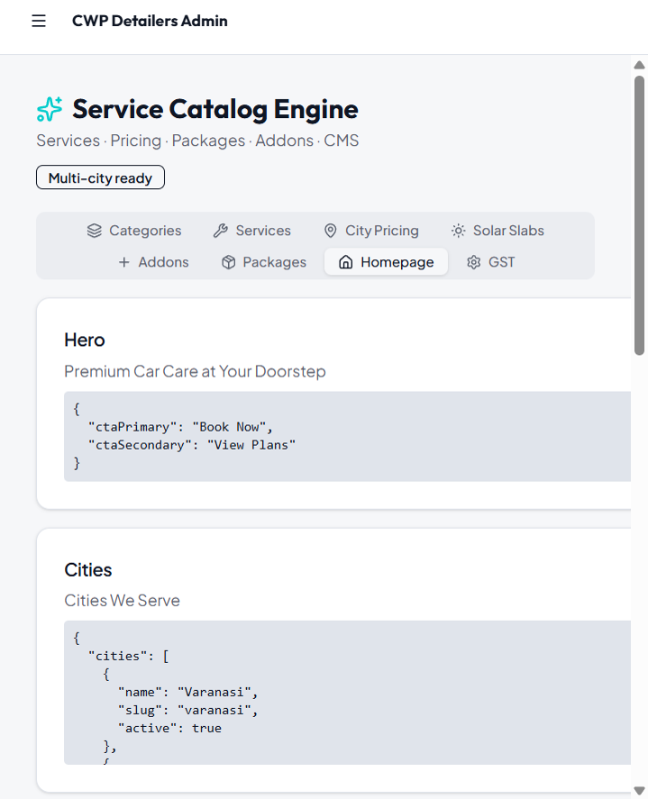
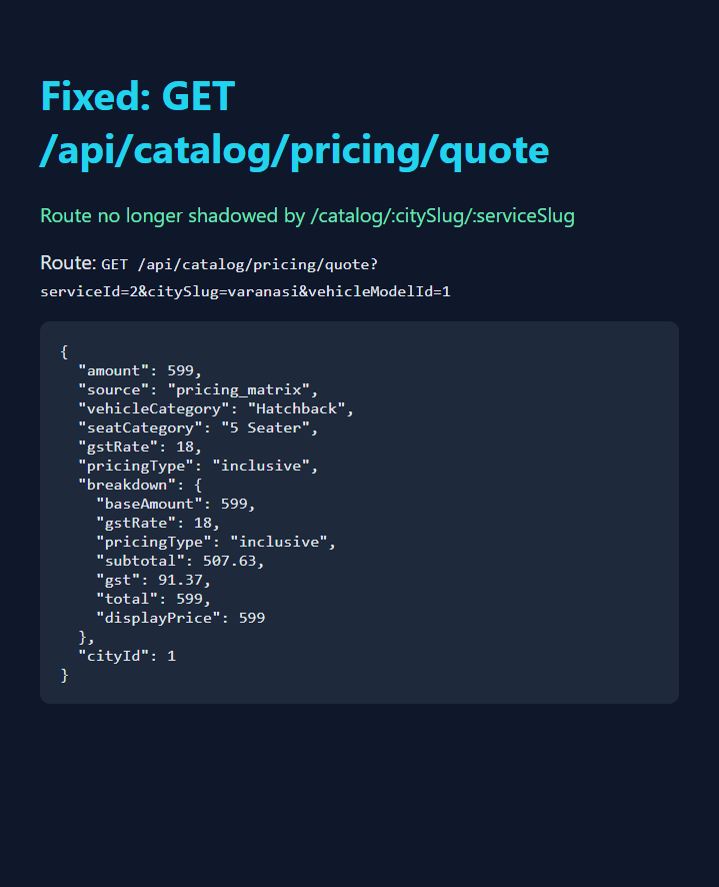

# Service Catalog Fix Verification Report

**Date:** 2026-06-14  
**Scope:** Verification findings only (P0 admin permissions + P1 pricing route)  
**Automated check:** `pnpm --filter @workspace/scripts run verify:catalog` → **25/25 passed**

---

## Fixes Applied

### P0 — Admin Permissions

| Change | File |
|--------|------|
| Added resources `catalog`, `pricing`, `packages`, `addons` to permission matrix | `scripts/src/seed-permissions.ts` |
| Admin/superadmin granted full actions on all catalog resources (incl. `masters`) | `scripts/src/seed-permissions.ts` |
| Stopped blanket `masters` guard on all authenticated `/catalog/*` GETs | `artifacts/api-server/src/middlewares/permissions.ts` |
| Mapped catalog routes to granular resources; public GETs bypass auth for anonymous + admin | `artifacts/api-server/src/middlewares/permissions.ts` |
| Load `.env` in permissions seed script | `scripts/src/seed-permissions.ts` |

**Deploy step run:** `pnpm --filter @workspace/scripts run seed:permissions` → 341 permission rows inserted.

### P1 — Pricing Route Conflict

| Change | File |
|--------|------|
| Moved `GET /catalog/pricing/quote` **before** `GET /catalog/:citySlug/:serviceSlug` | `artifacts/api-server/src/routes/service-catalog.ts` |
| Added reserved-segment list so `/catalog/packages/:id` is not treated as city SEO | `artifacts/api-server/src/middlewares/permissions.ts` |
| Added automated checks for public + admin pricing quote | `scripts/src/verify-catalog.ts` |

---

## P0 Verification — Admin Tabs (logged in as Admin)

**Account:** phone `9999999999` · password `admin123` · route `/admin/catalog`

### Categories Tab

| Field | Value |
|-------|-------|
| **Screenshot** |  |
| **Route** | UI: `/admin/catalog` (Categories) · API: `GET /api/masters/service-categories` |
| **Test data** | 11 seeded categories (e.g. Doorstep Car Wash, Solar Cleaning, Detailing) |
| **Result** | **Pass** — list renders with toggle switches; API returns **200** with 11 rows |

**API response (truncated):**
```json
[
  { "id": 1, "name": "Car Wash", "slug": "car-wash", "isActive": true },
  { "id": 6, "name": "Solar Cleaning", "slug": "solar-cleaning", "isActive": true }
]
```

### Addons Tab

| Field | Value |
|-------|-------|
| **Screenshot** |  |
| **Route** | UI: `/admin/catalog` (Addons) · API: `GET /api/catalog/addons` |
| **Test data** | 5 addons including Car Waxing ₹500, Interior Vacuum ₹300 |
| **Result** | **Pass** — addon cards visible while authenticated; admin GET **200** |

### Packages Tab

| Field | Value |
|-------|-------|
| **Screenshot** |  |
| **Route** | UI: `/admin/catalog` (Packages) · API: `GET /api/catalog/packages?citySlug=varanasi` |
| **Test data** | 4 Wash Package, Daily Cleaning + 2 Washes (BEST VALUE), etc. |
| **Result** | **Pass** — package cards with entitlement badges render; admin GET **200** |

### Homepage Tab

| Field | Value |
|-------|-------|
| **Screenshot** |  |
| **Route** | UI: `/admin/catalog` (Homepage) · API: `GET /api/catalog/homepage` |
| **Test data** | Sections: `hero`, `cities`, `testimonials`, `stats`, `faqs`, `contact` |
| **Result** | **Pass** — CMS section cards show seeded JSON content; admin GET **200** |

### Admin Permission Rows (DB)

Automated check confirms admin has **5 actions each** on: `masters`, `catalog`, `pricing`, `packages`, `addons` (25 rows total for these resources).

```
✓ admin permission:masters
✓ admin permission:catalog
✓ admin permission:pricing
✓ admin permission:packages
✓ admin permission:addons
```

---

## P1 Verification — Pricing Quote Route

| Field | Value |
|-------|-------|
| **Screenshot** |  |
| **Route** | `GET /api/catalog/pricing/quote?serviceId=2&citySlug=varanasi&vehicleModelId=1` |
| **Test data** | Premium Wash (serviceId 2) · Varanasi · Hatchback vehicle model 1 |
| **Result** | **Pass** — previously returned `404 {"error":"City not found"}` (shadowed route); now returns pricing JSON |

**Before fix:** `404 {"error":"City not found"}` — `/catalog/pricing/quote` matched `/catalog/:citySlug/:serviceSlug` with `citySlug=pricing`.

**After fix — public API response:**
```json
{
  "amount": 599,
  "source": "pricing_matrix",
  "vehicleCategory": "Hatchback",
  "seatCategory": "5 Seater",
  "gstRate": 18,
  "pricingType": "inclusive",
  "breakdown": {
    "baseAmount": 599,
    "subtotal": 507.63,
    "gst": 91.37,
    "total": 599,
    "displayPrice": 599
  },
  "cityId": 1
}
```

**After fix — admin-authenticated same route:** identical **200** response (amount 599).

### Automated Verification (`verify:catalog`)

```
✓ GET /catalog/pricing/quote?serviceId=2&citySlug=varanasi&vehicleModelId=1
✓ pricing/quote returns amount
✓ admin GET /catalog/pricing/quote
```

Full run: **25/25 passed**

---

## Files Changed

| File | Purpose |
|------|---------|
| `scripts/src/seed-permissions.ts` | New catalog resources + env loading |
| `artifacts/api-server/src/middlewares/permissions.ts` | Guard logic fix |
| `artifacts/api-server/src/routes/service-catalog.ts` | Route ordering fix |
| `scripts/src/verify-catalog.ts` | Automated admin + pricing quote checks |

---

## Post-Deploy Checklist

1. Run `pnpm --filter @workspace/scripts run seed:permissions` on each environment
2. Restart API server after deploy (route/guard changes)
3. Run `pnpm --filter @workspace/scripts run verify:catalog` — expect **25/25 passed**

---

*Fix verification only — no new catalog features added.*
