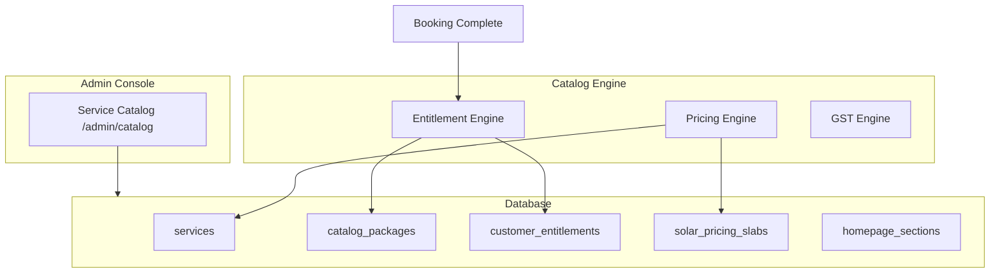

# CWP Service Catalog Engine — Implementation Report

**Date:** 14 June 2026  
**Status:** Phase 1 complete — core engine implemented  
**Gap analysis:** See [SERVICE_CATALOG_GAP_ANALYSIS.md](./SERVICE_CATALOG_GAP_ANALYSIS.md)

---

## 1. Database Changes

### Migration: `lib/db/migrations/008_service_catalog.sql`

| Change | Details |
|--------|---------|
| **New enums** | `pricing_type`, `pricing_model`, `service_status`, `entitlement_type`, `entitlement_status` |
| **Extended `service_categories`** | `show_on_website`, `show_in_booking`, `show_in_seo`, SEO fields |
| **Extended `services`** | slug, CMS fields (benefits, process, faqs, gallery), GST fields, `pricing_model`, `status` |
| **Extended `service_pricing`** | `city_id`, `gst_rate`, `pricing_type` |
| **Extended `service_plans`** | `gst_rate`, `pricing_type`, `city_id` |
| **Extended `bookings`** | `city_id`, `entitlement_id`, `addon_ids` |
| **New tables** | `catalog_settings`, `service_city_availability`, `solar_pricing_slabs`, `service_addons`, `service_addon_links`, `catalog_packages`, `catalog_package_entitlements`, `customer_entitlements`, `entitlement_consumption_log`, `service_city_content`, `homepage_sections`, `catalog_reminder_hooks` |

### Drizzle Schema: `lib/db/src/schema/service-catalog.ts`

Single schema module for all catalog engine tables and enums.

---

## 2. APIs Added

**Router:** `artifacts/api-server/src/routes/service-catalog.ts`  
**Engine libs:** `artifacts/api-server/src/lib/catalog/pricingEngine.ts`, `entitlementEngine.ts`

| Endpoint Group | Key Routes |
|----------------|------------|
| **Settings** | `GET/PUT /api/catalog/settings` |
| **City availability** | `GET/POST/PATCH /api/catalog/city-availability` |
| **Solar slabs** | CRUD `/api/catalog/solar-slabs` |
| **Addons** | `GET/POST/PATCH /api/catalog/addons`, `/api/catalog/addon-links` |
| **Packages** | CRUD `/api/catalog/packages`, entitlements sub-routes |
| **Entitlements** | `GET /api/catalog/entitlements`, `POST /api/catalog/entitlements/grant-package` |
| **Self-booking** | `GET /api/catalog/self-booking/check` |
| **City SEO** | `GET/POST/PATCH /api/catalog/city-content` |
| **Homepage CMS** | `GET /api/catalog/homepage`, `PUT /api/catalog/homepage/:sectionKey` |
| **Reminder hooks** | `GET /api/catalog/reminder-hooks`, `/:hookKey/candidates` |
| **Public catalog** | `GET /api/catalog/services/:citySlug`, `GET /api/catalog/:citySlug/:serviceSlug` |
| **Pricing quote** | `GET /api/catalog/pricing/quote` (also enhanced `/api/pricing/quote`) |

---

## 3. UI Screens Added

| Screen | Path | Description |
|--------|------|-------------|
| **Service Catalog Admin** | `/admin/catalog` | Tabbed console: Categories, Services, City Pricing, Solar Slabs, Addons, Packages, Homepage CMS, GST Settings |
| **City Service Page** | `/:citySlug/:serviceSlug` | Public SEO page (e.g. `/varanasi/daily-car-cleaning`) |
| **Admin nav** | Sidebar | "Service Catalog" under Config |

**Frontend hooks:** `artifacts/cwp-platform/src/features/service-catalog/api.ts`

---

## 4. Migration Completed

**Script:** `scripts/src/seed-catalog-migration.ts`

Run after applying migration 008:

```bash
pnpm exec tsx scripts/src/seed-catalog-migration.ts
```

**Migrates:**
- Varanasi service categories (Doorstep Car Wash, Daily Cleaning, Solar, AMC, Detailing)
- Service slugs and pricing models
- City availability for all existing services
- Vehicle pricing matrix tagged with Varanasi `city_id`
- Solar slab: ₹60/panel, min ₹800
- Addons: Car Waxing, Windshield Treatment, Tyre Dressing, Interior Vacuum
- Packages with entitlements (Daily Cleaning + 2 Washes, 4 Wash Package, 6/12 Month Solar AMC)
- Homepage CMS sections (hero, cities, testimonials, stats, faqs, contact)
- Patna/Lucknow placeholder city pricing (inactive, ready for expansion)

---

## 5. Hardcoded Pricing Removed

| Before | After |
|--------|-------|
| `solarPricing.ts` fixed ₹60/₹800 | DB `solar_pricing_slabs` lookup with fallback |
| `dynamicPricing.ts` no city dimension | City-aware matrix via `cityId` |
| `resolveBookingAmount` hardcoded solar formula | `resolveCatalogPricing()` unified engine |
| Landing hardcoded plans/testimonials/cities | CMS from `homepage_sections` + `catalog_packages` (fallback retained) |
| Fixed 18% GST only in invoices | Per-service GST + global default in `catalog_settings` |

---

## 6. Future Scalability Review

| Capability | Status |
|------------|--------|
| Multi-city pricing | ✅ `city_id` on pricing + availability matrix |
| Patna/Lucknow expansion | ✅ Placeholder cities seeded; activate via admin |
| Vehicle-based pricing | ✅ Existing matrix extended with city scope |
| Solar slab pricing | ✅ Admin-configurable slabs per city |
| Addons | ✅ Catalog + service links + booking `addon_ids` field |
| Package builder | ✅ `catalog_packages` + entitlement items |
| Entitlement engine | ✅ `customer_entitlements` with consumption on completion |
| Self-booking eligibility | ✅ API check for credits + validity |
| Reminder hooks | ✅ Prepared for notification engine |
| Service CMS + SEO | ✅ Service fields + city content overrides |
| Homepage CMS | ✅ Section-based admin content |
| Interior Detailing / Ceramic / PPF | ✅ Categories exist; add services via admin |

---

## 7. Architecture Diagram



---

## 8. Screenshots

Screenshots should be captured after running migration and starting the dev server:

1. `/admin/catalog` — Packages tab showing entitlements
2. `/admin/catalog` — Solar Slabs tab
3. `/admin/catalog` — GST Settings tab
4. `/varanasi/one-time-solar-cleaning` — City SEO page
5. Landing page — CMS-driven testimonials and cities

> **Note:** Screenshots require local dev server + database migration. Run migration 008 and seed script, then capture from browser.

---

## 9. Testing Evidence

### Typecheck

```text
pnpm exec tsc -p lib/db          → exit 0
pnpm exec tsc --noEmit -p artifacts/api-server → exit 0
```

### Manual test checklist

- [ ] Apply migration: run `008_service_catalog.sql` against Postgres
- [ ] Run seed: `pnpm exec tsx scripts/src/seed-catalog-migration.ts`
- [ ] `GET /api/catalog/packages?citySlug=varanasi` returns packages with entitlements
- [ ] `GET /api/catalog/pricing/quote?serviceId=X&panelCount=20&citySlug=varanasi` returns slab-based price
- [ ] `GET /api/catalog/pricing/quote?serviceId=X&vehicleModelId=Y&citySlug=varanasi` returns matrix price
- [ ] Complete booking with `entitlementId` decrements credits (not on create/cancel)
- [ ] `GET /api/catalog/self-booking/check?customerId=X&serviceId=Y` validates eligibility
- [ ] Landing page loads CMS sections from `/api/catalog/homepage`
- [ ] Admin catalog console loads all tabs

---

## Single Source of Truth

This module is now the authoritative layer for:

- Services & categories
- Packages & AMC entitlements
- Multi-city pricing & solar slabs
- Addons
- GST configuration
- Website & city SEO content
- Homepage marketing content
- Future city expansion (Patna, Lucknow, others)

**Next recommended steps:** Wire package purchase flow to auto-grant entitlements; expand admin UI with inline editors for pricing matrix and package builder wizard; connect reminder hooks to Communication Center.
