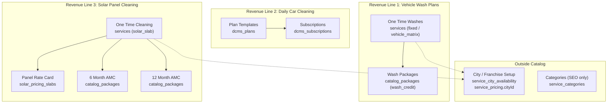

# Service Catalog Redesign Report

**Project:** CWP Detailers  
**Date:** 15 June 2026  
**Status:** Documentation only — no code changes  
**Purpose:** Prove the service catalog matches how CWP actually earns revenue, before any implementation.

**Supersedes (for catalog scope):** Software-architecture framing in `SERVICE_CATALOG_GAP_ANALYSIS.md`, `SERVICE_CATALOG_IMPLEMENTATION_REPORT.md`, and the catalog sections of `docs/PRODUCTS_SERVICES_ADMIN_RESTRUCTURE_REPORT_V3.md`.

---

## Table of Contents

1. [Executive Summary](#1-executive-summary)
2. [How CWP Earns Revenue (Founder Mental Model)](#2-how-cwp-earns-revenue-founder-mental-model)
3. [Current Model (Software Architecture Perspective)](#3-current-model-software-architecture-perspective)
4. [Why the Current Model Fails the Revenue Test](#4-why-the-current-model-fails-the-revenue-test)
5. [Proposed Catalog Structure](#5-proposed-catalog-structure)
6. [Entity Mapping: Existing → Business Concepts](#6-entity-mapping-existing--business-concepts)
7. [Categories: Justification or Removal](#7-categories-justification-or-removal)
8. [Pricing By City: Out of Catalog](#8-pricing-by-city-out-of-catalog)
9. [Solar: Service Line, Not Pricing Module](#9-solar-service-line-not-pricing-module)
10. [Revenue Alignment Proof](#10-revenue-alignment-proof)
11. [Admin UI Target (Founder View)](#11-admin-ui-target-founder-view)
12. [Migration Principles (When Implemented)](#12-migration-principles-when-implemented)
13. [Open Questions](#13-open-questions)
14. [Document History](#14-document-history)

---

## 1. Executive Summary

CWP earns money from **three revenue lines**, not from database tables, pricing engines, or marketing categories. The current catalog was built as a **multi-table catalog engine** (`services`, `service_categories`, `service_pricing`, `catalog_packages`, `solar_pricing_slabs`, `dcms_plans`, legacy `service_plans`, legacy `subscriptions`). That structure is technically capable but **organizes the admin experience around implementation artifacts**, not around how the founder thinks about sales.

This report reframes the catalog around revenue lines:

| # | Revenue line | What the customer buys |
|---|--------------|------------------------|
| 1 | **Vehicle Wash Plans** | One-time washes **and** prepaid wash packages (same line) |
| 2 | **Daily Car Cleaning Packages** | Recurring per-vehicle cleaning subscriptions |
| 3 | **Solar Panel Cleaning** | One-time cleaning **and** 6/12 month AMC (same line) |

Key corrections to the current model:

- **Wash Packages are not a separate business line.** They are a purchase format under Vehicle Wash.
- **Solar slab pricing is not a “Pricing” module.** It is part of the Solar service catalog (one-time rate card).
- **Categories are redundant** as a catalog dimension; revenue lines replace them for operations and reporting.
- **Pricing By City belongs in franchise/city setup**, not in the service catalog module.

The underlying tables (`services`, `catalog_packages`, `dcms_plans`, `solar_pricing_slabs`) largely **already support** the founder model. The redesign is primarily **conceptual reorganization, admin navigation, and retirement of legacy parallel paths** — not a greenfield schema.

---

## 2. How CWP Earns Revenue (Founder Mental Model)

When the founder opens “what we sell,” the mental tree is:

```
CWP Revenue
│
├── 1. Vehicle Wash Plans
│   ├── One Time Washes          → single job, pay per visit
│   └── Wash Packages            → prepaid credits (5-wash, 10-wash, etc.)
│
├── 2. Daily Car Cleaning Packages
│   └── Recurring plans          → monthly subscription per vehicle
│
└── 3. Solar Panel Cleaning
    ├── One Time Cleaning        → priced by panel count (slab rate card)
    ├── 6 Month AMC              → prepaid visit package over 6 months
    └── 12 Month AMC             → prepaid visit package over 12 months
```

### What each line means operationally

| Revenue line | Customer pays for | Fulfillment | Recurring? |
|--------------|-------------------|-------------|------------|
| Vehicle Wash — One Time | One wash job | Booking → execution → invoice | No |
| Vehicle Wash — Package | N wash credits | Purchase → entitlement → redeem per wash | No (prepaid bundle) |
| Daily Car Cleaning | Scheduled cleanings per vehicle | DCMS subscription → route visits | Yes |
| Solar — One Time | One cleaning job | Booking → execution → invoice | No |
| Solar — 6/12 Month AMC | N solar visits over term | Purchase → entitlement → redeem per visit | Contract term (prepaid AMC) |

### What is explicitly NOT a revenue line

| Concept | Why it is not a line |
|---------|---------------------|
| Wash Packages | Sub-variant of Vehicle Wash (prepaid format of the same wash service) |
| Solar slab pricing | Rate card for one-time solar — not a product category |
| Categories (`doorstep-car-wash`, `solar-amc`) | Marketing/SEO grouping — not how revenue is counted |
| Price By City | Franchise expansion lever — which services are sold where and at what local rate |
| Add-ons (wax, vacuum) | Upsells attached to a revenue line item |
| Detailing / ceramic / PPF | Future or secondary SKUs under Vehicle Wash (one-time), not a fourth line today |

---

## 3. Current Model (Software Architecture Perspective)

The codebase models catalog as a **layered engine** spread across multiple schema files and admin tabs.

### 3.1 Data layer (as implemented)

```
service_categories          ← admin-managed marketing groups
    └── services            ← one-time sellable items (wash, solar, detailing)
            ├── service_city_availability   ← city on/off + base override
            ├── service_pricing             ← vehicle × seat × city matrix
            ├── solar_pricing_slabs         ← panel-count slabs (one-time solar)
            └── service_addon_links → service_addons

catalog_packages            ← prepaid entitlement products
    └── catalog_package_entitlements      ← wash_credit | solar_visit | etc.

dcms_plans                  ← daily cleaning plan templates
    └── dcms_subscriptions  ← per-vehicle runtime subscriptions

service_plans (LEGACY)      ← old subscription tiers linked to services
subscriptions (LEGACY)      ← old solar_amc / monthly_wash counters

customer_entitlements       ← runtime credits from packages
customer_contracts          ← unified registry (product_line enum)
```

**Key files:**

| Layer | Path |
|-------|------|
| Core services | `lib/db/src/schema/services.ts` |
| Categories, legacy plans, vehicle matrix | `lib/db/src/schema/service-management.ts` |
| Catalog engine (slabs, packages, entitlements) | `lib/db/src/schema/service-catalog.ts` |
| Daily cleaning | `lib/db/src/schema/dcms.ts` |
| Contract registry | `lib/db/src/schema/customer-contracts.ts` |
| Fulfillment rules | `artifacts/api-server/src/lib/contracts/fulfillmentMode.ts` |
| Admin UI | `artifacts/cwp-platform/src/pages/admin/ProductsAndPlans.tsx` |
| Product constants | `lib/customer-model/src/products.ts` |

### 3.2 Admin UI (as implemented)

`ProductsAndPlans.tsx` groups tabs by **implementation concern**, not revenue line:

| Tab group | Tabs | Software framing |
|-----------|------|------------------|
| Service Catalog | Vehicle Services, **Wash Packages**, Daily Cleaning Plans | Three peer tabs — implies Wash Packages is its own catalog |
| **Pricing** | **Price By City**, **Solar Pricing** | Pricing as a cross-cutting module |
| Advanced Setup | GST, **Categories** | Categories as catalog setup |

This mirrors a developer’s mental model (services vs packages vs DCMS vs pricing tables), not the founder’s three revenue lines.

### 3.3 Parallel “plan” systems

The codebase has **four** ways to sell something that is not a one-time job:

| Store | Used for | Status |
|-------|----------|--------|
| `catalog_packages` | Wash packages, solar AMC | Target path |
| `dcms_plans` | Daily car cleaning | Target path |
| `service_plans` | Legacy homepage/monthly tiers | Retire |
| `subscriptions` | Legacy solar_amc / monthly_wash | Retire (synced to contract registry only) |

### 3.4 Dual categorization on every service

Every `services` row carries:

1. FK `serviceCategoryId` → `service_categories` (admin-managed, SEO flags)
2. Required pgEnum `category` → `car_wash | detailing | solar_cleaning | amc | subscription | …`

Categories and enum values overlap but are not identical. Neither column is a **revenue line**.

---

## 4. Why the Current Model Fails the Revenue Test

A catalog passes the revenue test when:

> A founder can navigate “what we sell,” configure a new city, and explain monthly revenue — **without knowing table names**.

| Failure | Example in current system |
|---------|----------------------------|
| Wash Packages elevated to peer tab | Admin shows Vehicle Services **and** Wash Packages as sibling catalog sections — implies two businesses |
| Solar split into “Pricing” | `SolarSlabsTab` lives under **Pricing**, separate from solar AMC packages — implies solar is a pricing engine, not a service line |
| Categories duplicate revenue lines | Seeded categories: `doorstep-car-wash`, `daily-car-cleaning`, `solar-cleaning`, `solar-amc` — four groups for three lines |
| Daily cleaning blurred into packages | Seed creates `daily-cleaning-2-washes` as `catalog_packages` with `cleaning_credit` — conflates line 1/2 |
| City pricing in catalog | `Price By City` tab edits `service_city_availability` inside Service Catalog — belongs with city/franchise rollout |
| No revenue_line dimension | `contract_product_line` enum has 6 values including legacy; no first-class `revenue_line` on catalog entities |
| Detailing as enum, not line | `services.category = detailing` exists but is not a founder revenue line |

---

## 5. Proposed Catalog Structure

Organize the catalog **only** by the three revenue lines. Purchase format (one-time vs package vs AMC) is a **variant within the line**, not a top-level module.

```
Service Catalog (/admin/services)
│
├── 1. Vehicle Wash Plans
│   ├── One Time Washes
│   │   ├── Service definitions (Exterior Wash, Full Detail, …)
│   │   ├── Add-ons (wax, vacuum, …)
│   │   └── Vehicle/seat rate card (see city setup for local overrides)
│   └── Wash Packages
│       ├── Package definitions (5-Wash, 10-Wash, …)
│       └── Entitlement rules (credits → underlying wash service)
│
├── 2. Daily Car Cleaning Packages
│   ├── Plan templates (Basic, Premium, …)
│   ├── Included cleanings / washes / weekly offs
│   └── Plan add-ons (bundled extras)
│
└── 3. Solar Panel Cleaning
    ├── One Time Cleaning
    │   ├── Service definition
    │   └── Panel slab rate card (min/max panels, price/panel, minimum billing)
    ├── 6 Month AMC
    └── 12 Month AMC
        └── Package definitions granting solar_visit credits
```

### What moves out of Service Catalog

| Concern | New home | Rationale |
|---------|----------|-----------|
| Price By City (availability + overrides) | **City / Franchise Setup** (`cities`, `service_areas`, city rollout wizard) | Founder question: “Is wash available in Patna and at what rate?” — not “what is a wash?” |
| Vehicle matrix per city | City setup (linked to services) | Same — local rate card for a franchise city |
| GST defaults | Finance settings or catalog global settings (unchanged) | Tax config, not a product |
| Homepage CMS | Marketing module (already partially separated) | Not revenue catalog |
| Categories | **Remove from catalog** or collapse to website SEO only (see §7) | Redundant with revenue lines |

### Revenue line as first-class concept

Introduce a stable identifier used in catalog, booking, contracts, and analytics:

```typescript
type RevenueLine =
  | "vehicle_wash"           // one-time + packages
  | "daily_car_cleaning"     // DCMS plans
  | "solar_panel_cleaning";  // one-time + 6mo/12mo AMC
```

Every sellable catalog item maps to exactly one `revenueLine`. Wash packages inherit `vehicle_wash`. Solar AMC inherits `solar_panel_cleaning`.

---

## 6. Entity Mapping: Existing → Business Concepts

### 6.1 Revenue Line 1 — Vehicle Wash Plans

| Business concept | Existing entity | Notes |
|------------------|-----------------|-------|
| One Time Wash (service SKU) | `services` where `pricingModel` ∈ `fixed`, `vehicle_matrix` and revenue line = vehicle_wash | Excludes solar slab services |
| Vehicle rate card (default) | `service_pricing` where `cityId IS NULL` | Global matrix |
| Vehicle rate card (city) | `service_pricing` where `cityId` set | **Managed in city setup**, referenced by service |
| City availability / override | `service_city_availability` | **Managed in city setup** |
| Wash add-ons | `service_addons` + `service_addon_links` | Linked to wash services |
| Wash Package (5-wash, etc.) | `catalog_packages` with entitlements `wash_credit` | Same revenue line as one-time wash |
| Package → service credit link | `catalog_package_entitlements` | Maps package to underlying wash `serviceId` |
| Customer’s remaining washes | `customer_entitlements` | Runtime, not catalog |
| Legacy monthly wash | `service_plans`, `subscriptions.type = monthly_wash` | **Retire** — not a founder revenue variant |

### 6.2 Revenue Line 2 — Daily Car Cleaning Packages

| Business concept | Existing entity | Notes |
|------------------|-----------------|-------|
| Plan template | `dcms_plans` | Sole catalog home for daily cleaning |
| Customer subscription | `dcms_subscriptions` | Per-vehicle instance |
| Visit / wash counters | `dcms_subscriptions` + visit tables | Operational, not catalog |
| Plan bundled add-ons | `dcms_plan_addons` | Catalog extension |
| Misplaced “daily + washes” bundle | `catalog_packages` with `cleaning_credit` | **Migrate or delete** — not daily cleaning; blurs lines |

### 6.3 Revenue Line 3 — Solar Panel Cleaning

| Business concept | Existing entity | Notes |
|------------------|-----------------|-------|
| One Time Cleaning (service SKU) | `services` where `pricingModel = solar_slab` | Single solar wash service |
| Panel slab rate card | `solar_pricing_slabs` | **Part of solar catalog**, not a separate “Pricing” module |
| 6 Month AMC | `catalog_packages` (validity ~180 days, 6 × `solar_visit`) | Same revenue line |
| 12 Month AMC | `catalog_packages` (validity ~365 days, 12 × `solar_visit`) | Same revenue line |
| AMC entitlement link | `catalog_package_entitlements` → one-time solar `serviceId` | Redeem AMC as visits |
| Customer AMC balance | `customer_entitlements` | Runtime |
| Legacy solar AMC | `subscriptions.type = solar_amc` | **Retire** after entitlement migration |
| Solar site asset | `solar_sites` | Assets module, not catalog |

### 6.4 Cross-cutting (not catalog)

| Business concept | Existing entity | Catalog role |
|------------------|-----------------|--------------|
| Contract registry view | `customer_contracts.product_line` | Maps to revenue lines (see §10) |
| Booking / invoice | `bookings`, invoices | Revenue recognized at sale/fulfillment |
| Wallet | wallet tables | ₹ ledger only — never wash/solar credits |
| City master | `cities`, `service_areas`, `pincodes` | Franchise setup |
| Vehicle/seat classes | `vehicle_categories`, `seat_categories` | Masters for wash rate card |

### 6.5 Mapping diagram



---

## 7. Categories: Justification or Removal

### Current state

`service_categories` provides:

- Website/booking display grouping (`showOnWebsite`, `showInBooking`, `showInSeo`)
- SEO metadata per group
- FK from `services` and optional FK from `catalog_packages`
- Parallel legacy sync via `legacyCategory` → `services.category` enum

Seeded slugs include: `doorstep-car-wash`, `daily-car-cleaning`, `solar-cleaning`, `solar-amc`, `detailing`.

### Verdict: redundant for catalog and revenue

| Use case | Categories today | Replacement |
|----------|------------------|-------------|
| “What business line is this?” | Implied by category slug | **`revenueLine` enum** (3 values) |
| “One-time vs package?” | Separate tables already | **Variant within revenue line** |
| Website navigation / SEO | Category pages | Keep **`service_categories` as SEO/marketing only** — not in Service Catalog admin |
| Admin catalog navigation | Categories tab | **Remove** — replaced by 3 revenue line sections |
| Reporting by line | Dashboard uses booking categories | Report by **`revenueLine`** on contract/booking |

### Recommendation

1. **Remove Categories from Service Catalog admin** (or move to Website CMS).
2. **Do not create new catalog items via category** — create under revenue line.
3. **Keep `service_categories` temporarily** for public website routes (`/varanasi/doorstep-car-wash`) until SEO URLs migrate to revenue-line-based routes.
4. **Deprecate `services.category` pgEnum** once all readers use `revenueLine` + service slug.

Categories justify themselves only as **marketing/SEO infrastructure**, not as catalog or revenue taxonomy.

---

## 8. Pricing By City: Out of Catalog

### Current state

The **Price By City** tab (`PricingTab.tsx`) edits `service_city_availability`:

- Which services are active in which city
- Optional `basePriceOverride` for fixed-price services

Vehicle matrix pricing (`service_pricing` with `cityId`) exists in the API but has **no admin UI** in this tab.

### Founder question vs software question

| Founder asks | Software tab today | Correct module |
|--------------|-------------------|----------------|
| “What do we sell?” | Service Catalog | Service Catalog |
| “Do we sell wash in Patna?” | Price By City (inside catalog) | **City / Franchise Setup** |
| “What is the hatchback rate in Lucknow?” | API-only matrix | **City Setup → linked rate cards** |
| “Enable solar in a new city?” | Solar slabs + city availability | **City Setup** + solar line config |

### Recommendation

Move city-scoped configuration to **Franchise / City Setup** (alongside `cities`, `service_areas`, `pincodes`):

```
City Setup (/admin/cities/:slug or /admin/franchise)
├── Territory (pincodes, service areas)
├── Enabled revenue lines (vehicle wash, daily cleaning, solar)
├── Per-service availability toggles     ← service_city_availability
├── Vehicle wash local rate matrix       ← service_pricing (cityId)
└── Solar slab overrides (optional)      ← solar_pricing_slabs (cityId)
```

Service Catalog defines **what the product is**. City Setup defines **where it is sold and at what local price**.

---

## 9. Solar: Service Line, Not Pricing Module

### Current state

Admin places **Solar Pricing** (`SolarSlabsTab`) under a **Pricing** tab group alongside Price By City. Solar AMC packages live under **Wash Packages** tab (`PackagesTab`) mixed with vehicle wash packages.

### Founder view

Solar is one revenue line with three sellable variants:

1. One Time Cleaning — priced by panel slabs
2. 6 Month AMC — fixed package price, visit entitlements
3. 12 Month AMC — fixed package price, visit entitlements

Slab configuration is the **rate card for variant 1**, not a separate “pricing module.”

### Recommendation

Under **Solar Panel Cleaning** catalog section:

| Sub-section | UI content | Backend |
|-------------|------------|---------|
| One Time Cleaning | Service details + panel slab editor | `services` + `solar_pricing_slabs` |
| 6 Month AMC | Package name, price, validity, visit count | `catalog_packages` + entitlements |
| 12 Month AMC | Same | `catalog_packages` + entitlements |

Remove “Solar Pricing” as a top-level Pricing tab. Remove solar AMC packages from the Vehicle Wash Packages tab.

---

## 10. Revenue Alignment Proof

Every way CWP collects money today maps to exactly one revenue line and one fulfillment path.

### 10.1 Sale type matrix

| Customer purchase | Revenue line | Catalog source | Fulfillment (`fulfillmentMode.ts`) | Contract `product_line` |
|-------------------|--------------|----------------|-------------------------------------|-------------------------|
| Single doorstep wash | Vehicle Wash → One Time | `services` | `one_time` | `one_time_service` |
| 5-wash package | Vehicle Wash → Package | `catalog_packages` | `contract_credits` | `wash_package` |
| Daily cleaning monthly plan | Daily Car Cleaning | `dcms_plans` → `dcms_subscriptions` | `contract_recurring` | `daily_cleaning` |
| Solar one-time clean | Solar → One Time | `services` + slabs | `one_time` | `one_time_service` |
| Solar 6-month AMC | Solar → 6 Month AMC | `catalog_packages` | `contract_recurring` | `solar_amc` |
| Solar 12-month AMC | Solar → 12 Month AMC | `catalog_packages` | `contract_recurring` | `solar_amc` |

Legacy rows (`service_plans`, `subscriptions.monthly_wash`, `subscriptions.solar_amc`) map to the same lines but should not appear in the target catalog UI.

### 10.2 `SERVICE_PRODUCTS` realignment

Current `lib/customer-model/src/products.ts` lists **5 bookable products** across 3 lines — close but not aligned:

| Current `SERVICE_PRODUCTS` key | Target revenue line | Change |
|-------------------------------|---------------------|--------|
| `one_time_wash` | Vehicle Wash → One Time | Keep |
| `wash_package` | Vehicle Wash → Package | Keep; parent = vehicle_wash |
| `daily_cleaning` | Daily Car Cleaning | Keep |
| `one_time_solar` | Solar → One Time | Keep |
| `solar_amc` | Solar → 6/12 Month AMC | Split UI variants; same line |

Add `revenueLine` to each product constant. Remove implication that `wash_package` is a peer line to wash.

### 10.3 Revenue recognition checklist

| # | Question | Pass? |
|---|----------|-------|
| 1 | Can all catalog items be tagged with exactly one of 3 revenue lines? | Yes — with mapping rules above |
| 2 | Are wash packages nested under vehicle wash in admin? | **No today** — pass after redesign |
| 3 | Is solar slab editing inside solar catalog? | **No today** — pass after redesign |
| 4 | Is city pricing outside catalog? | **No today** — pass after redesign |
| 5 | Is daily cleaning only in `dcms_plans`? | Mostly — except stray `catalog_packages` bundles |
| 6 | Can founder report revenue by 3 lines without table names? | **No today** — pass after `revenueLine` on contracts/bookings |

### 10.4 What we are NOT changing (data layer)

These tables remain valid; only their **admin grouping and metadata** change:

- `services`
- `catalog_packages` / `catalog_package_entitlements`
- `dcms_plans`
- `solar_pricing_slabs`
- `customer_entitlements`
- `customer_contracts`

---

## 11. Admin UI Target (Founder View)

### Before (software architecture)

```
Service Catalog | Pricing | Advanced Setup
  Vehicle Services | Wash Packages | Daily Cleaning Plans
  Price By City | Solar Pricing
  GST | Categories
```

### After (founder revenue)

```
Service Catalog
├── Vehicle Wash Plans
│   ├── One Time Washes
│   └── Wash Packages
├── Daily Car Cleaning Packages
└── Solar Panel Cleaning
    ├── One Time Cleaning (+ slab rate card inline)
    ├── 6 Month AMC
    └── 12 Month AMC

City / Franchise Setup  (separate module)
├── Cities & territories
├── Enabled lines per city
└── Local rate overrides

Marketing / Website CMS  (separate module)
├── Homepage sections
└── SEO category pages (legacy URLs)
```

Book Services Step 4 (“Service”) should present choices grouped by **revenue line → variant**, matching this tree.

---

## 12. Migration Principles (When Implemented)

**Not in scope for this document.** When implementation begins:

1. Add `revenue_line` column to `services`, `catalog_packages`, `dcms_plans` (or derive from rules during transition).
2. Reorganize `ProductsAndPlans.tsx` tabs to 3 revenue lines; no code deletion of tables in phase 1.
3. Move `PricingTab` to city/franchise admin; embed slab editor in solar section.
4. Migrate or archive `catalog_packages` with `cleaning_credit` that belong to daily cleaning.
5. Retire `service_plans` from homepage and API after `catalog_packages` coverage confirmed.
6. Migrate legacy `subscriptions.solar_amc` to entitlement-based packages; keep contract registry sync.
7. Collapse `contract_product_line` reporting to 3 revenue lines + variant for analytics export.

---

## 13. Open Questions

| # | Question | Default recommendation |
|---|----------|------------------------|
| 1 | Is detailing a separate revenue line or a one-time wash SKU? | **SKU under Vehicle Wash** until founder adds a fourth line |
| 2 | Keep `service_categories` for SEO URLs indefinitely? | Yes short-term; migrate URLs to `/services/{slug}` long-term |
| 3 | Should DCMS plans get optional `cityId` for city-specific daily cleaning prices? | Yes — but configured in **City Setup**, not catalog definition |
| 4 | Solar AMC: one admin form with duration toggle or two fixed templates? | Two fixed templates (6 / 12 month) matching founder language |

---

## 14. Document History

| Version | Date | Change |
|---------|------|--------|
| 1.0 | 15 Jun 2026 | Initial report — founder revenue model, entity mapping, no implementation |

---

## Appendix A: Current vs Proposed Tab Mapping

| Current tab | Proposed location |
|-------------|-------------------|
| Vehicle Services | Vehicle Wash Plans → One Time Washes |
| Wash Packages | Vehicle Wash Plans → Wash Packages |
| Daily Cleaning Plans | Daily Car Cleaning Packages |
| Solar Pricing | Solar Panel Cleaning → One Time Cleaning (slabs inline) |
| (solar AMC in PackagesTab) | Solar Panel Cleaning → 6 / 12 Month AMC |
| Price By City | City / Franchise Setup |
| Categories | Website CMS (SEO only) or remove |
| GST | Finance settings or catalog globals (unchanged) |
| Homepage | Marketing CMS (unchanged) |

## Appendix B: Glossary

| Term | Meaning |
|------|---------|
| Revenue line | One of CWP’s 3 earnings streams — how the founder segments the business |
| Variant | Purchase format within a line (one-time, package, AMC) |
| Rate card | Panel slabs or vehicle matrix — **how** price is calculated, not **what** is sold |
| Catalog | Definitions of sellable products — not city rollout, not customer runtime state |
| Entitlement | Prepaid credit balance after package purchase — operational, not catalog |
