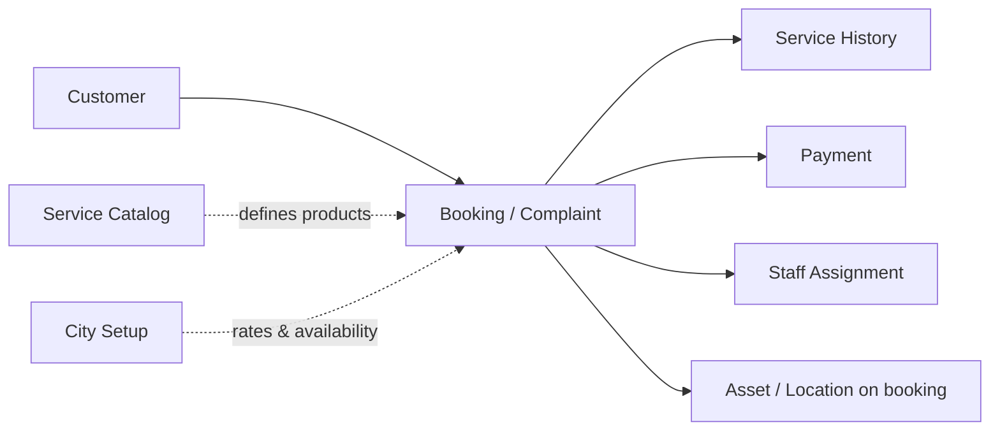
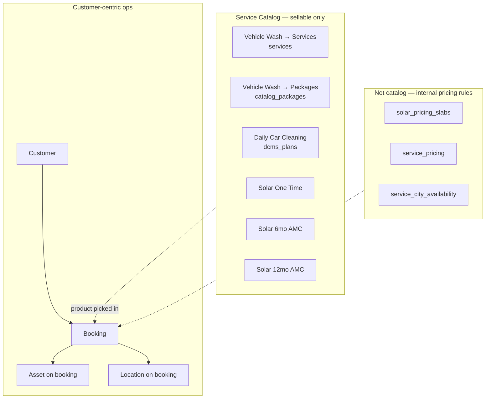

# Service Catalog Redesign Report — V2

**Project:** CWP Detailers  
**Date:** 15 June 2026  
**Status:** Documentation only — no code changes  
**Supersedes:** [`SERVICE_CATALOG_REDESIGN_REPORT.md`](./SERVICE_CATALOG_REDESIGN_REPORT.md) (V1) for catalog UI and admin workflow framing  
**Purpose:** Apply three founder corrections to the V1 proposal and determine **whether they change the proposed UI structure** before implementation.

---

## Table of Contents

1. [Executive Summary](#1-executive-summary)
2. [The Three V2 Corrections](#2-the-three-v2-corrections)
3. [Impact Analysis: Do These Change the UI?](#3-impact-analysis-do-these-change-the-ui)
4. [Revised Admin Workflow Model](#4-revised-admin-workflow-model)
5. [Revised Service Catalog UI](#5-revised-service-catalog-ui)
6. [Revised Entity Mapping](#6-revised-entity-mapping)
7. [What V1 Got Wrong](#7-what-v1-got-wrong)
8. [Revenue Alignment (Updated)](#8-revenue-alignment-updated)
9. [Implementation Notes (Still No Code)](#9-implementation-notes-still-no-code)
10. [Document History](#10-document-history)

---

## 1. Executive Summary

V1 reframed the catalog around **three revenue lines** and moved city pricing out of catalog. V2 adds three founder corrections that **do change the proposed UI**, but unevenly:

| Correction | Changes catalog UI? | Changes overall admin UI? |
|------------|--------------------|-----------------------------|
| 1. Customer-first; assets/locations are booking support | Minor (booking context only) | **Yes — major** |
| 2. Solar catalog = sellable products only; slabs are internal | **Yes — major** | Minor (slabs leave catalog entirely) |
| 3. Vehicle Wash = Services + Packages (explicit split) | **Yes — moderate** (naming & hierarchy) | No |

**Bottom line:** The three revenue-line catalog tree from V1 **survives**, but its **internal shape** and **surrounding admin architecture** change materially.

V1 proposed:

```
Service Catalog → 3 revenue lines
City Setup → pricing & availability
Assets / Service Locations → primary modules   ← V2 rejects this
Solar → product + inline slab editor           ← V2 rejects slab visibility in catalog
Vehicle Wash → "One Time Washes" + "Packages"  ← V2 renames and clarifies
```

V2 proposes:

```
Customer (primary) → Booking / Complaint / History / Payment / Staff
                     └── Asset & Location (secondary, on the booking record)

Service Catalog → 3 revenue lines (unchanged count)
  ├── Vehicle Wash → Services | Packages
  ├── Daily Car Cleaning → Plans
  └── Solar → 3 products only (no slab UI)

City / Franchise Setup → availability, local rates, internal pricing rules (incl. slabs)
```

---

## 2. The Three V2 Corrections

### Correction 1 — Customer is primary; assets and locations are booking support

**Founder rule:** Admins do not manage assets and locations as primary operational modules. The customer is the primary entity. Assets and locations are secondary supporting entities, owned in the context of a customer and surfaced when running a booking or complaint.

**Admin workflow (founder order):**

```
Customer
  → Booking / Complaint
  → Service History
  → Payment
  → Staff
  → Asset / Location used in that booking
```

Assets and locations answer: *“Which vehicle or site was this job for?”* — not *“Show me all vehicles in the system.”*

| Entity | Role | Primary admin home |
|--------|------|-------------------|
| Customer | Identity, contracts, balance, communication | **Customer** (Customer 360) |
| Booking / Complaint | Operational event | Booking flow / Complaints |
| Service History | Past jobs on this customer | Customer 360 → History |
| Payment | Invoice, receipt, wallet | Billing (linked from customer) |
| Staff | Who performed / will perform | Assignment (linked from booking) |
| Asset | Vehicle or solar site used | **On the booking**; quick-add from customer context |
| Location | Where service happens | **On the booking**; quick-add from customer context |

**Implication for V3 architecture docs:** `PRODUCTS_SERVICES_ADMIN_RESTRUCTURE_REPORT_V3.md` treats **Assets** and **Service Locations** as standalone modules (`/admin/assets`, `/admin/service-locations`). V2 **overrides that navigation model** for founder UX. The underlying tables (`vehicles`, `solar_sites`, `service_locations`) remain valid; only their **admin prominence** changes.

---

### Correction 2 — Solar catalog exposes only sellable products

**Founder sells exactly three solar products:**

1. Solar One Time Cleaning  
2. Solar 6 Month AMC  
3. Solar 12 Month AMC  

**Panel slabs are not products.** They are internal rate-calculation logic used when quoting or invoicing Solar One Time Cleaning (price varies by panel count). The admin catalog experience must show **what is sold**, not the pricing engine.

| Concept | Sellable product? | Admin catalog visibility |
|---------|-------------------|--------------------------|
| Solar One Time Cleaning | Yes | Yes — name, description, status, display price or “quoted at booking” |
| Solar 6 Month AMC | Yes | Yes — fixed price, visit count, validity |
| Solar 12 Month AMC | Yes | Yes — fixed price, visit count, validity |
| Panel slabs (`solar_pricing_slabs`) | **No** | **No** — backend / city setup / finance tooling only |
| `SolarSlabsTab` | N/A | **Remove from Service Catalog** |

When an admin edits “Solar One Time Cleaning,” they configure the **product** (name, marketing copy, active/inactive). Slab rules may exist in the data layer but are maintained outside the founder-facing catalog — e.g. City Setup, super-admin pricing rules, or engineering seed — not as a catalog navigation item.

---

### Correction 3 — Vehicle Wash distinguishes Services and Packages

**Founder tree:**

```
Vehicle Wash
├── Services                          ← one-time SKUs
│   ├── Foam Wash
│   ├── Interior Cleaning
│   ├── Exterior Cleaning
│   ├── Detailing
│   └── Other one-time services
│
└── Packages                          ← prepaid credit wrappers
    ├── 4 Wash Package
    ├── 8 Wash Package
    └── 12 Wash Package
```

Packages are **prepaid credit wrappers around wash services**. They are not an independent service line and not peer products to Foam Wash — they are a **purchase format** under the same revenue line.

| Layer | What admin manages | Backend |
|-------|-------------------|---------|
| Services | Individual wash/detailing SKUs | `services` |
| Packages | Bundle name, price, credit count, which service credits apply to | `catalog_packages` + `catalog_package_entitlements` |

Vehicle matrix pricing (`service_pricing`) is rate-calculation logic for Services — same category as solar slabs: **supports quoting, not a catalog product**.

---

## 3. Impact Analysis: Do These Change the UI?

### 3.1 Summary matrix

| UI surface | V1 proposal | V2 change? | What changes |
|------------|-------------|------------|--------------|
| Top-level admin nav | 8 modules incl. Assets, Service Locations | **Yes** | Demote Assets & Locations; elevate Customer |
| `/admin/customers` (Customer 360) | Read-only asset/location summaries + deep links to modules | **Yes** | Inline asset/location quick-view; create from customer; no module deep links as primary path |
| `/admin/book-services` | Customer → Location → Asset → Service… | **Yes** | Same steps, reframed as customer workflow; location/asset are booking fields |
| `/admin/services` (catalog) | 3 revenue lines | **Partial** | Same 3 lines; different inner tabs |
| Vehicle Wash section | One Time Washes \| Wash Packages | **Yes** | Rename to **Services \| Packages**; explicit SKU examples |
| Solar section | One Time (+ slabs inline) \| 6mo \| 12mo | **Yes** | **3 product cards only**; no slab editor |
| Pricing tab group | Price By City \| Solar Pricing | **Yes** | Entire group leaves catalog; slabs never appear here |
| `/admin/assets` | Primary module | **Yes** | **Remove from primary nav** (or super-admin only) |
| `/admin/service-locations` | Primary module | **Yes** | **Remove from primary nav**; manage via customer/booking |
| City / Franchise Setup | Availability + rate overrides + solar slabs | **Partial** | Absorbs all non-product pricing rules including slabs |
| Complaints / Service History | Not in V1 catalog scope | **Yes** | Explicit in customer-centric workflow |

---

### 3.2 Correction 1 — UI impact (Customer-first)

**Verdict: Major change to overall admin UI; minor change to catalog UI.**

#### What stays the same

- Service Catalog still has three revenue lines.
- Book Services still needs to capture which asset and location a job uses.
- Database entities for vehicles, solar sites, and service locations are unchanged.

#### What changes

| V1 / V3 implied | V2 target |
|-----------------|-----------|
| `/admin/assets` directory as daily ops entry | No standalone Assets in main nav |
| `/admin/service-locations` directory | No standalone Service Locations in main nav |
| Customer 360 → “Linked Assets” read-only + link out | Customer 360 → assets/locations as **supporting panels** with inline add/edit |
| “Create asset, then link customer” | “Open customer → book → add vehicle if needed” |

#### Revised navigation (operations)

```
Operations
├── Dashboard
├── Customers                    ← PRIMARY
│   └── Customer 360
│       ├── Profile
│       ├── Bookings & Complaints
│       ├── Service History
│       ├── Payments / Billing summary
│       ├── Active plans & packages
│       └── Assets & Locations   ← secondary, customer-scoped
│
├── Book Service                 ← starts from customer (or ends at customer)
├── Assign Services
├── Service Updates
├── Billing & Finance
│
└── Service Catalog              ← what we sell (setup, infrequent)
    └── (3 revenue lines)

City / Franchise Setup           ← where we sell + internal rate rules (infrequent)

(Optional super-admin)
└── Pricing Rules                ← vehicle matrix, solar slabs — not founder catalog
```

**Book Services step order** (V3 had Customer → Location → Asset → Service). V2 keeps the same **data capture** but reframes labels:

| Step | V3 framing | V2 framing |
|------|------------|------------|
| 1 | Customer | Customer *(primary)* |
| 2 | Service Location | **Where** — location on this booking |
| 3 | Asset | **What** — vehicle or solar site on this booking |
| 4 | Service | Catalog product |
| 5–9 | Add-ons, discount, payment, invoice, assignment | Unchanged |

Steps 2–3 are no longer “go to the Locations module first”; they are **fields on the booking under the customer**.

---

### 3.3 Correction 2 — UI impact (Solar = products only)

**Verdict: Major change to Solar section of catalog UI.**

#### V1 (incorrect for founder UX)

```
Solar Panel Cleaning
├── One Time Cleaning
│   └── Panel slab rate card inline    ← exposed pricing engine
├── 6 Month AMC
└── 12 Month AMC
```

Admin tab: **Solar Pricing** (`SolarSlabsTab`) under a Pricing group.

#### V2 (founder UX)

```
Solar Panel Cleaning
├── Solar One Time Cleaning      ← product
├── Solar 6 Month AMC            ← product
└── Solar 12 Month AMC           ← product
```

No slab editor. No “Pricing” sub-tab. Three rows in a product list — same visual pattern as Daily Car Cleaning plans.

#### Where slabs go (not catalog)

| Surface | Slab / matrix visibility | Audience |
|---------|--------------------------|----------|
| Service Catalog | **Hidden** | Founder / branch manager |
| City / Franchise Setup | Optional “One-time solar rate rules” per city | Expansion / ops lead |
| Super-admin / engineering | Full CRUD on `solar_pricing_slabs` | Engineering |
| Book Service quote step | Computed price shown | Staff at booking time |

The founder configures **that solar one-time is sold**. Engineering or city rollout configures **how panel count maps to price**.

#### Solar catalog admin form (target)

Each of the three products exposes only **sellable fields**:

| Field | One Time | 6 Month AMC | 12 Month AMC |
|-------|----------|-------------|--------------|
| Name | ✓ | ✓ | ✓ |
| Description / marketing | ✓ | ✓ | ✓ |
| Active / inactive | ✓ | ✓ | ✓ |
| List price or “price at quote” | ✓ (optional display) | ✓ fixed | ✓ fixed |
| Visit count | — | 6 | 12 |
| Validity period | — | 6 months | 12 months |
| Panel slab editor | **✗** | **✗** | **✗** |

---

### 3.4 Correction 3 — UI impact (Vehicle Wash: Services + Packages)

**Verdict: Moderate change — naming, hierarchy, and tab content; not a new revenue line.**

#### V1 vs V2

| V1 label | V2 label | Meaning |
|----------|----------|---------|
| Vehicle Wash Plans → One Time Washes | Vehicle Wash → **Services** | Individual SKUs |
| Vehicle Wash Plans → Wash Packages | Vehicle Wash → **Packages** | Prepaid credit wrappers |

#### Target catalog UI

```
Service Catalog
└── Vehicle Wash
    ├── [Tab] Services
    │     Foam Wash, Interior Cleaning, Exterior Cleaning, Detailing, …
    │     (+ add-ons linked to services — not separate products)
    │
    └── [Tab] Packages
          4 Wash Package, 8 Wash Package, 12 Wash Package, …
          Each package: price, credit count, validity, eligible services
```

#### What this fixes in current UI

Today `ProductsAndPlans.tsx` shows **Vehicle Services** and **Wash Packages** as **sibling top-level tabs** under “Service Catalog,” which implies two catalog roots. V2 nests both under **one revenue line header** with two sub-tabs.

#### Packages tab must not contain

- Solar AMC packages (move to Solar line)
- Daily cleaning bundles (move to Daily Car Cleaning or retire)
- Anything that is not a wash credit wrapper

---

## 4. Revised Admin Workflow Model



**Customer** is the entry point for all day-to-day ops. **Service Catalog** and **City Setup** are configuration surfaces visited occasionally — not part of the booking chain.

### Customer 360 target tabs (V2)

| Tab | Content | Assets / locations |
|-----|---------|-------------------|
| Overview | Persona, open items, CTAs | Summary chips only |
| Profile | Identity, GST, comms prefs | — |
| Bookings & Complaints | Active and recent | Shows asset + location **per row** |
| Service History | Completed jobs | Shows asset + location **per row** |
| Plans & Packages | DCMS, wash credits, solar AMC | Asset linked where relevant |
| Billing | Summary + link to finance | — |
| Assets & Locations | Customer’s vehicles, solar sites, addresses | **Secondary panel** — add/edit here or during booking |

No tab sends the admin to a global Assets directory as the primary action.

---

## 5. Revised Service Catalog UI

### 5.1 Full tree (V2 — authoritative)

```
Service Catalog (/admin/services)
│
├── 1. Vehicle Wash
│   ├── Services          → Foam Wash, Interior, Exterior, Detailing, …
│   └── Packages          → 4 / 8 / 12 Wash Package, …
│
├── 2. Daily Car Cleaning Packages
│   └── Plans             → Basic, Premium, … (dcms_plans)
│
└── 3. Solar Panel Cleaning
    ├── Solar One Time Cleaning
    ├── Solar 6 Month AMC
    └── Solar 12 Month AMC
```

**Not in catalog:** categories (SEO only), GST (finance/settings), homepage CMS (marketing), price-by-city, vehicle matrix, panel slabs, asset/location masters.

### 5.2 Tab layout (V2)

```
┌─────────────────────────────────────────────────────────────┐
│  Service Catalog                                            │
├─────────────────────────────────────────────────────────────┤
│  [ Vehicle Wash ]  [ Daily Car Cleaning ]  [ Solar ]        │  ← revenue lines
├─────────────────────────────────────────────────────────────┤
│  When Vehicle Wash selected:                                │
│    [ Services ]  [ Packages ]                               │  ← sub-tabs only here
├─────────────────────────────────────────────────────────────┤
│  Product list + add/edit forms                              │
└─────────────────────────────────────────────────────────────┘
```

Solar and Daily Car Cleaning have **no sub-tabs** — flat product/plan lists.

### 5.3 Side-by-side: V1 vs V2 catalog UI

| Element | V1 | V2 |
|---------|----|----|
| Revenue line count | 3 | 3 — **unchanged** |
| Vehicle Wash children | One Time Washes \| Packages | **Services** \| **Packages** — renamed |
| Vehicle Wash nesting | Under revenue line | Under revenue line + **explicit sub-tabs** |
| Solar children | One Time + slabs \| AMC × 2 | **3 products flat** — slabs removed |
| SolarSlabsTab | Inside catalog (solar section) | **Removed from catalog** |
| Pricing tab group | Moved to city setup | City setup + optional super-admin |
| Categories tab | Removed / SEO | Unchanged from V1 |
| Assets / Locations | Implied separate modules | **Not part of catalog** |

---

## 6. Revised Entity Mapping

### 6.1 Sellable catalog entities (what admin manages)

| Revenue line | Admin-visible product | Table |
|--------------|----------------------|-------|
| Vehicle Wash → Service | Foam Wash, Interior Cleaning, … | `services` |
| Vehicle Wash → Package | 4 / 8 / 12 Wash Package | `catalog_packages` |
| Daily Car Cleaning | Plan templates | `dcms_plans` |
| Solar | One Time Cleaning | `services` (one solar SKU) |
| Solar | 6 Month AMC | `catalog_packages` |
| Solar | 12 Month AMC | `catalog_packages` |

**Total founder-facing catalog item types: 4 shapes, 3 revenue lines.**

### 6.2 Non-product entities (hidden from catalog UI)

| Entity | Purpose | Admin home (V2) |
|--------|---------|-----------------|
| `solar_pricing_slabs` | Panel-count → price for one-time solar | City Setup or super-admin pricing rules |
| `service_pricing` | Vehicle × seat × city matrix | City Setup or super-admin pricing rules |
| `service_city_availability` | Service on/off per city | City Setup |
| `service_categories` | SEO / website grouping | Marketing CMS |
| `vehicles`, `solar_sites` | Customer assets | Customer 360 / booking |
| `service_locations` | Customer addresses / sites | Customer 360 / booking |
| `customer_entitlements` | Runtime credits | Customer 360 → Plans & Packages |
| `dcms_subscriptions` | Runtime daily cleaning | Customer 360 → Plans & Packages |

### 6.3 Correction impact on V1 mapping diagram

V1 drew `solar_pricing_slabs` inside the Solar catalog box. V2 moves it entirely outside:



---

## 7. What V1 Got Wrong

| V1 statement | V2 correction |
|--------------|---------------|
| “Solar slab rate card inline” under One Time Cleaning | Slabs are **not catalog UI**; they are internal rate logic |
| “SolarSlabsTab moves to solar catalog section” | Slabs leave catalog entirely — city setup or super-admin |
| Implied Assets / Service Locations as peer operational modules | **Customer-first**; assets/locations on booking |
| “One Time Washes” naming | **Services** — matches founder vocabulary |
| “Wash Packages” as peer catalog tab | **Packages** — nested under Vehicle Wash, not peer revenue line |
| Detailing as “future SKU” | Detailing is a **Service** under Vehicle Wash today |
| Book Services as catalog-centric | Book Services is **customer-centric**; catalog only supplies step 4 |

V1 was correct on: three revenue lines, wash packages not a separate line, categories redundant for ops, city pricing out of catalog, entity tables largely reusable.

---

## 8. Revenue Alignment (Updated)

Every sellable item maps to one revenue line. Internal pricing rules do not appear in the sellable list.

| Customer buys | Revenue line | Catalog admin item | Pricing rule (hidden) |
|---------------|--------------|--------------------|-----------------------|
| Foam Wash (one job) | Vehicle Wash | Service: Foam Wash | `service_pricing` matrix at quote |
| 8 Wash Package | Vehicle Wash | Package: 8 Wash | Fixed package price |
| Daily cleaning plan | Daily Car Cleaning | Plan template | Fixed plan price |
| Solar one-time job | Solar | Solar One Time Cleaning | `solar_pricing_slabs` at quote |
| Solar 6 Month AMC | Solar | Solar 6 Month AMC | Fixed package price |
| Solar 12 Month AMC | Solar | Solar 12 Month AMC | Fixed package price |

**Revenue test (V2):** Can the founder open Service Catalog and see **only things customers can buy**?  
→ Yes, after V2: 3 sections, flat or Services/Packages split, zero slab/matrix editors.

**Ops test (V2):** Can a branch admin run the day without opening Assets or Locations modules?  
→ Yes: start at Customer → Book → pick/create asset & location inline → rest of workflow.

---

## 9. Implementation Notes (Still No Code)

When implementation begins, priority order:

1. **Catalog UI** — Reorganize `ProductsAndPlans.tsx` to V2 tree; remove `SolarSlabsTab` and Pricing group from catalog; nest Vehicle Wash Services/Packages.
2. **Customer 360** — Consolidate asset/location management under customer; demote global Assets/Locations nav.
3. **Book Services** — Reframe steps 2–3 as booking fields; keep data model.
4. **City Setup module** — Absorb price-by-city, vehicle matrix, solar slabs as **pricing rules**, not products.
5. **Data layer** — Optional `revenue_line` column; no slab table changes required.

**Explicit non-goals for phase 1:**

- Do not delete `solar_pricing_slabs` or `service_pricing` tables.
- Do not merge Packages into Services table.
- Do not build a standalone Assets module unless super-admin needs it later.

---

## 10. Document History

| Version | Date | Change |
|---------|------|--------|
| 1.0 | 15 Jun 2026 | Initial founder revenue model ([V1 report](./SERVICE_CATALOG_REDESIGN_REPORT.md)) |
| 2.0 | 15 Jun 2026 | Three corrections; UI impact analysis; customer-first ops; solar products-only; Vehicle Wash Services/Packages |

---

## Appendix A — Direct Answer: Do the Corrections Change the Proposed UI Structure?

**Yes**, in four specific ways:

1. **Overall admin shell** — Assets and Service Locations drop out of primary navigation; Customer 360 and booking absorb them. **New structure, not just catalog.**

2. **Solar catalog section** — Collapses from “product + pricing engine” to **three product rows**. **Major simplification.**

3. **Vehicle Wash section** — Stays nested under one revenue line but renames to **Services | Packages** and stops being two peer top-level tabs. **Moderate restructure.**

4. **Pricing surfaces** — V1 already moved city pricing out of catalog; V2 also evicts **solar slabs and vehicle matrix** from any founder-facing catalog or pricing tab. All rate logic consolidates under **City Setup / super-admin**, invoked only at quote time.

**Unchanged:** The count of three revenue lines; the backend tables; the fulfillment modes (`one_time`, `contract_credits`, `contract_recurring`); daily cleaning living in `dcms_plans`.

---

## Appendix B — V2 Glossary Additions

| Term | Meaning |
|------|---------|
| Sellable product | Something that appears on an invoice with a product name the customer recognizes |
| Pricing rule | Internal logic (slabs, matrix, city override) that computes amount — never a catalog row |
| Services (Vehicle Wash) | One-time wash/detailing SKUs |
| Packages (Vehicle Wash) | Prepaid multi-wash credit bundles — not a separate revenue line |
| Booking support entity | Asset or location recorded **on a booking** under a customer — not a standalone ops module |
