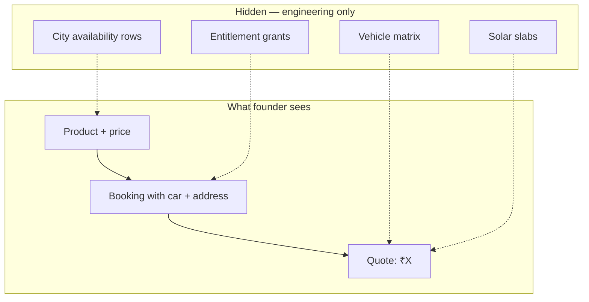

# Service Catalog Redesign Report — V3 (Founder Validation)

**Project:** CWP Detailers  
**Date:** 15 June 2026  
**Status:** Documentation only — no code changes  
**Supersedes:** [`SERVICE_CATALOG_REDESIGN_REPORT_V2.md`](./SERVICE_CATALOG_REDESIGN_REPORT_V2.md) for customer UX, pricing visibility, and DCMS validation  
**Goal:** Prove that a **non-technical business owner** can understand the entire CWP business model without encountering technical entities (assets, locations, slabs, matrices, entitlements, credits, categories, or pricing engines).

---

## Table of Contents

1. [Executive Verdict](#1-executive-verdict)
2. [The Business in Plain Language](#2-the-business-in-plain-language)
3. [Question 1 — Assets & Locations Tab](#3-question-1--assets--locations-tab)
4. [Question 2 — Pricing Engines & City Setup](#4-question-2--pricing-engines--city-setup)
5. [Question 3 — Daily Car Cleaning (DCMS) Verification](#5-question-3--daily-car-cleaning-dcms-verification)
6. [V3 Target Model (Authoritative)](#6-v3-target-model-authoritative)
7. [Technical Layer vs Founder Layer](#7-technical-layer-vs-founder-layer)
8. [Founder Validation Checklist](#8-founder-validation-checklist)
9. [Gaps Requiring Cleanup Before / During Implementation](#9-gaps-requiring-cleanup-before--during-implementation)
10. [Document History](#10-document-history)

---

## 1. Executive Verdict

V2 moved the model close to founder thinking. V3 resolves three remaining mismatches:

| Question | V2 position | V3 ruling |
|----------|-------------|-----------|
| Dedicated Assets & Locations tab? | Proposed as Customer 360 tab | **Not required.** Remove from all target docs. Vehicles and addresses appear **inside bookings** and optionally during **Book Service** setup — never as a standalone tab or module. |
| Vehicle matrix in City Setup? | Franchise owners configure matrices | **No.** Pricing engines (matrices, slabs) are **engineering-internal**. Founders configure **sellable prices on products** only. |
| DCMS = Premium Plan example? | Assumed correct | **Mostly yes** — schema matches. **Not fully isolated today** due to duplicate `catalog_packages` and one DCMS plan type that blurs into wash packages. |

**Can a non-technical owner understand the whole business?**

**Yes — after V3 rules are applied in UI copy and catalog cleanup.** The business has three things to sell, one customer screen to run operations, and zero exposed plumbing.

Phase 1B (`FOUNDER_UX_PHASE_1B_IMPLEMENTATION_REPORT.md`) already removed the Assets/Locations sidebar and collapsed booking setup into Customer Overview. V3 **confirms that direction** and explicitly **rejects V2’s regression** of a dedicated Assets & Locations tab.

---

## 2. The Business in Plain Language

This is the entire CWP model without technical vocabulary:

```
CWP sells three things:

1. CAR WASH
   • Single washes (Foam Wash, Interior, Exterior, Detailing, …)
   • Multi-wash deals (4-wash, 8-wash, 12-wash packages)

2. DAILY CAR CLEANING
   • Monthly plans (e.g. Premium — 26 cleans, 2 washes, 4 days off per week)

3. SOLAR CLEANING
   • One-time cleaning
   • 6-month service plan
   • 12-month service plan

How the branch runs a customer:

  Open customer
    → see bookings, past jobs, complaints, bills
    → start a new booking (pick service, car, address, staff)
    → job gets done → customer pays

The customer record is the centre.
Cars and addresses are details ON a booking — like “deliver to this address” on a food order.
```

No assets. No locations. No entitlements. No matrices. No slabs. Those words never appear in founder-facing UI.

---

## 3. Question 1 — Assets & Locations Tab

### 3.1 Founder workflow (authoritative)

```
Customer
  → Bookings
  → Service History
  → Complaints
  → Billing
```

Assets and locations are **not a workflow step**. They are **details captured when creating a booking**:

> “Which car?” and “Which address?” on this job.

### 3.2 Is a dedicated Assets & Locations tab required?

**No. Not justified.**

| Argument for a tab | Why it fails |
|--------------------|--------------|
| “Admin needs to manage vehicles centrally” | Vehicles belong to a customer. The question is always “this customer’s cars,” never “all cars in the system.” |
| “Admin needs to manage addresses centrally” | Same — addresses are “where we go for this customer.” |
| “Setup before first booking” | Book Service can ask “Add car?” / “Add address?” inline. No separate destination needed. |
| “Overview is crowded” | Bookings and history rows can show car + address per line. Complaints ditto. |

### 3.3 What V2 got wrong

V2 proposed Customer 360 tabs including **Assets & Locations** as a secondary panel. That re-introduces a **technical entity as navigation** the founder explicitly rejected.

### 3.4 V3 target — Customer screen

**Tabs (3 only — already implemented in Phase 1B):**

| Tab | Content |
|-----|---------|
| **Overview** | KPIs, active plans, billing summary, recent jobs, complaints |
| **Profile** | Name, phone, GST, preferences |
| **Communications** | Messages, notifications |

**Not a tab:** vehicles, addresses, assets, locations.

**Where car and address appear:**

| Surface | How it shows (founder language) |
|---------|--------------------------------|
| **Book Service** | “Which car?” / “Service address?” — create inline if missing |
| **Bookings list** | Each row: service name · car · address · date · status |
| **Service History** | Same — car and address on each completed job |
| **Complaints** | Linked job shows car and address |
| **Active plans** | “Premium Plan on Honda City at Home address” — car/address as readable text, not a module link |

**Optional (already in Phase 1B, acceptable as convenience only):**

A **collapsed section** on Overview — “Before first booking” — with Add car / Add address CTAs. This is **not a tab**, not a module, and should use plain language:

- ✅ “Vehicles & sites for this customer”
- ✅ “Service addresses”
- ❌ “Assets & Locations”
- ❌ “Linked Assets”
- ❌ “Manage in Assets module”

If Book Service fully supports inline create, this collapsible section could be removed in a later phase. It is **not required** for the business model.

### 3.5 UI structure change from V2

| Element | V2 | V3 |
|---------|----|----|
| Customer 360 tabs | Overview + … + **Assets & Locations** | **Overview, Profile, Communications only** |
| Vehicle/address management | Tab or panel | **Booking context + optional Overview collapse** |
| `/admin/assets`, `/admin/service-locations` | Demoted but exist | **Engineering / power-user URLs only** — no sidebar, no founder docs |

---

## 4. Question 2 — Pricing Engines & City Setup

### 4.1 The question

V2 placed vehicle matrix pricing (`service_pricing`: hatchback × 5-seater × city) in **City / Franchise Setup**. Should a founder or franchise owner ever see that?

**No.**

A founder thinks:

- “Foam Wash costs ₹399.”
- “Premium Daily Plan costs ₹1,499 per month.”
- “Solar one-time is quoted based on panel count.”

They do **not** think:

- “Hatchback 5-seater matrix row 3 column 7.”
- “Solar slab min 10 max 20 panels at ₹55/panel.”

### 4.2 Principle — two layers of price

| Layer | Who sees it | What it is |
|-------|-------------|------------|
| **Sellable price** | Founder, branch staff, customer | The number on the product or quote: “₹399”, “₹1,499/month”, “₹4,999 for 6 months” |
| **Pricing engine** | Engineering only | Rules that **compute** sellable price when it varies (vehicle type, panel count, city) |

Pricing engines must **never appear in admin navigation** — not in Service Catalog, not in City Setup, not in Customer 360.

### 4.3 What founders configure vs what engineering owns

| Configurable by founder (visible) | Owned by engineering (hidden) |
|-----------------------------------|--------------------------------|
| Service list price or “price varies by car — quoted at booking” | `service_pricing` vehicle × seat × city matrix |
| Package fixed price (4-wash ₹X) | Entitlement grant logic (`catalog_package_entitlements`) |
| Daily plan price + inclusions (26 cleans, 2 washes, 4 offs) | DCMS visit scheduling, weekly-off calendar math |
| Solar AMC fixed price (6-month ₹X) | — |
| Solar one-time: “quoted at booking” or optional “from ₹X” display | `solar_pricing_slabs` panel-count rules |
| Which products are **sold in a city** (on/off toggles) | `service_city_availability` table mechanics |
| Optional: city-level **single-number** price override on a product | Matrix diffs per vehicle class |

### 4.4 City Setup — V3 scope (founder-facing)

When CWP opens Patna, the franchise owner configures:

```
City: Patna
├── Which products are available here        (toggle list — plain product names)
└── Optional price adjustments               (one number per product, not a matrix)
```

**Not in City Setup:**

- Hatchback / sedan / SUV pricing grids
- Panel slab editors
- Vehicle category masters
- Seat category masters
- “Pricing rules” navigation

Vehicle/seat masters remain **engineering seed data**, maintained by CWP HQ — not franchise self-service.

### 4.5 How variable pricing works without exposing engines

**Vehicle Wash — price varies by car:**

At Book Service, staff picks the car → system shows **one quoted price**. Founder configured either:

- A fixed price on the service, or
- HQ pre-loaded rules (matrix) that staff never see.

**Solar one-time — price varies by panel count:**

At Book Service, staff enters panel count (or selects customer’s solar site) → system shows **one quoted price**. Slab rules run silently.

**Daily Car Cleaning — price varies by car size:**

V3 recommends **separate plan products per vehicle class** (founder-friendly), not a matrix:

| Plan (founder sees) | Price |
|---------------------|-------|
| Premium Plan — Hatchback | ₹1,499/month |
| Premium Plan — SUV | ₹1,899/month |

Each is a row in `dcms_plans` with `vehicleCategoryId` set. Admin shows **named plans with prices**, not a grid editor.

This matches existing canonical data in `scripts/src/prune-dcms-plans.ts` (plans scoped to hatchback · 5-seater).

### 4.6 UI structure change from V2

| Element | V2 | V3 |
|---------|----|----|
| City Setup contents | Territories + matrices + solar slabs | **Product availability + optional single-price overrides only** |
| `service_pricing` admin | City Setup or super-admin | **Engineering-only** (seed/scripts/API — no founder UI) |
| `solar_pricing_slabs` admin | City Setup or super-admin | **Engineering-only** |
| Price By City tab | Moved to City Setup | **Removed entirely** — replaced by product availability toggles |
| Solar Pricing tab | Removed from catalog | **Confirmed removed** — never reappears anywhere founder-facing |

---

## 5. Question 3 — Daily Car Cleaning (DCMS) Verification

### 5.1 Founder example

```
Premium Plan
₹1,499 / month
26 daily cleans
2 washes
4 weekly offs
```

### 5.2 Code verification — does `dcms_plans` model this?

**Yes.** The schema in `lib/db/src/schema/dcms.ts` maps directly:

| Founder field | Database column | Verified |
|---------------|-----------------|----------|
| Plan name | `dcms_plans.name` | ✅ |
| Price | `dcms_plans.price` | ✅ |
| 26 daily cleans | `included_cleanings` | ✅ |
| 2 washes | `included_washes` | ✅ |
| 4 weekly offs | `weekly_offs` | ✅ |

**Subscription runtime** (when customer buys the plan) copies these into counters on `dcms_subscriptions`:

| Concept | Column |
|---------|--------|
| Allocated cleans | `allocated_cleanings` ← from plan |
| Allocated washes | `allocated_washes` ← from plan |
| Used / remaining | `used_cleanings`, `remaining_cleanings`, `used_washes`, `remaining_washes` |

Visit scheduling respects `weekly_offs` via DCMS visit logic (`missedVisitScheduler.ts`, `isCleaningExpectedToday`).

**Admin form** (`DcmsPlansPanel.tsx`) exposes exactly these founder fields: name, price, included cleanings, included washes, weekly offs.

### 5.3 Nuances (founder vs technical)

| Topic | Reality in code | V3 founder presentation |
|-------|-----------------|-------------------------|
| “Per month” | No `billing_period` column — **26 cleanings implies monthly cycle** | Show as “₹1,499/month” in UI copy; store price in `price` |
| Vehicle size | Optional `vehicleCategoryId`, `seatCategoryId` on plan | Separate plan names: “Premium — Hatchback”, “Premium — SUV” |
| Bundled extras | `dcms_plan_addons` | “Includes engine bay clean” — optional add-on lines on plan |
| Washes inside plan | `included_washes` on same plan | “Includes 2 full washes per month” — **part of the daily plan**, not a wash package |

### 5.4 Is Daily Car Cleaning isolated from Wash Packages?

**Architecturally: yes. Operationally in seed data: not fully.**

#### Correct separation (target)

| | Daily Car Cleaning | Vehicle Wash Packages |
|---|-------------------|----------------------|
| **Revenue line** | Line 2 | Line 1 (sub-type: Packages) |
| **Catalog table** | `dcms_plans` | `catalog_packages` |
| **Customer buys** | Monthly plan on a car | Prepaid wash bundle |
| **Runtime tracking** | `dcms_subscriptions` counters | `customer_entitlements` |
| **Fulfillment** | Scheduled route visits | Redeem one wash at a time |
| **Founder label** | “Daily cleaning plan” | “Wash package” |

These are **different products, different tables, different customer experience**.

#### Leaks found in codebase (must fix before founder validation passes)

| Leak | Location | Problem |
|------|----------|---------|
| **“Daily Cleaning + 2 Washes” as catalog package** | `seed-catalog-migration.ts` → `catalog_packages` with `cleaning_credit` + `wash_credit` | Duplicates DCMS plan concept in wash-package system |
| **“Wash Card” DCMS plan** | `prune-dcms-plans.ts`: 4 washes, 0 cleanings | Looks like a **wash package** living in DCMS — blurs line 1 and line 2 |
| **`cleaning_credit` entitlement type** | `entitlement_type` enum | Technical artifact that lets daily cleaning leak into package engine |
| **Packages tab mixing product lines** | `PackagesTab` historically showed solar AMC + wash | Solar AMC belongs under Solar line only |

#### Canonical DCMS plans (aligned with founder model)

From `prune-dcms-plans.ts` — daily cleaning plans with cleanings > 0:

| Plan name | Price | Cleanings | Washes | Weekly offs |
|-----------|-------|-----------|--------|-------------|
| Daily Exterior Clean | ₹1,000 | 26 | 0 | 4 |
| Daily Clean + 1 Full Wash | ₹1,300 | 26 | 1 | 4 |
| Daily Clean + 2 Full Washes | ₹1,600 | 26 | 2 | 4 |

Founder’s “Premium Plan ₹1,499” is the **same shape** as “Daily Clean + 2 Full Washes” (26/2/4) with a different price point — fully supported by creating one `dcms_plans` row.

**Plans to retire or relocate:**

| Plan | Action |
|------|--------|
| “1 Time Wash” in DCMS | **Remove from DCMS** — belongs under Vehicle Wash → Services |
| “Wash Card” (4 washes, 0 cleanings) in DCMS | **Move to Vehicle Wash → Packages** as “4 Wash Package” |

### 5.5 DCMS validation verdict

| Criterion | Pass? |
|-----------|-------|
| Schema matches Premium Plan example | ✅ Yes |
| Admin form matches founder fields | ✅ Yes |
| Isolated from `catalog_packages` at schema level | ✅ Yes |
| Isolated in production seed/catalog data | ❌ No — cleanup required |
| Founder sees only “Daily Car Cleaning Plans” for line 2 | ⚠️ After removing leaks + Wash Card relocation |

---

## 6. V3 Target Model (Authoritative)

### 6.1 What we sell (Service Catalog)

```
Service Catalog
│
├── Car Wash
│   ├── Services          Foam Wash, Interior, Exterior, Detailing, …
│   └── Packages          4-wash, 8-wash, 12-wash deals
│
├── Daily Car Cleaning
│   └── Plans             Premium, Daily Exterior, Daily + 2 Washes, …
│                         (each row: name, ₹/month, cleans, washes, days off)
│
└── Solar Cleaning
    ├── One-time cleaning
    ├── 6-month plan
    └── 12-month plan
```

No sub-tabs for pricing. No slab editors. No categories tab.

### 6.2 How we run the business (Operations)

```
Customer Profile
├── Overview      bookings, history, complaints, billing summary
├── Profile       contact & GST details
└── Communications

Book Service      pick customer → service → car → address → pay → assign
Assign Service    today’s jobs
Service Updates   live progress
Billing           invoices & payments
```

No Assets module. No Locations module. No Assets & Locations tab.

### 6.3 City rollout (HQ / franchise — infrequent)

```
City Setup
└── Product availability in [city]    toggles only
    optional: adjust listed price per product (single ₹ field)
```

No pricing engine UI.

---

## 7. Technical Layer vs Founder Layer

Everything the founder must **never see** in daily operations:

| Technical entity | Founder-facing replacement |
|------------------|---------------------------|
| Asset | **Car** or **Solar site** |
| Service location | **Service address** |
| Entitlement / credit | **Washes left on package** or **Visits left on plan** |
| `wash_credit` / `cleaning_credit` / `solar_visit` | *(never shown)* |
| Category | *(removed — revenue line replaces)* |
| Pricing matrix | **Price** or **Quoted at booking** |
| Solar slab | *(never shown)* |
| Pricing engine | *(never shown)* |
| DCMS | **Daily cleaning plan** |
| `catalog_packages` | **Wash package** or **Solar plan** |
| `customer_entitlements` | **Remaining washes / visits** on customer Overview |
| `dcms_subscriptions` | **Active daily plan** on customer Overview |

### Data flow (founder invisible)



---

## 8. Founder Validation Checklist

A non-technical franchise owner should pass every row **without training or glossary**:

| # | Test | V3 pass? |
|---|------|----------|
| 1 | Name the three things CWP sells | ✅ Car wash, daily cleaning, solar |
| 2 | Add a wash package without hearing “entitlement” | ✅ After Packages tab is wash-only |
| 3 | Set up Premium daily plan (26/2/4) | ✅ DCMS plan form |
| 4 | Sell solar 6-month plan without seeing slabs | ✅ Three solar products only |
| 5 | Open Customer Profile — no Assets tab | ✅ Phase 1B done; V3 confirms |
| 6 | Find customer’s car from a booking row | ✅ Booking/history context |
| 7 | Open Patna — toggle products without a matrix | ⚠️ Requires City Setup redesign |
| 8 | Book Foam Wash — see one price, not hatchback grid | ⚠️ Requires matrix hidden + quote at booking |
| 9 | Explain difference between 8-wash package and daily plan | ✅ Different revenue lines, plain names |
| 10 | Never encounter “category”, “matrix”, “slab”, “asset” | ⚠️ Requires copy audit + catalog cleanup |

**Overall:** Model is **conceptually valid**. Full pass requires implementation of V3 UI rules and seed-data cleanup (§9).

---

## 9. Gaps Requiring Cleanup Before / During Implementation

Priority order — still no schema redesign required:

| Priority | Gap | Action |
|----------|-----|--------|
| **P0** | Delete/migrate `catalog_packages` with `cleaning_credit` | Remove “Daily Cleaning + 2 Washes” package; DCMS is sole daily cleaning path |
| **P0** | Move “Wash Card” / “1 Time Wash” out of `dcms_plans` | Wash Card → Vehicle Wash Package; 1 Time Wash → Vehicle Wash Service |
| **P0** | Remove Price By City + Solar Pricing tabs from catalog | Already grouped in Phase 1B — delete entirely, not relocate to City Setup matrices |
| **P1** | City Setup: product toggles only | Replace matrix admin with availability list |
| **P1** | Hide `service_pricing` / `solar_pricing_slabs` from all founder UI | Engineering scripts + booking quote only |
| **P1** | Packages tab: wash packages only | Remove solar AMC from this tab |
| **P2** | Rename Overview collapse to plain language | “Vehicles & sites” / “Service addresses” — not Assets & Locations |
| **P2** | Customer booking rows show car + address | Enrich list projections |
| **P2** | DCMS admin: show “₹/month” label | Copy only — `price` field unchanged |
| **P3** | Deprecate `cleaning_credit` entitlement type | Prevent future daily-cleaning leaks into packages |

---

## 10. Document History

| Version | Date | Change |
|---------|------|--------|
| 1.0 | 15 Jun 2026 | Founder revenue model ([V1](./SERVICE_CATALOG_REDESIGN_REPORT.md)) |
| 2.0 | 15 Jun 2026 | Customer-first ops, solar products-only, Services/Packages split ([V2](./SERVICE_CATALOG_REDESIGN_REPORT_V2.md)) |
| 3.0 | 15 Jun 2026 | Founder validation: no Assets tab, pricing engines internal, DCMS verified + isolation gaps |

---

## Appendix A — Direct Answers

### 1. Why did V2 propose an Assets & Locations tab — and is it required?

V2 proposed it as a **convenience panel** for pre-booking setup. That was **wrong**. The founder workflow does not include a standalone assets/locations destination. Phase 1B already implements the correct pattern: **3 customer tabs**, car/address on bookings, optional collapsed setup on Overview. **A dedicated tab is not required and should not be built.**

### 2. Should founders see vehicle matrices in City Setup?

**No.** Pricing engines stay internal. Founders see **sellable prices on products** and **product on/off per city**. Variable pricing appears as **one quoted number at booking time**, computed silently.

### 3. Is DCMS modeled as Premium Plan — and isolated from wash packages?

**Schema: yes** — `name`, `price`, `included_cleanings` (26), `included_washes` (2), `weekly_offs` (4).  
**Isolation: not yet in seed data** — duplicate `catalog_packages` and misplaced DCMS wash-only plans must be cleaned up. After cleanup, daily cleaning lives **only** in `dcms_plans`; wash packages live **only** in `catalog_packages` under Car Wash.

---

## Appendix B — Founder One-Pager (Implementation Acceptance Test)

Print this. If the built product contradicts any line, implementation is not done.

1. CWP sells **three things**: Car Wash, Daily Car Cleaning, Solar Cleaning.  
2. Car Wash has **Services** (single washes) and **Packages** (multi-wash deals). Packages are not a fourth business line.  
3. Solar has **three products**: one-time, 6-month plan, 12-month plan. No slab screens.  
4. Daily plans show **name, price per month, cleans, washes, days off**.  
5. **Customer Profile** is the starting point — tabs are Overview, Profile, Communications only.  
6. Car and address appear on **bookings and jobs**, not as a separate module or tab.  
7. **No pricing matrices, slabs, categories, entitlements, or credits** in any admin screen a branch owner uses.  
8. City rollout = **which products are sold here**, not how hatchback prices differ from SUV.
