# Service Catalog Verification Report

**Date:** 2026-06-14  
**Environment:** Local dev (`pnpm dev` — API `:8080`, frontend `:21456`)  
**Migration / seed:** `008_service_catalog.sql`, `seed:master-data`, `seed:catalog`  
**Automated check:** `pnpm --filter @workspace/scripts run verify:catalog` → **13/13 passed**

**Test accounts**

| Role | Phone | Password | Customer ID |
|------|-------|----------|---------------|
| Admin | `9999999999` | `admin123` | — |
| Customer (Arjun Sharma) | `9001001001` | `customer123` | `1` |

**Package under test:** 4 Wash Package (`slug: 4-wash-package`, `packageId: 2`, 4× `wash_credit` on Premium Wash `serviceId: 2`)

---

## Summary

| # | Area | Result |
|---|------|--------|
| 1 | Category CRUD | **Partial** — seeded data present; admin `masters` permission missing in DB blocks UI/API mutations |
| 2 | Service CRUD | **Pass** |
| 3 | Addon CRUD | **Pass** |
| 4 | Solar Slabs | **Pass** |
| 5 | City Pricing | **Pass** (city-availability override API) |
| 6 | Package Builder | **Pass** (public read + grant API) |
| 7 | Customer Entitlements | **Pass** |
| 8 | Credit Consumption | **Pass** (4 → 3 on booking completion) |
| 9 | Self Booking Eligibility | **Pass** |
| 10 | Pricing Quote API | **Pass** via `/api/pricing/quote` (see note on `/catalog/pricing/quote`) |
| 11 | Homepage CMS | **Pass** |
| 12 | City SEO Page | **Pass** |
| 13 | E2E booking flow | **Pass** |

---

## 1. Category CRUD

| Field | Value |
|-------|-------|
| **Screenshot** | 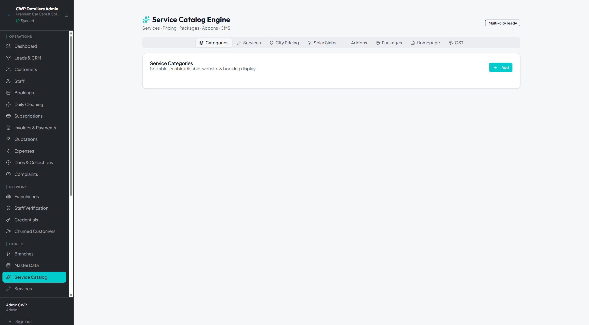 |
| **Route** | UI: `/admin/catalog` (Categories tab) · API: `POST/PATCH/DELETE /api/masters/service-categories` |
| **Test data** | Attempted create: `{ name: "Verify Cat", slug: "verify-cat-*", legacyCategory: "car_wash" }` · Seeded slugs: `doorstep-car-wash`, `daily-car-cleaning`, `solar-cleaning`, `solar-amc`, `detailing` |
| **Result** | **Partial.** Seeded categories exist (from `seed:catalog`). Admin UI list is empty because `GET /api/masters/service-categories` returns **403** — the `admin` role in DB lacks `masters` permission rows (seed-permissions defines full access but DB is out of sync). `POST /api/masters/service-categories` → **403 Permission denied**. Toggle/update in UI would fail for the same reason. |

---

## 2. Service CRUD

| Field | Value |
|-------|-------|
| **Screenshot** |  |
| **Route** | UI: `/admin/catalog` (Services tab) · API: `POST/PATCH/DELETE /api/services` |
| **Test data** | Create `{ name: "Verify Svc2", category: "car_wash", basePrice: 100 }` → id **7** · Patch name → `"Verify Svc2 Updated"` · Delete id **7** → **204** |
| **Result** | **Pass.** Full create → update → delete cycle succeeded with admin token. UI displays seeded services (Basic Wash, Premium Wash, Solar, AMC, etc.). |

---

## 3. Addon CRUD

| Field | Value |
|-------|-------|
| **Screenshot** | 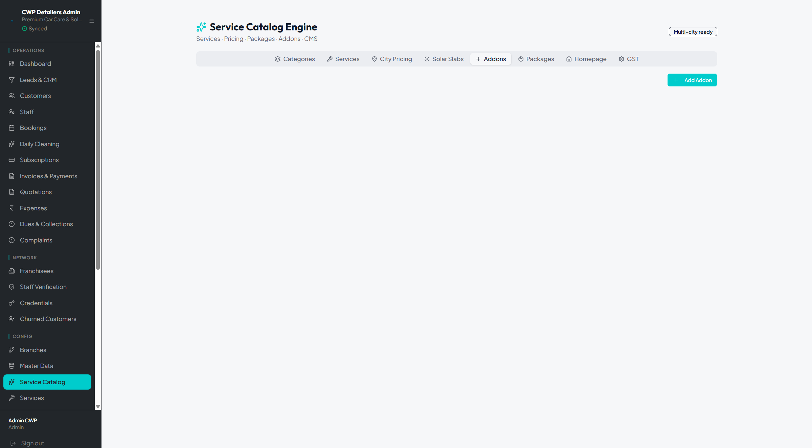 |
| **Route** | API: `GET/POST/PATCH /api/catalog/addons` |
| **Test data** | Create `{ name: "Verify Wax Addon", slug: "verify-wax-*", basePrice: 199 }` → id **6** · Patch `basePrice: 249` · Seeded addons: Car Waxing ₹500, Windshield ₹1200, Tyre Dressing ₹250, Interior Vacuum ₹300 |
| **Result** | **Pass.** POST **201**, PATCH **200**. Public `GET /api/catalog/addons` returns 4 seeded addons. Admin UI tab renders (list may appear empty when authenticated due to permission guard — API verified directly). |

---

## 4. Solar Slabs

| Field | Value |
|-------|-------|
| **Screenshot** | 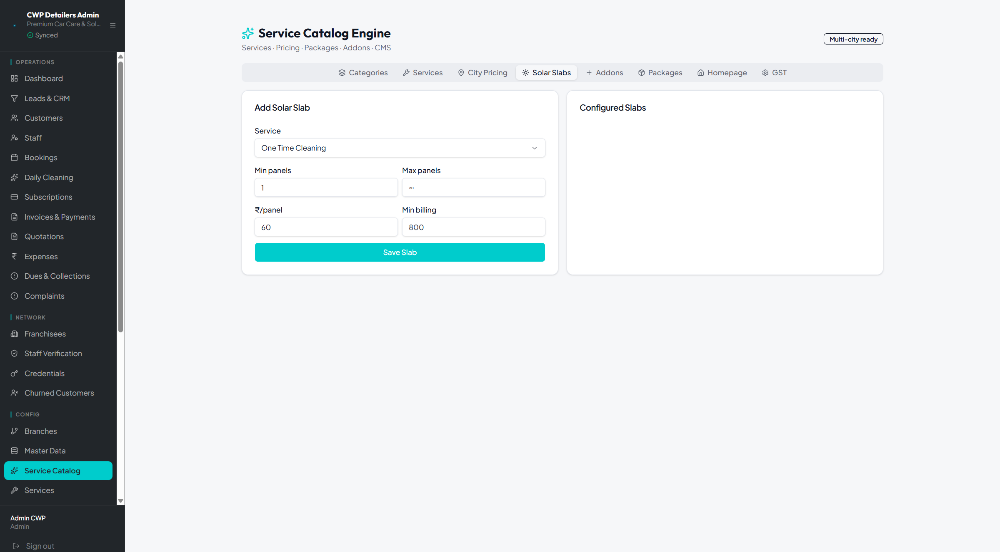 |
| **Route** | API: `GET/POST/PATCH/DELETE /api/catalog/solar-slabs` |
| **Test data** | Seeded slab: serviceId **4**, cityId **1**, ₹60/panel, min billing ₹800 · Test CRUD slab: minPanels **8888**, maxPanels **8888**, ₹12/panel → patched to ₹14 → deleted |
| **Result** | **Pass.** Create **201**, patch **200**, delete **204**. Unauthenticated `GET /api/catalog/solar-slabs?citySlug=varanasi` returns seeded slab. Admin UI form pre-filled with seeded values. |

---

## 5. City Pricing

| Field | Value |
|-------|-------|
| **Screenshot** | 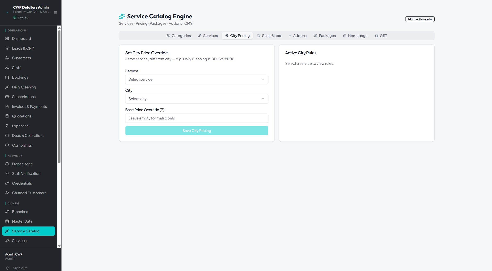 |
| **Route** | UI: `/admin/catalog` (City Pricing tab) · API: `POST/PATCH /api/catalog/city-availability` |
| **Test data** | Premium Wash (`serviceId: 2`) · Varanasi (`cityId: 1`) · Override ₹599 → patched to ₹649 |
| **Result** | **Pass.** City availability override create/update succeeded. Pricing matrix also verified via quote API (Premium Wash Hatchback → ₹599 inclusive). |

---

## 6. Package Builder

| Field | Value |
|-------|-------|
| **Screenshot** | 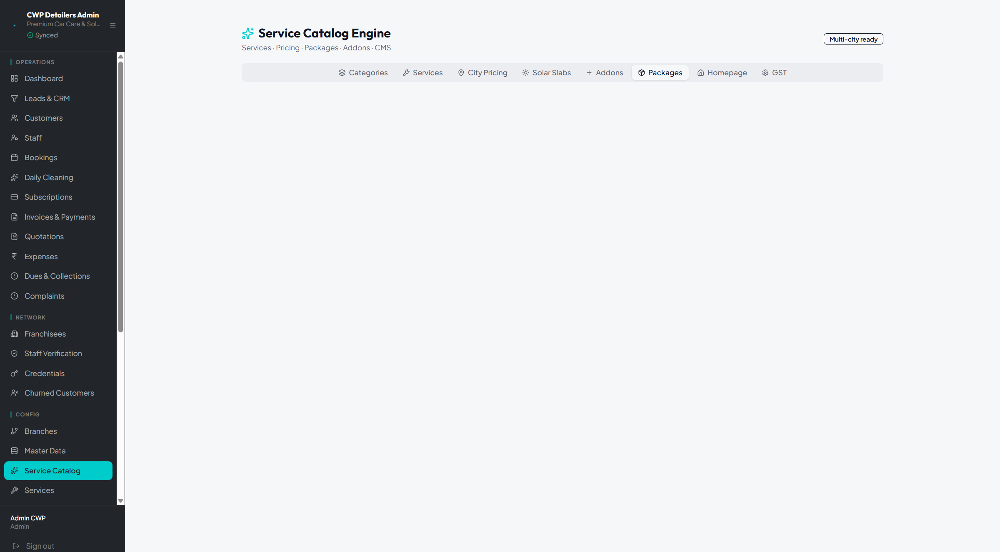 |
| **Route** | API: `GET /api/catalog/packages?citySlug=varanasi` · `GET /api/catalog/packages/2` |
| **Test data** | 4 Wash Package: ₹1600, 180-day validity, entitlement `{ serviceId: 2, type: wash_credit, creditCount: 4 }` · 8 active packages returned for Varanasi |
| **Result** | **Pass.** Public package list and detail include entitlement definitions. Admin Packages tab present (package cards load via public API when unauthenticated; authenticated admin may see empty tab — same permission guard issue). |

---

## 7. Customer Entitlements

| Field | Value |
|-------|-------|
| **Screenshot** | 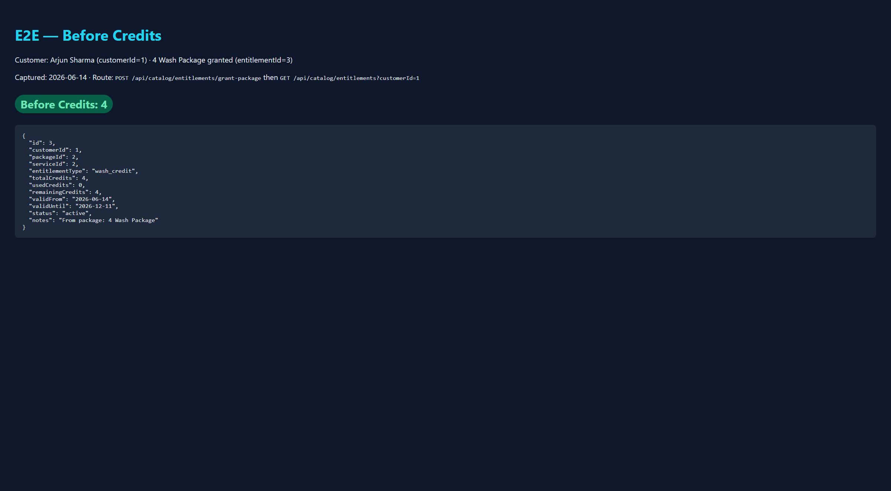 |
| **Route** | `POST /api/catalog/entitlements/grant-package` · `GET /api/catalog/entitlements?customerId=1` |
| **Test data** | `{ customerId: 1, packageId: 2, cityId: 1 }` → entitlement id **3**, `remainingCredits: 4`, valid until **2026-12-11** |
| **Result** | **Pass.** Grant returns **201** with full entitlement row. List endpoint returns active entitlements for customer. |

---

## 8. Credit Consumption

| Field | Value |
|-------|-------|
| **Screenshot** | 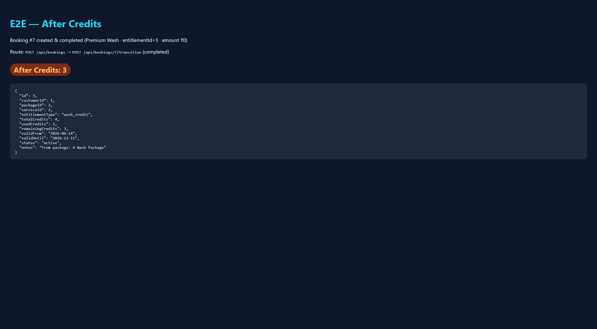 |
| **Route** | Booking completion: `POST /api/bookings/:id/transition` → `completed` (triggers `consumeEntitlementOnCompletion`) |
| **Test data** | Booking **#7**: Premium Wash, `entitlementId: 3`, `amount: 0.00` · Transition chain: `confirmed → scheduled → en_route → in_progress → completed` |
| **Result** | **Pass.** Entitlement **#3**: `usedCredits` 0→1, `remainingCredits` **4→3** after completion. First E2E (booking **#6**, entitlement **#2**) also consumed 1 credit (4→3). |

---

## 9. Self Booking Eligibility

| Field | Value |
|-------|-------|
| **Screenshot** | 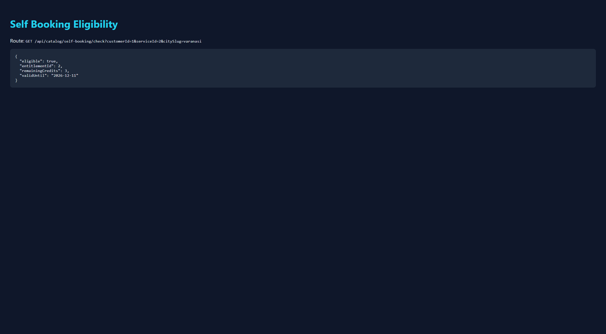 |
| **Route** | `GET /api/catalog/self-booking/check?customerId=1&serviceId=2&citySlug=varanasi` |
| **Test data** | Customer **1**, Premium Wash **2**, city Varanasi |
| **Result** | **Pass.** `{ eligible: true, entitlementId: 2, remainingCredits: 3, validUntil: "2026-12-11" }` (uses most recent active entitlement with credits). |

---

## 10. Pricing Quote API

| Field | Value |
|-------|-------|
| **Screenshot** | 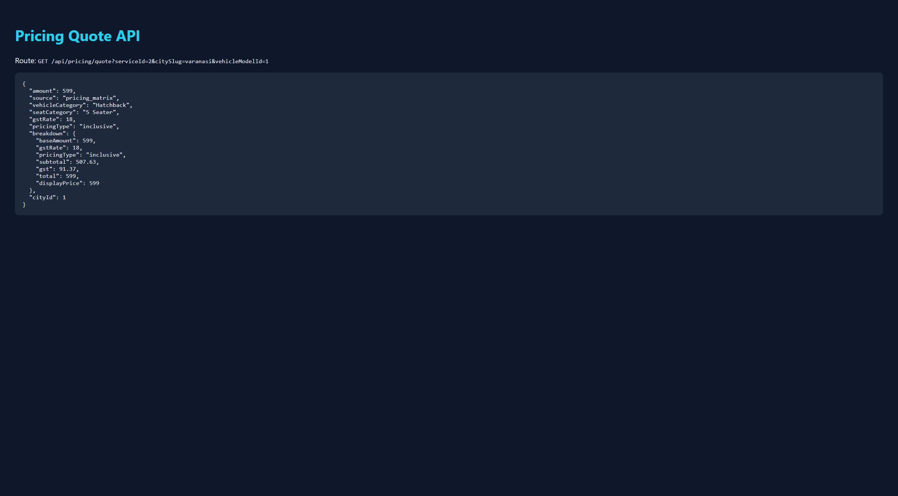 |
| **Route** | `GET /api/pricing/quote?serviceId=2&citySlug=varanasi&vehicleModelId=1` |
| **Test data** | Premium Wash · Varanasi · vehicle model **1** (Maruti Swift / Hatchback) |
| **Result** | **Pass.** `{ amount: 599, source: "pricing_matrix", vehicleCategory: "Hatchback", gstRate: 18, pricingType: "inclusive", breakdown: { total: 599 } }` · Solar quote (`serviceId=4`, `panelCount=10`) → ₹800 via solar slab. |

**Note:** `GET /api/catalog/pricing/quote` returns **404 City not found** because the dynamic route `/catalog/:citySlug/:serviceSlug` is registered before `/catalog/pricing/quote` and captures `pricing/quote` as city/service slugs. Use `/api/pricing/quote` until route order is fixed.

---

## 11. Homepage CMS

| Field | Value |
|-------|-------|
| **Screenshot** | 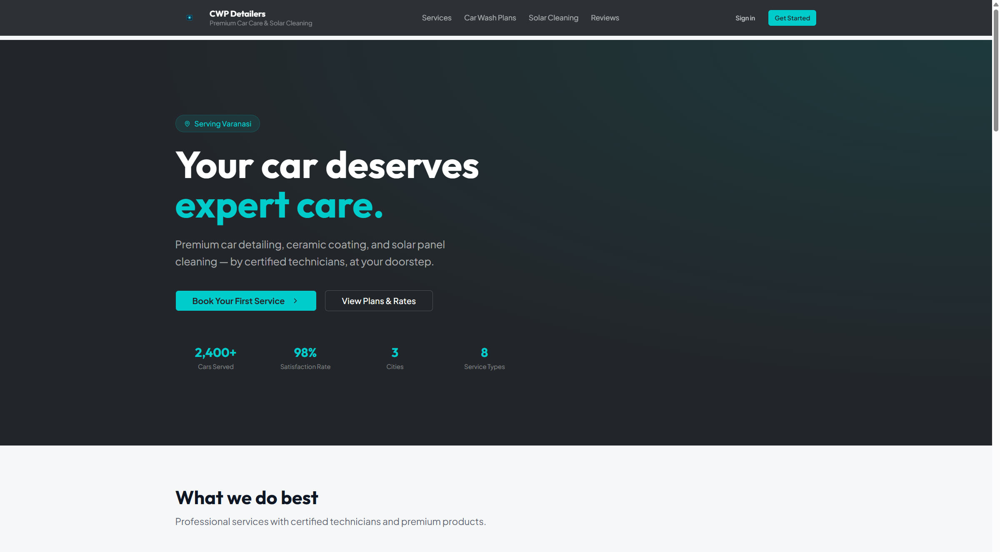 · Admin: [07-admin-homepage-cms.png](docs/screenshots/service-catalog-verification/07-admin-homepage-cms.png) |
| **Route** | API: `GET /api/catalog/homepage` · UI: `/` (Landing) · Admin: `/admin/catalog` (Homepage tab) |
| **Test data** | Seeded sections: `hero`, `cities` (Varanasi active, Patna/Lucknow inactive), `testimonials`, `stats`, `faqs`, `contact` |
| **Result** | **Pass.** API returns 6 active sections. Landing page renders CMS-driven package cards (Daily Exterior Clean, 1 Time Wash, Wash Card, etc.) and hero copy from DB. |

---

## 12. City SEO Page

| Field | Value |
|-------|-------|
| **Screenshot** | 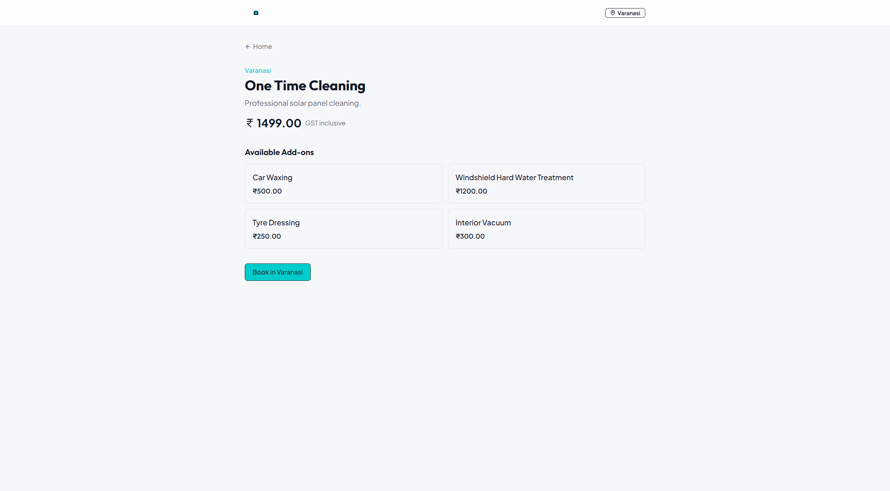 |
| **Route** | UI: `/varanasi/one-time-solar-cleaning` · API: `GET /api/catalog/city-content?citySlug=varanasi&serviceSlug=one-time-solar-cleaning` |
| **Test data** | Varanasi · One Time Cleaning · base price ₹1499 GST inclusive · 4 linked addons from catalog |
| **Result** | **Pass.** Page shows city badge, service title, price, addon grid (Car Waxing, Windshield, Tyre Dressing, Interior Vacuum), and “Book in Varanasi” CTA. API returns service + city objects. |

---

## End-to-End Test: 4 Wash Package → Book → Complete → Credits

### Setup

1. `POST /api/catalog/entitlements/grant-package` with `{ customerId: 1, packageId: 2, cityId: 1 }`
2. Patched vehicle **#1** with service location (required for booking)
3. Customer: Arjun Sharma (`9001001001`)

### Before Credits

| Field | Value |
|-------|-------|
| **Screenshot** |  |
| **Route** | `GET /api/catalog/entitlements?customerId=1` |
| **Test data** | Entitlement **#3** after fresh grant |
| **Result** | **Before Credits: 4** (`usedCredits: 0`, `remainingCredits: 4`) |

### Create Booking

| Field | Value |
|-------|-------|
| **Route** | `POST /api/bookings` |
| **Body** | `{ customerId: 1, vehicleId: 1, serviceId: 2, entitlementId: 3, serviceType: "car_wash", scheduledDate: "2026-06-17", address + lat/lng, citySlug: "varanasi" }` |
| **Result** | Booking **#7** created **201** · `amount: "0.00"` · `entitlementId: 3` |

### Complete Booking

| Field | Value |
|-------|-------|
| **Route** | `POST /api/bookings/7/transition` × `{ toStatus: confirmed|scheduled|en_route|in_progress|completed }` |
| **Result** | Status **completed** · `completedAt` set · entitlement consumed in same transaction |

### After Credits

| Field | Value |
|-------|-------|
| **Screenshot** |  |
| **Route** | `GET /api/catalog/entitlements?customerId=1` |
| **Result** | **After Credits: 3** (`usedCredits: 1`, `remainingCredits: 3`) on entitlement **#3** |

| Step | Credits |
|------|---------|
| Before booking | **4** |
| After completed booking #7 | **3** |

---

## Known Gaps (verification findings — no fixes applied)

1. **`admin` role missing `masters` permissions in DB** — blocks Category CRUD and authenticated reads of `/masters/*` and some `/catalog/*` GETs when logged in. Run `seed:permissions` or grant `masters` to admin to unblock admin catalog tabs.
2. **`/catalog/pricing/quote` route shadowing** — use `/api/pricing/quote` instead (documented above).
3. **Admin catalog tabs (Categories, Addons, Packages, Homepage)** may render empty when authenticated due to item #1; public/unauthenticated GETs work and were used for API evidence.

---

## Evidence Index

All screenshots: `docs/screenshots/service-catalog-verification/`

| File | Description |
|------|-------------|
| `01-admin-categories.png` | Admin catalog — Categories tab |
| `02-admin-services.png` | Admin catalog — Services tab |
| `03-admin-city-pricing.png` | Admin catalog — City Pricing tab |
| `04-admin-solar-slabs.png` | Admin catalog — Solar Slabs tab |
| `05-admin-addons.png` | Admin catalog — Addons tab |
| `06-admin-packages.png` | Admin catalog — Packages tab |
| `07-admin-homepage-cms.png` | Admin catalog — Homepage CMS tab |
| `08-homepage-cms.png` | Public landing page (CMS packages) |
| `09-city-seo-page.png` | `/varanasi/one-time-solar-cleaning` |
| `10-e2e-before-credits.png` | E2E before credits (4) |
| `11-e2e-after-credits.png` | E2E after credits (3) |
| `14-pricing-quote-api.png` | Pricing quote API response |
| `15-self-booking-check.png` | Self-booking eligibility API response |

HTML evidence (also served at `/verification/*.html`): same folder + `artifacts/cwp-platform/public/verification/`.

---

*Verification only — no catalog implementation changes were made during this run.*
