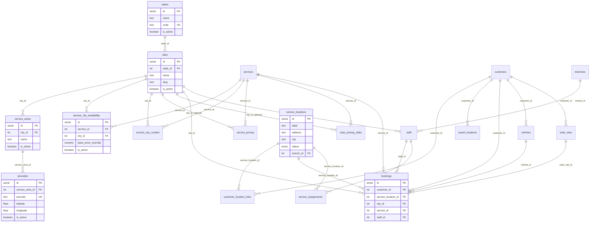

# Address, Google Maps & Booking Architecture Audit Report

**Project:** CWP Detailers / Kleansolar  
**Date:** 16 July 2026  
**Version:** 1.0  
**Scope:** Address storage, Google Maps integration, booking flow, service availability, admin location management, validation, database schema  
**Status:** Inspection only — **no code changes made**

---

## Executive Summary

CWP Detailers has a **frontend-only Google Maps integration** (Maps JS + Places Autocomplete + client Geocoder), **flat-text address storage** with lat/lng/place_id, and **two parallel booking paths** (customer self-service vs admin wizard). Coverage master data (`states → cities → service_areas → pincodes`) exists but is **not enforced at booking time**. City-level service availability is defined in the DB and used for SEO/catalog listing only — **`isServiceAvailableInCity()` is never called during booking creation**.

The platform is effectively a **single-city (Varanasi) operation** with hardcoded `citySlug: "varanasi"` in the customer flow.

**Primary findings:**

1. All paid Google Maps usage is isolated to one component (`GoogleMapPicker.tsx`); the backend never calls Google APIs.
2. Customer addresses are stored as a single TEXT blob + coordinates — no structured Indian address fields.
3. Pincode and city availability master data exists but is disconnected from booking validation.
4. Customer booking has no payment step; unavailable-by-city services can still be booked.
5. `place_id` is persisted across five tables but never read for business logic.

---

## Table of Contents

1. [Google Maps Integration](#1-google-maps-integration)
2. [Address Storage](#2-address-storage)
3. [Booking Flow](#3-booking-flow)
4. [Service Availability Logic](#4-service-availability-logic)
5. [Database Audit & ER Diagram](#5-database-audit--er-diagram)
6. [Admin Panel](#6-admin-panel)
7. [Booking Validation](#7-booking-validation)
8. [Google Maps Data](#8-google-maps-data)
9. [Comparison with Market Leaders](#9-comparison-with-market-leaders)
10. [Final Gap Analysis](#10-final-gap-analysis)
11. [Key File Index](#11-key-file-index)

---

## 1. Google Maps Integration

### 1.1 APIs in Use

| Google API / Product | Used? | Where | Backend? |
|---|---|---|---|
| **Maps JavaScript API** (Map, Marker) | Yes | `GoogleMapPicker.tsx` | No |
| **Places Autocomplete** (legacy widget) | Yes | `GoogleMapPicker.tsx` | No |
| **Place Details** (implicit via Autocomplete `getPlace()`) | Yes | Same — SDK fetches details on selection | No |
| **Geocoding** (reverse, client-side `Geocoder`) | Yes | Pin drag, map click, "Use current location" | No |
| **Directions API** | No | Deep links only (`urls.ts`) | No |
| **Distance Matrix** | No | Haversine in `geoFence.ts` | N/A |
| **Static Maps** | No | — | No |
| **Server-side Geocoding REST** | No | — | No |
| **Place Details REST** | No | — | No |
| **Roads / Elevation / etc.** | No | — | No |

**Config:** `VITE_GOOGLE_MAPS_API_KEY` (fallback `GOOGLE_MAPS_API_KEY`) in `.env.example`.

**Loader:** `artifacts/cwp-platform/src/lib/maps/loadGoogleMaps.ts`

```
https://maps.googleapis.com/maps/api/js?key=KEY&libraries=places&callback=__cwpGoogleMapsInit&v=weekly
```

**Note:** `GoogleSignInButton.tsx` uses Google Identity Services — unrelated to Maps.

---

### 1.2 Places Autocomplete

| Attribute | Detail |
|---|---|
| **Frontend file** | `artifacts/cwp-platform/src/components/shared/GoogleMapPicker.tsx` |
| **Backend file** | None |
| **Request** | `new maps.places.Autocomplete(input, { fields: ["formatted_address", "geometry", "place_id"], componentRestrictions: { country: "in" } })` |
| **Response fields used** | `formatted_address`, `geometry.location` (lat/lng), `place_id` |
| **Response fields ignored** | `name`, `address_components`, `types`, `url`, `vicinity`, `plus_code`, `business_status`, viewport/bounds, all other results |
| **Stored fields** | `address` (from formatted_address), `latitude`, `longitude`, `place_id` |
| **Unused stored fields** | `place_id` is written but never read for logic, navigation, or re-fetch |

---

### 1.3 Geocoding (Reverse)

| Attribute | Detail |
|---|---|
| **Frontend file** | `GoogleMapPicker.tsx` (lines 48–66, 183–189) |
| **Backend file** | None |
| **Request** | `geocoder.geocode({ location: { lat, lng } }, callback)` |
| **Response fields used** | `results[0].formatted_address`, `results[0].place_id` |
| **Response fields ignored** | `address_components`, `geometry.bounds/viewport`, `types`, `partial_match`, `plus_code`, all other results |
| **Fallback** | If geocode fails → coordinate string `"lat, lng"` used as address |
| **Stored fields** | Same as above |

---

### 1.4 Maps SDK (Interactive Map)

| Attribute | Detail |
|---|---|
| **Frontend file** | `GoogleMapPicker.tsx` |
| **Triggers** | Map mount, marker drag, map click, autocomplete pan |
| **Output** | lat/lng → reverse geocode or direct emit |
| **Stored** | lat/lng in DB columns per entity |

---

### 1.5 Deep Links (no API key, no billing to your key)

| Function | File | URL pattern |
|---|---|---|
| `mapsViewUrl` | `artifacts/cwp-platform/src/lib/maps/urls.ts` | `https://www.google.com/maps?q=lat,lng` |
| `buildMapsUrl` / `buildNavigateUrl` | Same | `https://www.google.com/maps/dir/?api=1&destination=lat,lng` |

Used by staff Navigate buttons and customer "View location" links across 10+ components.

---

### 1.6 API Cost Impact (when key is set)

| User action | Likely billed product | Frequency |
|---|---|---|
| Page load with map | Dynamic Maps | Per map load |
| Type in search | Autocomplete (session) | Per session |
| Select suggestion | Place Details (via `getPlace()` + `fields`) | Per selection |
| Drag pin / click map | Geocoding (reverse) | 1 request per action |
| "Use current location" | Geocoding (reverse) | 1 request |

**Cost risks:**

- No debouncing on reverse geocode during rapid pin drags
- Autocomplete + Place Details on every selection
- Multiple map instances if several pickers open in one session
- Staff/customer deep links are free (open Google Maps app/site)

**Backend never calls Google** — API server runs without Maps credentials.

---

### 1.7 Component Hierarchy

```
VITE_GOOGLE_MAPS_API_KEY set?
├── YES → GoogleMapPicker (Maps + Places + Geocoder)
│         ├── LocationPicker (assets, admin)
│         └── AddressPickerSheet (BookService)
└── NO  → Manual address + lat/lng + browser GPS (no geocode, no place_id)
```

---

### 1.8 Data Flow Diagram

```
┌─────────────────────────────────────────────────────────────┐
│  Frontend (cwp-platform)                                     │
│  loadGoogleMaps.ts → GoogleMapPicker.tsx                     │
│    ├── Autocomplete → formatted_address + lat/lng + place_id │
│    ├── Geocoder (reverse) → formatted_address + place_id     │
│    └── Map/Marker → lat/lng                                  │
│  LocationPicker / AddressPickerSheet → REST API              │
│  urls.ts → deep links (staff navigate, customer view)        │
└──────────────────────────┬──────────────────────────────────┘
                           │ REST (no Google on backend)
┌──────────────────────────▼──────────────────────────────────┐
│  API Server (api-server)                                     │
│  POST /bookings, /vehicles, /saved-locations, etc.           │
│  Stores: address, lat/lng, place_id                          │
│  Geofencing: Haversine (geoFence.ts) — NOT Google            │
└──────────────────────────┬──────────────────────────────────┘
                           │
┌──────────────────────────▼──────────────────────────────────┐
│  PostgreSQL                                                  │
│  bookings, saved_locations, service_locations, vehicles,     │
│  solar_sites — all with place_id (write-only in practice)    │
└─────────────────────────────────────────────────────────────┘
```

---

## 2. Address Storage

### 2.1 Architecture: Three Parallel Models

1. **`customers.address`** — legacy flat text + optional `city`
2. **`saved_locations`** — customer bookmarks (label, address, lat/lng, place_id)
3. **`service_locations` + `customer_location_links`** — newer canonical model (Sprint 2+)

These are **not kept in sync** beyond migration 029 backfill.

---

### 2.2 Primary Schemas

#### `saved_locations` — `lib/db/src/schema/saved-locations.ts`

| Column | DB type | Nullable | Default | Notes |
|---|---|---|---|---|
| `id` | SERIAL PK | NO | — | |
| `customer_id` | INTEGER | NO | — | No FK in Drizzle schema |
| `label` | TEXT | NO | — | Acts as nickname |
| `address` | TEXT | NO | — | Single formatted string |
| `latitude` | DOUBLE PRECISION | NO | — | Required |
| `longitude` | DOUBLE PRECISION | NO | — | Required |
| `place_id` | TEXT | YES | — | Google Places |
| `is_default` | BOOLEAN | NO | `false` | |
| `created_at` | TIMESTAMP | NO | `NOW()` | |
| `updated_at` | TIMESTAMP | NO | `NOW()` | |

**Migration:** `lib/db/migrations/006_master_data.sql`

---

#### `service_locations` — `lib/db/src/schema/service-locations.ts`

| Column | DB type | Nullable | Default | Notes |
|---|---|---|---|---|
| `id` | SERIAL PK | NO | — | |
| `label` | TEXT | NO | — | Nickname |
| `address` | TEXT | YES | — | Flat string |
| `city` | TEXT | YES | — | Free text, not FK |
| `latitude` | DOUBLE PRECISION | YES | — | |
| `longitude` | DOUBLE PRECISION | YES | — | |
| `place_id` | TEXT | YES | — | |
| `location_type` | ENUM | NO | `'other'` | office, factory, residence, parking, other |
| `status` | ENUM | NO | `'active'` | active, inactive |
| `is_auto_created` | BOOLEAN | NO | `false` | Backfill flag |
| `company_id` | INTEGER | YES | — | Tenant scope |
| `franchisee_id` | INTEGER | YES | — | |
| `branch_id` | INTEGER | YES | — | |
| `created_at` | TIMESTAMP | NO | `NOW()` | |
| `updated_at` | TIMESTAMP | NO | `NOW()` | |

**Migration:** `lib/db/migrations/029_service_locations.sql`

---

#### `bookings` (address snapshot at booking time) — `lib/db/src/schema/bookings.ts`

| Column | Nullable | Notes |
|---|---|---|
| `service_location_id` | YES | FK to service location |
| `saved_location_id` | YES | FK to saved location |
| `address` | YES | Snapshot at booking time |
| `area` | YES | Only `area` field in customer flow |
| `location_lat` | YES | |
| `location_lng` | YES | |
| `place_id` | YES | Added in migration 006 |
| `notes` | YES | General notes, not delivery instructions |
| `city_id` | YES | FK to `cities` master (often unset in customer flow) |

---

### 2.3 Example Records (from seed / defaults)

| Entity | Example |
|---|---|
| Branch | `address: "Lanka, Varanasi - 221005"`, `city: "Varanasi"` |
| Customer | `address: "Lanka, Varanasi"`, `city: "Varanasi"` |
| Business info | `address_line1: "Seer Goverdhanpur, Behind BHU"`, `pin_code: "221005"`, `state: "Uttar Pradesh"` |
| Saved location | `{ label: "Home", address: "123 Main St, Varanasi", latitude: 25.3176, longitude: 82.9739, placeId: "ChIJ..." }` |

---

### 2.4 Field Coverage Matrix

| Field | Stored? | Where | Nullable? |
|---|---|---|---|
| Address Line 1 | Partial | `business_info.address_line1`; staff `house_number` + `street` | business: NO; staff: YES |
| Address Line 2 | Partial | `business_info.address_line2` only | YES |
| House Number | Staff only | `staff.current_house_number`, `permanent_house_number` | YES |
| Building Name | **No** | — | — |
| Apartment / Flat | **No** | — | — |
| Landmark | Staff only | `staff.current_landmark`, `permanent_landmark` | YES |
| Street | Staff only | `staff.current_street`, `permanent_street` | YES |
| Area | Partial | `bookings.area`, staff `current_area`; `service_areas.name` is operational zone | YES |
| Locality | Partial | `schema_org` JSON only | YES |
| Sub-locality | **No** | — | — |
| Village | **No** | — | — |
| City | Yes | `customers`, `service_locations`, `solar_sites`, `branches`, staff, `cities` master | Mostly YES (except branches.city NOT NULL) |
| District | **No** | — | — |
| State | Partial | `business_info`, staff, `states` master | YES (staff) / NO (business_info) |
| Country | Partial | `business_info.country` | NO on business_info |
| PIN Code | Partial | `business_info.pin_code`, staff pincode, `pincodes` master | YES |
| Latitude | Yes | saved_locations (required), service_locations, bookings, vehicles, solar_sites | YES except saved_locations |
| Longitude | Yes | Same | Same |
| Google Place ID | Yes | saved_locations, service_locations, bookings, vehicles, solar_sites | YES |
| Formatted Address | **No column** | Folded into `address` TEXT at runtime | — |
| Address Nickname | Yes | `label` / `location_label` | NO (label) |
| Default Address | Yes | `saved_locations.is_default`, `customer_location_links.is_default` | NO (default false) |
| Address Type | Yes | `service_locations.location_type` enum | NO (default `other`) |
| Delivery Instructions | **No** | — | — |
| Location Accuracy | Partial | GPS logs only — not on address records | YES |
| Plus Code | **No** | — | — |

**Customer-facing addresses are a single TEXT blob + coordinates.** Staff profiles have the richest breakdown; `business_info` is the only fully structured postal address.

---

### 2.5 Tables with `place_id`

| Table | Schema file | Geo columns |
|---|---|---|
| `bookings` | `lib/db/src/schema/bookings.ts` | `address`, `location_lat`, `location_lng`, `place_id` |
| `vehicles` | `lib/db/src/schema/vehicles.ts` | `service_address`, `service_lat`, `service_lng`, `place_id` |
| `solar_sites` | `lib/db/src/schema/solar-sites.ts` | `service_lat`, `service_lng`, `place_id` |
| `saved_locations` | `lib/db/src/schema/saved-locations.ts` | `address`, `latitude`, `longitude`, `place_id` |
| `service_locations` | `lib/db/src/schema/service-locations.ts` | `address`, `latitude`, `longitude`, `place_id` |

---

## 3. Booking Flow

### 3.1 Path A — Customer Self-Service (Primary)

```
User opens app
    │
    ▼
/  Landing.tsx
    GET /api/services, /api/catalog/homepage-plans?citySlug=varanasi
    │
    ▼
/register or /login
    POST /api/auth/login (portal: customer)
    │
    ▼
/customer/dashboard  Dashboard.tsx
    GET /api/customers/:id/summary, /api/bookings
    │
    ▼
/customer/bookings  BookService.tsx  (FAB in CustomerLayout)
    │
    ├── Step "service"
    │     GET /api/catalog/services  (ALL active services, no city filter)
    │     Pick category + service
    │
    ├── Step "asset"
    │     GET /api/vehicles, /api/solar-sites
    │     QuickAddAssetSheet → POST /api/vehicles or /api/solar-sites
    │
    └── Step "schedule"
          AddressPickerSheet → GET/POST /api/saved-locations
          GET /api/catalog/addons, /api/catalog/pricing/quote
          GET /api/catalog/self-booking/check
          │
          ▼
    POST /api/bookings  (citySlug: "varanasi" hardcoded)
          │
          ▼
    Inline success screen → /customer/history, /customer/bookings/:id
```

**No payment step** in customer booking. Payment is separate via invoices (`/customer/invoices`) and wallet (`/customer/wallet` — manual recharge via call/WhatsApp).

---

### 3.2 Path B — Admin Book Services Wizard

```
/admin/book-services?customerId=X  BookServicesPage.tsx
    │
    ├── 1. CustomerSelect
    ├── 2. LocationSelect + InlineServiceAddressForm
    │       GET/POST /api/service-locations
    ├── 3. AssetSelect + InlineVehicleSolarForm
    │       GET /api/assets
    ├── 4. ServiceSelect
    │       GET /api/services, /api/catalog/packages
    ├── 5. AddOnSelect
    ├── 6. DiscountStep
    ├── 7. PaymentTermsStep (full_advance / partial / after_service)
    ├── 8. ReviewSummaryStep
    │
    ▼
POST /api/service-contracts
    → creates booking + customer_contracts registry
POST /api/service-contracts/:id/quotation OR /invoice
    │
    ▼
ContractCreatedStep (confirmation + billing links)
```

---

### 3.3 Path C — SEO / Marketing (Not a Booking Funnel)

```
/:citySlug/:serviceSlug  CityServicePage.tsx
    GET /api/catalog/:citySlug/:serviceSlug
    CTA → /register (not direct booking)
```

---

### 3.4 Screen / API Reference Table

| Stage | Route / Screen | Key APIs |
|---|---|---|
| Landing | `/` | `/api/catalog/homepage`, `/api/services` |
| Auth | `/login`, `/register` | `/api/auth/*` |
| Dashboard | `/customer/dashboard` | `/api/customers/:id/summary` |
| Service pick | `/customer/bookings` step 1 | `/api/catalog/services` |
| Asset pick | step 2 | `/api/vehicles`, `/api/solar-sites` |
| Address + schedule | step 3 | `/api/saved-locations`, `/api/catalog/pricing/quote` |
| Submit | — | `POST /api/bookings` |
| Confirmation | inline + `/customer/history` | `GET /api/bookings` |
| Payment (separate) | `/customer/wallet`, `/customer/invoices` | wallet/invoice APIs |
| Admin booking | `/admin/book-services` | `/api/service-contracts`, quotation/invoice |

---

## 4. Service Availability Logic

| Check | Backend validates? | Frontend validates? | Details |
|---|---|---|---|
| **City** | No at booking | No | `citySlug: "varanasi"` hardcoded; `isServiceAvailableInCity()` exists but is **never called** |
| **Pincode** | No | No | `GET /masters/pincodes/lookup/:pincode` exists, **unused** in booking |
| **Radius / geofence** | Post-booking only | No | 150m staff geofence on job start/complete, not at booking |
| **GPS** | Partial | Partial | Customer must provide lat/lng; no accuracy check at booking |
| **Service active globally** | Partial | Yes (catalog filter) | Inactive services hidden from catalog; city-level disable does not block |
| **Fallback** | Pricing falls back to base price | None for coverage | No "unserviceable" UX |

### 4.1 Can Unavailable Services Still Be Booked?

**Yes.**

1. Customer UI uses `GET /api/catalog/services` — all active services, no city filter.
2. `POST /api/bookings` does not call `isServiceAvailableInCity()`.
3. City availability only gates `GET /api/catalog/services/:citySlug` (SEO) and price overrides.
4. Admin wizard uses `GET /api/services?includeInactive=true` — no city filter.

Disabling a service globally (`isActive: false` / `status: archived`) hides it; **city-level deactivation alone does not block booking**.

### 4.2 `isServiceAvailableInCity()` — Defined but Unused

```typescript
// artifacts/api-server/src/lib/catalog/pricingEngine.ts:66
export async function isServiceAvailableInCity(serviceId: number, cityId: number): Promise<boolean> {
  const [row] = await db.select()
    .from(serviceCityAvailabilityTable)
    .where(and(
      eq(serviceCityAvailabilityTable.serviceId, serviceId),
      eq(serviceCityAvailabilityTable.cityId, cityId),
      eq(serviceCityAvailabilityTable.isActive, true),
    ))
    .limit(1);
  return !!row;
}
```

**Grep result:** Only defined in `pricingEngine.ts` — never imported or called elsewhere.

---

## 5. Database Audit & ER Diagram

### 5.1 Location / Coverage Domain

| Table | Role |
|---|---|
| `states` | State master |
| `cities` | City master (`slug`, `is_active`) |
| `service_areas` | Zones within city |
| `pincodes` | Postal coverage → service area |

### 5.2 Address / Delivery Points

| Table | Role |
|---|---|
| `service_locations` | Customer service address |
| `customer_location_links` | Customer ↔ location M:N |
| `saved_locations` | Legacy saved GPS addresses |
| `customers` | Profile address (text) |
| `vehicles` | Per-vehicle service point |
| `solar_sites` | Solar install site |
| `branches` | Branch office (free-text city) |

### 5.3 Bookings & Operations

| Table | Role |
|---|---|
| `bookings` | Service jobs |
| `booking_events` | Audit trail |
| `service_assignments` | Staff assignment |
| `pending_service_assignments` | Pre-assignment queue |
| `service_executions` | Job execution |
| `staff_location_logs` | Staff GPS trail |
| `dcms_subscription_locations` | Daily-cleaning geo-fence |
| `dcms_visits` | DCMS visit records |

### 5.4 Service Types & Availability

| Table | Role |
|---|---|
| `service_categories` | Taxonomy |
| `services` | Sellable services |
| `service_city_availability` | Per-city on/off + price override |
| `service_city_content` | Per-city SEO content |
| `service_pricing` | Vehicle matrix pricing |
| `solar_pricing_slabs` | Solar tier pricing |
| `catalog_packages` | Package products |
| `customer_entitlements` | Credits |

### 5.5 Workers

| Table | Role |
|---|---|
| `staff` | Field workers |
| `staff_role_assignments` | Role mapping |
| `dcms_staff_assignments` | DCMS route staff |

**No tables named `zones` or `coverage`** — coverage = `service_areas` + `pincodes`.

---

### 5.6 ER Diagram



---

## 6. Admin Panel

| Capability | Admin UI | API | Status |
|---|---|---|---|
| Add city | Yes (`/admin/masters` → Cities) | `POST /masters/cities` | Works |
| Disable city | Yes ("Deactivate") | `DELETE /masters/cities/:id` (soft) | Works |
| Enable city | **No UI** | `PATCH /masters/cities/:id` `{ isActive: true }` | API only |
| Add pincode | Yes | `POST /masters/pincodes` | Requires raw `serviceAreaId` |
| Disable pincode | Yes | `DELETE /masters/pincodes/:id` | Soft delete |
| Enable pincode | **No UI** | `PATCH /masters/pincodes/:id` | API only |
| Coming Soon | **No** | **No** | No status enum |
| Unavailable (pincode/city) | Partial | `is_active` boolean only | No granular status |
| Bulk upload PIN codes | **No** | **No** | Seed script only |
| Import CSV | **No** | **No** | CSV exists for customer migration only |
| Export CSV | **No** | **No** | — |
| Search PIN | Partial | `GET /masters/pincodes?q=` | Text search only |
| Filter PIN | **No UI** | API supports `serviceAreaId`, `isActive` | Not exposed |
| Edit city/pincode | **No UI** | `PATCH` exists | Create + deactivate only |
| Per-city service availability | Yes (`/admin/services`) | `/catalog/city-availability` | Works |
| City price overrides | Built but hidden | `PricingTab.tsx` | Not in nav |

**Admin UI file:** `artifacts/cwp-platform/src/pages/admin/MasterData.tsx`

**UX gaps:** Raw numeric FK IDs instead of cascading dropdowns; no re-enable button; deactivated rows still visible in lists.

---

## 7. Booking Validation

### 7.1 Customer Flow (`POST /api/bookings`)

| Rule | Frontend | Backend | DB constraints |
|---|---|---|---|
| Customer linked | Account scope check | `customerId` required, tenant scope | FK implied |
| Service selected | `canContinueService` | `serviceType` required | enum |
| Address + GPS | `bookingLocation` required | `address`, `locationLat`, `locationLng` required | nullable columns |
| Scheduled date | `form.scheduledDate` | `scheduledDate` required | NOT NULL |
| Vehicle ownership | Implicit | Validates `vehicle.customerId` | — |
| Vehicle location complete | **Allows booking** ("set address on next step") | **Rejects** if `!vehicle.locationComplete` | boolean flag |
| Solar site location | Same gap | Same rejection | boolean flag |
| City service availability | **Not checked** | **Not checked** | — |
| Pincode coverage | **Not checked** | **Not checked** | — |
| Inactive service | Hidden from catalog | Daily-clean name guard only | — |
| Entitlement | UI hint | Server re-validates credits/expiry | — |
| Staff assignment | N/A | Role validation if `staffId` set | — |
| Payment | N/A | N/A on direct booking | — |

### 7.2 Admin Wizard (`POST /api/service-contracts`)

| Rule | Frontend (`validateStep`) | Backend (`serviceContractService`) |
|---|---|---|
| Customer selected | Yes | `customerId` required |
| Location selected | Yes | `assertCustomerLocation()` link check |
| Asset selected | Yes | `getAssetDetail()` |
| Service selected | Yes | Service exists; daily-clean guard |
| Lat/lng on location | **Not validated** | Defaults to `0, 0` if missing |
| City/pincode coverage | **Not checked** | **Not checked** |

### 7.3 Post-Booking Geofence (Staff)

```typescript
// artifacts/api-server/src/lib/staffLocation/locationService.ts
export const BOOKING_GEOFENCE_RADIUS_METERS = 150;
export const MAX_GPS_ACCURACY_METERS = 200;
```

Applied on booking status transitions — **not at booking creation**.

### 7.4 Bypass Vectors

1. **Direct API call** with valid session — skip all frontend checks; city/pincode never validated.
2. **Admin contract path** — booking created with `lat/lng = 0, 0` if service location has no coordinates.
3. **City-disabled services** — bookable via customer portal if globally active.
4. **`PATCH /api/bookings/:id`** — status changes without re-validating address/coverage.
5. **Frontend/backend mismatch** — customer can submit with incomplete vehicle location; backend rejects after UX implied success path.

**No database CHECK constraints** on lat/lng ranges or pincode format.

---

## 8. Google Maps Data

### 8.1 TypeScript Surface (What Code Reads)

```typescript
// Autocomplete getPlace() — only these fields requested
{
  formatted_address?: string;
  place_id?: string;
  geometry?: { location?: { lat(): number; lng(): number } };
}

// Geocoder results[0] — only these read
{
  formatted_address?: string;
  place_id?: string;
}

// App type (LocationValue) — artifacts/cwp-platform/src/features/master-data/api.ts
{
  address: string;
  latitude: number;
  longitude: number;
  placeId?: string;
}
```

### 8.2 Example Full Google Response (Ignored Fields)

When a user selects "Assi Ghat, Shivala, Varanasi, Uttar Pradesh 221005, India":

```json
{
  "formatted_address": "Assi Ghat, Shivala, Varanasi, Uttar Pradesh 221005, India",
  "place_id": "ChIJxxxxxxxxxxxx",
  "geometry": {
    "location": { "lat": 25.2843, "lng": 83.0060 },
    "viewport": {
      "south": 25.2830, "west": 83.0045,
      "north": 25.2855, "east": 83.0075
    }
  },
  "address_components": [
    { "long_name": "Assi Ghat", "short_name": "Assi Ghat", "types": ["establishment", "point_of_interest"] },
    { "long_name": "Shivala", "short_name": "Shivala", "types": ["sublocality_level_1", "sublocality", "political"] },
    { "long_name": "Varanasi", "short_name": "Varanasi", "types": ["locality", "political"] },
    { "long_name": "Varanasi", "short_name": "Varanasi", "types": ["administrative_area_level_2", "political"] },
    { "long_name": "Uttar Pradesh", "short_name": "UP", "types": ["administrative_area_level_1", "political"] },
    { "long_name": "India", "short_name": "IN", "types": ["country", "political"] },
    { "long_name": "221005", "short_name": "221005", "types": ["postal_code"] }
  ],
  "types": ["establishment", "point_of_interest"],
  "name": "Assi Ghat",
  "plus_code": {
    "global_code": "7JVW7XM5+XX",
    "compound_code": "7XM5+XX Varanasi, Uttar Pradesh, India"
  }
}
```

### 8.3 What Gets Stored

```json
{
  "address": "Assi Ghat, Shivala, Varanasi, Uttar Pradesh 221005, India",
  "latitude": 25.2843,
  "longitude": 83.0060,
  "placeId": "ChIJxxxxxxxxxxxx"
}
```

### 8.4 Fields Ignored (Should Likely Be Stored)

| Ignored field | Why it matters |
|---|---|
| `address_components` | Extract PIN, city, state, locality, sub-locality |
| `postal_code` | Pincode-based serviceability |
| `locality` / `sublocality` | Area-based routing |
| `administrative_area_level_1` | State for GST / compliance |
| `plus_code` | Offline/GPS fallback addressing |
| `name` | Landmark / POI name |
| `types` | Address vs establishment classification |
| `geometry.viewport` | Service area visualization |
| GPS `accuracy` | Quality gate for doorstep |

### 8.5 Inconsistent Capture Paths

| Path | placeId | Reverse geocode |
|---|---|---|
| GoogleMapPicker autocomplete | Yes | N/A |
| GoogleMapPicker drag/click | Yes (from geocode) | Yes |
| GoogleMapPicker GPS | Yes | Yes |
| AddressPickerSheet manual fallback | **No** | **No** |
| AddressPickerSheet GPS (no maps key) | **No** | **No** |

---

## 9. Comparison with Market Leaders

| UX Pattern | Swiggy / Zomato | Urban Company | Blinkit / Zepto | CWP Detailers |
|---|---|---|---|---|
| Location-first gate | Yes — browse blocked until location set | Yes — city + pincode | Yes — pincode mandatory | **No** — hardcoded Varanasi |
| Pincode serviceability check | Yes, before menu | Yes | Yes, instant | **No** — master data unused |
| GPS auto-detect on open | Yes | Yes | Yes | Optional, not on app open |
| Structured address form | House/flat/floor/landmark | House/flat/landmark/block | House/flat/tower | **Single text field** |
| Map pin adjustment | Yes | Yes | Yes (limited) | Yes (when API key set) |
| Saved addresses with labels | Home/Work/Other + default | Nickname + type | Multiple + default | Yes (basic labels) |
| "Change location" banner | Persistent header | Yes | Yes | **No** |
| Delivery / service instructions | Yes | Yes | Yes | **No** |
| Address verification | Partial | Yes | No | **No** |
| Unserviceable UX | "Not delivering here" + notify me | "Not available in your area" | "Unavailable at this pincode" | **No** — books anyway |
| Coming soon cities | Yes | Yes | Yes | **No** |
| Payment at checkout | Mandatory | Mandatory | Mandatory | **Not in customer booking** |
| Slot / time selection | Yes | Yes | Instant / slots | Date + optional time only |
| Live order tracking map | Yes | Limited | Yes | Staff navigate deep link only |
| Address dedup via place_id | Yes | Yes | Partial | Stored but **unused** |
| Reverse geocode on pin move | Debounced | Yes | Yes | Yes but **not debounced** |
| Multi-city expansion UX | Full | Full | Full | Single-city hardcode |

---

## 10. Final Gap Analysis

### 10.1 Current Architecture (As-Is)

```
┌─────────────────────────────────────────────────────────────┐
│  Frontend (React + Vite)                                     │
│  GoogleMapPicker → LocationValue {address, lat, lng, placeId}│
│  BookService (3 steps) │ Admin BookServicesWizard (8 steps)  │
└──────────────────────────┬──────────────────────────────────┘
                           │ REST (no Google on backend)
┌──────────────────────────▼──────────────────────────────────┐
│  API Server (Express)                                        │
│  POST /bookings │ POST /service-contracts                    │
│  Validates: address+GPS, asset ownership, locationComplete   │
│  Does NOT validate: city availability, pincode, radius       │
└──────────────────────────┬──────────────────────────────────┘
                           │
┌──────────────────────────▼──────────────────────────────────┐
│  PostgreSQL                                                  │
│  Flat address TEXT + lat/lng/place_id                        │
│  Coverage masters (states/cities/areas/pincodes) — unused    │
│  service_city_availability — SEO/pricing only                │
└─────────────────────────────────────────────────────────────┘
```

---

### 10.2 Problems

1. **Coverage data exists but is not enforced** — pincodes and city availability are admin-only metadata.
2. **Three address models** — `customers.address`, `saved_locations`, `service_locations` without sync.
3. **`place_id` is write-only** — no dedup, refresh, or Place Details re-fetch.
4. **Single-city hardcode** — `citySlug: "varanasi"` blocks multi-city without code changes.
5. **Customer booking has no payment** — unlike every competitor; revenue leakage risk.
6. **Frontend/backend validation mismatch** — vehicle `locationComplete` warning vs hard rejection.
7. **Admin path allows 0,0 coordinates** — geofence and navigation break silently.
8. **Legacy Places Autocomplete widget** — Google deprecating in favor of Places API (New).
9. **No structured Indian address fields** — house/flat/landmark/PIN not captured for customers.
10. **Geofence only post-booking** — customers outside service area can book; ops discovers at job time.

---

### 10.3 Missing Database

| Proposed entity / column | Purpose |
|---|---|
| Unified `addresses` table with structured components | Single source of truth |
| `pincode`, `locality`, `sublocality`, `state`, `district` on customer addresses | Serviceability + GST |
| `delivery_instructions`, `floor`, `flat_number`, `landmark` | Ops UX |
| `location_accuracy_meters`, `plus_code` | Quality + fallback |
| `coverage_status` enum on pincodes/cities (`active`, `coming_soon`, `unserviceable`) | Marketing UX |
| `service_pincode_availability` (service × pincode) | Granular coverage |
| FK: `service_locations.city_id` → `cities.id` | Replace free-text city |
| DB CHECK: lat/lng range, non-zero coordinates on bookings | Data integrity |

---

### 10.4 Missing APIs

| API | Purpose |
|---|---|
| `GET /api/coverage/check?lat=&lng=` or `?pincode=` | Pre-booking serviceability |
| `POST /api/addresses/parse` (server-side geocode optional) | Structured address from place_id |
| `GET /api/catalog/services?citySlug=` used by customer app | City-filtered catalog |
| Booking create: call `isServiceAvailableInCity()` | Enforce availability |
| Pincode bulk import/export endpoints | Admin ops |
| Places API (New) Autocomplete session token endpoint | Cost control + future-proofing |

---

### 10.5 Missing UX

- Location-first gate on app open
- Pincode entry + instant serviceability feedback
- Structured address form (house/flat/landmark/floor)
- "Not serviceable here" with notify-me / coming soon
- Change location banner across app
- Payment step in customer booking
- Address edit/re-enable in admin masters
- Cascading state → city → area → pincode dropdowns
- Debounced reverse geocode on pin drag
- Default address auto-select with override

---

### 10.6 Missing Backend Validation

- City availability at `POST /api/bookings`
- Pincode lookup at booking create
- Radius check (customer GPS vs nearest service area centroid)
- Non-zero lat/lng enforcement (admin path)
- `place_id` format validation
- GPS accuracy threshold at address save
- Rate limiting on geocode-heavy flows (if moved server-side)

---

### 10.7 Security Issues

| Issue | Severity |
|---|---|
| Google Maps API key in frontend (`VITE_*`) — exposed in bundle | Medium — mitigate with HTTP referrer restrictions |
| No server-side address validation — arbitrary text/lat/lng accepted | Medium |
| `place_id` never verified server-side | Low |
| Customer can book outside coverage via direct API | Medium — ops/fraud risk |
| No tenant isolation audit on `saved_locations` (no FK in schema) | Low–Medium |

---

### 10.8 Scalability Issues

| Issue | Impact |
|---|---|
| Flat TEXT addresses — no indexable pincode/city | Cannot query "all bookings in 221005" |
| Per-booking address snapshot without normalized FK | Reporting fragmentation |
| Frontend-only geocoding — no cache | Repeated Google billing for same locations |
| `isServiceAvailableInCity` dead code | Multi-city rollout requires new integration |
| Free-text `city` on 5+ tables vs `cities` master | Data drift across entities |
| No address dedup by `place_id` | Duplicate saved locations |

---

### 10.9 Recommended Architecture (Target State)

```
┌──────────────────────────────────────────────────────────────────┐
│                        Customer App                               │
│  1. Location Gate (GPS / Pincode / Search)                       │
│  2. Coverage API → serviceable? coming_soon?                     │
│  3. Structured Address Form + Map Pin                            │
│  4. City-filtered Catalog                                        │
│  5. Book → Pay → Confirm                                         │
└────────────────────────────┬─────────────────────────────────────┘
                             │
┌────────────────────────────▼─────────────────────────────────────┐
│                     API Server                                    │
│  coverageService.check(lat|pincode|place_id)                     │
│  addressService.parse(place_id) → structured components          │
│  bookingService.create() → validates coverage + availability     │
│  Optional: server geocode cache (Redis/DB)                       │
└────────────────────────────┬─────────────────────────────────────┘
                             │
┌────────────────────────────▼─────────────────────────────────────┐
│                     PostgreSQL                                    │
│  addresses (structured) ← place_id, pincode, components JSON     │
│  coverage: cities → zones → pincodes (with status enum)          │
│  service_coverage: service × city × optional pincode             │
│  bookings → address_id FK + snapshot JSON                        │
└──────────────────────────────────────────────────────────────────┘
```

**Phased approach (when implementing):**

1. **Phase 1 — Enforce what exists:** Wire `isServiceAvailableInCity()` + pincode lookup into `POST /api/bookings`; switch customer catalog to city-filtered endpoint.
2. **Phase 2 — Unify addresses:** Migrate to single `addresses` table; parse `address_components` from Google; deprecate `saved_locations`.
3. **Phase 3 — Coverage UX:** Location gate, serviceability API, coming soon states, admin bulk pincode import.
4. **Phase 4 — Payments & polish:** Customer checkout payment; Places API (New); geocode cache; dedup by `place_id`.

---

## 11. Key File Index

| Area | Path |
|---|---|
| Google Maps loader | `artifacts/cwp-platform/src/lib/maps/loadGoogleMaps.ts` |
| Map picker (only Google API caller) | `artifacts/cwp-platform/src/components/shared/GoogleMapPicker.tsx` |
| Deep-link helpers | `artifacts/cwp-platform/src/lib/maps/urls.ts` |
| Location picker wrapper | `artifacts/cwp-platform/src/components/shared/LocationPicker.tsx` |
| Booking address UI | `artifacts/cwp-platform/src/components/shared/AddressPickerSheet.tsx` |
| Customer booking page | `artifacts/cwp-platform/src/pages/customer/BookService.tsx` |
| Admin booking wizard | `artifacts/cwp-platform/src/features/book-services/components/BookServicesWizard.tsx` |
| Booking API | `artifacts/api-server/src/routes/bookings.ts` |
| Service contracts | `artifacts/api-server/src/lib/contracts/serviceContractService.ts` |
| City availability helper (unused at booking) | `artifacts/api-server/src/lib/catalog/pricingEngine.ts` |
| Pincode lookup API | `artifacts/api-server/src/routes/master-data.ts` |
| Admin masters UI | `artifacts/cwp-platform/src/pages/admin/MasterData.tsx` |
| Service catalog / city availability | `artifacts/api-server/src/routes/service-catalog.ts` |
| Address schemas | `lib/db/src/schema/saved-locations.ts`, `service-locations.ts`, `bookings.ts` |
| Coverage schemas | `lib/db/src/schema/city-masters.ts`, `service-catalog.ts` |
| Staff geofence | `artifacts/api-server/src/lib/staffLocation/locationService.ts` |
| Haversine geo math | `artifacts/api-server/src/lib/dcms/geoFence.ts` |
| LocationValue type | `artifacts/cwp-platform/src/features/master-data/api.ts` |
| Seed master data | `scripts/src/seed-master-data.ts` |
| Migration 029 (service locations backfill) | `lib/db/migrations/029_service_locations.sql` |

---

*End of report. No code changes were made during this audit.*
