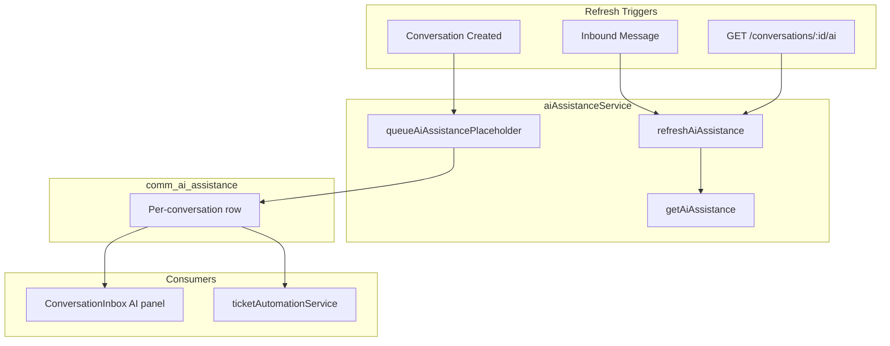
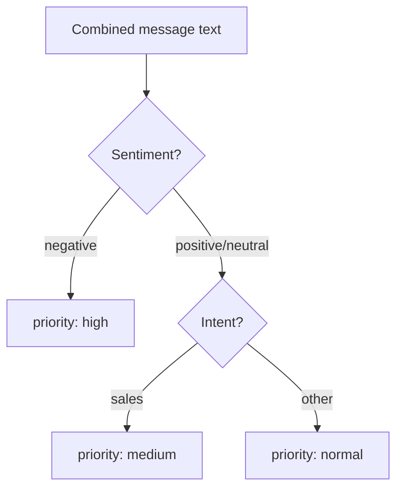
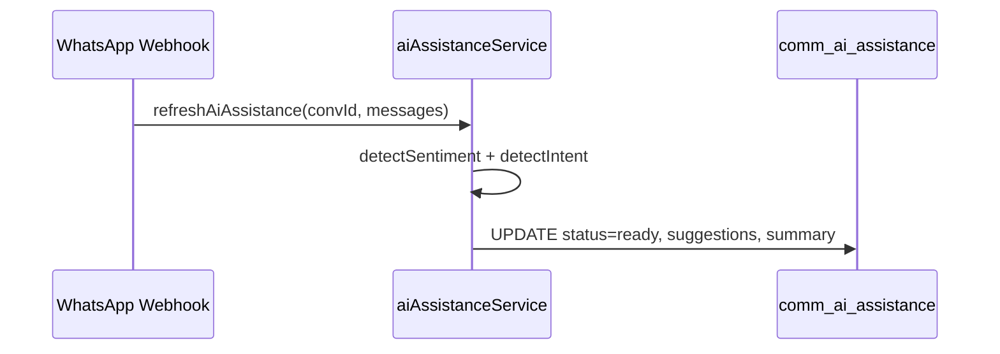
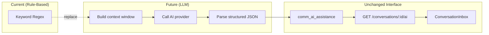

# Communication Center — AI Readiness Layer

Phase 3 includes an **AI Readiness Layer** that prepares the Conversational CRM for future LLM integration without making external AI API calls today. Implemented in `aiAssistanceService.ts`, it stores structured assistance data per conversation using rule-based sentiment, intent, and reply suggestion generation.

---

## Table of Contents

1. [Overview](#overview)
2. [Design Philosophy](#design-philosophy)
3. [Data Model](#data-model)
4. [Service Functions](#service-functions)
5. [Detection Rules](#detection-rules)
6. [Reply Suggestions](#reply-suggestions)
7. [Lifecycle Integration](#lifecycle-integration)
8. [API & Frontend](#api--frontend)
9. [Ticket Automation Coupling](#ticket-automation-coupling)
10. [Future LLM Integration](#future-llm-integration)
11. [Configuration](#configuration)

---

## Overview



The layer is explicitly documented in schema as **"schema only, no external AI calls"**. All intelligence is deterministic keyword matching — suitable for development, testing, and UI wiring before connecting OpenAI, Anthropic, or similar providers.

---

## Design Philosophy

| Principle | Implementation |
|-----------|----------------|
| **Schema-first** | `comm_ai_assistance` table ready for rich AI payloads |
| **No external deps** | Zero network calls; runs synchronously in request path |
| **Idempotent** | `queueAiAssistancePlaceholder` skips if row exists |
| **Composable** | Tags, intent, and priority feed ticket automation rules |
| **Agent-assist, not auto-reply** | Suggestions populate composer; agent sends manually |

This approach lets teams validate inbox UX, API contracts, and data flows before incurring AI costs or latency.

---

## Data Model

**Table:** `comm_ai_assistance`

| Column | Type | Description |
|--------|------|-------------|
| `conversation_id` | INTEGER | FK to conversation (indexed) |
| `summary` | TEXT | Concatenated message preview |
| `sentiment` | TEXT | `positive`, `negative`, `neutral` |
| `intent` | TEXT | `payment`, `booking`, `sales`, `support`, `general` |
| `priority` | TEXT | `high`, `medium`, `normal` |
| `reply_suggestions` | JSONB | Array of suggested reply strings |
| `lead_qualification_hints` | JSONB | Tags + intent + sentiment bundle |
| `status` | TEXT | `pending` → `ready` |
| `company_id` | INTEGER | Tenant scope |

**Drizzle type:** `CommAiAssistance` exported from `communications-phase3.ts`.

---

## Service Functions

### `queueAiAssistancePlaceholder(conversationId)`

Called during `findOrCreateConversation`. Creates a row with:

```typescript
{
  conversationId,
  status: "pending",
  summary: null,
  sentiment: null,
  intent: null,
  priority: "normal",
  replySuggestions: [],
}
```

Returns existing row if already present (no duplicate inserts).

### `refreshAiAssistance(conversationId, lastMessages: string[])`

Core analysis function. Steps:

1. Join last N message bodies into `combined` text.
2. Run `detectSentiment(combined)` and `detectIntent(combined)`.
3. Derive `priority`:
   - `negative` sentiment → `high`
   - `sales` intent → `medium`
   - else → `normal`
4. Load conversation tags from `comm_conversation_tags`.
5. Build `replySuggestions` based on detected intent.
6. Generate `summary` from message count and truncated combined text.
7. Upsert row with `status: "ready"`.

### `getAiAssistance(conversationId)`

Simple SELECT returning the assistance row or `null`.

---

## Detection Rules

### Sentiment (`detectSentiment`)

| Result | Regex Patterns |
|--------|----------------|
| `negative` | `angry`, `worst`, `bad`, `unhappy`, `complaint` |
| `positive` | `thank`, `great`, `good`, `happy`, `excellent` |
| `neutral` | Default when no match |

### Intent (`detectIntent`)

| Result | Regex Patterns |
|--------|----------------|
| `payment` | `payment`, `due`, `invoice`, `refund` |
| `booking` | `book`, `schedule`, `appointment` |
| `sales` | `price`, `quote`, `cost` |
| `support` | `complaint`, `delay`, `issue` |
| `general` | Default |



### Priority Matrix

| Sentiment | Intent | Priority |
|-----------|--------|----------|
| negative | any | `high` |
| any | sales | `medium` |
| other | other | `normal` |

---

## Reply Suggestions

Intent-driven template suggestions (max one per matched intent):

| Intent | Suggestion |
|--------|------------|
| `payment` | "I can help you with your payment. Let me check your account." |
| `booking` | "Would you like to schedule a service? I can find the next available slot." |
| `support` | "I'm sorry for the inconvenience. Let me look into this right away." |
| `sales` | "I'd be happy to share our packages and pricing with you." |

Multiple intents can produce multiple suggestions. Frontend displays first two with click-to-fill behavior.

### Lead Qualification Hints

Stored as JSON:

```json
{
  "tags": ["payment_issue", "hot_lead"],
  "intent": "payment",
  "sentiment": "negative"
}
```

Combines auto-tags from `taggingService` with AI layer outputs for supervisor dashboards and future lead scoring.

---

## Lifecycle Integration

| Trigger Point | Function | When |
|---------------|----------|------|
| `findOrCreateConversation` | `queueAiAssistancePlaceholder` | New conversation |
| `processWhatsAppInbound` | `refreshAiAssistance` | After message saved |
| `GET /conversations/:id/ai` | `refreshAiAssistance` then `getAiAssistance` | Agent opens AI panel |

**Note:** SMS and email inbound paths do not currently call `refreshAiAssistance` — only WhatsApp webhook does. The GET endpoint refreshes on demand for all channels.



---

## API & Frontend

### API Endpoint

```
GET /api/communications/conversations/:id/ai
```

**Behavior:**

1. Loads last 20 messages from conversation.
2. Calls `refreshAiAssistance` if messages exist.
3. Returns assistance row.

**Auth:** `communications:view`

**Response example:**

```json
{
  "conversationId": 42,
  "summary": "Conversation (5 messages): I need help with my payment...",
  "sentiment": "negative",
  "intent": "payment",
  "priority": "high",
  "replySuggestions": [
    "I can help you with your payment. Let me check your account."
  ],
  "leadQualificationHints": {
    "tags": ["payment_issue"],
    "intent": "payment",
    "sentiment": "negative"
  },
  "status": "ready"
}
```

### Frontend (`ConversationInbox.tsx`)

AI panel renders when `ai` data is present:

- Sparkles icon + "AI Suggestions" header
- Sentiment · Intent · Priority line
- Up to 2 clickable suggestions that populate the reply input

```tsx
{(ai.replySuggestions as string[])?.slice(0, 2).map((s, i) => (
  <button onClick={() => setReply(s)}>{s}</button>
))}
```

React Query key: `["comm-ai", selectedId]`.

---

## Ticket Automation Coupling

`ticketAutomationService.evaluateTicketRules` reads AI assistance data:

| Rule Trigger | AI Condition |
|--------------|--------------|
| `escalation_request` | `ai.priority === "high"` |
| `intent_match` | `ai.intent === rule.intentMatch` |

Combined with auto-tags (`complaint`, `payment_issue`) and SLA breach status, AI outputs influence automatic complaint ticket creation.

---

## Future LLM Integration

Replace `refreshAiAssistance` internals while keeping the same table and API contract:



### Recommended LLM Prompt Output Schema

```json
{
  "summary": "Customer reports delayed service, requesting refund",
  "sentiment": "negative",
  "intent": "support",
  "priority": "high",
  "replySuggestions": ["...", "..."],
  "leadQualificationHints": { "score": 0.3, "stage": "at_risk" }
}
```

### Integration Checklist

- [ ] Add `AI_PROVIDER` env var and API key management
- [ ] Implement async refresh via job queue (avoid blocking webhook)
- [ ] Add rate limiting per conversation
- [ ] Include knowledge base articles as RAG context
- [ ] Log AI calls in `comm_audit_logs`
- [ ] Redact PII before sending to external provider

---

## Configuration

No environment variables required for the current rule-based implementation.

When upgrading to external AI:

| Variable | Purpose |
|----------|---------|
| `AI_PROVIDER` | `openai`, `anthropic`, etc. |
| `AI_API_KEY` | Provider credential |
| `AI_MODEL` | Model identifier |
| `AI_MAX_TOKENS` | Response limit |

Store secrets in Render env groups — never commit to repository.

---

## Related Documentation

- [Conversation Engine](./COMMUNICATION_CENTER_CONVERSATION_ENGINE.md)
- [Inbox Module](./COMMUNICATION_CENTER_INBOX_MODULE.md)
- [Database Schema Phase 3](./COMMUNICATION_CENTER_DATABASE_SCHEMA_PHASE3.md)
- [Security Model Phase 3](./COMMUNICATION_CENTER_SECURITY_MODEL_PHASE3.md)
