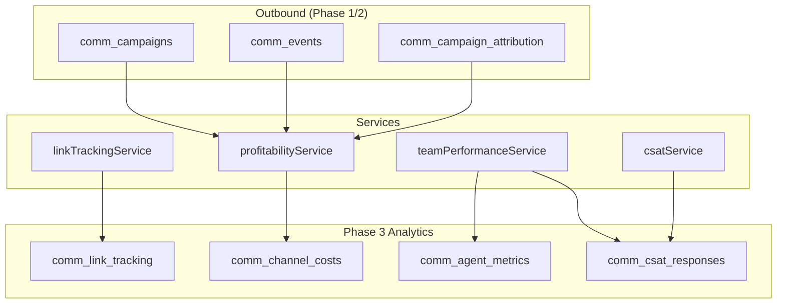
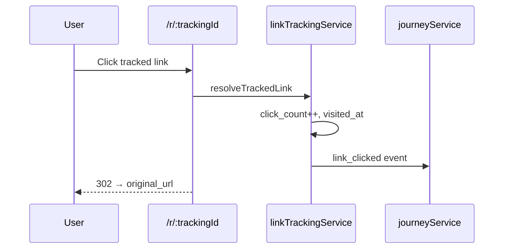
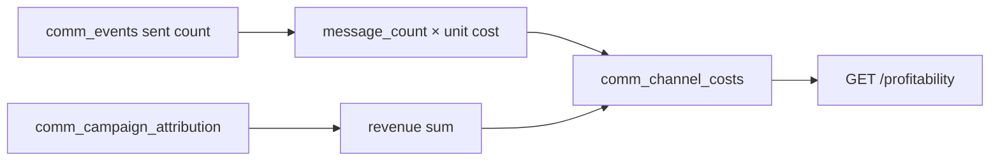
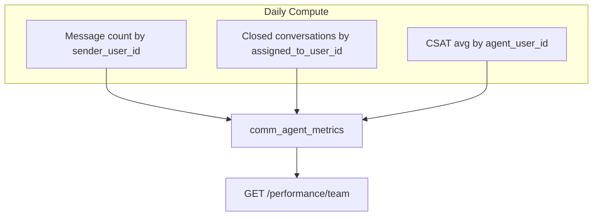

# Communication Center — Phase 3 CRM Analytics

Phase 3 extends Communication Center analytics beyond outbound campaign metrics (Phase 1/2) into **Conversational CRM analytics**: campaign link tracking, channel profitability, team performance dashboards, and CSAT measurement. This document covers the four analytics services and their API integration.

---

## Table of Contents

1. [Overview](#overview)
2. [Analytics Architecture](#analytics-architecture)
3. [Link Tracking](#link-tracking)
4. [Campaign Profitability](#campaign-profitability)
5. [Team Performance](#team-performance)
6. [CSAT Analytics](#csat-analytics)
7. [Combined CRM Dashboard](#combined-crm-dashboard)
8. [Journey Event Integration](#journey-event-integration)
9. [API Reference](#api-reference)
10. [Phase 1/2 Data Dependencies](#phase-12-data-dependencies)
11. [Reporting Examples](#reporting-examples)

---

## Overview

| Module | Service | Primary Tables |
|--------|---------|----------------|
| Link tracking | `linkTrackingService` | `comm_link_tracking` |
| Profitability | `profitabilityService` | `comm_channel_costs`, `comm_campaigns`, `comm_campaign_attribution` |
| Team performance | `teamPerformanceService` | `comm_agent_metrics`, `comm_conversation_messages` |
| CSAT | `csatService` + `teamPerformanceService` | `comm_csat_responses` |



---

## Analytics Architecture

Analytics data flows through two paths:

1. **Event-driven** — Link clicks, CSAT submissions, message replies write rows immediately.
2. **Batch/compute** — `recordChannelCosts` and `computeAgentMetrics` aggregate from source tables on demand.

All analytics respect `company_id` tenant scoping. Brand-level filtering available where `brand_id` is stored.

---

## Link Tracking

**Service:** `linkTrackingService.ts`

### Purpose

Track campaign URL clicks with redirect through `/r/{trackingId}` for attribution and journey timeline integration.

### Create Tracked Link

```typescript
createTrackedLink({
  originalUrl: "https://example.com/offer",
  campaignId: 12,
  customerId: 456,
  brandId: 1,
  companyId: 10,
})
// Returns: { trackingId, trackUrl: "/r/abc123def456..." }
```

`trackingId` is 16-character hex from `crypto.randomBytes(8)`.

### Redirect Resolution

```
GET /api/r/:trackingId
```

Public endpoint (no auth). Flow:

1. Lookup `comm_link_tracking` by `tracking_id`.
2. Increment `click_count`, set `visited_at`.
3. Record `link_clicked` journey event if `customer_id` present.
4. HTTP 302 redirect to `original_url`.



### Conversion Tracking

`recordLinkConversion(trackingId, value)` sets `converted_at` and `conversion_value`. Called from booking/payment webhooks (integration point — not auto-wired in Phase 3 routes).

### Campaign Stats

```
GET /api/communications/links/stats/:campaignId
```

Returns:

```json
{
  "total": 150,
  "clicks": 320,
  "conversions": 12,
  "revenue": 45000
}
```

| Metric | Calculation |
|--------|-------------|
| `total` | COUNT of tracking rows |
| `clicks` | SUM of `click_count` |
| `conversions` | COUNT where `converted_at IS NOT NULL` |
| `revenue` | SUM of `conversion_value` |

### Usage in Campaigns

Embed `trackUrl` in SMS/WhatsApp/email campaign bodies:

```
Book now: https://api.example.com/api/r/a1b2c3d4e5f6g7h8
```

Create links via `POST /communications/links/track` before campaign send.

---

## Campaign Profitability

**Service:** `profitabilityService.ts`

### Purpose

Calculate per-campaign and per-channel ROI by comparing message costs against attributed revenue from Phase 2 attribution engine.

### Default Unit Costs

| Channel | Cost per Message (INR) |
|---------|------------------------|
| sms | 0.25 |
| whatsapp | 0.45 |
| email | 0.02 |
| push | 0.01 |
| in_app | 0.00 |

### Record Channel Costs

```
POST /api/communications/campaigns/:id/profitability
```

**`recordChannelCosts(campaignId)`** steps:

1. Load campaign from `comm_campaigns`.
2. Count sent events from `comm_events` (status: sent, delivered, read).
3. Calculate `cost = sent × unitCost[channel]`.
4. Sum revenue from `comm_campaign_attribution.revenue_amount`.
5. Insert row into `comm_channel_costs`.
6. Return `{ cost, revenue, profit, roi, sent }`.

```typescript
profit = revenue - cost
roi = cost > 0 ? revenue / cost : 0
```

### Profitability Report

```
GET /api/communications/profitability?brandId=&campaignId=
```

Aggregates `comm_channel_costs` grouped by channel, brand, campaign:

```json
[
  {
    "channel": "whatsapp",
    "brandId": 1,
    "campaignId": 12,
    "messages": 5000,
    "cost": 2250,
    "revenue": 85000,
    "profit": 82750,
    "roi": 37.78
  }
]
```



---

## Team Performance

**Service:** `teamPerformanceService.ts`

### Purpose

Track agent-level productivity metrics for supervisor dashboards.

### Agent Metrics Table

**`comm_agent_metrics`** — one row per user per day:

| Column | Source |
|--------|--------|
| `messages_handled` | Outgoing messages with `sender_user_id` |
| `conversations_closed` | Conversations closed by agent that day |
| `avg_response_time_sec` | Stubbed to 0 (future: message timestamp delta) |
| `csat_avg` | Average CSAT rating for agent that day |
| `revenue_generated` | Stubbed to 0 (future: attribution linkage) |

Unique index: `(user_id, period_date, company_id)`.

### Compute Metrics

```
POST /api/communications/performance/compute
Body: { userId?, periodDate? }
```

Defaults to current user and today's date (`YYYY-MM-DD`).

### Team Dashboard

```
GET /api/communications/performance/team?date=2026-06-13
```

Returns all `comm_agent_metrics` rows for the date, scoped by `company_id`.



### Supervisor Use Cases

- Compare agents on messages handled and closure rate
- Identify low CSAT agents for coaching
- Schedule daily cron to compute metrics for all active agents

---

## CSAT Analytics

**Services:** `csatService.ts` (collection), `teamPerformanceService.getCsatDashboard` (aggregation)

### CSAT Collection

Triggered on conversation close:

```
POST /api/communications/conversations/:id/close
→ requestCsatSurvey() returns survey prompt + URL
```

Customer submits rating:

```
POST /api/communications/csat/:conversationId
Body: { rating: 1-5, feedback?, customerId? }
```

**`submitCsat`** stores in `comm_csat_responses`:

- Links `agent_user_id` from conversation's `assigned_to_user_id`
- Records `csat_submitted` journey event
- Validates rating 1–5

### CSAT Dashboard

```
GET /api/communications/csat/dashboard
```

Returns:

```json
{
  "totalResponses": 142,
  "avgRating": 4.2,
  "satisfactionPct": 78.5
}
```

| Metric | Calculation |
|--------|-------------|
| `totalResponses` | COUNT of CSAT rows |
| `avgRating` | AVG(rating), rounded to 1 decimal |
| `satisfactionPct` | % of ratings ≥ 4 |

---

## Combined CRM Dashboard

```
GET /api/communications/crm/analytics
```

Single endpoint bundling three domains:

```json
{
  "inbox": {
    "open": 23,
    "slaBreaches": 3,
    "escalated": 7,
    ...
  },
  "sla": {
    "openConversations": 45,
    "pendingReplies": 38,
    "slaBreaches": 3,
    "escalated": 7
  },
  "csat": {
    "totalResponses": 142,
    "avgRating": 4.2,
    "satisfactionPct": 78.5
  }
}
```

Ideal for Communication Center supervisor overview tab or external BI tooling.

---

## Journey Event Integration

Analytics actions emit journey events for unified customer timeline:

| Action | Event Type |
|--------|------------|
| Link click | `link_clicked` |
| Link conversion | `campaign_converted` (via `recordLinkConversion`) |
| CSAT submit | `csat_submitted` |
| Ticket auto-create | `ticket_created` |

View merged timeline: `GET /communications/journey/customer/:customerId`.

---

## API Reference

| Endpoint | Method | Auth | Service |
|----------|--------|------|---------|
| `/communications/links/track` | POST | create | `createTrackedLink` |
| `/communications/links/stats/:campaignId` | GET | view | `getLinkStats` |
| `/r/:trackingId` | GET | public | `resolveTrackedLink` |
| `/communications/profitability` | GET | view | `getProfitabilityReport` |
| `/communications/campaigns/:id/profitability` | POST | edit | `recordChannelCosts` |
| `/communications/performance/team` | GET | view | `getTeamPerformance` |
| `/communications/performance/compute` | POST | create | `computeAgentMetrics` |
| `/communications/csat/dashboard` | GET | view | `getCsatDashboard` |
| `/communications/csat/:conversationId` | POST | create | `submitCsat` |
| `/communications/crm/analytics` | GET | view | Combined |

Frontend client: `commApi.getCrmAnalytics`, `getProfitability`, `getCsatDashboard`, `getSlaDashboard`.

---

## Phase 1/2 Data Dependencies

| Phase 3 Feature | Phase 1/2 Source |
|-----------------|------------------|
| Profitability cost | `comm_events` sent counts |
| Profitability revenue | `comm_campaign_attribution` |
| Campaign reference | `comm_campaigns.channel`, `brand_id` |
| Journey sync | `comm_timeline` (Phase 2) |
| Link in campaigns | Campaign send uses `createTrackedLink` output |

Phase 3 analytics **complements** Phase 1 dashboard (`GET /communications/dashboard`) — do not remove existing analytics endpoints.

---

## Reporting Examples

### Weekly Campaign ROI

1. Send campaign (Phase 1).
2. Create tracked links for CTAs.
3. `POST /campaigns/:id/profitability` after send completes.
4. `GET /profitability?campaignId=:id` for report.
5. `GET /links/stats/:id` for click-through data.

### Agent Scorecard

1. Cron: `POST /performance/compute` for each agent daily.
2. `GET /performance/team?date=YYYY-MM-DD` for supervisor review.
3. Cross-reference `GET /csat/dashboard` for team satisfaction trend.

### SLA + CSAT Correlation

Compare `sla.slaBreaches` from CRM analytics with CSAT `satisfactionPct` over time — high breaches typically correlate with lower satisfaction (manual analysis; automated correlation not yet implemented).

---

## Related Documentation

- [Phase 3 Architecture](./COMMUNICATION_CENTER_PHASE3_ARCHITECTURE.md)
- [SLA Engine](./COMMUNICATION_CENTER_SLA_ENGINE.md)
- [Database Schema Phase 3](./COMMUNICATION_CENTER_DATABASE_SCHEMA_PHASE3.md)
- [Phase 2 Architecture](./COMMUNICATION_CENTER_PHASE2_ARCHITECTURE.md)
