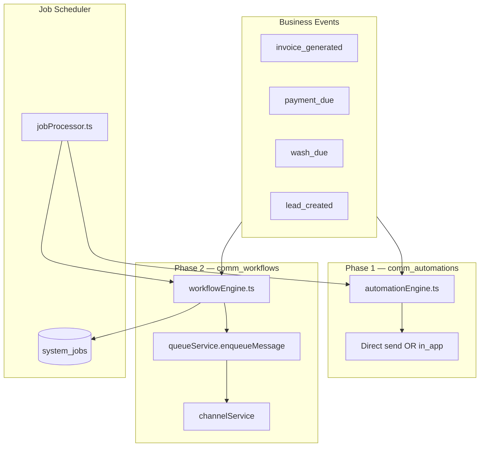
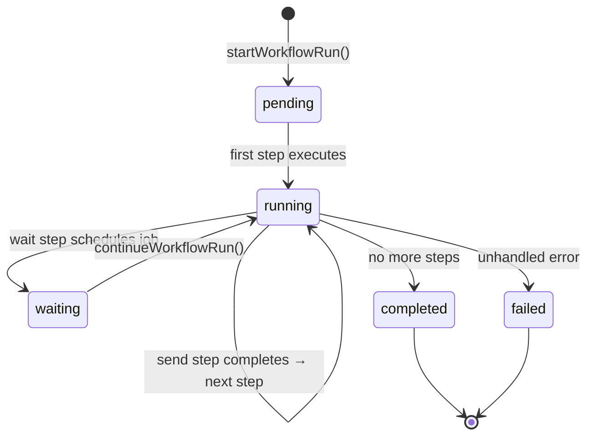
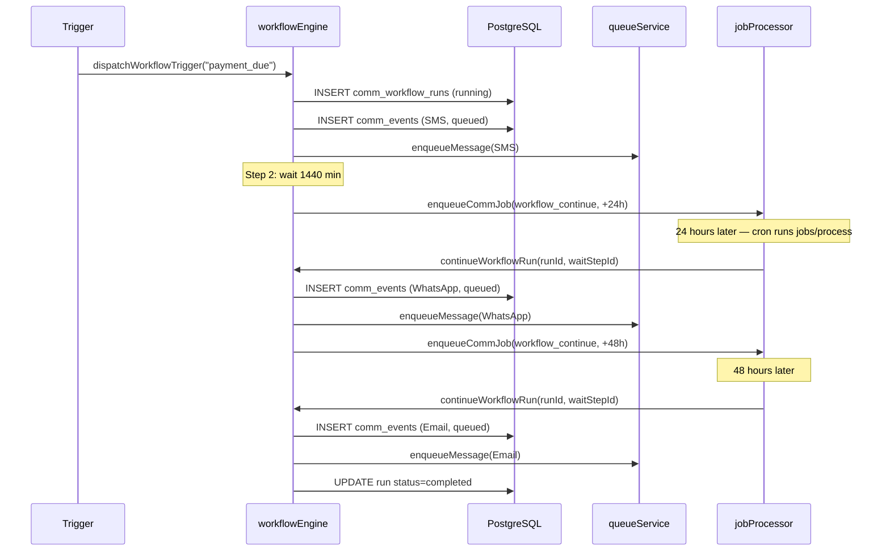

# Communication Center — Automation Engine

Reference for Communication Center workflow automation (Phase 2) and legacy single-step automations (Phase 1). Covers triggers, step types, execution model, wait/branch semantics, and a complete payment-due nurture example.

---

## Table of Contents

1. [Architecture Overview](#architecture-overview)
2. [Phase 1 Automations](#phase-1-automations)
3. [Phase 2 Workflows](#phase-2-workflows)
4. [Trigger Catalog](#trigger-catalog)
5. [Step Types](#step-types)
6. [Execution Lifecycle](#execution-lifecycle)
7. [Wait Steps & Scheduling](#wait-steps--scheduling)
8. [Branch Steps](#branch-steps)
9. [Example: Payment Due Flow](#example-payment-due-flow)
10. [Dispatching Triggers](#dispatching-triggers)
11. [Operational Notes](#operational-notes)

---

## Architecture Overview

Communication Center supports two automation models that coexist:



| Model | Table | Engine | Send Path |
|-------|-------|--------|-----------|
| Phase 1 | `comm_automations` | `automationEngine.ts` | Sync provider call or in-app notification |
| Phase 2 | `comm_workflows` + `comm_workflow_steps` | `workflowEngine.ts` | Async queue → channel service |

New integrations should use Phase 2 workflows. Phase 1 automations remain for backward compatibility and cron-driven batch triggers.

---

## Phase 1 Automations

### Data Model

Each automation is a single rule:

```
name + trigger + channel + templateId + [audienceId] + delayMinutes + isActive
```

Stored in `comm_automations`. Trigger enum (`comm_automation_trigger`):

- `payment_due`, `wash_due`, `package_expiry`, `birthday`
- `lead_follow_up`, `invoice_generated`, `payment_received`, `amc_reminder`

### Execution Flow

1. `triggerAutomationsByEvent(trigger, context, companyId)` finds active automations
2. `dispatchAutomationEvent(automationId, context)` resolves recipient from `customerId` or `leadId`
3. Template is rendered via `templateEngine`
4. Dedupe check prevents duplicate sends with same rendered body
5. `comm_events` row inserted
6. Send path:
   - **in_app:** Insert into `notifications` table
   - **Other channels:** Direct `sendViaProvider()` (sync, no queue)

### Cron-Driven Triggers

`jobProcessor.processAutomationTriggers()` runs on `POST /communications/jobs/process`:

| Trigger | Query Logic |
|---------|-------------|
| `payment_due` | Customers with `totalDues > 0` (limit 100) |
| `wash_due` | Active subscriptions where `nextServiceDate <= today` |
| `package_expiry` | Subscriptions with status `expiring` |
| `lead_follow_up` | Leads with `nextFollowUpAt <= now` and open status |

---

## Phase 2 Workflows

### Data Model

```
comm_workflows
  ├── brand_id (required)
  ├── trigger (comm_workflow_trigger)
  ├── is_active
  └── config (JSONB)

comm_workflow_steps
  ├── workflow_id
  ├── step_order (execution sequence)
  ├── step_type (comm_automation_step_type)
  └── config (JSONB — template IDs, wait minutes, branch conditions)

comm_workflow_runs
  ├── workflow_id
  ├── customer_id / lead_id
  ├── current_step_id
  ├── status (pending | running | completed | failed | cancelled)
  └── context (RecipientContext snapshot)
```

### Core Functions

| Function | Purpose |
|----------|---------|
| `listWorkflows(companyId, brandId)` | List workflow definitions |
| `getWorkflowWithSteps(workflowId)` | Workflow + ordered steps |
| `startWorkflowRun(workflowId, context)` | Create run, execute first step |
| `executeWorkflowStep(runId, stepId, context)` | Process one step |
| `continueWorkflowRun(runId, completedStepId)` | Resume after wait |
| `dispatchWorkflowTrigger(trigger, context)` | Start all matching active workflows |

---

## Trigger Catalog

### Phase 2 Workflow Triggers (`comm_workflow_trigger`)

| Trigger | Typical Use Case |
|---------|------------------|
| `lead_created` | Welcome sequence for new leads |
| `lead_lost` | Win-back campaign |
| `lead_won` | Onboarding messages |
| `customer_registered` | Welcome + app download push |
| `package_purchased` | Confirmation + care instructions |
| `invoice_generated` | Invoice delivery (email + SMS) |
| `payment_received` | Thank-you message |
| **`payment_due`** | **Payment reminder nurture** |
| `wash_due` | Service reminder |
| `solar_cleaning_due` | Kleansolar cleaning schedule |
| `amc_due` | AMC renewal reminder |
| `package_expiry` | Renewal offer |
| `no_visit_30_days` | Re-engagement |
| `no_visit_60_days` | Stronger re-engagement |
| `no_visit_90_days` | Win-back offer |
| `birthday` | Birthday greeting + offer |
| `anniversary` | Customer anniversary message |

### Mapping Phase 1 → Phase 2

| Phase 1 Trigger | Phase 2 Equivalent |
|-----------------|---------------------|
| `payment_due` | `payment_due` |
| `wash_due` | `wash_due` |
| `package_expiry` | `package_expiry` |
| `birthday` | `birthday` |
| `lead_follow_up` | (manual — use `lead_created` workflows) |
| `invoice_generated` | `invoice_generated` |
| `payment_received` | `payment_received` |
| `amc_reminder` | `amc_due` |

---

## Step Types

Enum: `comm_automation_step_type`

### Send Steps

| Step Type | Channel | Config Keys |
|-----------|---------|-------------|
| `send_sms` | sms | `templateId` → `comm_templates` |
| `send_whatsapp` | whatsapp | `whatsappTemplateId` → `comm_whatsapp_templates` |
| `send_email` | email | `emailTemplateId` → `comm_email_templates` |
| `send_push` | push | `templateId` (future: push payload) |

Send steps:

1. Load template from appropriate table
2. Render with `contextToVars(context)` (supports `{{customerName}}`, `{{amountDue}}`, etc.)
3. Insert `comm_events` row with `status: queued`
4. Call `enqueueMessage()` for async delivery
5. Advance to next step immediately (unless current step is `wait`)

### Control Flow Steps

| Step Type | Behavior |
|-----------|----------|
| `wait` | Schedule `workflow_continue` job; pause execution |
| `branch` | Audit log only — condition evaluation stub for future |
| `create_task` | Audit log only — CRM task creation stub |
| `assign_staff` | Audit log only — staff assignment stub |

### Step Config Schema (`WorkflowStepConfig`)

```typescript
{
  templateId?: number;           // SMS / push
  emailTemplateId?: number;      // Email
  whatsappTemplateId?: number;   // WhatsApp
  waitMinutes?: number;          // Wait step (default 60)
  branchCondition?: Record<string, unknown>;  // Branch stub
  staffId?: number;              // Assign staff stub
  taskTitle?: string;            // Create task stub
}
```

---

## Execution Lifecycle



### Step Execution Order

Steps are ordered by `step_order` ascending. After each non-wait step:

1. Find current step index in ordered list
2. If next step exists → update `current_step_id` → execute immediately
3. If no next step → set run `status: completed`, `completed_at: now`

Wait steps break this pattern: execution pauses until the scheduled job fires.

---

## Wait Steps & Scheduling

When a `wait` step executes:

```typescript
const waitMinutes = cfg.waitMinutes ?? 60;
await enqueueCommJob(
  { type: "workflow_continue", runId, stepId: step.id },
  new Date(Date.now() + waitMinutes * 60_000),
);
```

The job is stored in `system_jobs` with:

- `jobType`: `comm_workflow_continue`
- `runAt`: now + waitMinutes
- `payload`: `{ runId, stepId }`

When `processCommJobs()` processes this job, it calls:

```typescript
continueWorkflowRun(payload.runId, payload.stepId);
```

Which finds the next step after the completed wait step and resumes execution.

**Important:** Wait steps do not advance `current_step_id` to the next step until the job fires. The run remains in `running` status during the wait period.

---

## Branch Steps

Branch steps are registered in the workflow definition but currently execute as audit-only stubs:

```typescript
case "branch":
case "create_task":
case "assign_staff":
  await logCommAudit({
    action: `workflow.${step.stepType}`,
    resource: "workflow_run",
    resourceId: runId,
    brandId: workflow.brandId,
    payload: { stepId, config: cfg },
  });
  break;
```

Future implementation will evaluate `branchCondition` against run context and skip/jump steps accordingly. For now, branch steps act as no-op markers in the sequence and execution continues to the next step.

---

## Example: Payment Due Flow

Complete Phase 2 workflow for customers with outstanding payments across SMS → wait → WhatsApp → email escalation.

### Business Requirements

1. Day 0: Send transactional SMS reminder (DLT-compliant)
2. Day 1: Send WhatsApp utility message if no payment
3. Day 3: Send email with invoice link
4. All messages scoped to CWP brand
5. Respects SMS/WhatsApp/email consent

### Step 1: Create Templates

**SMS** (`comm_templates` id=12):

```
Dear {{customerName}}, your payment of Rs.{{amountDue}} for invoice {{invoiceNumber}} is due. Please pay to continue service.
```

**WhatsApp** (`comm_whatsapp_templates` id=3):

```
metaTemplateName: "payment_reminder_v1"
bodyPreview: "Dear {{1}}, payment of Rs.{{2}} is due."
```

**Email** (`comm_email_templates` id=7):

```html
<h1>Payment Reminder</h1>
<p>Dear {{customerName}},</p>
<p>Amount due: Rs.{{amountDue}} for invoice {{invoiceNumber}}.</p>
```

### Step 2: Create Workflow via API

```
POST /api/communications/workflows
```

```json
{
  "brandId": 1,
  "name": "Payment Due — 3-Touch Nurture",
  "trigger": "payment_due",
  "config": {
    "description": "SMS → 24h wait → WhatsApp → 48h wait → Email"
  },
  "steps": [
    {
      "stepOrder": 1,
      "stepType": "send_sms",
      "config": { "templateId": 12 }
    },
    {
      "stepOrder": 2,
      "stepType": "wait",
      "config": { "waitMinutes": 1440 }
    },
    {
      "stepOrder": 3,
      "stepType": "send_whatsapp",
      "config": { "whatsappTemplateId": 3 }
    },
    {
      "stepOrder": 4,
      "stepType": "wait",
      "config": { "waitMinutes": 2880 }
    },
    {
      "stepOrder": 5,
      "stepType": "send_email",
      "config": { "emailTemplateId": 7 }
    }
  ]
}
```

### Step 3: Trigger Flow

**Option A — External event hook:**

```typescript
import { dispatchWorkflowTrigger } from "./workflowEngine";

await dispatchWorkflowTrigger("payment_due", {
  customerId: 101,
  customerName: "Rajesh Kumar",
  phone: "9876543210",
  email: "rajesh@example.com",
  amountDue: "2500",
  invoiceNumber: "INV-2026-001",
  companyId: 1,
  brandId: 1,
});
```

**Option B — Manual test via API:**

```
POST /api/communications/workflows/5/run
```

With the same recipient context in the request body.

### Step 4: Execution Timeline



### Step 5: Monitor

```
GET /api/communications/workflows/5/runs
GET /api/communications/timeline/customer/101?brandId=1
GET /api/communications/queue/stats
```

---

## Dispatching Triggers

### From Application Code

**Phase 2 (recommended):**

```typescript
await dispatchWorkflowTrigger("invoice_generated", {
  customerId, companyId, brandId,
  invoiceNumber, amountDue,
});
```

**Phase 1 (legacy):**

```typescript
await triggerAutomationsByEvent("payment_received", { customerId }, companyId);
```

### From Cron

Ensure both job endpoints run every 5 minutes:

```
POST /api/communications/jobs/process      # workflow_continue + Phase 1 triggers
POST /api/communications/queue/process     # actual message delivery
```

---

## Operational Notes

### Consent

Phase 2 send steps enqueue messages without inline consent checks. Campaign engine performs consent validation; workflow engine currently relies on queue processing. Ensure customers have appropriate consents before triggering workflows, or extend workflow engine with consent gates (recommended for production).

### DLT Validation

SMS sends from campaigns pass through `validateSmsTemplate()`. Workflow SMS steps enqueue directly — ensure templates in `comm_templates` have valid DLT registration and matching `comm_dlt_templates` governance rows.

### Dedupe

Phase 1 automations dedupe by rendered body. Phase 2 workflows do not dedupe across runs — each trigger creates a new run. Implement idempotency at the trigger source if needed.

### Brand Resolution

Workflows use `resolveBrandId(workflow.brandId, companyId)` which falls back to the `cwp` brand when not specified.

### Error Handling

Unhandled errors in step execution do not automatically set run status to `failed`. Monitor `comm_workflow_runs` and `comm_events` for stuck runs in `running` status.

---

*Last updated: June 2026 — Communication Center Automation Engine*
