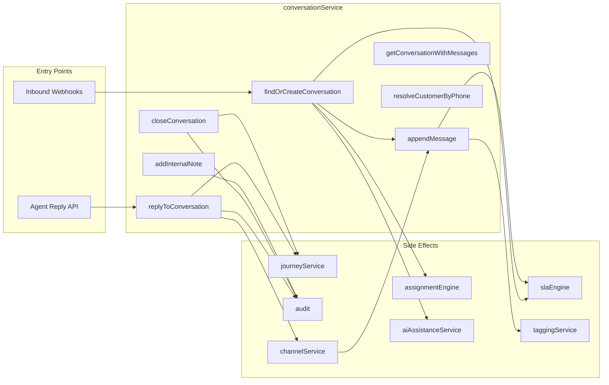
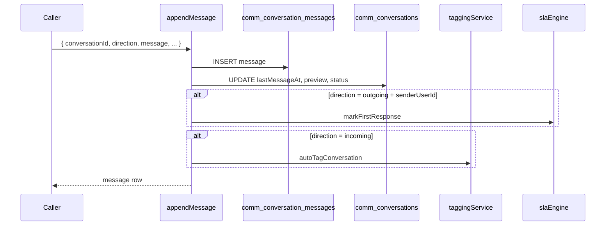
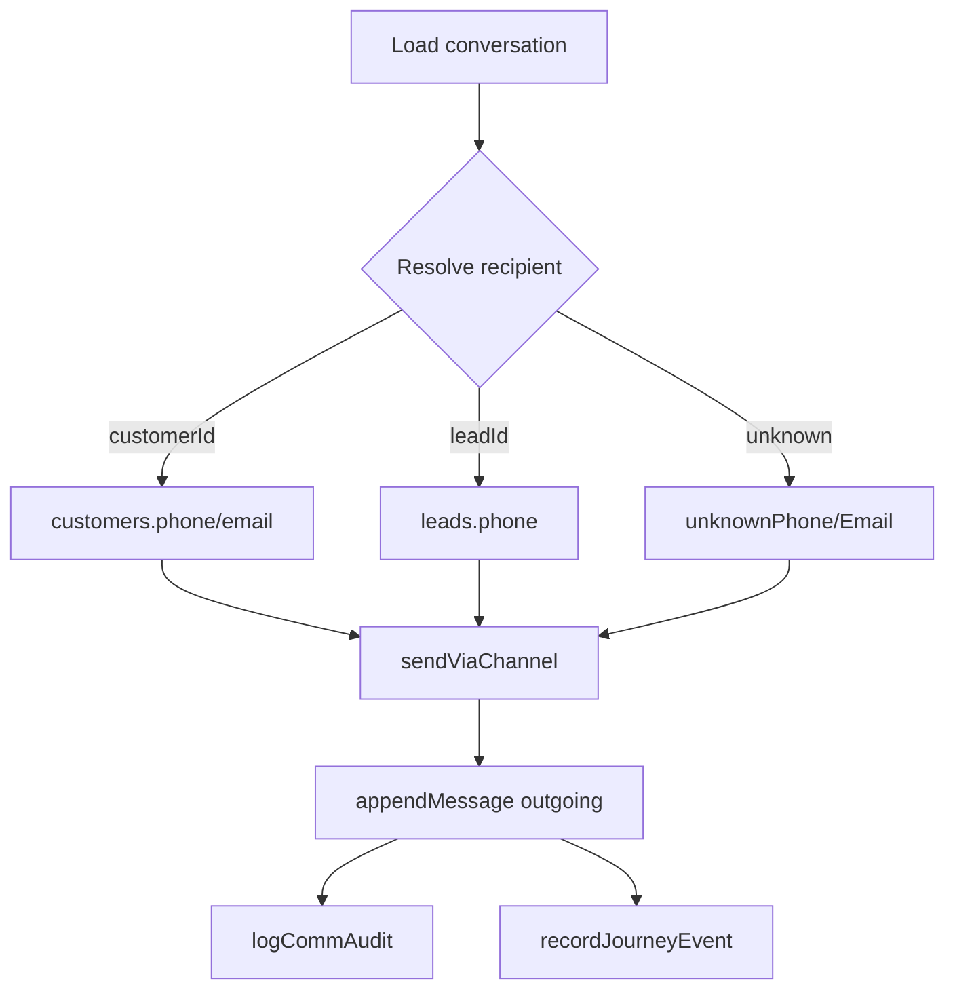

# Communication Center — Conversation Engine

The Conversation Engine is the core orchestration layer for Phase 3 Conversational CRM. Implemented in `conversationService.ts`, it manages conversation lifecycle, message threading, customer resolution, outbound replies, internal notes, and integration hooks for SLA, assignment, tagging, AI, and journey recording.

---

## Table of Contents

1. [Overview](#overview)
2. [Conversation Model](#conversation-model)
3. [Lifecycle Operations](#lifecycle-operations)
4. [Message Pipeline](#message-pipeline)
5. [Customer Resolution](#customer-resolution)
6. [Outbound Replies](#outbound-replies)
7. [Internal Notes](#internal-notes)
8. [Integration Hooks](#integration-hooks)
9. [API Mapping](#api-mapping)
10. [Error Handling](#error-handling)
11. [Design Decisions](#design-decisions)

---

## Overview



The engine is **channel-agnostic** at the conversation level. Each message carries its own `channel` field (whatsapp, sms, email, push, in_app), while the conversation stores a `primary_channel` default.

---

## Conversation Model

A conversation row (`comm_conversations`) represents a unified thread. Key fields:

| Field | Purpose |
|-------|---------|
| `customer_id` / `lead_id` | CRM linkage |
| `primary_channel` | Default reply channel |
| `status` | `open`, `assigned`, `pending`, `resolved`, `closed`, `spam` |
| `email_thread_id` | Email deduplication key |
| `is_unknown_contact` | Flag for unidentified senders |
| `unknown_phone` / `unknown_email` | Contact info before CRM match |
| `assigned_to_user_id` / `assigned_team_id` | Ownership |
| `sla_policy_id` / `sla_status` | SLA tracking |
| `complaint_id` | Linked auto-ticket |
| `last_message_at` / `last_message_preview` | Inbox sorting |

### Deduplication Rules

`findOrCreateConversation` resolves existing threads before creating new ones:

1. **Customer + channel** — Active conversation (status not `closed` or `spam`) for same `customer_id` and `primary_channel`.
2. **Email thread** — Match on `email_thread_id` regardless of customer (email threading).
3. **New conversation** — Insert with SLA, auto-assign, and AI placeholder queue.

```typescript
// Simplified dedup logic
if (customerId) → find active by customerId + channel
if (emailThreadId) → find by emailThreadId
else → create new (possibly unknown contact)
```

---

## Lifecycle Operations

### Create (`findOrCreateConversation`)

**Triggers:** Inbound webhooks, future manual conversation creation.

**Steps:**

1. Deduplicate per rules above.
2. Set `is_unknown_contact` when no `customer_id` or `lead_id`.
3. Insert into `comm_unknown_contacts` for unknown senders.
4. Call `applySlaToConversation` — attaches default SLA policy, sets due timestamps.
5. Call `autoAssignConversation` — keyword-based team routing.
6. Call `queueAiAssistancePlaceholder` — creates pending AI row.
7. Record `conversation_opened` journey event if customer known.

### Read (`getConversationWithMessages`)

Returns conversation with:

- **Messages** — Last N messages (default 50), chronological order.
- **Notes** — Internal notes, newest first in query, displayed in thread.
- **Tags** — Auto and manual tags.

### Close (`closeConversation`)

Sets `status: closed`, `closedAt`, `resolvedAt`. Records journey event and audit log. The route layer additionally triggers `requestCsatSurvey`.

### Reopen (implicit)

When an **incoming** message arrives on a `closed` conversation, `appendMessage` resets status to `open`.

---

## Message Pipeline

### `appendMessage`

Central function for all message writes.



**Message fields:**

| Field | Description |
|-------|-------------|
| `direction` | `incoming` or `outgoing` |
| `status` | `pending`, `sent`, `delivered`, `read`, `replied`, `failed` |
| `provider_message_id` | External ID for delivery status updates |
| `sender_user_id` | Agent ID for outbound messages |
| `attachments` | JSON array `{ type, url, name? }` |
| `metadata` | Channel-specific data (e.g., email subject) |

**Default status:**

- Outgoing: `sent`
- Incoming: `delivered`

WhatsApp delivery receipts update status via `processWhatsAppInbound` status handler.

---

## Customer Resolution

### `resolveCustomerByPhone`

Normalizes phone to last 10 digits and searches:

1. `customers` table (scoped by `company_id` if provided)
2. `leads` table (returns `leadId` and optional `customerId` from lead)

Returns `{ customerId, leadId }` — both may be null for unknown contacts.

Used by WhatsApp and SMS inbound handlers before conversation creation.

### Unknown Contact Queue

When no CRM match exists:

- Conversation flagged `is_unknown_contact = true`
- Row created in `comm_unknown_contacts` with `status: pending`
- Inbox filter `unknown` surfaces these for manual linking

---

## Outbound Replies

### `replyToConversation`



**Channel selection:** Uses request `channel` param or falls back to `conv.primary_channel`.

**Send result:** `channelService.sendViaChannel` returns `{ success, externalId, error }`. Message `metadata` stores these; status set to `sent` or `failed`.

**Journey events by channel:**

| Channel | Event Type |
|---------|------------|
| whatsapp | `whatsapp_sent` |
| sms | `sms_sent` |
| email | `email_sent` |
| other | `in_app_sent` |

---

## Internal Notes

### `addInternalNote`

Private agent notes stored in `comm_conversation_notes`:

- **Not sent to customer** — displayed only in admin UI with dashed border styling.
- **Mentions** — JSON array of user IDs for future notification integration.
- **Audit** — `conversation.note` action logged.

API: `POST /communications/conversations/:id/notes` with `{ body, mentions? }`.

---

## Integration Hooks

Every significant conversation event triggers downstream services:

| Event | Service | Action |
|-------|---------|--------|
| Conversation created | `slaEngine` | `applySlaToConversation` |
| Conversation created | `assignmentEngine` | `autoAssignConversation` |
| Conversation created | `aiAssistanceService` | `queueAiAssistancePlaceholder` |
| Incoming message | `taggingService` | `autoTagConversation` |
| Incoming message (webhook) | `aiAssistanceService` | `refreshAiAssistance` |
| Incoming message (webhook) | `ticketAutomationService` | `evaluateTicketRules` |
| Outgoing message (agent) | `slaEngine` | `markFirstResponse` |
| Close | `journeyService` | `conversation_closed` event |
| Reply | `audit` | `conversation.reply` |
| Assign | `assignmentEngine` | via route, not conversationService |

---

## API Mapping

| Service Function | HTTP Endpoint |
|------------------|---------------|
| `getConversationWithMessages` | `GET /communications/conversations/:id` |
| `replyToConversation` | `POST /communications/conversations/:id/reply` |
| `closeConversation` | `POST /communications/conversations/:id/close` |
| `addInternalNote` | `POST /communications/conversations/:id/notes` |
| `findOrCreateConversation` | Internal (webhooks only) |
| `appendMessage` | Internal |
| `resolveCustomerByPhone` | Internal |

**Inbox listing** is delegated to `inboxService` — see [Inbox Module](./COMMUNICATION_CENTER_INBOX_MODULE.md).

**Assignment** is exposed via `assignmentEngine.assignConversation` at `POST /communications/conversations/:id/assign`.

---

## Error Handling

| Scenario | Behavior |
|----------|----------|
| Conversation not found on reply | Throws `"Conversation not found"` → 500 with message |
| Channel send failure | Message saved with `status: failed`, `metadata.error` populated |
| Missing customer on reply | Uses unknown phone/email if available |
| Webhook processing error (WhatsApp) | Returns 200 to prevent Meta retries; error logged |

---

## Design Decisions

### Why one conversation per customer+channel?

Prevents inbox fragmentation. A customer texting on WhatsApp gets one active thread; SMS creates a separate thread on a different channel. Email uses thread ID for finer granularity.

### Why appendMessage is centralized?

Ensures consistent updates to `last_message_at`, SLA first-response, auto-tagging, and preview text regardless of entry point (webhook vs agent).

### Why channelService for outbound?

Reuses Phase 1 provider configuration, consent checks, and DLT validation — no duplicate send infrastructure.

### Status transitions

```
open → assigned (on first agent response or auto-assign)
open/assigned → open (on incoming message to closed conversation)
any → closed (explicit close)
```

---

## Related Documentation

- [Inbox Module](./COMMUNICATION_CENTER_INBOX_MODULE.md)
- [SLA Engine](./COMMUNICATION_CENTER_SLA_ENGINE.md)
- [AI Readiness](./COMMUNICATION_CENTER_AI_READINESS.md)
- [Database Schema Phase 3](./COMMUNICATION_CENTER_DATABASE_SCHEMA_PHASE3.md)
