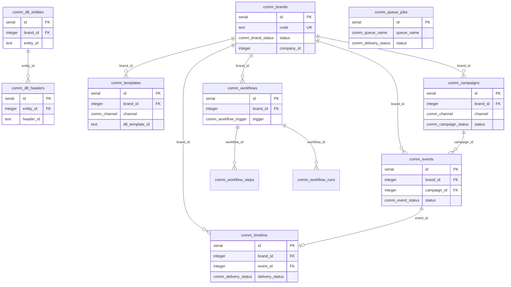

# Communication Center — Database Schema

Complete reference for Communication Center PostgreSQL tables, enums, indexes, and brand scoping across Phase 1 and Phase 2. Schema is defined in Drizzle ORM (`lib/db/src/schema/communications.ts`, `communications-phase2.ts`) and applied via `drizzle-kit push` or manual SQL migrations.

---

## Table of Contents

1. [Schema Overview](#schema-overview)
2. [Enum Types](#enum-types)
3. [Phase 1 Core Tables](#phase-1-core-tables)
4. [Phase 1 Enhancement Tables](#phase-1-enhancement-tables)
5. [Phase 2 Tables](#phase-2-tables)
6. [Brand ID Columns](#brand-id-columns)
7. [Indexes Reference](#indexes-reference)
8. [Entity Relationships](#entity-relationships)
9. [Migration Files](#migration-files)

---

## Schema Overview



All tables include tenant isolation via `company_id` (nullable for global/system rows). Branch-scoped resources also include `branch_id`.

---

## Enum Types

### Shared (Phase 1 Base)

| Enum | Values |
|------|--------|
| `comm_channel` | `sms`, `whatsapp`, `email`, `push`, `in_app` |
| `comm_provider_type` | `fast2sms`, `msg91`, `twilio`, `resend`, `smtp`, `firebase`, `whatsapp_business` |
| `comm_campaign_status` | `draft`, `scheduled`, `processing`, `sent`, `failed`, `cancelled` |
| `dlt_template_category` | `transactional`, `promotional`, `service_implicit`, `otp`, `utility` |
| `audience_filter_type` | See [Audience Filters](#audience-filter-type) |
| `comm_consent_source` | `walk_in`, `website`, `lead_form`, `invoice`, `manual`, `import` |

### Phase 1 Event & Automation

| Enum | Values |
|------|--------|
| `comm_event_status` | `pending`, `queued`, `processing`, `sent`, `delivered`, `read`, `failed`, `skipped`, `clicked`, `converted`, `consent_blocked`, `retrying`, `dead_letter` |
| `comm_automation_trigger` | `payment_due`, `wash_due`, `package_expiry`, `birthday`, `lead_follow_up`, `invoice_generated`, `payment_received`, `amc_reminder` |

### Phase 2 Enums

| Enum | Values |
|------|--------|
| `comm_brand_status` | `active`, `inactive`, `archived` |
| `comm_dlt_template_status` | `draft`, `pending_approval`, `approved`, `rejected`, `suspended` |
| `comm_email_type` | `marketing`, `transactional`, `service` |
| `comm_whatsapp_category` | `marketing`, `utility`, `authentication` |
| `comm_whatsapp_approval_status` | `draft`, `pending`, `approved`, `rejected` |
| `comm_automation_step_type` | `send_sms`, `send_whatsapp`, `send_email`, `send_push`, `create_task`, `assign_staff`, `wait`, `branch` |
| `comm_automation_run_status` | `pending`, `running`, `completed`, `failed`, `cancelled` |
| `comm_campaign_recurrence` | `none`, `daily`, `weekly`, `monthly` |
| `comm_delivery_status` | `queued`, `processing`, `sent`, `delivered`, `read`, `failed`, `retrying`, `dead_letter` |
| `comm_queue_name` | `sms_queue`, `whatsapp_queue`, `email_queue`, `push_queue` |
| `comm_ai_recommendation_type` | `best_send_time`, `campaign_suggestion`, `segment_suggestion`, `reactivation` |
| `comm_workflow_trigger` | See [Workflow Triggers](#workflow-triggers) |

#### Audience Filter Type

```
all_customers, active_customers, inactive_customers, lost_leads, open_leads,
hot_leads, warm_leads, cold_leads, cwp_customers, dcc_customers, solar_customers,
bidwar_customers, payment_due, wash_due, amc_due, expiring_package,
no_visit_since_days, multiple_vehicles, high_value_customers,
revenue_above, last_visit_between
```

Phase 2 adds: `bidwar_customers`, `revenue_above`, `last_visit_between`.

#### Workflow Triggers

```
lead_created, lead_lost, lead_won, customer_registered, package_purchased,
invoice_generated, payment_received, payment_due, wash_due, solar_cleaning_due,
amc_due, package_expiry, no_visit_30_days, no_visit_60_days, no_visit_90_days,
birthday, anniversary
```

---

## Phase 1 Core Tables

Base tables from `lib/db/src/schema/communications.ts`. All include `company_id`; branch-scoped tables also have `branch_id`. Phase 2 adds nullable `brand_id` to most tables below.

| Table | Purpose | Key Columns |
|-------|---------|-------------|
| `comm_dlt_entities` | TRAI Principal Entity (PE ID) | `entity_id`, `brand_id`, `is_active` |
| `comm_dlt_headers` | Approved sender headers | `entity_id` FK, `header_id`, `is_active` |
| `comm_templates` | Message templates (all channels) | `channel`, `category`, `dlt_template_id`, `header_id`, `body`, `variables` JSONB |
| `comm_providers` | Provider config (no code deploy to switch) | `provider_type`, `channel`, `config` JSONB, `is_primary`, `priority` |
| `comm_audiences` | Saved audience filter trees | `filter_definition` JSONB (AudienceFilterNode), `estimated_count` |
| `comm_campaigns` | Campaign definitions | `channel`, `audience_id`, `template_id`, `email_template_id`†, `whatsapp_template_id`†, `status`, `recurrence`†, `cost_amount`, `stats` JSONB |
| `comm_events` | Per-recipient send events | `campaign_id`, `automation_id`, `customer_id`, `rendered_body`, `status`, `external_id`, `retry_count`†, timestamps |
| `comm_automations` | Phase 1 single-step rules | `trigger`, `channel`, `template_id`, `delay_minutes`, `is_active` |
| `comm_audit_logs` | Append-only audit trail | `action`, `resource`, `resource_id`, `user_id`, `brand_id`†, `payload` JSONB |

† Phase 2 column.

**AudienceFilterNode:**

```json
{ "type": "filter", "filter": "payment_due" }
{ "type": "smart_segment", "segmentKey": "high_value" }
{ "type": "group", "operator": "AND", "children": [...] }
```

---

## Phase 1 Enhancement Tables

Added by `001_comm_phase1_enhancement.sql`.

| Table | Purpose | Key Columns | Indexes |
|-------|---------|-------------|---------|
| `comm_customer_consents` | Per-customer opt-in (TRAI/DPDP) | `customer_id` UNIQUE, `sms/whatsapp/email/push_consent`, `consent_source`, `birth_date`, `brand_id`† | customer_idx, company_idx |
| `comm_smart_segments` | Reusable audience segments | `segment_key`, `config_json`, `is_system`, `active` | key_company_idx UNIQUE, active_idx |
| `comm_campaign_attribution` | 30-day revenue attribution | `campaign_id`, `customer_id`, `booking_id`, `invoice_id`, `revenue_amount` | campaign, customer, composite |

---

## Phase 2 Tables

Added by `002_comm_phase2_enterprise.sql`.

### `comm_brands`

Multi-brand registry. Seeded: cwp, kleansolar, dcc, bidwar.

| Column | Type | Notes |
|--------|------|-------|
| `id` | SERIAL PK | |
| `name`, `code` | TEXT NOT NULL | Unique per `(code, company_id)` |
| `status` | comm_brand_status DEFAULT active | |
| `logo`, `primary_color` | TEXT | UI branding |
| `email_sender`, `email_reply_to` | TEXT | |
| `default_sms_header`, `default_whatsapp_number`, `default_support_number` | TEXT | |
| `company_id` | INTEGER | NULL = global brand |

### Template & Governance Centers

| Table | Required brand_id | Key Columns |
|-------|-------------------|-------------|
| `comm_dlt_templates` | Yes | `entity_id`, `header_id`, `template_id`, `approved_content`, `status`, `template_type` |
| `comm_email_templates` | Yes | `subject`, `html_content`, `email_type`, `variables`, `attachments` |
| `comm_whatsapp_templates` | Yes | `meta_template_name`, `category`, `language`, `body_preview`, `approval_status` |

### Workflow Engine

| Table | Key Columns |
|-------|-------------|
| `comm_workflows` | `brand_id`, `trigger` (comm_workflow_trigger), `is_active`, `config` |
| `comm_workflow_steps` | `workflow_id`, `step_order`, `step_type`, `config` (templateId, waitMinutes, branchCondition) |
| `comm_workflow_runs` | `workflow_id`, `customer_id`, `current_step_id`, `status`, `context` JSONB, `error` |

**Step config (`WorkflowStepConfig`):** `templateId`, `emailTemplateId`, `whatsappTemplateId`, `waitMinutes`, `branchCondition`, `staffId`, `taskTitle`

### Queue & Delivery

| Table | Key Columns |
|-------|-------------|
| `comm_timeline` | Denormalized customer history: `customer_id`, `channel`, `message`, `delivery_status`, `read_status`, `clicked`, `event_id` |
| `comm_queue_jobs` | `queue_name`, `bull_job_id`, `event_id`, `payload`, `status`, `retry_count`, `max_retries`, `next_retry_at`, `last_error` |
| `comm_dead_letter` | Failed messages: `queue_job_id`, `event_id`, `channel`, `payload`, `error`, `brand_id` |

### Consent & AI

| Table | Key Columns |
|-------|-------------|
| `comm_consent_history` | Append-only: consent booleans snapshot, `changed_by`, `consent_ip`, `consent_source` |
| `comm_ai_recommendations` | Placeholder: `recommendation_type`, `suggestion` JSONB, `confidence`, `status` |

---

## Brand ID Columns

Summary of tables with `brand_id`:

| Table | Required | Default Behavior |
|-------|----------|------------------|
| `comm_brands` | N/A (is brand) | — |
| `comm_dlt_entities` | Optional | Global entity |
| `comm_templates` | Optional | Falls back to CWP |
| `comm_providers` | Optional | Company-level provider |
| `comm_audiences` | Optional | All brands |
| `comm_campaigns` | Optional | resolveBrandId → cwp |
| `comm_customer_consents` | Optional | Per-customer global consent |
| `comm_events` | Optional | Set at send time |
| `comm_automations` | Optional | Legacy automations |
| `comm_audit_logs` | Optional | Set when known |
| `comm_dlt_templates` | **Required** | Brand-bound governance |
| `comm_email_templates` | **Required** | |
| `comm_whatsapp_templates` | **Required** | |
| `comm_workflows` | **Required** | |
| `comm_timeline` | Optional | Filterable |
| `comm_queue_jobs` | Optional | |
| `comm_dead_letter` | Optional | |
| `comm_consent_history` | Optional | |
| `comm_ai_recommendations` | Optional | |

---

## Indexes Reference

### Analytics & Performance (Phase 1)

```sql
comm_events_campaign_idx       ON comm_events(campaign_id)
comm_events_customer_idx       ON comm_events(customer_id)
comm_events_status_idx         ON comm_events(status)
comm_events_created_idx        ON comm_events(created_at)
comm_events_company_created_idx ON comm_events(company_id, created_at)
comm_attr_campaign_idx         ON comm_campaign_attribution(campaign_id)
comm_attr_customer_idx         ON comm_campaign_attribution(customer_id)
comm_attr_campaign_customer_idx ON comm_campaign_attribution(campaign_id, customer_id)
```

### Queue Processing (Phase 2)

```sql
comm_queue_jobs_status_retry_idx ON comm_queue_jobs(status, next_retry_at)
comm_queue_jobs_queue_idx        ON comm_queue_jobs(queue_name, status)
comm_timeline_customer_idx       ON comm_timeline(customer_id, created_at DESC)
```

These indexes support:

- Campaign analytics dashboards
- Customer timeline pagination
- Queue worker polling (`status IN (queued, retrying) AND next_retry_at <= NOW()`)
- Attribution ROI queries

---

## Entity Relationships

```
comm_brands
  └── comm_dlt_templates → comm_dlt_entities → comm_dlt_headers
  └── comm_email_templates
  └── comm_whatsapp_templates
  └── comm_workflows → comm_workflow_steps
                     → comm_workflow_runs
  └── comm_campaigns → comm_events → comm_timeline
                     → comm_campaign_attribution
  └── comm_audiences (filter_definition)
  └── comm_templates
  └── comm_providers
  └── comm_customer_consents → comm_consent_history
  └── comm_queue_jobs → comm_dead_letter
```

---

## Migration Files

| File | Purpose |
|------|---------|
| `lib/db/migrations/001_comm_phase1_enhancement.sql` | Consent, smart segments, attribution, event indexes |
| `lib/db/migrations/002_comm_phase2_enterprise.sql` | Brands, timeline, workflows, queue, Phase 2 enums |
| Drizzle push | `pnpm --filter @workspace/db run push` |

Both SQL files use `IF NOT EXISTS` guards and are safe to re-run.

---

*Last updated: June 2026 — Communication Center Database Schema Phase 1 + 2*
