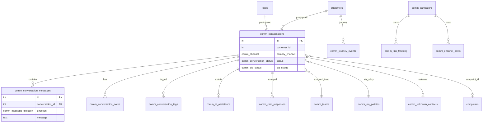

# Communication Center — Database Schema (Phase 3)

Phase 3 Conversational CRM adds 16 tables, 8 PostgreSQL enums, and supporting indexes to the existing Communication Center schema. Definitions live in `lib/db/src/schema/communications-phase3.ts` with SQL migration in `lib/db/migrations/003_comm_phase3_conversational_crm.sql`.

---

## Table of Contents

1. [Schema Overview](#schema-overview)
2. [Enum Types](#enum-types)
3. [Core Conversation Tables](#core-conversation-tables)
4. [Assignment & SLA Tables](#assignment--sla-tables)
5. [Intelligence Tables](#intelligence-tables)
6. [Analytics Tables](#analytics-tables)
7. [Knowledge & Automation Tables](#knowledge--automation-tables)
8. [Entity Relationship Diagram](#entity-relationship-diagram)
9. [Indexes](#indexes)
10. [Seed Data](#seed-data)
11. [Phase 1/2 Dependencies](#phase-12-dependencies)
12. [TypeScript Exports](#typescript-exports)

---

## Schema Overview

| Table | Rows Purpose |
|-------|--------------|
| `comm_conversations` | Unified conversation threads |
| `comm_conversation_messages` | All messages in threads |
| `comm_conversation_notes` | Private internal notes |
| `comm_teams` | Assignment teams |
| `comm_conversation_tags` | Auto and manual tags |
| `comm_sla_policies` | SLA configuration |
| `comm_unknown_contacts` | Unidentified sender queue |
| `comm_ai_assistance` | AI readiness payloads |
| `comm_link_tracking` | Campaign link tracking |
| `comm_channel_costs` | Channel cost/revenue snapshots |
| `comm_knowledge_base` | Agent knowledge articles |
| `comm_csat_responses` | Customer satisfaction surveys |
| `comm_ticket_rules` | Auto-ticket triggers |
| `comm_journey_events` | Unified customer journey |
| `comm_agent_metrics` | Daily agent performance |

---

## Enum Types

Phase 3 introduces these enums (Phase 1 `comm_channel` is reused):

### `comm_conversation_status`

```
open | assigned | pending | resolved | closed | spam
```

### `comm_message_direction`

```
incoming | outgoing
```

### `comm_message_delivery`

```
pending | sent | delivered | read | replied | failed
```

### `comm_sla_status`

```
within_sla | warning | breached
```

### `comm_tag_source`

```
auto | manual
```

### `comm_journey_event_type`

```
lead_created, lead_assigned, lead_won, lead_lost,
sms_sent, sms_received, whatsapp_sent, whatsapp_delivered, whatsapp_read, whatsapp_replied,
email_sent, email_opened, email_replied, push_sent, in_app_sent,
booking_created, invoice_generated, payment_received, package_purchased,
service_completed, review_submitted, conversation_opened, conversation_closed,
ticket_created, csat_submitted, link_clicked, campaign_converted
```

### `comm_kb_category`

```
faq | policy | script | response_template
```

### `comm_ticket_rule_trigger`

```
complaint_detected | payment_issue | escalation_request | sla_breach
```

---

## Core Conversation Tables

### `comm_conversations`

Primary thread entity. One row per customer/channel context or email thread.

| Column | Type | Notes |
|--------|------|-------|
| `id` | SERIAL PK | |
| `brand_id` | INTEGER | Multi-brand scope |
| `customer_id` | INTEGER | FK to customers (logical) |
| `lead_id` | INTEGER | FK to leads (logical) |
| `primary_channel` | comm_channel | Default reply channel |
| `status` | comm_conversation_status | Default `open` |
| `subject` | TEXT | Email subject or first message preview |
| `assigned_to_user_id` | INTEGER | Agent ownership |
| `assigned_team_id` | INTEGER | Team ownership |
| `complaint_id` | INTEGER | Linked auto-ticket |
| `email_thread_id` | TEXT | Email deduplication |
| `is_unknown_contact` | BOOLEAN | Unknown sender flag |
| `unknown_phone` / `unknown_email` | TEXT | Pre-CRM contact info |
| `sla_policy_id` | INTEGER | Applied SLA policy |
| `sla_status` | comm_sla_status | Default `within_sla` |
| `first_response_due_at` | TIMESTAMP | SLA deadline |
| `resolution_due_at` | TIMESTAMP | Resolution deadline |
| `first_response_at` | TIMESTAMP | Agent first reply time |
| `resolved_at` / `closed_at` | TIMESTAMP | Closure timestamps |
| `last_message_at` | TIMESTAMP | Inbox sort key |
| `last_message_preview` | TEXT | Truncated preview (200 chars) |
| `priority` | INTEGER | Default 0 |
| `metadata` | JSONB | Extensible payload |
| `company_id` / `branch_id` | INTEGER | Tenant scope |

### `comm_conversation_messages`

| Column | Type | Notes |
|--------|------|-------|
| `id` | SERIAL PK | |
| `conversation_id` | INTEGER NOT NULL | Parent thread |
| `channel` | comm_channel | Per-message channel |
| `direction` | comm_message_direction | incoming/outgoing |
| `message` | TEXT NOT NULL | Body content |
| `attachments` | JSONB | `[{ type, url, name? }]` |
| `provider_message_id` | TEXT | WhatsApp/SMS external ID |
| `status` | comm_message_delivery | Delivery state |
| `sender` / `receiver` | TEXT | Phone/email addresses |
| `sender_user_id` | INTEGER | Agent for outbound |
| `reply_to_message_id` | INTEGER | Threading (reserved) |
| `metadata` | JSONB | Channel-specific data |
| `company_id` | INTEGER | Tenant |
| `created_at` | TIMESTAMP | Message timestamp |

### `comm_conversation_notes`

| Column | Type | Notes |
|--------|------|-------|
| `id` | SERIAL PK | |
| `conversation_id` | INTEGER NOT NULL | |
| `author_user_id` | INTEGER NOT NULL | |
| `body` | TEXT NOT NULL | Note content |
| `mentions` | JSONB | `number[]` user IDs |
| `company_id` | INTEGER | |
| `created_at` | TIMESTAMP | |

**Privacy:** Notes are never sent to customers or external channels.

---

## Assignment & SLA Tables

### `comm_teams`

| Column | Type | Notes |
|--------|------|-------|
| `name` | TEXT NOT NULL | Display name |
| `code` | TEXT NOT NULL | Unique per company |
| `description` | TEXT | |
| `auto_assign_rules` | JSONB | Future rule config |
| `is_active` | BOOLEAN | Default true |
| `company_id` | INTEGER | |

**Unique index:** `(code, company_id)`

### `comm_sla_policies`

| Column | Type | Default |
|--------|------|---------|
| `first_response_minutes` | INTEGER | 30 |
| `resolution_minutes` | INTEGER | 1440 |
| `escalation_minutes` | INTEGER | 60 |
| `warning_threshold_pct` | INTEGER | 80 |
| `is_default` | BOOLEAN | false |

### `comm_unknown_contacts`

Queue for unidentified inbound senders pending CRM linking.

| Column | Type | Notes |
|--------|------|-------|
| `conversation_id` | INTEGER | Linked conversation |
| `phone` / `email` | TEXT | Contact identifiers |
| `channel` | comm_channel | Source channel |
| `status` | TEXT | Default `pending` |
| `linked_customer_id` / `linked_lead_id` | INTEGER | After resolution |

---

## Intelligence Tables

### `comm_conversation_tags`

| Column | Type | Notes |
|--------|------|-------|
| `conversation_id` | INTEGER | |
| `tag` | TEXT | Tag name |
| `source` | comm_tag_source | auto or manual |

**Built-in auto tags** (`AUTO_TAGS` constant):

```
payment_issue, complaint, service_delay, interested, hot_lead,
lost_lead, renewal_candidate, solar_prospect, high_value_customer
```

### `comm_ai_assistance`

Schema-ready AI layer (no external calls in Phase 3).

| Column | Type | Notes |
|--------|------|-------|
| `summary` | TEXT | Conversation summary |
| `sentiment` | TEXT | positive/negative/neutral |
| `intent` | TEXT | payment/booking/sales/support/general |
| `priority` | TEXT | high/medium/normal |
| `reply_suggestions` | JSONB | `string[]` |
| `lead_qualification_hints` | JSONB | Structured hints |
| `status` | TEXT | pending/ready |

---

## Analytics Tables

### `comm_link_tracking`

| Column | Type | Notes |
|--------|------|-------|
| `tracking_id` | TEXT UNIQUE | Public redirect key |
| `campaign_id` | INTEGER | Phase 1 campaign |
| `customer_id` | INTEGER | Recipient |
| `original_url` | TEXT NOT NULL | Redirect target |
| `click_count` | INTEGER | Incremented per visit |
| `visited_at` | TIMESTAMP | Last click |
| `converted_at` | TIMESTAMP | Conversion timestamp |
| `conversion_value` | NUMERIC(10,2) | Revenue attributed |

### `comm_channel_costs`

| Column | Type | Notes |
|--------|------|-------|
| `campaign_id` | INTEGER | |
| `channel` | comm_channel | |
| `message_count` | INTEGER | Messages sent |
| `cost_amount` | NUMERIC(10,4) | Channel cost |
| `revenue_amount` | NUMERIC(10,2) | Attributed revenue |
| `recorded_at` | TIMESTAMP | Snapshot time |

### `comm_csat_responses`

| Column | Type | Notes |
|--------|------|-------|
| `conversation_id` | INTEGER NOT NULL | |
| `customer_id` | INTEGER | |
| `agent_user_id` | INTEGER | Assigned agent |
| `rating` | INTEGER | 1–5 |
| `feedback` | TEXT | Optional comment |

### `comm_agent_metrics`

| Column | Type | Notes |
|--------|------|-------|
| `user_id` | INTEGER NOT NULL | Agent |
| `period_date` | TEXT | `YYYY-MM-DD` |
| `messages_handled` | INTEGER | Daily count |
| `conversations_closed` | INTEGER | |
| `avg_response_time_sec` | INTEGER | Future metric |
| `csat_avg` | NUMERIC(3,2) | |
| `revenue_generated` | NUMERIC(10,2) | Future metric |

**Unique index:** `(user_id, period_date, company_id)`

---

## Knowledge & Automation Tables

### `comm_knowledge_base`

| Column | Type | Notes |
|--------|------|-------|
| `brand_id` | INTEGER | Brand-scoped articles |
| `title` | TEXT NOT NULL | |
| `category` | comm_kb_category | faq/policy/script/response_template |
| `content` | TEXT NOT NULL | Article body |
| `tags` | JSONB | `string[]` search tags |
| `is_active` | BOOLEAN | Soft visibility |

### `comm_ticket_rules`

| Column | Type | Notes |
|--------|------|-------|
| `trigger` | comm_ticket_rule_trigger | Rule type |
| `tag_match` | TEXT | Match auto-tag |
| `intent_match` | TEXT | Match AI intent |
| `complaint_type` | TEXT | Default `other` |
| `is_active` | BOOLEAN | |

Creates rows in existing `complaints` table when matched.

### `comm_journey_events`

| Column | Type | Notes |
|--------|------|-------|
| `customer_id` / `lead_id` | INTEGER | Subject |
| `event_type` | comm_journey_event_type | |
| `title` | TEXT NOT NULL | Display title |
| `description` | TEXT | Detail text |
| `entity_type` / `entity_id` | TEXT/INTEGER | Related entity |
| `metadata` | JSONB | |
| `occurred_at` | TIMESTAMP | Event time |

---

## Entity Relationship Diagram



---

## Indexes

| Index | Table | Columns |
|-------|-------|---------|
| `comm_conv_customer_idx` | conversations | `(customer_id, last_message_at)` |
| `comm_conv_status_idx` | conversations | `(status, last_message_at)` |
| `comm_conv_assigned_user_idx` | conversations | `(assigned_to_user_id, status)` |
| `comm_conv_assigned_team_idx` | conversations | `(assigned_team_id, status)` |
| `comm_conv_brand_idx` | conversations | `(brand_id)` |
| `comm_conv_unknown_idx` | conversations | `(is_unknown_contact, status)` |
| `comm_conv_email_thread_idx` | conversations | `(email_thread_id)` |
| `comm_conv_msg_conversation_idx` | messages | `(conversation_id, created_at)` |
| `comm_conv_msg_provider_idx` | messages | `(provider_message_id)` |
| `comm_conv_notes_conversation_idx` | notes | `(conversation_id, created_at)` |
| `comm_conv_tags_conversation_idx` | tags | `(conversation_id)` |
| `comm_conv_tags_tag_idx` | tags | `(tag)` |
| `comm_link_tracking_id_idx` | link_tracking | `(tracking_id)` UNIQUE |
| `comm_journey_customer_idx` | journey_events | `(customer_id, occurred_at)` |
| `comm_agent_metrics_user_date_idx` | agent_metrics | `(user_id, period_date, company_id)` UNIQUE |

---

## Seed Data

Migration seeds global defaults (`company_id IS NULL`):

### Teams (`DEFAULT_TEAMS`)

| Name | Code | Description |
|------|------|-------------|
| Solar Team | solar | Solar cleaning & AMC queries |
| Service Team | service | Car wash & detailing |
| Sales Team | sales | Leads and quotations |
| Support Team | support | General support tickets |

### SLA Policy

| Name | First Response | Resolution | Default |
|------|-------------|------------|---------|
| Default SLA | 30 min | 1440 min | true |

Ticket rules are seeded at runtime by `ticketAutomationService.seedTicketRules`.

---

## Phase 1/2 Dependencies

| Phase 3 Table | References |
|---------------|------------|
| All channel columns | `comm_channel` enum from `communications.ts` |
| `comm_link_tracking.campaign_id` | `comm_campaigns` (Phase 1) |
| `comm_channel_costs` | `comm_campaigns`, `comm_events`, `comm_campaign_attribution` |
| `comm_journey_events` | Merged with `comm_timeline` (Phase 2) in queries |
| `complaint_id` | `complaints` platform table |

No foreign key constraints are enforced in SQL migration — logical references only for deployment flexibility.

---

## TypeScript Exports

Drizzle infers select types for all 15 tables (`CommConversation`, `CommConversationMessage`, etc.) plus constants `AUTO_TAGS` and `DEFAULT_TEAMS` from `communications-phase3.ts`, re-exported via `lib/db/src/schema/index.ts`.

---

## Related Documentation

- [Migration Plan Phase 3](./COMMUNICATION_CENTER_MIGRATION_PLAN_PHASE3.md)
- [Phase 3 Architecture](./COMMUNICATION_CENTER_PHASE3_ARCHITECTURE.md)
- [Phase 1 Database Schema](./COMMUNICATION_CENTER_DATABASE_SCHEMA.md)
