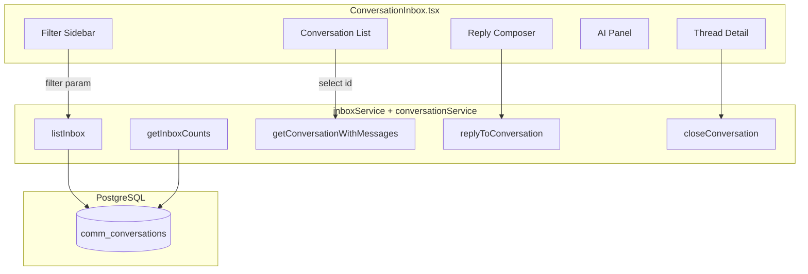
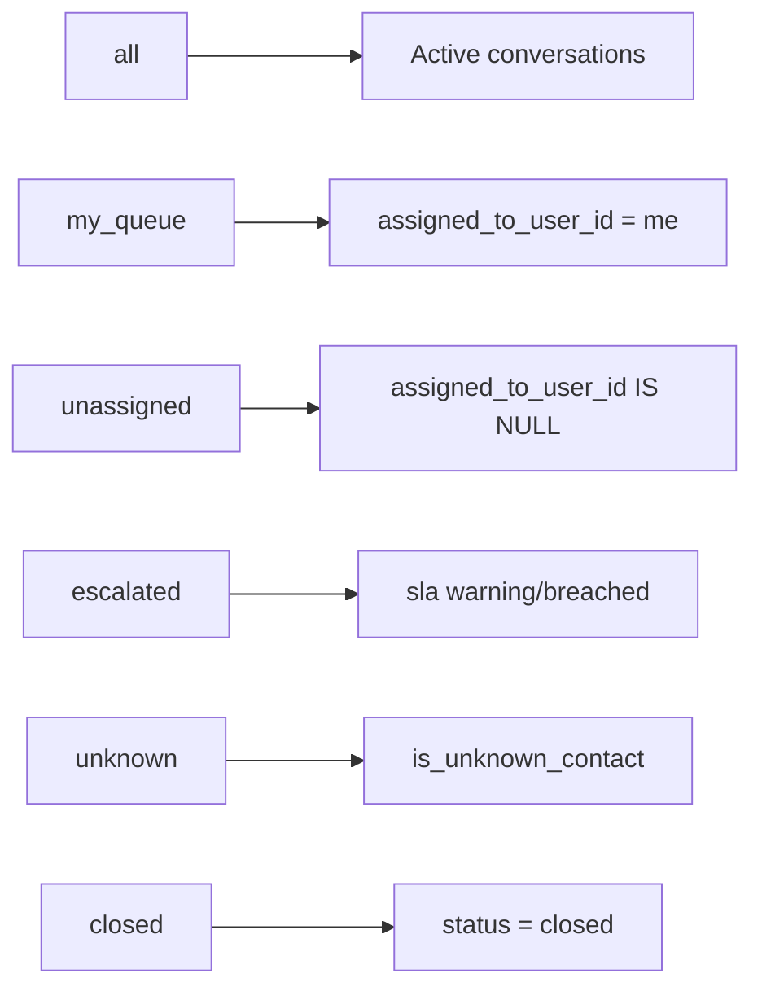
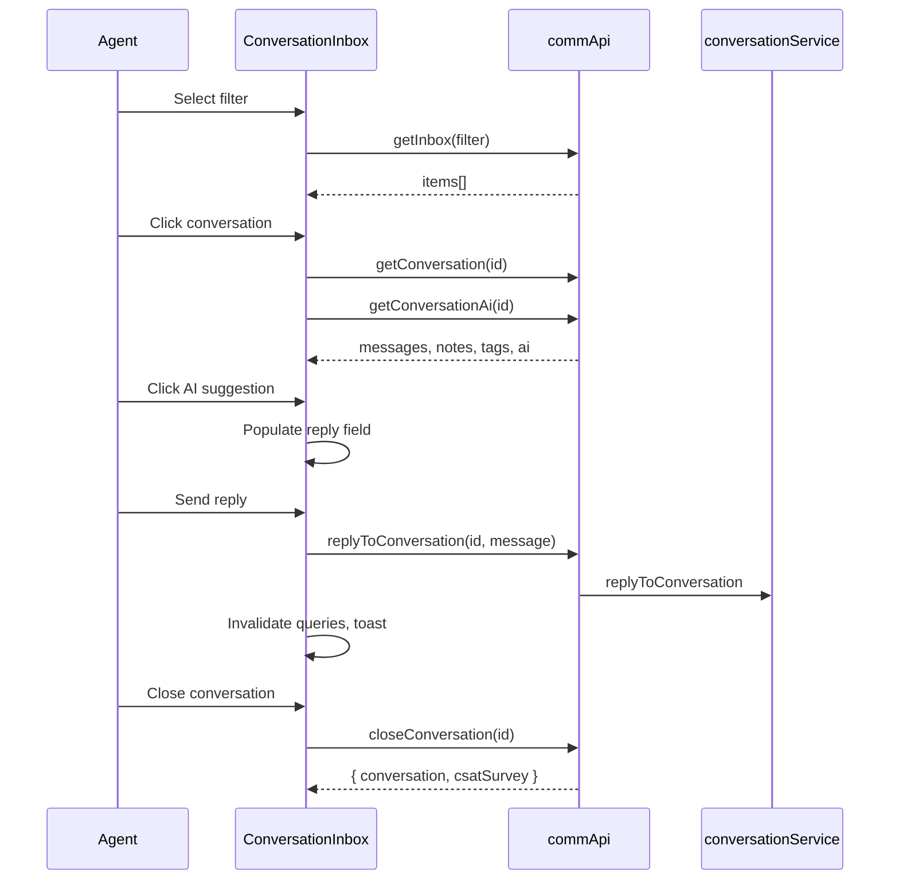

# Communication Center — Inbox Module

The Inbox Module provides the unified agent workspace for Phase 3 Conversational CRM. It combines server-side filtering and aggregation (`inboxService.ts`) with a three-column React UI (`ConversationInbox.tsx`). All channels — WhatsApp, SMS, Email — surface as a single conversation list with status, SLA, and assignment metadata.

---

## Table of Contents

1. [Overview](#overview)
2. [Inbox Filters](#inbox-filters)
3. [Server-Side Implementation](#server-side-implementation)
4. [Count Aggregations](#count-aggregations)
5. [Pagination](#pagination)
6. [Frontend Layout](#frontend-layout)
7. [User Interactions](#user-interactions)
8. [API Reference](#api-reference)
9. [Query Keys & Caching](#query-keys--caching)
10. [Role-Based Views](#role-based-views)
11. [Performance Considerations](#performance-considerations)

---

## Overview



The inbox is the primary entry point for **Conversation Manager**, **Conversation Agent**, and **Conversation Supervisor** roles (see [Security Model Phase 3](./COMMUNICATION_CENTER_SECURITY_MODEL_PHASE3.md)).

---

## Inbox Filters

Seven filter modes map to `InboxFilter` type in `conversationService.ts`:

| Filter ID | Label | Query Logic |
|-----------|-------|-------------|
| `all` | Inbox | All conversations except `spam` |
| `my_queue` | My Queue | `assigned_to_user_id = current user`, not closed/spam |
| `unassigned` | Unassigned | `assigned_to_user_id IS NULL`, not closed/spam |
| `assigned` | Assigned | `assigned_to_user_id IS NOT NULL`, not closed/spam |
| `escalated` | Escalated | `sla_status IN (warning, breached)`, not closed/spam |
| `unknown` | Unknown | `is_unknown_contact = true` |
| `closed` | Closed | `status = closed` |



Frontend constant `INBOX_FILTERS` in `ConversationInbox.tsx` mirrors these IDs with Lucide icons.

---

## Server-Side Implementation

### `listInbox`

**File:** `artifacts/api-server/src/lib/communications/inboxService.ts`

**Parameters:**

| Param | Type | Description |
|-------|------|-------------|
| `filter` | `InboxFilter` | Active filter mode |
| `userId` | `number?` | Current user (for `my_queue`) |
| `companyId` | `number?` | Tenant scope |
| `brandId` | `number?` | Brand filter |
| `cursor` | `number?` | Conversation ID for pagination |
| `limit` | `number?` | Page size (max 100, default 50) |

**Ordering:** `last_message_at DESC`, `id DESC` — most recent activity first.

**Scoping:** When `companyId` is set, all queries filter `comm_conversations.company_id`.

### `getInboxCounts`

Returns aggregate counts for dashboard cards and filter badges:

| Count Key | SQL Filter |
|-----------|------------|
| `open` | `status = 'open'` |
| `assigned` | `assigned_to_user_id IS NOT NULL`, active |
| `unassigned` | `assigned_to_user_id IS NULL`, active |
| `escalated` | `sla_status IN ('warning','breached')`, active |
| `closed` | `status = 'closed'` |
| `unknown` | `is_unknown_contact = true`, active |
| `myQueue` | `assigned_to_user_id = userId`, active |
| `pendingReplies` | `status IN ('open','assigned','pending')` with messages |
| `slaBreaches` | `sla_status = 'breached'` |

---

## Count Aggregations

The UI displays two headline metrics above the filter sidebar:

```tsx
// ConversationInbox.tsx
<Card>Open: {counts?.open ?? 0}</Card>
<Card>SLA Breach: {counts?.slaBreaches ?? 0}</Card>
```

The combined CRM analytics endpoint (`GET /communications/crm/analytics`) bundles inbox counts with SLA dashboard and CSAT dashboard for supervisor overview screens.

---

## Pagination

Cursor-based pagination using conversation `id`:

```typescript
// Request
GET /communications/inbox?filter=all&cursor=42

// Response
{
  "items": [...],
  "nextCursor": 15,  // ID of last item if more pages exist
  "hasMore": true
}
```

Implementation fetches `limit + 1` rows; if extra row exists, `hasMore = true` and `nextCursor` is set to the last returned item's ID.

Frontend currently loads the first page only; cursor param is available in `commApi.getInbox` for infinite scroll extension.

---

## Frontend Layout

`ConversationInbox.tsx` uses a responsive 12-column grid:

| Column | Span | Content |
|--------|------|---------|
| Left | `lg:col-span-3` | Count cards + filter buttons |
| Center | `lg:col-span-4` | Conversation list |
| Right | `lg:col-span-5` | Thread detail + composer |

### Conversation List Item

Each row displays:

- **Title** — `subject` → `lastMessagePreview` → `Conversation #id`
- **Channel badge** — `primaryChannel` (whatsapp, sms, email)
- **Preview** — Truncated `lastMessagePreview`
- **Status badge** — `status` value
- **SLA badge** — Red destructive badge when `slaStatus !== within_sla`

### Thread Detail Panel

When a conversation is selected:

1. **Header** — Subject, status, channel, Close button
2. **AI panel** — Sentiment, intent, priority, clickable reply suggestions
3. **Message thread** — Outgoing (right-aligned, primary color), incoming (left-aligned, muted)
4. **Internal notes** — Dashed yellow border, "Internal note" label
5. **Reply composer** — Input + Send button, Enter key submits

---

## User Interactions



### Mutations

| Action | Mutation | Invalidates |
|--------|----------|-------------|
| Reply | `replyMut` | `comm-conversation`, `comm-inbox` |
| Close | `closeMut` | `comm-inbox` |

Toast notifications on success/failure via `useToast`.

---

## API Reference

### List Inbox

```
GET /api/communications/inbox?filter={filter}&brandId={id}&cursor={id}
```

**Auth:** `communications:view`

**Response:**

```json
{
  "items": [
    {
      "id": 1,
      "status": "assigned",
      "primaryChannel": "whatsapp",
      "lastMessagePreview": "I need help with payment",
      "slaStatus": "warning",
      "assignedToUserId": 5,
      "lastMessageAt": "2026-06-13T10:00:00Z"
    }
  ],
  "nextCursor": null,
  "hasMore": false
}
```

### Inbox Counts

```
GET /api/communications/inbox/counts
```

**Auth:** `communications:view`

### Get Conversation Detail

```
GET /api/communications/conversations/:id
```

Returns conversation with `messages`, `notes`, `tags` arrays.

---

## Query Keys & Caching

React Query cache keys used by the inbox:

| Key | Data | Stale Strategy |
|-----|------|----------------|
| `comm-inbox-counts` | Aggregate counts | Default (refetch on mount) |
| `comm-inbox` | Filtered list | Per-filter key |
| `comm-conversation` | Thread detail | Per-conversation ID |
| `comm-ai` | AI assistance | Per-conversation ID |

Filter changes trigger new `comm-inbox` fetches. Conversation selection enables detail and AI queries (`enabled: selectedId != null`).

---

## Role-Based Views

| Role | Recommended Filters | Capabilities |
|------|---------------------|--------------|
| **Conversation Agent** | `my_queue`, `all` | Reply, close, view AI suggestions |
| **Conversation Manager** | `unassigned`, `escalated`, `unknown` | Assign teams/users, manage unknown contacts |
| **Conversation Supervisor** | `escalated`, `all` | Monitor SLA breaches, team queues |

Assignment UI is API-ready (`POST /conversations/:id/assign`) but not yet wired in `ConversationInbox.tsx` — extend the detail header for manager workflows.

Internal notes are rendered when present in the conversation payload but the compose UI for new notes is not yet in the component — use API directly or extend the UI.

---

## Performance Considerations

### Database Indexes

Migration creates indexes optimized for inbox queries:

- `comm_conv_status_idx` — `(status, last_message_at DESC)`
- `comm_conv_assigned_user_idx` — `(assigned_to_user_id, status)`
- `comm_conv_customer_idx` — `(customer_id, last_message_at DESC)`
- `comm_conv_unknown_idx` — `(is_unknown_contact, status)`

### Query Efficiency

- Count aggregation uses single `SELECT` with PostgreSQL `FILTER` clauses.
- List queries cap at 100 items per request.
- Conversation detail limits messages to 50 by default.

### Future Improvements

- WebSocket push for new messages (eliminate polling)
- Virtualized list for large inboxes
- Prefetch conversation detail on list hover
- Badge counts per filter button (requires extended counts API)

---

## Integration with Communication Center

`CommunicationCenter.tsx` mounts the inbox in a dedicated tab alongside Phase 1/2 features (campaigns, automations, analytics). The tab uses the `Inbox` Lucide icon and is accessible to users with `communications:view` permission.

---

## Related Documentation

- [Conversation Engine](./COMMUNICATION_CENTER_CONVERSATION_ENGINE.md)
- [SLA Engine](./COMMUNICATION_CENTER_SLA_ENGINE.md)
- [Phase 3 Architecture](./COMMUNICATION_CENTER_PHASE3_ARCHITECTURE.md)
- [Security Model Phase 3](./COMMUNICATION_CENTER_SECURITY_MODEL_PHASE3.md)
