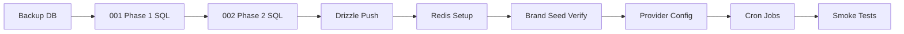

# Communication Center — Migration Plan

Step-by-step guide to deploy Communication Center Phase 2 Enterprise Omnichannel. Covers SQL migration, Drizzle schema push, Redis/BullMQ setup, brand seeding, verification, and rollback procedures.

---

## Table of Contents

1. [Prerequisites](#prerequisites)
2. [Migration Overview](#migration-overview)
3. [Step 1: Phase 1 Migration (If Not Applied)](#step-1-phase-1-migration-if-not-applied)
4. [Step 2: Phase 2 SQL Migration](#step-2-phase-2-sql-migration)
5. [Step 3: Drizzle Schema Push](#step-3-drizzle-schema-push)
6. [Step 4: Redis & BullMQ Setup](#step-4-redis--bullmq-setup)
7. [Step 5: Brand Seed Verification](#step-5-brand-seed-verification)
8. [Step 6: Provider Configuration](#step-6-provider-configuration)
9. [Step 7: DLT Governance Data](#step-7-dlt-governance-data)
10. [Step 8: Cron Jobs & Queue Workers](#step-8-cron-jobs--queue-workers)
11. [Step 9: Verification Checklist](#step-9-verification-checklist)
12. [Rollback Procedures](#rollback-procedures)
13. [Troubleshooting](#troubleshooting)

---

## Prerequisites

| Requirement | Details |
|-------------|---------|
| PostgreSQL | Managed Postgres (Render) or local instance |
| Node.js | Same version as project (see root `package.json`) |
| pnpm | Monorepo package manager |
| DATABASE_URL | Connection string with write access |
| Phase 1 base schema | `comm_*` core tables must exist (from prior Drizzle push) |
| Backup | Snapshot database before migration |

**Recommended order:** Phase 1 enhancement → Phase 2 enterprise → Drizzle push → Redis → verification.

---

## Migration Overview



| Artifact | Path |
|----------|------|
| Phase 1 SQL | `lib/db/migrations/001_comm_phase1_enhancement.sql` |
| Phase 2 SQL | `lib/db/migrations/002_comm_phase2_enterprise.sql` |
| Drizzle schema | `lib/db/src/schema/communications.ts`, `communications-phase2.ts` |
| Drizzle config | `lib/db/drizzle.config.ts` |

Both SQL files use `IF NOT EXISTS` / `ADD VALUE IF NOT EXISTS` guards and are **safe to re-run**.

---

## Step 1: Phase 1 Migration (If Not Applied)

Skip if Phase 1 is already deployed (consent table, smart segments, attribution exist).

### Option A: Drizzle Push (Recommended)

```bash
cd "C:\Users\Lenovo\Desktop\BIDWAR ALL\updatedbidwarcore-main\CWPDETAILERS"
pnpm --filter @workspace/db run push
```

### Option B: Manual SQL

```bash
psql $DATABASE_URL -f lib/db/migrations/001_comm_phase1_enhancement.sql
```

### Phase 1 Creates

- `comm_customer_consents` table
- `comm_smart_segments` table
- `comm_campaign_attribution` table
- `comm_campaigns.cost_amount` column
- `comm_event_status` value: `consent_blocked`
- Analytics indexes on `comm_events`

### Verify

```sql
SELECT EXISTS (SELECT 1 FROM information_schema.tables WHERE table_name = 'comm_customer_consents');
SELECT EXISTS (SELECT 1 FROM pg_enum e JOIN pg_type t ON e.enumtypid = t.oid
  WHERE t.typname = 'comm_event_status' AND e.enumlabel = 'consent_blocked');
```

---

## Step 2: Phase 2 SQL Migration

Apply the enterprise omnichannel migration:

```bash
psql $DATABASE_URL -f lib/db/migrations/002_comm_phase2_enterprise.sql
```

On Render, use the Dashboard SQL console or Render CLI:

```bash
render psql -- < lib/db/migrations/002_comm_phase2_enterprise.sql
```

### What Phase 2 SQL Does

**Extends existing enums:**

- `comm_event_status`: + `processing`, `retrying`, `dead_letter`
- `audience_filter_type`: + `bidwar_customers`, `revenue_above`, `last_visit_between`
- `comm_provider_type`: + `smtp`

**Creates new enums:**

- `comm_brand_status`, `comm_dlt_template_status`, `comm_email_type`
- `comm_whatsapp_category`, `comm_whatsapp_approval_status`
- `comm_automation_step_type`, `comm_automation_run_status`
- `comm_campaign_recurrence`, `comm_delivery_status`, `comm_queue_name`
- `comm_ai_recommendation_type`, `comm_workflow_trigger`

**Adds brand_id columns** (nullable) to 10 Phase 1 tables.

**Creates 12 new tables:**

- `comm_brands`, `comm_dlt_templates`, `comm_timeline`
- `comm_email_templates`, `comm_whatsapp_templates`
- `comm_workflows`, `comm_workflow_steps`, `comm_workflow_runs`
- `comm_queue_jobs`, `comm_dead_letter`
- `comm_consent_history`, `comm_ai_recommendations`

**Seeds 4 global brands:** cwp, kleansolar, dcc, bidwar

### Verify

```sql
-- Brands seeded
SELECT id, code, name, status FROM comm_brands WHERE company_id IS NULL;

-- New tables exist
SELECT table_name FROM information_schema.tables
WHERE table_name IN ('comm_brands', 'comm_timeline', 'comm_queue_jobs', 'comm_workflows')
ORDER BY table_name;

-- brand_id column added
SELECT column_name FROM information_schema.columns
WHERE table_name = 'comm_campaigns' AND column_name = 'brand_id';
```

Expected: 4 brand rows, all tables present, brand_id column exists.

---

## Step 3: Drizzle Schema Push

Sync Drizzle ORM schema with the database (adds any indexes defined in TypeScript but not in SQL):

```bash
pnpm --filter @workspace/db run push
```

Review the diff prompt carefully. Drizzle may propose additional indexes from `communications-phase2.ts`:

- `comm_brands_status_idx`
- `comm_dlt_templates_brand_idx`, `comm_dlt_templates_status_idx`
- `comm_timeline_campaign_idx`, `comm_timeline_created_idx`
- `comm_wa_templates_brand_name_idx`
- `comm_workflows_brand_trigger_idx`
- `comm_queue_jobs_queue_idx`, `comm_queue_jobs_event_idx`
- `comm_workflow_runs_*` indexes
- `comm_dead_letter_*` indexes
- `comm_ai_rec_brand_type_idx`

If schema drift is detected, prefer accepting Drizzle additions over manual edits.

### Force Push (Development Only)

```bash
pnpm --filter @workspace/db run push-force
```

**Warning:** Never use `--force` on production without reviewing the diff.

### Permissions Seed

If communications permissions are not yet seeded:

```bash
pnpm --filter @workspace/scripts exec tsx src/seed-permissions.ts
```

This grants `communications: view/create/edit` to admin, superadmin, and manager roles.

---

## Step 4: Redis & BullMQ Setup

Phase 2 queue service uses BullMQ when `REDIS_URL` is set; otherwise falls back to PostgreSQL polling.

### Render Key Value (Recommended)

1. Create a Key Value instance in Render Dashboard
2. Copy internal connection URL
3. Set on api-server web service:

```
REDIS_URL=redis://red-xxx:6379
```

Use [internal URL](https://render.com/docs/key-value) for service-to-service communication.

### Local Development

```bash
docker run -d -p 6379:6379 redis:7-alpine
export REDIS_URL=redis://localhost:6379
```

### Verify Redis Connection

Start api-server and check logs for:

- No `"BullMQ unavailable — using DB queue fallback"` warning
- Queue jobs get `bull_job_id` populated in `comm_queue_jobs`

```sql
SELECT id, queue_name, bull_job_id, status
FROM comm_queue_jobs
ORDER BY id DESC LIMIT 5;
```

### Without Redis

The system operates in DB-only mode:

- Messages still queue in `comm_queue_jobs`
- Process via `POST /api/communications/queue/process`
- No BullMQ workers needed — cron polls the database

This is acceptable for low-volume deployments but not recommended for production scale.

---

## Step 5: Brand Seed Verification

Phase 2 SQL seeds global brands. API also seeds per-tenant brands on first access.

### SQL Seed (Global)

```sql
SELECT id, name, code, primary_color, status
FROM comm_brands
WHERE company_id IS NULL
ORDER BY code;
```

Expected output:

| code | name | primary_color |
|------|------|---------------|
| bidwar | BidWar | #dc2626 |
| cwp | CWP Detailers | #1e40af |
| dcc | DCC | #7c3aed |
| kleansolar | Kleansolar | #059669 |

### API Seed (Per Tenant)

```
GET /api/communications/brands
```

First call for a company with no brands triggers `seedDefaultBrands(companyId)`.

### Backfill brand_id on Existing Data (Recommended)

After migration, assign brands to active resources:

```sql
-- Example: assign CWP brand to existing campaigns
UPDATE comm_campaigns
SET brand_id = (SELECT id FROM comm_brands WHERE code = 'cwp' AND company_id IS NULL LIMIT 1)
WHERE brand_id IS NULL;

-- Same pattern for templates, providers, events as needed
UPDATE comm_templates SET brand_id = (SELECT id FROM comm_brands WHERE code = 'cwp' AND company_id IS NULL LIMIT 1) WHERE brand_id IS NULL;
```

---

## Step 6: Provider Configuration

Configure at least one provider per channel you plan to use.

### SMS (Fast2SMS)

```
POST /api/communications/providers
```

```json
{
  "name": "Primary Fast2SMS",
  "providerType": "fast2sms",
  "channel": "sms",
  "brandId": 1,
  "config": { "apiKey": "...", "senderId": "CWPDBL" },
  "isPrimary": true,
  "priority": 10
}
```

Or set env vars: `FAST2SMS_API_KEY`, `FAST2SMS_SENDER_ID`.

### WhatsApp (Meta)

Env vars:

```
WHATSAPP_ACCESS_TOKEN=EAAxxxxx
WHATSAPP_PHONE_NUMBER_ID=123456789
```

Or DB provider with `providerType: "whatsapp_business"`.

### Email (Resend)

```
RESEND_API_KEY=re_xxxxx
```

Or DB provider with `providerType: "resend"`.

### Email (SMTP)

```json
{
  "providerType": "smtp",
  "channel": "email",
  "config": {
    "host": "smtp.example.com",
    "port": "587",
    "user": "noreply@cwpdetailers.com",
    "pass": "...",
    "from": "CWP Detailers <noreply@cwpdetailers.com>"
  }
}
```

Requires `nodemailer` package installed on api-server.

---

## Step 7: DLT Governance Data

For SMS compliance, populate the governance chain:

1. **Entities** — `POST /communications/dlt/entities`
2. **Headers** — `POST /communications/dlt/headers`
3. **Governance templates** — `POST /communications/dlt/templates`
4. **Message templates** — `POST /communications/templates` (with matching `dltTemplateId`)

Validate:

```
POST /api/communications/dlt/validate
{
  "brandId": 1,
  "dltTemplateId": "your-trai-template-id",
  "channel": "sms",
  "customerId": 101
}
```

---

## Step 8: Cron Jobs & Queue Workers

### Render Cron Job (Recommended)

Create a cron job service that runs every 5 minutes:

```bash
curl -X POST https://your-api.onrender.com/api/communications/jobs/process \
  -H "Authorization: Bearer $CRON_TOKEN"

curl -X POST https://your-api.onrender.com/api/communications/queue/process \
  -H "Authorization: Bearer $CRON_TOKEN" \
  -H "Content-Type: application/json" \
  -d '{"limit": "50"}'
```

### Job Responsibilities

| Endpoint | Processes |
|----------|-----------|
| `/jobs/process` | Scheduled campaigns, Phase 1 automation triggers, workflow wait continuations, attribution |
| `/queue/process` | SMS/WhatsApp/email/push delivery, retries, dead-letter |

### With BullMQ + Redis

BullMQ handles job dispatch when workers are connected. The DB fallback cron is still required as a safety net unless dedicated BullMQ workers are deployed.

---

## Step 9: Verification Checklist

### Database

- [ ] All Phase 2 tables exist
- [ ] 4 global brands seeded
- [ ] `brand_id` columns present on Phase 1 tables
- [ ] New enum values queryable

### API Smoke Tests

- [ ] `GET /communications/brands` returns 4 brands
- [ ] `GET /communications/queue/stats` returns stats object
- [ ] `POST /communications/dlt/validate` validates test template
- [ ] `POST /communications/workflows` creates workflow with steps
- [ ] `POST /communications/whatsapp/test-send` succeeds (if configured)

### End-to-End Send

- [ ] Create campaign → send → event created with `status: queued`
- [ ] Queue process → event moves to `sent`
- [ ] Timeline entry created in `comm_timeline`
- [ ] Consent-blocked customer gets `consent_blocked` status

### UI

- [ ] Communication Center loads at `/admin/communications`
- [ ] Customer preferences toggle works
- [ ] Timeline displays on customer profile

---

## Rollback Procedures

Phase 2 migration is designed to be non-destructive (additive only). Rollback options depend on deployment stage.

### Pre-Production Rollback (Full)

If Phase 2 has not received production traffic:

```sql
-- Drop Phase 2 tables (order matters for implicit dependencies)
DROP TABLE IF EXISTS comm_ai_recommendations;
DROP TABLE IF EXISTS comm_consent_history;
DROP TABLE IF EXISTS comm_dead_letter;
DROP TABLE IF EXISTS comm_queue_jobs;
DROP TABLE IF EXISTS comm_workflow_runs;
DROP TABLE IF EXISTS comm_workflow_steps;
DROP TABLE IF EXISTS comm_workflows;
DROP TABLE IF EXISTS comm_whatsapp_templates;
DROP TABLE IF EXISTS comm_email_templates;
DROP TABLE IF EXISTS comm_timeline;
DROP TABLE IF EXISTS comm_dlt_templates;
DROP TABLE IF EXISTS comm_brands;

-- Remove Phase 2 columns from Phase 1 tables
ALTER TABLE comm_campaigns DROP COLUMN IF EXISTS email_template_id;
ALTER TABLE comm_campaigns DROP COLUMN IF EXISTS whatsapp_template_id;
ALTER TABLE comm_campaigns DROP COLUMN IF EXISTS recurrence;
ALTER TABLE comm_customer_consents DROP COLUMN IF EXISTS push_consent;

-- Remove brand_id columns
ALTER TABLE comm_dlt_entities DROP COLUMN IF EXISTS brand_id;
ALTER TABLE comm_templates DROP COLUMN IF EXISTS brand_id;
ALTER TABLE comm_providers DROP COLUMN IF EXISTS brand_id;
ALTER TABLE comm_audiences DROP COLUMN IF EXISTS brand_id;
ALTER TABLE comm_campaigns DROP COLUMN IF EXISTS brand_id;
ALTER TABLE comm_customer_consents DROP COLUMN IF EXISTS brand_id;
ALTER TABLE comm_events DROP COLUMN IF EXISTS brand_id;
ALTER TABLE comm_automations DROP COLUMN IF EXISTS brand_id;
ALTER TABLE comm_audit_logs DROP COLUMN IF EXISTS brand_id;
```

**Note:** PostgreSQL does not support removing enum values. New enum types can be dropped if unused:

```sql
DROP TYPE IF EXISTS comm_workflow_trigger;
DROP TYPE IF EXISTS comm_queue_name;
-- etc.
```

### Production Rollback (Safe — Keep Schema)

If Phase 2 schema is deployed but features should be disabled:

1. **Disable Phase 2 routes** — revert api-server deploy to pre-Phase-2 version
2. **Keep database schema** — nullable columns cause no harm
3. **Stop Phase 2 cron** — remove `/queue/process` from cron; keep `/jobs/process` for Phase 1
4. **Unset REDIS_URL** — falls back to DB-only mode or disable queue entirely

Phase 1 campaigns and automations continue working because:

- `brand_id` is nullable
- Campaign engine falls back to `resolveBrandId()` → CWP
- Phase 1 routes unchanged

### Restore from Backup

For catastrophic failure:

1. Restore PostgreSQL snapshot from pre-migration backup
2. Redeploy previous api-server version
3. Re-run Phase 1 migration only if needed

---

## Troubleshooting

| Issue | Cause | Fix |
|-------|-------|-----|
| `BullMQ unavailable` in logs | Missing/invalid REDIS_URL | Set REDIS_URL or accept DB fallback |
| SMS blocked at DLT validation | Missing governance template | Create `comm_dlt_templates` row |
| Queue jobs stuck in `queued` | Cron not running | Enable `/queue/process` cron |
| Workflow stuck after wait | Jobs not processing | Ensure `/jobs/process` runs |
| `smtp requires nodemailer` | Package not installed | `pnpm add nodemailer` to api-server |
| Duplicate brand codes | Re-seed on tenant | Brands unique per `(code, company_id)` |
| Enum value already exists | Re-running migration | Safe — `IF NOT EXISTS` guards skip |

---

## Migration Timeline (Suggested)

| Day | Activity |
|-----|----------|
| D-7 | Backup production DB; run Phase 2 on staging |
| D-3 | Configure providers, DLT data, brands on staging |
| D-1 | End-to-end test: campaign + workflow + queue |
| D-Day | Apply `002_comm_phase2_enterprise.sql` on production |
| D-Day | Drizzle push; set REDIS_URL; deploy api-server |
| D+1 | Monitor queue stats, dead-letter queue, audit logs |

---

*Last updated: June 2026 — Communication Center Phase 2 Migration Plan*
