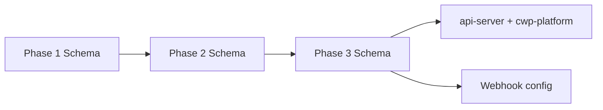
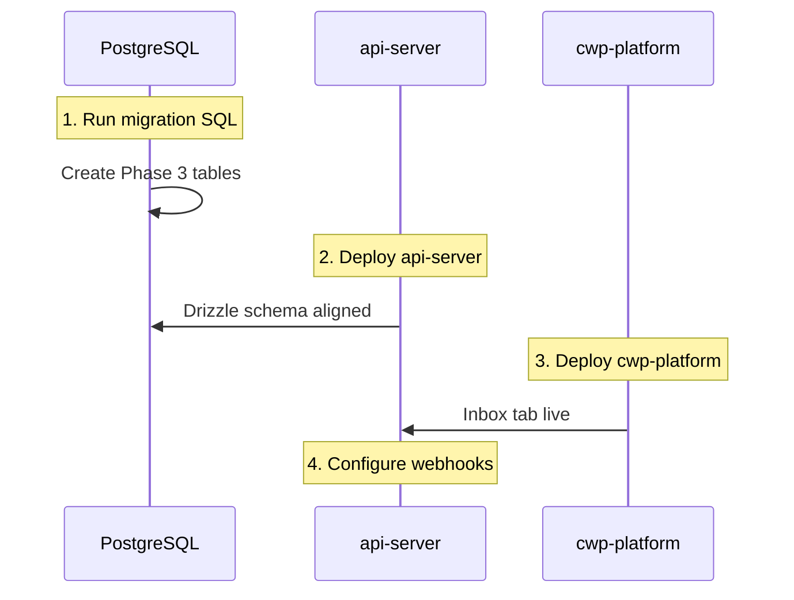
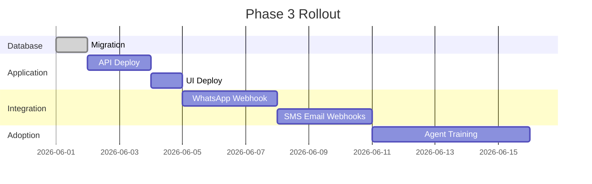

# Communication Center — Migration Plan (Phase 3)

This document describes how to safely deploy Phase 3 Conversational CRM database changes and application code. The migration file `lib/db/migrations/003_comm_phase3_conversational_crm.sql` is idempotent and designed for zero-downtime rollout alongside existing Phase 1 and Phase 2 Communication Center features.

---

## Table of Contents

1. [Migration Summary](#migration-summary)
2. [Prerequisites](#prerequisites)
3. [Pre-Migration Checklist](#pre-migration-checklist)
4. [Migration Execution](#migration-execution)
5. [Post-Migration Verification](#post-migration-verification)
6. [Application Deployment](#application-deployment)
7. [Webhook Configuration](#webhook-configuration)
8. [Rollback Strategy](#rollback-strategy)
9. [Data Backfill](#data-backfill)
10. [Tenant Onboarding](#tenant-onboarding)
11. [Timeline & Sequencing](#timeline--sequencing)
12. [Troubleshooting](#troubleshooting)

---

## Migration Summary

| Item | Value |
|------|-------|
| Migration file | `lib/db/migrations/003_comm_phase3_conversational_crm.sql` |
| Drizzle schema | `lib/db/src/schema/communications-phase3.ts` |
| New enums | 8 |
| New tables | 16 |
| Seed data | 4 teams + 1 SLA policy |
| Idempotent | Yes (`IF NOT EXISTS`, `DO $$ EXCEPTION`) |
| Breaking changes | None to Phase 1/2 |



---

## Prerequisites

### Database

- PostgreSQL 14+ (Render Managed PostgreSQL or equivalent)
- Phase 1 migration applied (`comm_channel` enum exists)
- Phase 2 migration applied (`comm_timeline`, `comm_brands`, etc.)
- Sufficient connection pool headroom for DDL

### Application

- `communications-phase3.ts` routes deployed
- `communications-webhooks.ts` routes deployed (public, pre-auth mount)
- Service files in `lib/communications/` present
- `lib/db/src/schema/index.ts` exports Phase 3 schema

### Environment

| Variable | Required | Default | Purpose |
|----------|----------|---------|---------|
| `DATABASE_URL` | Yes | — | PostgreSQL connection |
| `WHATSAPP_VERIFY_TOKEN` | Recommended | `cwp_verify` | Meta webhook verification |
| Provider credentials | For outbound | Phase 1 vars | Reply sending |

---

## Pre-Migration Checklist

- [ ] Backup production database (Render snapshot or `pg_dump`)
- [ ] Confirm Phase 1+2 tables exist: `comm_campaigns`, `comm_events`, `comm_timeline`
- [ ] Review migration SQL in staging environment
- [ ] Verify no naming conflicts with existing tables
- [ ] Schedule maintenance window (optional — migration is non-blocking)
- [ ] Notify agents of new inbox feature post-deploy

---

## Migration Execution

### Staging

```bash
psql $DATABASE_URL -f lib/db/migrations/003_comm_phase3_conversational_crm.sql
```

### Production (Render)

**Option A — Manual via Render Dashboard:**

1. Open PostgreSQL service → Shell or external `psql` with external connection string.
2. Run migration SQL file contents.

**Option B — Deploy hook:**

Add to CI/CD pipeline after successful build:

```bash
psql "$DATABASE_URL" -f lib/db/migrations/003_comm_phase3_conversational_crm.sql
```

### Idempotency Guarantees

```sql
-- Enums: safe re-run
DO $$ BEGIN CREATE TYPE comm_conversation_status AS ENUM (...);
EXCEPTION WHEN duplicate_object THEN NULL; END $$;

-- Tables: safe re-run
CREATE TABLE IF NOT EXISTS comm_conversations (...);

-- Indexes: safe re-run
CREATE INDEX IF NOT EXISTS comm_conv_status_idx ON comm_conversations(...);

-- Seeds: conditional insert
INSERT INTO comm_teams (...) WHERE NOT EXISTS (...);
```

Re-running the migration on an already-migrated database is safe.

---

## Post-Migration Verification

### Schema Verification

```sql
-- Verify tables
SELECT table_name FROM information_schema.tables
WHERE table_name LIKE 'comm_%'
ORDER BY table_name;

-- Verify enums
SELECT typname FROM pg_type
WHERE typname LIKE 'comm_%'
ORDER BY typname;

-- Verify seed data
SELECT * FROM comm_teams WHERE company_id IS NULL;
SELECT * FROM comm_sla_policies WHERE is_default = true AND company_id IS NULL;
```

Expected: 4 teams, 1 default SLA policy.

### API Smoke Tests

```bash
# Inbox (requires auth cookie/token)
curl -s /api/communications/inbox/counts

# SLA dashboard
curl -s /api/communications/sla/dashboard

# CRM analytics bundle
curl -s /api/communications/crm/analytics

# Public link redirect (404 expected for invalid ID)
curl -sI /api/r/nonexistent
```

### Webhook Tests

```bash
# WhatsApp verification
curl "/api/webhooks/whatsapp?hub.mode=subscribe&hub.verify_token=cwp_verify&hub.challenge=test123"
# Expected: test123

# SMS inbound
curl -X POST /api/webhooks/sms?companyId=1 \
  -H "Content-Type: application/json" \
  -d '{"phone":"9876543210","message":"Test inbound"}'
```

---

## Application Deployment

### Deploy Order



1. **Database** — Run migration
2. **api-server** — Deploy with Phase 3 routes and services
3. **cwp-platform** — Deploy with `ConversationInbox` component
4. **Webhooks** — Register URLs with Meta, SMS provider, email relay

### Route Registration

Confirmed in `routes/index.ts`:

```typescript
router.use(communicationsWebhooksRouter);  // Public, before auth
router.use(guardResource("communications"), [
  communicationsRouter,
  communicationsPhase2Router,
  communicationsPhase3Router,
]);
```

No changes required to Phase 1/2 route files.

---

## Webhook Configuration

### Meta WhatsApp

| Setting | Value |
|---------|-------|
| Callback URL | `https://<host>/api/webhooks/whatsapp?companyId=<id>` |
| Verify Token | Value of `WHATSAPP_VERIFY_TOKEN` |
| Subscribed fields | `messages`, `message_status` |

### SMS Provider (Fast2SMS/MSG91)

Configure inbound callback:

```
POST https://<host>/api/webhooks/sms?companyId=<id>
Body: { phone, message, messageId }
```

### Email Relay (Resend/SMTP)

```
POST https://<host>/api/webhooks/email?companyId=<id>
Body: { from, to, subject, body, threadId, customerId }
```

### Campaign Links

Use tracked URLs in campaign content:

```
https://<host>/api/r/<trackingId>
```

Create via `POST /api/communications/links/track` before send.

---

## Rollback Strategy

Phase 3 is additive. Rollback options:

### Application Rollback

Redeploy previous api-server/cwp-platform versions. Phase 3 tables remain unused but harmless.

### Schema Rollback (only if necessary)

```sql
-- Drop Phase 3 tables (order matters for dependencies)
DROP TABLE IF EXISTS comm_agent_metrics;
DROP TABLE IF EXISTS comm_journey_events;
DROP TABLE IF EXISTS comm_ticket_rules;
DROP TABLE IF EXISTS comm_csat_responses;
DROP TABLE IF EXISTS comm_knowledge_base;
DROP TABLE IF EXISTS comm_channel_costs;
DROP TABLE IF EXISTS comm_link_tracking;
DROP TABLE IF EXISTS comm_ai_assistance;
DROP TABLE IF EXISTS comm_unknown_contacts;
DROP TABLE IF EXISTS comm_sla_policies;
DROP TABLE IF EXISTS comm_conversation_tags;
DROP TABLE IF EXISTS comm_teams;
DROP TABLE IF EXISTS comm_conversation_notes;
DROP TABLE IF EXISTS comm_conversation_messages;
DROP TABLE IF EXISTS comm_conversations;

-- Drop enums
DROP TYPE IF EXISTS comm_ticket_rule_trigger;
DROP TYPE IF EXISTS comm_kb_category;
DROP TYPE IF EXISTS comm_journey_event_type;
DROP TYPE IF EXISTS comm_tag_source;
DROP TYPE IF EXISTS comm_sla_status;
DROP TYPE IF EXISTS comm_message_delivery;
DROP TYPE IF EXISTS comm_message_direction;
DROP TYPE IF EXISTS comm_conversation_status;
```

**Warning:** Rollback destroys all conversation data. Prefer application-only rollback.

---

## Data Backfill

Phase 3 does not automatically migrate historical data. Optional backfill tasks:

### Journey Sync

For existing customers with Phase 1/2 timeline entries:

```
GET /api/communications/journey/customer/:id?sync=true
```

Calls `syncJourneyFromPlatformEvents` — imports up to 100 `comm_timeline` rows into `comm_journey_events` (one-time per customer).

### Profitability Snapshots

For historical campaigns:

```bash
for id in $(campaign_ids); do
  curl -X POST /api/communications/campaigns/$id/profitability
done
```

### Agent Metrics

Backfill daily metrics:

```bash
curl -X POST /api/communications/performance/compute \
  -d '{"userId": 5, "periodDate": "2026-06-01"}'
```

---

## Tenant Onboarding

Per-tenant setup after migration:

| Step | Action | Result |
|------|--------|--------|
| 1 | First conversation created | Teams + SLA auto-seeded for `company_id` |
| 2 | Configure webhooks with `?companyId=` | Tenant-scoped inbound |
| 3 | Seed ticket rules | Auto-created on first `evaluateTicketRules` call |
| 4 | Create KB articles | `POST /communications/knowledge-base` |
| 5 | Assign Conversation roles | See Security Model Phase 3 |

### Multi-Brand Tenants

Pass `brandId` query param on inbox and knowledge base endpoints for brand filtering.

---

## Timeline & Sequencing

Recommended rollout phases:

| Week | Activity |
|------|----------|
| 1 | Staging migration + API smoke tests |
| 2 | Deploy to production (DB + API + UI) |
| 3 | Configure WhatsApp webhook, test inbound/outbound |
| 4 | Enable SMS/email webhooks |
| 5 | Train agents on inbox, CSAT, internal notes |
| 6 | Enable link tracking in campaigns |
| 7 | Review profitability + team performance dashboards |



---

## Troubleshooting

| Issue | Cause | Fix |
|-------|-------|-----|
| `type "comm_channel" does not exist` | Phase 1 not migrated | Run Phase 1 migration first |
| Inbox returns empty | No inbound webhooks configured | Set up provider callbacks |
| WhatsApp verify fails | Token mismatch | Align `WHATSAPP_VERIFY_TOKEN` with Meta config |
| SLA always `within_sla` | `refreshSlaStatuses` not called | Hit `/sla/dashboard` or add cron |
| Teams not found | Seed not run | Re-run migration INSERT or call `seedDefaultTeams` |
| Link redirect 404 | Invalid `tracking_id` | Create link via `/links/track` first |
| Permission denied on inbox | Missing `communications:view` | Update role permissions |

### Render-Specific Notes

- Bind API to `0.0.0.0:$PORT`
- Filesystem is ephemeral — do not store uploads locally
- Free tier spin-down may delay webhook processing (upgrade for production CRM)

---

## Related Documentation

- [Database Schema Phase 3](./COMMUNICATION_CENTER_DATABASE_SCHEMA_PHASE3.md)
- [Phase 3 Architecture](./COMMUNICATION_CENTER_PHASE3_ARCHITECTURE.md)
- [Original Migration Plan](./COMMUNICATION_CENTER_MIGRATION_PLAN.md)
- [Security Model Phase 3](./COMMUNICATION_CENTER_SECURITY_MODEL_PHASE3.md)
