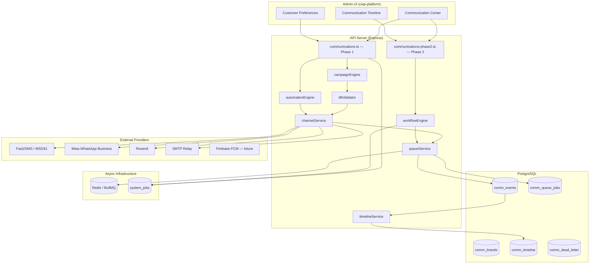
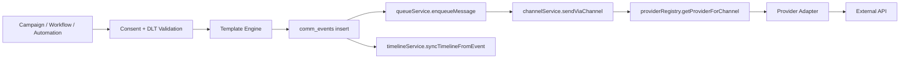
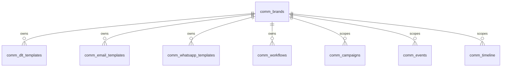
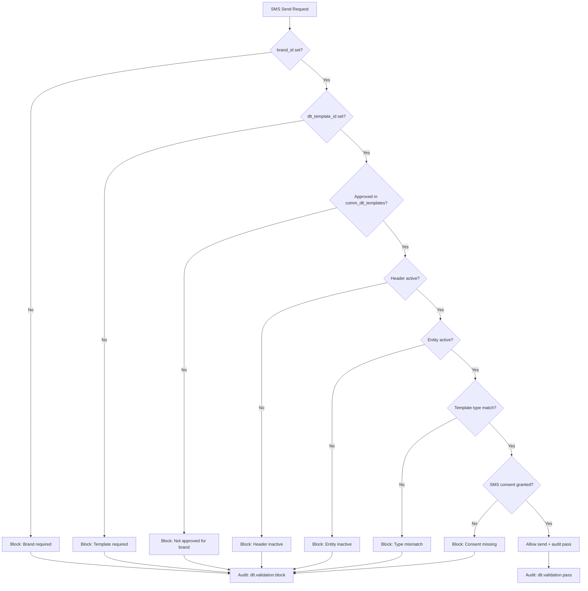
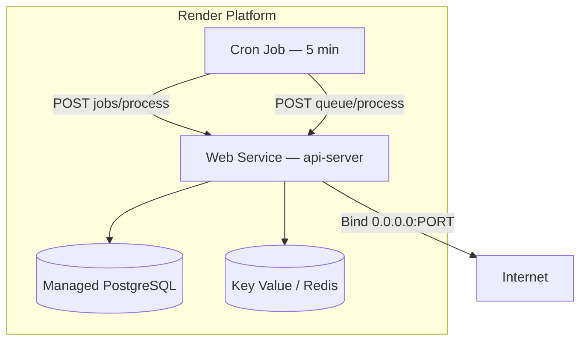

# Communication Center — Phase 2 Architecture

Enterprise omnichannel communication platform for CWP Detailers, Kleansolar, DCC, and BidWar. Phase 2 extends Phase 1 with multi-brand isolation, channel abstraction, async delivery queues, DLT governance, unified customer timelines, and multi-step workflow automation—while preserving all Phase 1 APIs and data paths.

---

## Table of Contents

1. [Design Goals](#design-goals)
2. [System Overview](#system-overview)
3. [Layered Architecture](#layered-architecture)
4. [Multi-Brand Model](#multi-brand-model)
5. [Channel Abstraction](#channel-abstraction)
6. [Message Queue & Retry](#message-queue--retry)
7. [DLT Governance Chain](#dlt-governance-chain)
8. [Unified Timeline](#unified-timeline)
9. [Automation: Phase 1 vs Phase 2](#automation-phase-1-vs-phase-2)
10. [Job Processing](#job-processing)
11. [Backward Compatibility with Phase 1](#backward-compatibility-with-phase-1)
12. [Deployment Topology](#deployment-topology)
13. [Key Source Files](#key-source-files)

---

## Design Goals

| Goal | Phase 2 Solution |
|------|------------------|
| Operate four brands from one platform | `comm_brands` registry with per-brand templates, providers, and sender identity |
| TRAI/DPDP compliance for SMS | DLT validation chain before every SMS send |
| Reliable delivery at scale | BullMQ + PostgreSQL dual-write queue with exponential retry and dead-letter |
| Single customer view | Denormalized `comm_timeline` synced from `comm_events` |
| Complex nurture flows | Multi-step `comm_workflows` with wait, branch, and cross-channel send steps |
| Zero breaking changes | Phase 1 routes, automations, and campaign engine remain active |

---

## System Overview



The Communication Center is a tenant-scoped subsystem. Every query and mutation is filtered by `company_id` (and optionally `branch_id`) via `tenantFilters` / `tenantStamp` middleware. Phase 2 adds optional `brand_id` scoping on campaigns, events, consents, and audit logs.

---

## Layered Architecture



**Rule enforced in code:** The campaign engine must never call providers directly. All outbound sends flow through `channelService.sendViaChannel`, which delegates to `providerRegistry`.

### Responsibility Matrix

| Layer | Module | Responsibility |
|-------|--------|----------------|
| Routes | `communications.ts`, `communications-phase2.ts` | HTTP validation, tenant stamping, audit hooks |
| Campaign | `campaignEngine.ts` | Audience resolution, consent checks, batch send, DLT pre-check |
| Automation (P1) | `automationEngine.ts` | Single-step trigger → template → send (sync or direct provider) |
| Workflow (P2) | `workflowEngine.ts` | Multi-step runs with wait/branch/send actions |
| Channel | `channels/channelService.ts` | Provider-independent send contract |
| Provider | `providerRegistry.ts` | DB-configured provider selection + env fallbacks |
| Queue | `queueService.ts` | BullMQ enqueue, DB mirror, retry, dead-letter |
| DLT | `dltValidator.ts` | Brand → entity → header → template → consent chain |
| Timeline | `timelineService.ts` | Denormalized customer communication history |
| Jobs | `jobProcessor.ts` | Scheduled campaigns, automation ticks, workflow continuations |

---

## Multi-Brand Model

Phase 2 introduces `comm_brands` as the canonical brand registry. Four global brands are seeded on migration:

| Code | Name | Primary Color |
|------|------|---------------|
| `cwp` | CWP Detailers | `#1e40af` |
| `kleansolar` | Kleansolar | `#059669` |
| `dcc` | DCC | `#7c3aed` |
| `bidwar` | BidWar | `#dc2626` |

Each brand record stores sender identity used at render/send time:

- `email_sender`, `email_reply_to`
- `default_sms_header`
- `default_whatsapp_number`
- `default_support_number`
- `logo`, `primary_color`

### Brand Scoping

The following Phase 1 tables receive an optional `brand_id` column in Phase 2:

- `comm_dlt_entities`, `comm_templates`, `comm_providers`
- `comm_audiences`, `comm_campaigns`, `comm_customer_consents`
- `comm_events`, `comm_automations`, `comm_audit_logs`

When `brand_id` is null, `brandService.resolveBrandId()` falls back to the `cwp` brand for the tenant. This ensures legacy campaigns continue to send under the default CWP identity.



Brand-specific template centers:

- **SMS/DLT:** `comm_dlt_templates` — TRAI-approved content bound to entity + header
- **Email:** `comm_email_templates` — HTML templates with `comm_email_type`
- **WhatsApp:** `comm_whatsapp_templates` — Meta template names with approval status

---

## Channel Abstraction

Channels are defined in the `comm_channel` enum:

```
sms | whatsapp | email | push | in_app
```

The `channels/types.ts` module defines provider-independent interfaces:

- `SmsProvider`, `WhatsappProvider`, `EmailProvider`, `PushProvider`
- `ChannelSendPayload` — normalized send request
- `ChannelSendResult` — success, externalId, error, timelineEvents

`channelService.sendViaChannel(channel, payload)` routes:

| Channel | Handler |
|---------|---------|
| `in_app` | Direct insert into `notifications` table |
| `sms`, `whatsapp`, `email`, `push` | Provider lookup → adapter send |

Campaign engine maps WhatsApp template categories to message types:

- `utility` → utility text
- `service_implicit` → service text
- DLT template ID present → Meta template message

---

## Message Queue & Retry

Phase 2 decouples message creation (`comm_events`) from delivery via `comm_queue_jobs`.

### Queue Names

| Channel | Queue Enum |
|---------|------------|
| SMS | `sms_queue` |
| WhatsApp | `whatsapp_queue` |
| Email | `email_queue` |
| Push | `push_queue` |

### Dual-Write Strategy

1. Insert row into `comm_queue_jobs` (always — DB is source of truth)
2. If `REDIS_URL` is set, also enqueue to BullMQ with `bull_job_id` reference
3. If Redis unavailable, `POST /api/communications/queue/process` polls DB directly

### Retry Policy

Implemented in `retryEngine.ts`:

| Attempt | Delay |
|---------|-------|
| 1 | 1 minute |
| 2 | 5 minutes |
| 3 | 15 minutes |
| 4 | 1 hour |

Default `max_retries = 4`. After exhaustion, job moves to `dead_letter` status and a row is inserted into `comm_dead_letter`.

### Delivery Status Lifecycle

```
queued → processing → sent
                   ↘ retrying → (retry) → sent
                              ↘ dead_letter
```

Both `comm_queue_jobs.status` and `comm_events.status` are updated in tandem during processing.

---

## DLT Governance Chain

Every SMS send passes through `validateBeforeSmsSend()` (or `validateSmsTemplate()` for campaign sends):



Validation results are always written to `comm_audit_logs` with action `dlt.validation.pass` or `dlt.validation.block`.

Non-SMS channels skip DLT validation with step `non_sms_skip`.

---

## Unified Timeline

Phase 1 exposed timeline via `GET /api/communications/timeline` reading directly from `comm_events`.

Phase 2 adds a denormalized `comm_timeline` table optimized for customer profile reads:

- Cursor-based pagination: `GET /api/communications/timeline/customer/:customerId?cursor=&limit=&brandId=`
- Engagement flags: `read_status`, `clicked`, `responded`
- `delivery_status` mapped from event status via `syncTimelineFromEvent()`

Timeline is written after queue processing completes (success or dead-letter). Phase 1 timeline endpoint remains available for backward compatibility.

---

## Automation: Phase 1 vs Phase 2

| Aspect | Phase 1 (`comm_automations`) | Phase 2 (`comm_workflows`) |
|--------|------------------------------|----------------------------|
| Steps | Single send per trigger | Multi-step with ordering |
| Triggers | 8 legacy triggers | 18 enterprise triggers |
| Channels | One channel per rule | Per-step channel selection |
| Wait/Delay | `delayMinutes` field | Dedicated `wait` step + job scheduler |
| Branching | Not supported | `branch` step (audit-only stub) |
| Execution | Direct provider or in-app | Queue-based async send |
| Staff actions | Not supported | `create_task`, `assign_staff` (audit stubs) |

Both engines can coexist. External systems should prefer `dispatchWorkflowTrigger()` for new integrations; legacy hooks continue to call `triggerAutomationsByEvent()`.

---

## Job Processing

Two job systems operate in parallel:

### 1. System Jobs (`system_jobs` table)

Managed by `jobProcessor.ts` — job types prefixed with `comm_`:

| Type | Purpose |
|------|---------|
| `campaign_send` | Launch campaign immediately |
| `campaign_batch` | Batch continuation |
| `automation_trigger` | Dispatch single automation |
| `process_scheduled` | Poll scheduled campaigns + automation triggers |
| `process_queue` | Drain message queue |
| `workflow_continue` | Resume workflow after wait step |

Triggered via `POST /api/communications/jobs/process` (Phase 1 cron endpoint).

### 2. Message Queue Jobs (`comm_queue_jobs`)

Managed by `queueService.ts` — triggered via `POST /api/communications/queue/process` (Phase 2).

Recommended cron schedule (Render Cron Job, every 5 minutes):

```
POST /api/communications/jobs/process
POST /api/communications/queue/process
```

---

## Backward Compatibility with Phase 1

Phase 2 is additive. No Phase 1 endpoints were removed or renamed.

| Phase 1 Feature | Phase 2 Impact |
|-----------------|----------------|
| Campaign send | Now queues via `enqueueMessage`; in-app still sync |
| Automations | Unchanged; still use `comm_automations` table |
| Consent API | Extended with `push_consent` and consent history |
| Timeline API | Still reads `comm_events`; new endpoint reads `comm_timeline` |
| Provider config | Extended with `smtp` type and `brand_id` |
| Analytics | Unchanged; timeline analytics added separately |
| DLT entities/headers | Unchanged; governance templates added |

Nullable `brand_id` columns mean existing rows require no backfill before go-live. Recommended post-migration task: assign brand IDs to active campaigns and templates.

---

## Deployment Topology



Required environment variables:

| Variable | Purpose |
|----------|---------|
| `DATABASE_URL` | PostgreSQL connection |
| `REDIS_URL` | BullMQ queues (optional — DB fallback) |
| `FAST2SMS_API_KEY` | SMS fallback |
| `WHATSAPP_ACCESS_TOKEN` | Meta WhatsApp |
| `WHATSAPP_PHONE_NUMBER_ID` | Meta WhatsApp sender |
| `RESEND_API_KEY` | Email via Resend |

---

## Key Source Files

| Path | Description |
|------|-------------|
| `artifacts/api-server/src/routes/communications.ts` | Phase 1 REST API |
| `artifacts/api-server/src/routes/communications-phase2.ts` | Phase 2 REST API |
| `artifacts/api-server/src/lib/communications/campaignEngine.ts` | Campaign launch + consent + DLT |
| `artifacts/api-server/src/lib/communications/workflowEngine.ts` | Multi-step workflows |
| `artifacts/api-server/src/lib/communications/queueService.ts` | BullMQ + DB queue |
| `artifacts/api-server/src/lib/communications/channels/channelService.ts` | Channel abstraction |
| `artifacts/api-server/src/lib/communications/providerRegistry.ts` | Provider adapters |
| `artifacts/api-server/src/lib/communications/dltValidator.ts` | DLT governance |
| `artifacts/api-server/src/lib/communications/timelineService.ts` | Unified timeline |
| `artifacts/api-server/src/lib/communications/brandService.ts` | Brand registry + seed |
| `lib/db/src/schema/communications.ts` | Phase 1 Drizzle schema |
| `lib/db/src/schema/communications-phase2.ts` | Phase 2 Drizzle schema |
| `lib/db/migrations/002_comm_phase2_enterprise.sql` | Phase 2 SQL migration |

---

*Last updated: June 2026 — Communication Center Phase 2 Enterprise Omnichannel*
