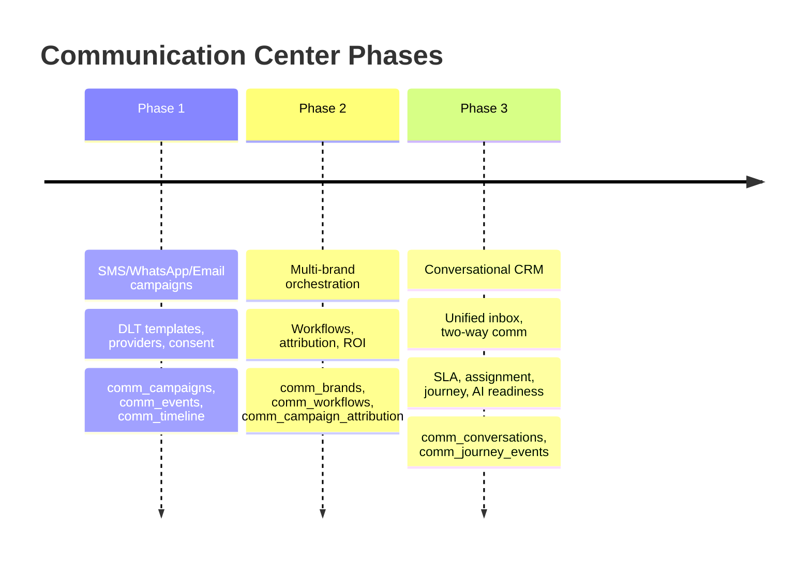
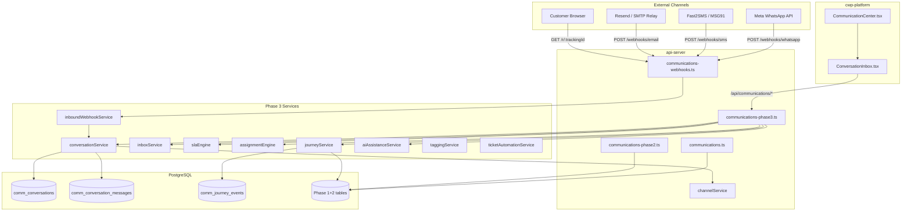
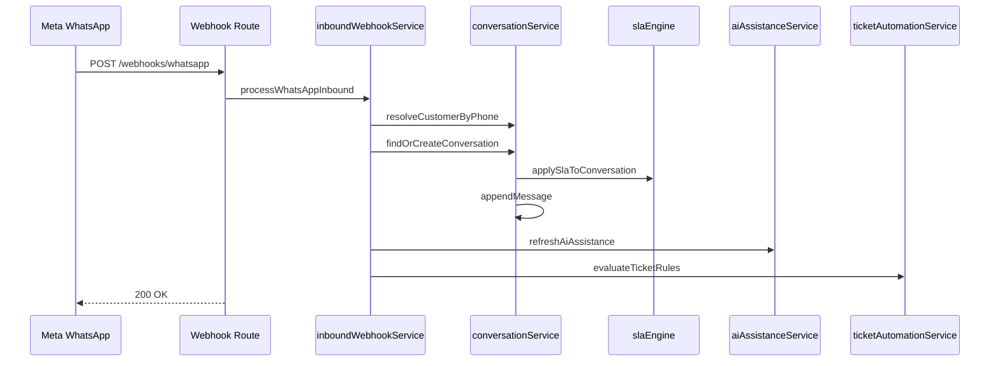
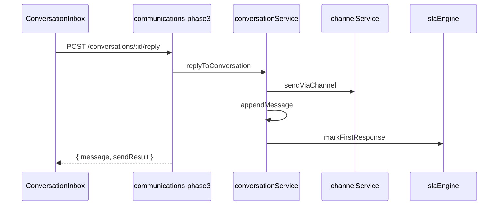

# Communication Center Phase 3 — Conversational CRM Architecture

Phase 3 extends the Communication Center from outbound campaign orchestration (Phase 1) and multi-brand workflow automation (Phase 2) into a full **Conversational CRM**: unified inbox, two-way messaging, SLA management, agent assignment, customer journey timeline, AI-readiness layer, and CRM analytics. This document describes the system architecture as implemented in the codebase.

---

## Table of Contents

1. [Executive Summary](#executive-summary)
2. [Phase Evolution](#phase-evolution)
3. [System Context](#system-context)
4. [Layered Architecture](#layered-architecture)
5. [Core Modules](#core-modules)
6. [Data Flow Overview](#data-flow-overview)
7. [API Surface](#api-surface)
8. [Frontend Integration](#frontend-integration)
9. [Backward Compatibility](#backward-compatibility)
10. [Deployment Topology](#deployment-topology)
11. [Extension Points](#extension-points)

---

## Executive Summary

Phase 3 introduces **conversation-centric** data models and services on top of existing `comm_*` tables from Phases 1 and 2. Key capabilities:

| Capability | Primary Service | Storage |
|------------|-----------------|---------|
| Unified inbox | `inboxService` | `comm_conversations` |
| Two-way messaging | `conversationService` | `comm_conversation_messages` |
| Inbound webhooks | `inboundWebhookService` | Messages + conversations |
| Auto-assignment | `assignmentEngine` | `comm_teams` |
| SLA tracking | `slaEngine` | `comm_sla_policies` |
| Smart tags | `taggingService` | `comm_conversation_tags` |
| AI placeholders | `aiAssistanceService` | `comm_ai_assistance` |
| Customer journey | `journeyService` | `comm_journey_events` |
| Link tracking | `linkTrackingService` | `comm_link_tracking` |
| CRM analytics | Multiple services | `comm_channel_costs`, `comm_agent_metrics`, `comm_csat_responses` |
| Auto tickets | `ticketAutomationService` | `comm_ticket_rules` → `complaints` |
| Knowledge base | `knowledgeBaseService` | `comm_knowledge_base` |

---

## Phase Evolution



Phase 3 **does not replace** Phase 1/2 tables. Outbound campaigns continue to write to `comm_events` and `comm_timeline`. Phase 3 **reads** those tables when building the unified customer journey via `syncJourneyFromPlatformEvents`.

---

## System Context



---

## Layered Architecture

### 1. Presentation Layer

- **`CommunicationCenter.tsx`** — Tabbed admin UI; Phase 3 inbox lives in the **Inbox** tab.
- **`ConversationInbox.tsx`** — Three-column layout: filters, conversation list, thread detail with AI panel.
- **`api.ts`** — Typed `commApi` client for all Phase 3 endpoints.

### 2. API / Route Layer

| Router | Mount | Auth |
|--------|-------|------|
| `communications-phase3.ts` | `/api/communications/*` | `guardResource("communications")` |
| `communications-webhooks.ts` | `/api/webhooks/*`, `/api/r/:id` | Public (webhook verification for WhatsApp) |

Routes are registered in `artifacts/api-server/src/routes/index.ts` alongside Phase 1 and Phase 2 routers under the same `communications` permission guard.

### 3. Service Layer

Services live in `artifacts/api-server/src/lib/communications/`. Each service owns a bounded domain:

- **Conversation lifecycle** — `conversationService` (create, append, reply, close, notes)
- **Inbox queries** — `inboxService` (filtered lists, counts)
- **Inbound processing** — `inboundWebhookService` (WhatsApp, SMS, email)
- **Operational** — `slaEngine`, `assignmentEngine`, `taggingService`
- **Intelligence (placeholder)** — `aiAssistanceService`
- **Analytics** — `profitabilityService`, `teamPerformanceService`, `csatService`, `linkTrackingService`
- **Automation** — `ticketAutomationService`, `journeyService`, `knowledgeBaseService`

### 4. Data Layer

- **Drizzle schema** — `lib/db/src/schema/communications-phase3.ts`
- **SQL migration** — `lib/db/migrations/003_comm_phase3_conversational_crm.sql`
- Reuses `comm_channel` enum from `communications.ts` (Phase 1)

---

## Core Modules

### Unified Inbox

All channels converge into `comm_conversations`. A conversation is keyed by:

- `customer_id` + `primary_channel` (WhatsApp/SMS)
- `email_thread_id` (email threading)
- Unknown contacts via `is_unknown_contact`, `unknown_phone`, `unknown_email`

### Two-Way Communication

**Inbound:** Webhooks → `findOrCreateConversation` → `appendMessage` → auto-tag, AI refresh, ticket evaluation.

**Outbound:** Agent reply → `sendViaChannel` (Phase 1 channel service) → `appendMessage` → SLA first-response mark → journey event.

### Assignment & Teams

Default teams seeded on first use: Solar, Service, Sales, Support. Keyword-based auto-assignment runs at conversation creation. Manual assignment via API overrides team/user.

### SLA Engine

Default policy: 30 min first response, 1440 min resolution, 80% warning threshold. Statuses: `within_sla`, `warning`, `breached`.

### Journey Timeline

`comm_journey_events` records cross-channel customer events. Merged with Phase 1 `comm_timeline` in `getCustomerJourney` for a single chronological feed.

---

## Data Flow Overview

### Inbound WhatsApp Message



### Agent Reply



---

## API Surface

Phase 3 adds these endpoint groups (all under authenticated `/api`):

| Group | Key Endpoints |
|-------|---------------|
| Inbox | `GET /communications/inbox`, `GET /communications/inbox/counts` |
| Conversations | `GET/POST /communications/conversations/:id/*` |
| Journey | `GET /communications/journey/customer/:customerId` |
| SLA | `GET /communications/sla/dashboard` |
| Teams | `GET /communications/teams` |
| Links | `POST /communications/links/track`, `GET /communications/links/stats/:campaignId` |
| Profitability | `GET /communications/profitability`, `POST /communications/campaigns/:id/profitability` |
| Performance | `GET /communications/performance/team`, `POST /communications/performance/compute` |
| CSAT | `GET /communications/csat/dashboard`, `POST /communications/csat/:conversationId` |
| Knowledge Base | `GET/POST /communications/knowledge-base` |
| CRM Analytics | `GET /communications/crm/analytics` |

Public webhooks (no auth):

| Endpoint | Purpose |
|----------|---------|
| `GET/POST /webhooks/whatsapp` | Meta verification + inbound |
| `POST /webhooks/sms` | SMS provider callback |
| `POST /webhooks/email` | Email relay inbound |
| `GET /r/:trackingId` | Campaign link redirect |

---

## Frontend Integration

`CommunicationCenter.tsx` renders a tabbed interface. The **Inbox** tab mounts `ConversationInbox`:

- **Left column** — Filter buttons (`all`, `my_queue`, `unassigned`, `assigned`, `escalated`, `unknown`, `closed`) plus open/SLA breach counters.
- **Center column** — Paginated conversation list with channel badge, status, SLA indicator.
- **Right column** — Message thread, internal notes (dashed yellow border), AI suggestion panel, reply composer.

React Query keys: `comm-inbox-counts`, `comm-inbox`, `comm-conversation`, `comm-ai`.

---

## Backward Compatibility

| Phase 1/2 Asset | Phase 3 Relationship |
|-----------------|----------------------|
| `comm_events` | Profitability reads sent counts; journey sync reads timeline |
| `comm_timeline` | Merged into customer journey view |
| `comm_campaigns` | Link tracking and profitability reference `campaign_id` |
| `comm_campaign_attribution` | Revenue source for profitability reports |
| `channelService` | Outbound replies reuse Phase 1 send infrastructure |
| `complaints` table | Auto-tickets insert into existing complaints module |
| `customers` / `leads` | Phone resolution links inbound to CRM records |

No Phase 1/2 routes were removed. Phase 3 routers are additive mounts in `routes/index.ts`.

---

## Deployment Topology

On Render (or similar):

1. **Web service** — `api-server` binds `0.0.0.0:$PORT`; serves API + webhook routes.
2. **Static site / SPA** — `cwp-platform` proxies `/api` to backend.
3. **PostgreSQL** — Run migration `003_comm_phase3_conversational_crm.sql` before deploy.
4. **Environment variables** — `WHATSAPP_VERIFY_TOKEN` for Meta webhook verification (default: `cwp_verify`).

Webhook URLs to configure with providers:

```
https://<api-host>/api/webhooks/whatsapp?companyId=<id>
https://<api-host>/api/webhooks/sms?companyId=<id>
https://<api-host>/api/webhooks/email?companyId=<id>
```

Campaign tracked links use:

```
https://<api-host>/api/r/<trackingId>
```

---

## Extension Points

| Area | Current State | Future Integration |
|------|---------------|-------------------|
| AI assistance | Rule-based sentiment/intent | Replace `refreshAiAssistance` with LLM provider |
| Agent metrics | `avgResponseTimeSec` stubbed to 0 | Compute from message timestamps |
| User assignment | Manual + team auto-assign | Round-robin / load-based routing |
| Real-time inbox | Polling via React Query | WebSocket / SSE push |
| CSAT delivery | Survey URL returned on close | WhatsApp/SMS survey message via channelService |
| Email threading | Basic `email_thread_id` | Full MIME threading with `inReplyTo` |

---

## Related Documentation

- [Conversation Engine](./COMMUNICATION_CENTER_CONVERSATION_ENGINE.md)
- [Inbox Module](./COMMUNICATION_CENTER_INBOX_MODULE.md)
- [Database Schema Phase 3](./COMMUNICATION_CENTER_DATABASE_SCHEMA_PHASE3.md)
- [Migration Plan Phase 3](./COMMUNICATION_CENTER_MIGRATION_PLAN_PHASE3.md)
- [Security Model Phase 3](./COMMUNICATION_CENTER_SECURITY_MODEL_PHASE3.md)
- [Phase 2 Architecture](./COMMUNICATION_CENTER_PHASE2_ARCHITECTURE.md)
