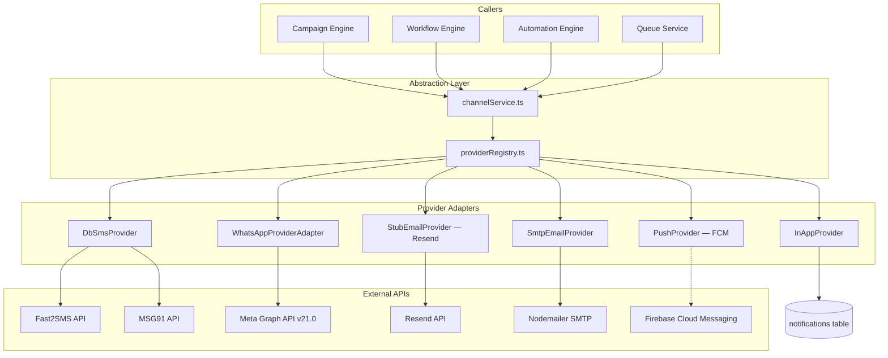
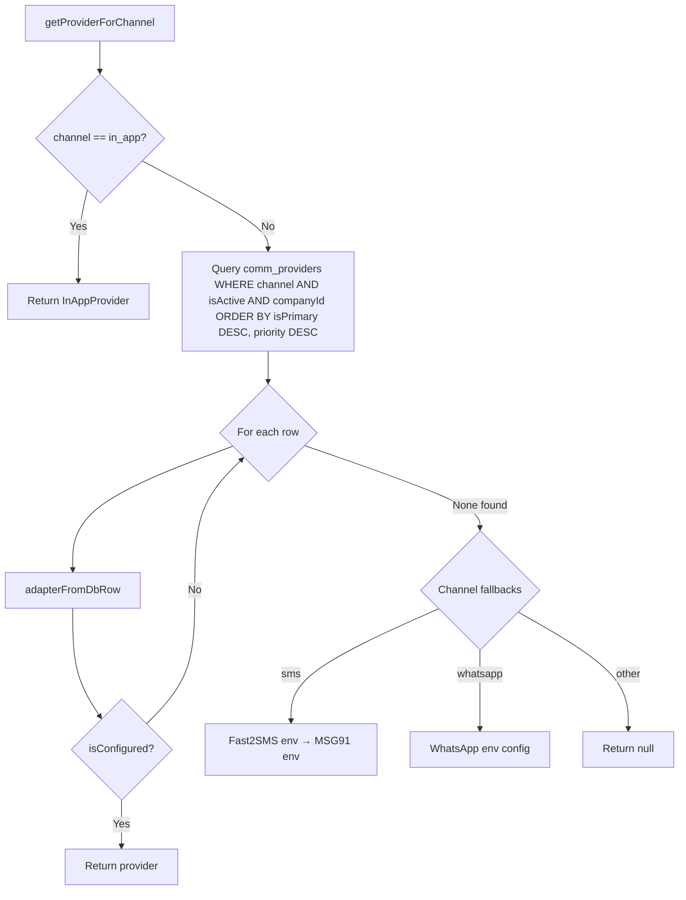

# Communication Center — Provider Architecture

Provider abstraction layer for SMS, WhatsApp, Email, and Push delivery. Documents the adapter pattern, configuration model, and integrations with Fast2SMS, MSG91, Meta WhatsApp Business, Resend, SMTP, and Firebase FCM.

---

## Table of Contents

1. [Design Principles](#design-principles)
2. [Architecture Diagram](#architecture-diagram)
3. [Interface Contracts](#interface-contracts)
4. [Provider Registry](#provider-registry)
5. [Channel Service Layer](#channel-service-layer)
6. [SMS Providers](#sms-providers)
7. [WhatsApp Provider](#whatsapp-provider)
8. [Email Providers](#email-providers)
9. [Push Provider](#push-provider)
10. [In-App Channel](#in-app-channel)
11. [Configuration Model](#configuration-model)
12. [Provider Selection Logic](#provider-selection-logic)
13. [Adding a New Provider](#adding-a-new-provider)

---

## Design Principles

1. **Campaign engine never calls providers directly** — all sends go through `channelService.sendViaChannel()`
2. **DB-configured providers** — switch providers per tenant/brand without code deploys
3. **Env fallbacks** — development works without DB provider rows
4. **Priority-based selection** — `is_primary` and `priority` determine provider order
5. **Secrets redacted in API** — provider list endpoint returns `configKeys` only

---

## Architecture Diagram



---

## Interface Contracts

Defined in `channels/types.ts`:

### ChannelSendPayload

```typescript
{
  phone?: string;
  email?: string;
  message: string;
  subject?: string;
  dltTemplateId?: string;
  senderId?: string;
  companyId?: number | null;
  brandId?: number | null;
  whatsappTemplateName?: string;
  whatsappTemplateLanguage?: string;
  whatsappVariables?: Record<string, string>;
  whatsappMessageType?: "template" | "text" | "utility" | "service";
  pushToken?: string;
  metadata?: Record<string, unknown>;
}
```

### ChannelSendResult

```typescript
{
  success: boolean;
  externalId?: string;
  error?: string;
  timelineEvents?: Array<{ type: string; at: string }>;
}
```

### Provider Interfaces

| Interface | Methods |
|-----------|---------|
| `SmsProvider` | `name`, `isConfigured()`, `send(payload)` |
| `WhatsappProvider` | `name`, `isConfigured()`, `send(payload)` |
| `EmailProvider` | `name`, `isConfigured()`, `send(payload)` |
| `PushProvider` | `name`, `isConfigured()`, `send(payload)` |

The runtime implementation uses `CommChannelProvider` in `providerRegistry.ts` with a unified `send(opts: SendOptions)` signature.

---

## Provider Registry

**File:** `artifacts/api-server/src/lib/communications/providerRegistry.ts`

### CommChannelProvider Interface

```typescript
interface CommChannelProvider {
  readonly name: string;
  readonly channel: string;
  isConfigured(): boolean;
  send(opts: SendOptions): Promise<SmsSendResult>;
}
```

### DB Row → Adapter Mapping

| `provider_type` | Adapter Class | External Service |
|-----------------|---------------|------------------|
| `fast2sms` | `DbSmsProvider` + `Fast2SmsAdapter` | Fast2SMS DLT API |
| `msg91` | `DbSmsProvider` + `Msg91Adapter` | MSG91 API |
| `resend` | `StubEmailProvider` | Resend REST API |
| `smtp` | `SmtpEmailProvider` | SMTP via Nodemailer |
| `whatsapp_business` | `WhatsAppProviderAdapter` | Meta Graph API |
| `firebase` | `PushProvider` | FCM (stub) |
| (implicit) | `InAppProvider` | Internal notifications |

### Public Functions

| Function | Purpose |
|----------|---------|
| `getProviderForChannel(channel, companyId)` | Select best configured provider |
| `sendViaProvider(channel, opts, companyId)` | Send via selected provider |

---

## Channel Service Layer

**File:** `artifacts/api-server/src/lib/communications/channels/channelService.ts`

```typescript
export async function sendViaChannel(
  channel: CommChannel,
  payload: ChannelSendPayload,
): Promise<ChannelSendResult>
```

Routing:

| Channel | Path |
|---------|------|
| `in_app` | Direct DB insert (requires `metadata.userId`) |
| Others | `getProviderForChannel()` → `provider.send()` |

Also exports `isChannelConfigured(channel, companyId)` for UI readiness checks.

---

## SMS Providers

### Fast2SMS Adapter

**File:** `artifacts/api-server/src/lib/notifications/channels/sms.ts`

**DB config keys:**

| Key | Env Fallback |
|-----|--------------|
| `apiKey` | `FAST2SMS_API_KEY` |
| `senderId` | `FAST2SMS_SENDER_ID` |
| `templateId` | `FAST2SMS_TEMPLATE_ID` |

When a DB provider row is loaded, config values are injected into `process.env` before adapter instantiation.

**Usage:** Primary SMS provider for Indian DLT-compliant messaging.

### MSG91 Adapter

**DB config keys:**

| Key | Env Fallback |
|-----|--------------|
| `authKey` | `MSG91_AUTH_KEY` |
| `senderId` | `MSG91_SENDER_ID` |

**Usage:** Fallback SMS provider when Fast2SMS is unavailable.

### DbSmsProvider Wrapper

```typescript
class DbSmsProvider implements CommChannelProvider {
  async send(opts: SendOptions): Promise<SmsSendResult> {
    if (!opts.phone) return { success: false, error: "No phone number" };
    return this.adapter.sendSms(opts.phone, opts.message);
  }
}
```

DLT template ID and sender ID are passed through campaign engine payload as `dltTemplateId` and `senderId`.

---

## WhatsApp Provider

**File:** `artifacts/api-server/src/lib/communications/providers/whatsappProvider.ts`

### WhatsAppBusinessProvider

Meta Cloud API integration using Graph API v21.0.

**Config / Env:**

| Key | Env Variable |
|-----|--------------|
| `accessToken` | `WHATSAPP_ACCESS_TOKEN` |
| `phoneNumberId` | `WHATSAPP_PHONE_NUMBER_ID` |

### Message Types

| Type | API Payload |
|------|-------------|
| `template` | Meta template message with variable components |
| `text` | Free-form text (within 24h window) |
| `utility` | Text with `preview_url: false` |
| `service` | Text for service conversations |

### Phone Normalization

Indian numbers normalized to 12-digit format with `91` prefix:

- `9876543210` → `919876543210`
- Already prefixed numbers preserved

### Template Components

Variables passed as ordered body parameters:

```typescript
buildTemplateComponents({ customerName: "Raj", amountDue: "2500" })
// → [{ type: "body", parameters: [{ type: "text", text: "Raj" }, ...] }]
```

### Timeline Events

WhatsApp sends emit timeline events:

- `whatsapp_sent`, `whatsapp_delivered` (on success)
- `whatsapp_failed` (on error)

### Webhook Status Parser

```typescript
WhatsAppBusinessProvider.parseWebhookStatus(payload)
// → { messageId, status: "delivered" | "read" | "failed" }
```

For future webhook route integration to update `comm_events` read/delivery status.

### WhatsAppProviderAdapter

Wraps `WhatsAppBusinessProvider` for the registry:

```typescript
return this.provider.send({
  phone: opts.phone,
  message: opts.message,
  messageType: opts.whatsappMessageType ?? (opts.whatsappTemplateName ? "template" : "text"),
  templateName: opts.whatsappTemplateName,
  templateLanguage: opts.whatsappTemplateLanguage ?? "en",
  templateVariables: opts.whatsappVariables,
});
```

---

## Email Providers

### Resend (StubEmailProvider)

Direct REST integration — no SDK required.

**Config:**

| Key | Env Fallback |
|-----|--------------|
| `apiKey` | `RESEND_API_KEY` |
| `from` | Default: `CWP Detailers <noreply@cwpdetailers.com>` |

**API call:**

```
POST https://api.resend.com/emails
Authorization: Bearer {apiKey}
{
  "from": "...",
  "to": ["recipient@example.com"],
  "subject": "...",
  "html": "..."
}
```

Returns Resend message `id` as `externalId`.

### SMTP (SmtpEmailProvider)

Uses Nodemailer when installed (`npm install nodemailer`).

**Config keys:**

| Key | Description |
|-----|-------------|
| `host` | SMTP server hostname |
| `port` | Port (default 587) |
| `secure` | `"true"` for TLS |
| `user`, `pass` | Authentication |
| `from` | Sender address |

**Provider type enum:** `smtp` (added in Phase 2 migration)

Returns Nodemailer `messageId` as `externalId`.

---

## Push Provider

### PushProvider (FCM Stub)

**Provider type:** `firebase`

**Config:**

| Key | Env Fallback |
|-----|--------------|
| `serverKey` | `FCM_SERVER_KEY` |

**Current status:** Returns `{ success: false, error: "Push notifications require device token registration (future)" }`.

The `ChannelSendPayload.pushToken` field is reserved for future FCM integration. `push_consent` is tracked in `comm_customer_consents` (Phase 2).

---

## In-App Channel

Not a traditional provider — handled directly in `channelService`:

```typescript
await db.insert(notificationsTable).values({
  userId: payload.metadata.userId,
  title: payload.subject ?? "Notification",
  message: payload.message,
  type: "broadcast",
  channel: "in_app",
  deliveryStatus: "sent",
});
```

Requires `metadata.userId` from recipient context. Used by Phase 1 automations and synchronous in-app campaign sends.

---

## Configuration Model

### Database Table: `comm_providers`

```json
{
  "name": "CWP Primary SMS",
  "providerType": "fast2sms",
  "channel": "sms",
  "brandId": 1,
  "config": {
    "apiKey": "xxxx",
    "senderId": "CWPDBL"
  },
  "isActive": true,
  "isPrimary": true,
  "priority": 10,
  "companyId": 1
}
```

### Environment Variables (Fallbacks)

| Variable | Provider |
|----------|----------|
| `FAST2SMS_API_KEY` | SMS |
| `FAST2SMS_SENDER_ID` | SMS |
| `MSG91_AUTH_KEY` | SMS fallback |
| `WHATSAPP_ACCESS_TOKEN` | WhatsApp |
| `WHATSAPP_PHONE_NUMBER_ID` | WhatsApp |
| `RESEND_API_KEY` | Email |
| `FCM_SERVER_KEY` | Push (future) |
| `REDIS_URL` | Queue (not provider) |

---

## Provider Selection Logic



Selection priority:

1. DB providers for tenant (`company_id` match)
2. Active + configured, ordered by `is_primary DESC, priority DESC`
3. Environment-based fallbacks for SMS and WhatsApp only
4. `null` → send fails with `"No configured provider for {channel}"`

---

## Adding a New Provider

1. **Add enum value** to `comm_provider_type` in schema + migration
2. **Create adapter class** implementing `CommChannelProvider`
3. **Register in `adapterFromDbRow()`** switch statement
4. **Add config key documentation** for admin UI
5. **Test** via `POST /communications/providers` and campaign test send

Example stub:

```typescript
case "twilio":
  return new TwilioSmsProvider(row.name, config);
```

Ensure the campaign engine passes channel-specific fields through `ChannelSendPayload` without modification.

---

## Provider Comparison Matrix

| Provider | Channel | DLT Required | Template Required | Consent Required | Status |
|----------|---------|--------------|-------------------|------------------|--------|
| Fast2SMS | SMS | Yes | Yes | SMS consent | Production |
| MSG91 | SMS | Yes | Yes | SMS consent | Production |
| Meta WA | WhatsApp | N/A | Meta-approved | WhatsApp consent | Production |
| Resend | Email | N/A | Optional | Email consent | Production |
| SMTP | Email | N/A | Optional | Email consent | Production |
| Firebase | Push | N/A | N/A | Push consent | Planned |
| In-App | in_app | N/A | N/A | No | Production |

---

*Last updated: June 2026 — Communication Center Provider Architecture*
