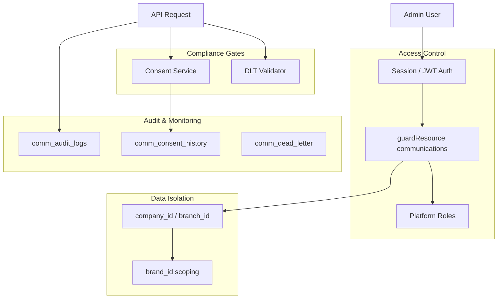
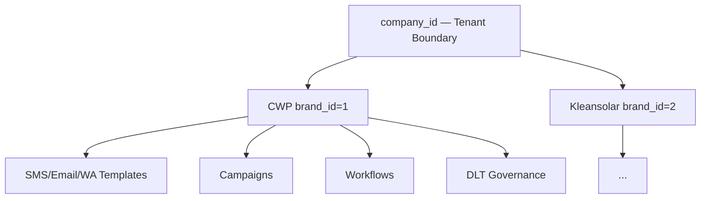

# Communication Center — Security Model

Security architecture for Communication Center Phase 2: role-based access control, brand isolation, consent enforcement, DLT governance, and audit trail. Maps conceptual operational roles to the platform's implemented permission system.

---

## Table of Contents

1. [Security Overview](#security-overview)
2. [Role Definitions](#role-definitions)
3. [Permission Matrix](#permission-matrix)
4. [Platform Role Mapping](#platform-role-mapping)
5. [API Authorization](#api-authorization)
6. [Brand Isolation](#brand-isolation)
7. [Tenant Isolation](#tenant-isolation)
8. [Consent & Compliance](#consent--compliance)
9. [DLT Governance Security](#dlt-governance-security)
10. [Audit Trail](#audit-trail)
11. [Secret Management](#secret-management)
12. [Operational Security Checklist](#operational-security-checklist)

---

## Security Overview



Communication Center security operates at four layers:

1. **Authentication** — Standard platform session (same as admin routes)
2. **Authorization** — RBAC via `communications` resource permissions
3. **Data isolation** — Multi-tenant (`company_id`) + multi-brand (`brand_id`)
4. **Compliance** — Consent checks + DLT validation before SMS send

---

## Role Definitions

Phase 2 defines four conceptual operational roles for Communication Center teams. These map to the platform's existing RBAC roles and permission actions.

### Communication Admin

**Purpose:** Full control over Communication Center configuration, providers, DLT governance, brands, and workflows.

**Capabilities:**

- Create/edit/delete brands, providers, DLT entities and templates
- Configure workflow automations and campaign recurrence
- View audit logs and dead-letter queue
- Process job queues and manage retries
- Access all brands within tenant

**Risk level:** High — can configure external integrations and send mass communications.

### Campaign Manager

**Purpose:** Create and execute marketing/transactional campaigns without infrastructure access.

**Capabilities:**

- Create audiences, templates (non-governance), campaigns
- Schedule and send campaigns
- Preview audiences and message content
- View campaign analytics, attribution, and ROI
- Create/edit workflows (send steps only)

**Restrictions:**

- Cannot modify provider credentials
- Cannot approve DLT governance templates
- Cannot delete audit logs

### Support Agent

**Purpose:** Customer-facing communication support — view timelines, manage consent, send test messages.

**Capabilities:**

- View customer communication timeline
- Read/update customer consent preferences
- View consent history
- Send WhatsApp test messages (with approval)
- View campaign status (read-only)

**Restrictions:**

- Cannot launch mass campaigns
- Cannot modify providers, brands, or workflows
- Cannot access dead-letter queue management

### Viewer

**Purpose:** Read-only access for reporting and oversight.

**Capabilities:**

- View dashboard analytics and timeline analytics
- View campaign list and status
- View audit logs (read-only)
- View queue stats

**Restrictions:**

- No create, edit, or send operations

---

## Permission Matrix

Communication Center uses the `communications` resource with four actions:

| Action | HTTP Mapping | Description |
|--------|--------------|-------------|
| `view` | GET | Read campaigns, timelines, analytics, audit logs |
| `create` | POST | Create templates, campaigns, audiences, test sends |
| `edit` | PUT/PATCH/POST* | Update resources, send campaigns, process jobs |
| `delete` | DELETE | Remove resources (not widely exposed in comm routes) |

*Specific POST endpoints mapped to `edit` — see [API Authorization](#api-authorization).

### Conceptual Role → Permission Mapping

| Capability | Communication Admin | Campaign Manager | Support Agent | Viewer |
|------------|:------------------:|:----------------:|:-------------:|:------:|
| View dashboard/analytics | ✓ | ✓ | ✓ | ✓ |
| View customer timeline | ✓ | ✓ | ✓ | ✓ |
| View audit logs | ✓ | ✓ | — | ✓ |
| Create audiences/campaigns | ✓ | ✓ | — | — |
| Send/schedule campaigns | ✓ | ✓ | — | — |
| Create workflows | ✓ | ✓ | — | — |
| Manage consent | ✓ | ✓ | ✓ | — |
| View consent history | ✓ | ✓ | ✓ | — |
| WhatsApp test send | ✓ | ✓ | ✓* | — |
| Manage providers | ✓ | — | — | — |
| Manage brands | ✓ | — | — | — |
| DLT governance templates | ✓ | — | — | — |
| Process job/queue | ✓ | ✓ | — | — |
| Dead-letter management | ✓ | — | — | — |
| Delete resources | ✓ | — | — | — |

*Support Agent test sends should be limited by operational policy (rate limits, approval workflow — not yet enforced in code).

---

## Platform Role Mapping

The platform implements RBAC via `permissions` table seeded by `scripts/src/seed-permissions.ts`. Map conceptual roles to platform roles:

| Conceptual Role | Platform Role(s) | communications Permissions |
|-----------------|------------------|----------------------------|
| Communication Admin | `admin`, `superadmin` | view, create, edit, delete |
| Campaign Manager | `manager` | view, create, edit |
| Support Agent | Custom* | view, edit (consent only) |
| Viewer | Custom* | view |

*Support Agent and Viewer require custom permission rows — not in default seed.

### Default Seed (Implemented)

```typescript
// admin / superadmin
communications: ["view", "create", "edit", "delete"]

// manager
communications: ["view", "create", "edit"]

// franchisee
communications: ["view", "create"]

// staff, customer
// (no communications permissions)
```

### UI Route Guard

Communication Center page (`/admin/communications`):

```typescript
roles={["admin", "superadmin", "manager"]}
permission={{ resource: "communications", action: "view" }}
```

Admin sidebar link requires `communications:view`.

### Implementing Custom Roles

To add Support Agent or Viewer roles, insert permission rows:

```sql
INSERT INTO permissions (role, resource, action, allow) VALUES
  ('support_agent', 'communications', 'view', true),
  ('support_agent', 'communications', 'edit', true),
  ('comm_viewer', 'communications', 'view', true);
```

Then extend `ProtectedRoute` and sidebar `perm` checks to include the new role.

---

## API Authorization

All Communication Center routes are mounted with `guardResource("communications")` in `routes/index.ts`.

### Method → Action Default

| HTTP Method | Permission Action |
|-------------|-------------------|
| GET | view |
| POST | create |
| PUT, PATCH | edit |
| DELETE | delete |

### Endpoint Overrides

Non-CRUD POST endpoints with custom action mapping:

| Endpoint Pattern | Method | Action |
|------------------|--------|--------|
| `/campaigns/:id/send` | POST | edit |
| `/campaigns/:id/schedule` | POST | edit |
| `/campaigns/preview` | POST | view |
| `/audiences/preview` | POST | view |
| `/jobs/process` | POST | edit |
| `/queue/process` | POST | edit |
| `/whatsapp/test-send` | POST | create |
| `/consents/:customerId` | PUT | edit |
| `/smart-segments/preview` | POST | view |
| `/campaigns/:id/attribution` | GET | view |

Unauthorized requests receive `403 Forbidden` from the permission middleware.

---

## Brand Isolation

Phase 2 introduces `brand_id` scoping across communication resources.

### Isolation Model



### Enforcement Points

| Layer | Mechanism |
|-------|-----------|
| API queries | `tenantFilters(req, { companyCol })` on all list endpoints |
| Brand-filtered endpoints | Optional `?brandId=` query parameter |
| DLT validation | Templates must match `(brand_id, template_id)` in `comm_dlt_templates` |
| Campaign send | `resolveBrandId(campaign.brandId, companyId)` |
| Workflow execution | Uses `workflow.brandId` for all send steps |
| Audit logs | `brandId` recorded on brand-scoped actions |
| Timeline | Filterable by `brandId` on customer timeline API |

### Cross-Brand Restrictions

- DLT governance templates are unique per `(brand_id, template_id)`
- WhatsApp templates are unique per `(brand_id, meta_template_name, language)`
- Workflows require `brand_id` — cannot create brand-less workflows
- A Campaign Manager for Brand A should only receive `brandId=1` in UI filters (UI enforcement — API accepts any brand within tenant)

### Recommended Policy

Assign users to brand scopes via operational policy or future `user_brand_access` table (not yet implemented). Until then, all users with `communications:edit` can access all brands within their company.

---

## Tenant Isolation

All Communication Center tables include `company_id`. Middleware enforces:

- `tenantFilters()` — WHERE clauses on read operations
- `tenantStamp()` — Sets `company_id` on create operations
- Branch-scoped resources also filter by `branch_id` where applicable (campaigns, audiences, automations, events)

Cross-tenant data access is prevented at the query layer. Provider credentials stored in `comm_providers.config` are tenant-scoped.

Global brands (`company_id IS NULL`) are readable by all tenants but tenant-specific brand overrides can be created via `POST /communications/brands`.

---

## Consent & Compliance

### Consent Channels

Tracked in `comm_customer_consents`:

| Field | Channel |
|-------|---------|
| `sms_consent` | SMS |
| `whatsapp_consent` | WhatsApp |
| `email_consent` | Email |
| `push_consent` | Push (Phase 2) |

### Consent Enforcement

Campaign engine (`campaignEngine.ts`):

1. Loads consents in batch (5000 IDs per query)
2. Skips recipients without consent → event status `consent_blocked`
3. Analytics track consent-blocked count

DLT validator (`dltValidator.ts`):

- SMS sends blocked if `sms_consent` is false
- Audit: `dlt.validation.block` with step `consent`

### Consent History

Phase 2 records every consent change in `comm_consent_history`:

- Previous and new consent values
- `changed_by` (user ID)
- `consent_ip` (DPDP audit trail)
- `consent_source`

API: `GET /communications/consents/:customerId/history`

### Regulatory Alignment

| Regulation | Implementation |
|------------|----------------|
| TRAI DLT | DLT entity → header → template validation chain |
| DPDP (India) | Consent tracking, IP logging, consent history |
| Meta WhatsApp Policy | Template-only outbound; category tracking in `comm_whatsapp_templates` |

---

## DLT Governance Security

SMS sends require passing the full validation chain (see Architecture doc):

1. Brand must be set
2. DLT template ID must exist in `comm_dlt_templates` with `status: approved`
3. Header must be active
4. Entity must be active
5. Template type must match
6. SMS consent must be granted

Every validation attempt is audited:

- Pass: `dlt.validation.pass`
- Block: `dlt.validation.block` with `step` and `error`

Only Communication Admin role should create/modify DLT governance templates.

---

## Audit Trail

### Audit Table: `comm_audit_logs`

| Field | Purpose |
|-------|---------|
| `action` | Dot-notation event type |
| `resource` | Entity type |
| `resource_id` | Entity ID |
| `user_id` | Acting user |
| `brand_id` | Brand context (Phase 2) |
| `company_id` | Tenant |
| `payload` | Action-specific JSON context |
| `created_at` | Timestamp |

### Audited Actions

| Action | Trigger |
|--------|---------|
| `dlt_entity.create` | DLT entity created |
| `template.create` | Message template created |
| `provider.create` | Provider configured |
| `campaign.create` | Campaign created |
| `campaign.launch` | Campaign sent |
| `consent.update` | Customer consent changed |
| `segment.create` | Smart segment created |
| `whatsapp.test_send` | Test WhatsApp sent |
| `dlt.validation.pass` | DLT check passed |
| `dlt.validation.block` | DLT check blocked |
| `brand.create`, `brand.update` | Brand management |
| `dlt_template.create` | Governance template created |
| `email_template.create` | Email template created |
| `whatsapp_template.create` | WhatsApp template created |
| `workflow.create` | Workflow created |
| `workflow.send_sms`, etc. | Workflow step stubs |
| `automation.trigger` | Phase 1 automation fired |

### Audit Access

- API: `GET /communications/audit-logs` (last 100 entries)
- Recommended: Communication Admin and Viewer roles only
- Logs are append-only (no delete endpoint)

---

## Secret Management

### Provider Credentials

Stored in `comm_providers.config` JSONB column.

**API exposure:** List endpoint redacts values:

```json
{
  "configKeys": ["apiKey", "senderId"],
  "hasConfig": true
}
```

**Production recommendations:**

- Store secrets in Render environment variables, reference by key name in config
- Rotate API keys via provider dashboard + DB update
- Never commit credentials to git
- Use Render Secret Files for SMTP passwords

### Environment Variables

| Variable | Sensitivity |
|----------|-------------|
| `FAST2SMS_API_KEY` | High |
| `WHATSAPP_ACCESS_TOKEN` | High |
| `RESEND_API_KEY` | High |
| `FCM_SERVER_KEY` | High |
| `REDIS_URL` | Medium (internal network) |
| `DATABASE_URL` | Critical |

On Render, use internal Key Value URL for `REDIS_URL` to avoid public exposure.

---

## Operational Security Checklist

### Deployment

- [ ] `DATABASE_URL` uses SSL connection
- [ ] Provider API keys in env vars, not committed config
- [ ] `REDIS_URL` uses internal Render network
- [ ] Cron endpoints protected with auth token
- [ ] Permissions seeded (`seed-permissions.ts`)

### Access Control

- [ ] Only admin/superadmin have provider management access
- [ ] Manager role cannot delete communications resources
- [ ] Staff/customer roles have no communications access
- [ ] Custom Support Agent role scoped if deployed

### Compliance

- [ ] DLT governance templates populated for all active SMS templates
- [ ] Consent collected at walk-in / website before marketing sends
- [ ] Consent history enabled (Phase 2 migration applied)
- [ ] WhatsApp templates Meta-approved before use

### Monitoring

- [ ] Review `comm_audit_logs` weekly
- [ ] Monitor `comm_dead_letter` for failed sends
- [ ] Track `consent_blocked` rate in campaign analytics
- [ ] Alert on spike in `dlt.validation.block` events

### Incident Response

1. Disable affected provider (`is_active = false`)
2. Cancel in-flight campaigns (`status = cancelled`)
3. Review audit logs for scope of impact
4. Rotate compromised API keys
5. Re-process dead-letter queue after fix

---

*Last updated: June 2026 — Communication Center Security Model*
