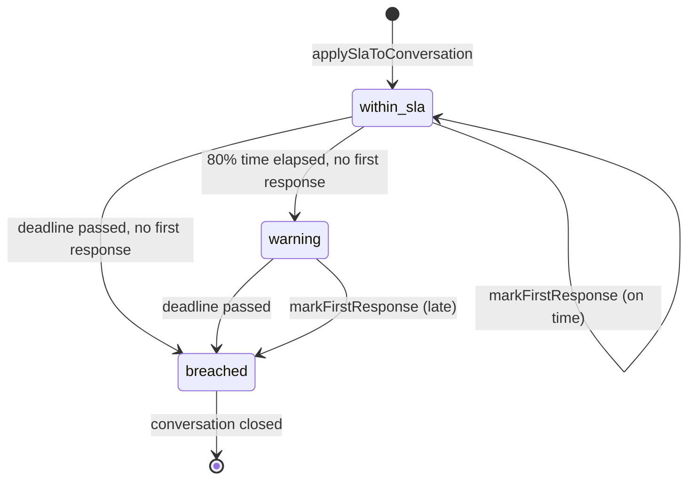

# Communication Center — SLA Engine

The SLA Engine tracks response-time commitments for Conversational CRM conversations. Implemented in `slaEngine.ts`, it applies policies at conversation creation, monitors first-response deadlines, escalates warnings, and feeds the inbox escalated filter and supervisor dashboards.

---

## Table of Contents

1. [Overview](#overview)
2. [SLA Policy Model](#sla-policy-model)
3. [Status Lifecycle](#status-lifecycle)
4. [Engine Functions](#engine-functions)
5. [Timing Calculations](#timing-calculations)
6. [Integration Points](#integration-points)
7. [Dashboard & Reporting](#dashboard--reporting)
8. [Ticket Automation](#ticket-automation)
9. [API Reference](#api-reference)
10. [Operational Runbook](#operational-runbook)
11. [Future Enhancements](#future-enhancements)

---

## Overview



SLA tracking operates at the **conversation** level, not per-message. Two deadlines are tracked:

| Deadline | Default | Field |
|----------|---------|-------|
| First response | 30 minutes | `first_response_due_at` |
| Resolution | 1440 minutes (24h) | `resolution_due_at` |

Current implementation actively enforces **first response SLA**. Resolution deadline is stored but not yet evaluated in `refreshSlaStatuses`.

---

## SLA Policy Model

**Table:** `comm_sla_policies`

| Column | Default | Description |
|--------|---------|-------------|
| `name` | "Default SLA" | Policy label |
| `first_response_minutes` | 30 | First agent reply window |
| `resolution_minutes` | 1440 | Full resolution window |
| `escalation_minutes` | 60 | Escalation threshold (reserved) |
| `warning_threshold_pct` | 80 | % of time elapsed before warning |
| `is_default` | true | Applied to new conversations |
| `company_id` | NULL | Tenant-specific override |

### Seeding

Policies are seeded by:

1. **Migration** — `003_comm_phase3_conversational_crm.sql` inserts default policy if none exists.
2. **Runtime** — `seedDefaultSlaPolicy(companyId)` creates tenant-specific default on demand.

```sql
INSERT INTO comm_sla_policies (name, first_response_minutes, resolution_minutes, is_default)
SELECT 'Default SLA', 30, 1440, true
WHERE NOT EXISTS (SELECT 1 FROM comm_sla_policies WHERE is_default = true AND company_id IS NULL);
```

---

## Status Lifecycle

**Enum:** `comm_sla_status` → `within_sla`, `warning`, `breached`

### Transitions

| From | To | Condition |
|------|-----|-----------|
| `within_sla` | `warning` | ≥80% of first-response window elapsed, no `first_response_at` |
| `within_sla` | `breached` | `first_response_due_at` passed, no `first_response_at` |
| `warning` | `breached` | `first_response_due_at` passed, no `first_response_at` |
| any | `within_sla` or `breached` | `markFirstResponse` — breached if reply after deadline |

Once `first_response_at` is set, `refreshSlaStatuses` no longer modifies that conversation's SLA status (filter requires `sla_status = within_sla`).

---

## Engine Functions

### `seedDefaultSlaPolicy(companyId?)`

Ensures a default policy exists for the tenant. Returns existing or newly created policy.

### `applySlaToConversation(conversationId)`

Called when a conversation is created. Steps:

1. Load conversation row.
2. Find default SLA policy for `company_id`.
3. Calculate `firstResponseDueAt = now + firstResponseMinutes * 60_000`.
4. Calculate `resolutionDueAt = now + resolutionMinutes * 60_000`.
5. Set `slaPolicyId`, `slaStatus: within_sla`.

### `markFirstResponse(conversationId)`

Called when an agent sends an outgoing message (`appendMessage` with `senderUserId`).

1. Skip if `first_response_at` already set.
2. Compare `now` vs `first_response_due_at`:
   - On time → `slaStatus: within_sla`
   - Late → `slaStatus: breached`
3. Set `first_response_at = now`.
4. Transition conversation `status` from `open` to `assigned` if currently `open`.

### `refreshSlaStatuses(companyId?)`

Batch job logic (called by SLA dashboard endpoint):

1. Select conversations with `sla_status = within_sla`.
2. For each with `first_response_due_at` set and no `first_response_at`:
   - Calculate `% time elapsed`.
   - If deadline passed → `breached`.
   - Else if ≥80% elapsed → `warning`.
3. Return `{ updated: count }`.

### `getSlaDashboard(companyId?)`

Aggregates from `getInboxCounts`:

```typescript
{
  openConversations: counts.open + counts.assigned,
  pendingReplies: counts.pendingReplies,
  slaBreaches: counts.slaBreaches,
  escalated: counts.escalated,
}
```

---

## Timing Calculations

### Warning Threshold

```typescript
const dueMs = firstResponseDueAt.getTime();
const remaining = dueMs - now.getTime();
const total = dueMs - createdAt.getTime();
const pctUsed = total > 0 ? 1 - remaining / total : 1;

if (pctUsed >= 0.8 && !firstResponseAt) → warning
if (remaining <= 0 && !firstResponseAt) → breached
```



```mermaid
gantt
    title First Response SLA Timeline (30 min default)
    dateFormat X
    axisFormat %M min

    section SLA Window
    within_sla     :0, 24
    warning (80%)  :24, 6
    breached       :30, 1
```

With default 30-minute SLA:

- **0–24 min** — `within_sla`
- **24–30 min** — `warning` (80% = 24 minutes)
- **30+ min** — `breached`

---

## Integration Points

| Caller | Function | When |
|--------|----------|------|
| `conversationService.findOrCreateConversation` | `applySlaToConversation` | New conversation |
| `conversationService.appendMessage` | `markFirstResponse` | Outgoing + `senderUserId` |
| `communications-phase3` SLA route | `refreshSlaStatuses` | Dashboard load |
| `inboxService.listInbox` | Reads `sla_status` | `escalated` filter |
| `ticketAutomationService` | Reads `sla_status` | `sla_breach` trigger |

### Inbox Escalated Filter

```typescript
case "escalated":
  conditions.push(or(
    eq(commConversationsTable.slaStatus, "breached"),
    eq(commConversationsTable.slaStatus, "warning"),
  ));
```

### UI Indicators

`ConversationInbox.tsx` shows destructive badge when `slaStatus !== "within_sla"`. Count card displays `slaBreaches` total.

---

## Dashboard & Reporting

### SLA Dashboard Endpoint

```
GET /api/communications/sla/dashboard
```

Refreshes statuses before returning aggregates. Suitable for supervisor monitoring.

### CRM Analytics Bundle

```
GET /api/communications/crm/analytics
```

Returns `{ inbox, sla, csat }` — single call for overview widgets.

### Inbox Counts

`slaBreaches` count:

```sql
count(*) filter (where sla_status = 'breached')
```

`escalated` count includes both `warning` and `breached` on active conversations.

---

## Ticket Automation

`ticketAutomationService` evaluates `sla_breach` trigger:

```typescript
if (rule.trigger === "sla_breach" && conv.slaStatus === "breached") match = true;
```

When matched, creates a complaint ticket in the existing `complaints` table and links via `conversation.complaint_id`.

Default rules do not include SLA breach — add via `comm_ticket_rules` for your tenant.

---

## API Reference

| Endpoint | Method | Auth | Description |
|----------|--------|------|-------------|
| `/communications/sla/dashboard` | GET | view | Refresh + return SLA aggregates |
| `/communications/crm/analytics` | GET | view | Combined inbox + SLA + CSAT |
| `/communications/inbox?filter=escalated` | GET | view | SLA warning/breach conversations |
| `/communications/inbox/counts` | GET | view | Includes `slaBreaches`, `escalated` |

No dedicated CRUD endpoints for SLA policies in Phase 3 — manage via direct database or future admin UI.

---

## Operational Runbook

### Monitoring SLA Health

1. Check `GET /communications/sla/dashboard` — watch `slaBreaches` trend.
2. Assign agents to `escalated` filter conversations.
3. Review `first_response_at` vs `first_response_due_at` for breached items.

### Adjusting Default SLA

```sql
UPDATE comm_sla_policies
SET first_response_minutes = 15, resolution_minutes = 480
WHERE is_default = true AND company_id = <tenant_id>;
```

New conversations pick up updated policy. Existing conversations retain original due timestamps.

### Scheduled Refresh

`refreshSlaStatuses` runs on dashboard access. For production, schedule a cron job:

```
POST /api/communications/sla/dashboard  (or internal cron calling refreshSlaStatuses)
```

Every 5 minutes ensures warning/breach transitions without waiting for supervisor page load.

---

## Future Enhancements

| Enhancement | Description |
|-------------|-------------|
| Resolution SLA | Evaluate `resolution_due_at` on close/pending transitions |
| Business hours | Pause SLA clock outside operating hours |
| Per-channel policies | Different SLAs for WhatsApp vs email |
| Per-priority policies | High-priority tags get shorter windows |
| Escalation routing | Auto-reassign on `escalation_minutes` breach |
| SLA policy API | CRUD endpoints for admin configuration |
| Notifications | Push/email to supervisor on breach |

---

## Related Documentation

- [Inbox Module](./COMMUNICATION_CENTER_INBOX_MODULE.md)
- [Conversation Engine](./COMMUNICATION_CENTER_CONVERSATION_ENGINE.md)
- [Database Schema Phase 3](./COMMUNICATION_CENTER_DATABASE_SCHEMA_PHASE3.md)
- [Analytics](./COMMUNICATION_CENTER_ANALYTICS.md)
