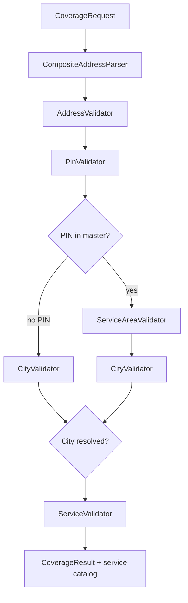

# Coverage Engine — Phase 1.2 Architecture

**Project:** CWP Detailers  
**Date:** 16 July 2026  
**Status:** Implemented — hardening layer on Phase 1 (no UI/DB redesign)

---

## Summary

Phase 1.2 refactors the Phase 1 serviceability validation into an enterprise **Coverage Engine** — the single source of truth for all location-based decisions. Booking validation is one capability; the same engine powers the new public coverage check API.

**Backward compatibility:** All Phase 1 imports from `lib/serviceability` continue to work. Booking APIs return the same legacy `{ success, status, message }` failure shape.

---

## Module Structure

```
artifacts/api-server/src/lib/coverage/
├── CoverageEngine.ts          # check(), validateForBooking()
├── CoverageValidators.ts      # Pipeline orchestrator
├── CoverageTypes.ts           # Status enums, request/result types
├── CoverageErrors.ts          # CoverageValidationError (+ legacy alias)
├── CoverageCache.ts           # In-process TTL cache + invalidation
├── CoverageMetrics.ts         # Structured logs + demand signals
├── CoverageCorrelation.ts     # coverageValidationId, requestId
├── parsers/
│   ├── AddressParser.ts       # Interface + shared helpers
│   ├── GoogleAddressParser.ts
│   ├── ManualAddressParser.ts
│   └── index.ts               # CompositeAddressParser, buildCoverageRequest
├── repositories/
│   ├── CityRepository.ts
│   ├── PinRepository.ts
│   ├── ServiceAvailabilityRepository.ts
│   └── CoverageRepository.ts
└── validators/
    ├── AddressValidator.ts
    ├── PinValidator.ts
    ├── ServiceAreaValidator.ts
    ├── CityValidator.ts
    └── ServiceValidator.ts

lib/serviceability/            # Deprecated barrel → re-exports coverage
```

---

## Architecture Diagram

```
┌─────────────────────────────────────────────────────────────────┐
│                     Consumers                                    │
│  POST /bookings │ POST /service-contracts │ POST /coverage/check │
│  walk-in │ lead convert │ (future: Address UI, Pricing, ETA)    │
└────────────────────────────┬────────────────────────────────────┘
                             │
┌────────────────────────────▼────────────────────────────────────┐
│                     CoverageEngine                               │
│  check() │ validateForBooking()                                  │
└────────────────────────────┬────────────────────────────────────┘
                             │
┌────────────────────────────▼────────────────────────────────────┐
│                  CoverageValidators (Pipeline)                   │
│  Address → PIN → ServiceArea → City → Service                    │
└─────┬──────────────────┬──────────────────┬───────────────────────┘
      │                  │                  │
┌─────▼─────┐   ┌────────▼────────┐  ┌─────▼──────────┐
│  Parsers  │   │  Repositories   │  │ CoverageCache │
│ Google +  │   │ (cached DB)     │  │ TTL 5 min     │
│ Manual    │   │ City/PIN/Svc    │  │ + invalidation│
└───────────┘   └─────────────────┘  └────────────────┘
                             │
┌────────────────────────────▼────────────────────────────────────┐
│  CoverageMetrics + Demand Signals (structured logs)              │
│  correlation: coverageValidationId, requestId, bookingId         │
└─────────────────────────────────────────────────────────────────┘
```

---

## Validation Pipeline



### City resolution priority (Implementation 11)

1. **PIN code** → city from pin master chain  
2. **Parsed Google city** (`address_components.locality`)  
3. **`citySlug`** (legacy frontend sends `"varanasi"`)  
4. **`cityId`**  
5. **`cityName`** / `area` field  

Never uses `citySlug` when PIN or Google city resolves successfully.

---

## APIs

### New: `POST /api/coverage/check` (alias: `/api/serviceability/check`)

**Auth:** None required (public, like health check).

**Request:**
```json
{
  "address": "Lanka, Varanasi, Uttar Pradesh 221005, India",
  "latitude": 25.28,
  "longitude": 82.99,
  "placeId": "ChIJ...",
  "serviceId": 3
}
```

Also accepts `locationLat` / `locationLng` (booking-compatible).

**Success response:**
```json
{
  "success": true,
  "coverageStatus": "AVAILABLE",
  "correlation": {
    "coverageValidationId": "uuid",
    "requestId": "uuid"
  },
  "city": { "id": 7, "name": "Varanasi", "slug": "varanasi", "stateName": "Uttar Pradesh" },
  "postalCode": "221005",
  "serviceArea": "Lanka",
  "availableServices": [{ "id": 3, "name": "Premium Wash", "slug": "premium-wash" }],
  "comingSoonServices": [],
  "unavailableServices": [{ "id": 99, "name": "Other", "slug": "other" }]
}
```

### Existing booking APIs

Unchanged request/response contracts. Failures still return HTTP 422:
```json
{ "success": false, "status": "SERVICE_NOT_AVAILABLE", "message": "..." }
```

Now includes `correlation` object in failure responses (additive, non-breaking).

---

## Caching Strategy

| Setting | Value |
|---|---|
| Default TTL | **5 minutes** |
| Storage | In-process `Map` (Node single-threaded) |
| Scope | Cities, PIN lookups, city service catalogs |

### Invalidation triggers

| Admin action | Cache namespace cleared |
|---|---|
| Cities CRUD | `city:*`, `services:city:*` |
| Service areas CRUD | `pin:*`, `area:*` |
| Pincodes CRUD | `pin:*` (+ specific pin when known) |
| City availability CRUD | `services:city:{cityId}` |

### Future (Phase 3+)

Redis shared cache for multi-instance deployments. TTL bounds staleness until then.

---

## Coverage Status Model

### Internal codes (expanded)

`SUCCESS`, `INVALID_ADDRESS`, `PIN_NOT_FOUND`, `SERVICE_AREA_NOT_SUPPORTED`, `CITY_NOT_FOUND`, `CITY_DISABLED`, `SERVICE_AVAILABLE`, `SERVICE_UNAVAILABLE`, `SERVICE_COMING_SOON`, `TEMPORARILY_UNAVAILABLE`, `WAITLIST`, `PRE_LAUNCH`, `INVITE_ONLY`

Legacy booking statuses (`CITY_NOT_AVAILABLE`, `SERVICE_NOT_AVAILABLE`) map via `toLegacyStatus()`.

### Public labels

`AVAILABLE`, `UNAVAILABLE`, `COMING_SOON`, `TEMPORARILY_UNAVAILABLE`, `WAITLIST`, `PRE_LAUNCH`, `INVITE_ONLY`, `INVALID`

---

## Metrics & Demand Signals

Every validation emits:

**`coverage_validation`** (info log):
- timestamp, correlation IDs, customerId, serviceId, cityId, postalCode, serviceArea, coverageStatus, failureReason, requestSource

**`coverage_demand_signal`** (warn log, on blocked bookings):
- PIN, city, requested service, reason, timestamp

Future analytics / heat maps consume these structured events.

---

## Extension Points

| Future module | Reuse pattern |
|---|---|
| Address System (Phase 2) | `CompositeAddressParser` + persist parsed components |
| Dynamic Pricing | `ServiceAvailabilityRepository.getCityServiceCatalog()` |
| ETA / Staff allocation | `CoverageEngine.check()` → city + serviceArea + coordinates |
| Slot availability | Extend pipeline with `SlotValidator` |
| Expansion analytics | Subscribe to `coverage_demand_signal` logs |
| Coming Soon UX (Phase 3) | Populate `comingSoonServices` from new master flags |

---

## Tests

```bash
pnpm --filter @workspace/api-server run test:coverage
```

Covers: cache hit/miss/invalidation, parsers, pipeline, correlation IDs, city priority, API response shaping, backward-compatible booking statuses.

---

## Remaining Work (Phase 2+)

- Persist structured addresses + demand signals to database  
- Unified `addresses` table  
- Redis cache layer  
- Populate `comingSoonServices` from master data flags  
- PIN-level service availability  
- Frontend consumption of `/coverage/check`  
- Dashboards on metrics / demand signals  

---

*See also: [SERVICEABILITY_VALIDATION_PHASE1.md](./SERVICEABILITY_VALIDATION_PHASE1.md)*
