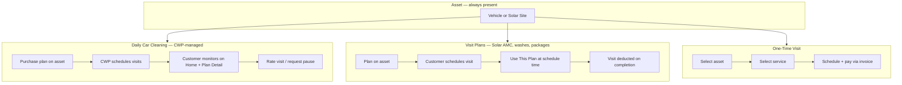

# Customer Portal — Information Architecture & Booking Journey

**Status:** Refined proposal (pre-implementation)  
**Prerequisite:** Frozen platforms (Location Intelligence, Address, Booking) — no backend redesign  
**Follows:** Phase 3.5 My Plans terminology; precedes Phase 4 refinements  
**Principle:** Purpose-built for CWP Detailers — not adapted from a generic marketplace

---

## 1. Product Principles (This Document)

| Principle | What it means for CWP |
|-----------|----------------------|
| **CWP language, not marketplace language** | “Scheduled Service,” “Use This Plan,” “One-Time Visit” — never “order,” “cart,” or generic “book” |
| **Assets are first-class** | Every plan and every visit is tied to a **vehicle or solar site**; Assets are not buried in Account |
| **Home is an operational dashboard** | Live state: today’s visit, staff en route, feedback due — not a static marketing landing |
| **One adaptive primary CTA** | Home shows exactly **one** action button; label and destination change with customer state |
| **Questions, not modules** | Routes exist because a customer asks a question — not because a backend module exists |

---

## 2. CWP Customer Terminology

Use consistently across UI, empty states, CTAs, and success messages.

| Avoid (generic / internal) | Use (CWP customer language) |
|----------------------------|----------------------------|
| Book / Booking | **Schedule** / **Scheduled Service** |
| Order | **Service Visit** |
| Use Existing Plan | **Use This Plan** |
| Book One-Time Service | **One-Time Visit** |
| Book a visit | **Schedule Next Visit** |
| Book a Service | **Schedule a Service** |
| View booking | **View Scheduled Service** |
| Transaction history | **Service History** |
| Credits | **Included Services** / **Visits Remaining** |
| Subscription | **Plan** |
| Package | **Service Plan** (with visit count) |
| Customer entitlements | **Included in Your Plan** |
| En route / In progress | **Technician On the Way** / **Service In Progress** |
| Pending (booking) | **Request Received** (awaiting CWP confirmation) |
| Vehicle / Solar site (mixed) | **Asset** — with type shown: *Vehicle* or *Solar Site* |
| My Assets page title | **My Vehicles & Solar Sites** (descriptive) / tab label **Assets** (short) |
| Complaints | **Support** (page) — distinct from **Renew Plan** (sales/ops contact) |
| Recharge / Wallet | **Renew Plan** / **Purchase Plan** |

---

## 3. Question-Driven Information Architecture

The portal is organized around **six customer questions**. Each question owns one primary destination. Backend modules (DCMS, subscriptions, entitlements, billing) are **implementation details** — never navigation labels.

| # | Customer question | Primary screen | Route |
|---|-------------------|----------------|-------|
| 1 | **What should I do today?** | Home (operational dashboard) | `/customer/dashboard` |
| 2 | **What benefits do I still have?** | My Plans | `/customer/plans` |
| 3 | **What do I own that CWP services?** | Assets | `/customer/assets` |
| 4 | **How do I schedule a service?** | Schedule (FAB) | `/customer/schedule` |
| 5 | **What services have I received?** | Service History | `/customer/history` |
| 6 | **How do I manage my account?** | Account | `/customer/account` |

**Not primary questions → secondary routes only:**
- “How is *this* plan doing?” → Plan Detail `/customer/plans/:id`
- “What’s happening with *this* scheduled service?” → Scheduled Service Detail `/customer/schedule/:id`
- “What do I owe?” → Invoices `/customer/invoices`
- “How do I get help?” → Support `/customer/support`

---

## 4. Primary Navigation

Assets elevated to **first-class tab**. Schedule remains center FAB — the highest-frequency action for credit and one-time customers.

```
┌────────┬────────┬──────────┬────────┬─────────┐
│  Home  │ Plans  │ SCHEDULE │ Assets │ Account │
│        │        │   (FAB)  │        │         │
└────────┴────────┴──────────┴────────┴─────────┘
```

| Tab | Route | Question |
|-----|-------|----------|
| Home | `/customer/dashboard` | What should I do today? |
| Plans | `/customer/plans` | What benefits do I still have? |
| **Schedule** (FAB) | `/customer/schedule` | How do I schedule a service? |
| **Assets** | `/customer/assets` | What do I own that CWP services? |
| Account | `/customer/account` | How do I manage my account? |

**Removed from bottom nav:**
- Services → merged into Plans
- Wallet → merged into Plans
- Book (old label) → **Schedule**

**Service History** — reachable from Home operational footer, Plan Detail, and Account; not a bottom tab (reduces nav clutter; upcoming services surface on Home).

### Route aliases (backward compatible)

| Legacy route | Canonical route |
|--------------|-----------------|
| `/customer/services` | `/customer/plans` |
| `/customer/wallet` | `/customer/plans` |
| `/customer/bookings` | `/customer/schedule` |
| `/customer/bookings/:id` | `/customer/schedule/:id` |
| `/customer/book` | `/customer/schedule` |
| `/customer/complaints` | `/customer/support` |
| `/customer/daily-cleaning` | `/customer/plans/:dcmsPlanId` |
| `/customer/daily-cleaning/history` | `/customer/plans/:dcmsPlanId?tab=visits` |
| `/customer/daily-cleaning/gallery` | `/customer/plans/:dcmsPlanId?tab=photos` |

---

## 5. Asset-Centric Design

> Every service is performed on an asset. The IA must reflect that.

### 5.1 Asset appears everywhere it matters

| Screen | Asset presence |
|--------|----------------|
| **Home** | Operational hero shows asset name + type for today’s scheduled service |
| **Plans** | Every plan card shows linked vehicle or solar site |
| **Plan Detail** | Asset header: photo/icon, registration, service address |
| **Schedule wizard** | Asset step **before** service (when cold entry); pre-filled when from plan |
| **Scheduled Service Detail** | Asset + service address map link |
| **Service History** | Asset on every past visit row |
| **Assets** | Full CRUD; location completeness indicator |

### 5.2 Assets screen — *What do I own that CWP services?*

**Not** an Account sub-link. A primary tab.

**Show:**
- Vehicles and solar sites as cards (not tabs buried in settings)
- Per asset: name/registration, service address status, active plans count, last service date
- **Add vehicle** / **Add solar site** as primary empty-state CTA

**Actions:**
- Tap asset → Asset Detail (future) or inline edit address
- “Plans for this asset” → Plans filtered by `?assetId=`
- “Schedule for this asset” → `/customer/schedule?assetId=`

**APIs:** `GET /vehicles`, `GET /solar-sites`, Address Platform fields on asset

### 5.3 Schedule wizard — asset-first when cold

For customers with multiple assets, **pick asset first** (recognition over recall), then show only relevant plans and services for that asset type (vehicle vs solar).

```
Cold Schedule entry
  → Which asset? (vehicle or solar site)
  → Use This Plan OR One-Time Visit (filtered to asset)
  → Service (if one-time)
  → Date, time, address
  → Confirm
```

From Plan Detail with known asset → skip asset step.

---

## 6. Home — Operational Dashboard

**Not a static landing page.** A live control panel that answers: *What should I do today?*

### 6.1 Layout (priority order)

```
┌─────────────────────────────────────────┐
│  OPERATIONAL HERO                        │
│  Live state: today's scheduled service,  │
│  technician on the way, or clear day     │
│  Asset: Swift · UP32AB1234               │
│  [ ONE ADAPTIVE PRIMARY CTA ]            │
├─────────────────────────────────────────┤
│  ACTION QUEUE (0–2 items max)            │
│  e.g. Rate yesterday's visit · ₹ due     │
├─────────────────────────────────────────┤
│  PLAN PULSE (single line)                │
│  Daily Cleaning · 25 visits left · Feb  │
├─────────────────────────────────────────┤
│  FOOTER LINKS (text, not cards)          │
│  All plans · Service history             │
└─────────────────────────────────────────┘
```

### 6.2 Operational hero states

| State | Hero content | Status badge |
|-------|--------------|--------------|
| Service in progress | Service name + asset + “Happening now” | Service In Progress |
| Technician on the way | ETA window + asset + staff name if known | Technician On the Way |
| Scheduled today | Time + asset + address snippet | Scheduled Today |
| Scheduled future | Next date/time + asset | Scheduled |
| DCMS visit today | “Daily cleaning visit today” + asset | Scheduled (managed) |
| Visit completed, feedback pending | “How was your visit?” + asset | Feedback Due |
| Clear day | “No service scheduled today” | — |

Hero always includes **asset context** when a visit exists.

### 6.3 Adaptive primary CTA (exactly one)

Evaluated in **priority order** — first match wins:

| Priority | Condition | CTA label | Destination |
|----------|-----------|-----------|-------------|
| 1 | Feedback pending (DCMS or booking) | **Rate Your Visit** | Feedback sheet / visit detail |
| 2 | Service in progress or en route | **Track Today's Service** | Scheduled Service Detail |
| 3 | Scheduled service today | **View Today's Service** | Scheduled Service Detail |
| 4 | Invoice due > ₹0 | **View Your Bill** | Invoices |
| 5 | Plan renewal due / expired | **Renew Plan** | Plan Detail or Plans contact section |
| 6 | Paused plan with visits left | **Contact CWP to Resume** | Plans (paused section) |
| 7 | Active credit plan + visits remaining, no upcoming | **Schedule Next Visit** | `/customer/schedule?planId=` |
| 8 | Active DCMS plan | **View Daily Cleaning Plan** | Plan Detail (DCMS) |
| 9 | Has assets, no plans | **Get a Plan for [Asset]** | Plans empty / contact |
| 10 | No assets | **Add Your Vehicle** | Assets |
| 11 | Default | **Schedule a Service** | `/customer/schedule` |

**Rules:**
- Never show two primary buttons on Home
- Secondary actions live in Action Queue (max 2) or footer links
- CTA label uses CWP terminology (§2), never generic “Book now”

### 6.4 What Home must not show

- Full plan list (→ Plans tab)
- Full service history (→ Service History)
- Static stat chips without action (₹ wallet, duplicate counts)
- Marketing / catalog browse (→ public site or Plans empty state)
- Multiple competing FABs

### 6.5 APIs feeding the dashboard

| Widget | Source |
|--------|--------|
| Operational hero | `GET /customers/:id/summary` (recentBookings), DCMS dashboard |
| Plan pulse | `GET /subscriptions?customerId=` (primary plan heuristic) |
| Action queue | pending feedback API, `pendingDues`, renewal status on subscription |
| Adaptive CTA | Client state machine over above |

---

## 7. Screen Specifications

### My Plans — *What benefits do I still have?*

- Group optionally by asset (vehicle/site header → plans beneath)
- Plan card: plan name, status, visits remaining, expiry, next scheduled visit, **asset**
- Actions: **Open Plan**, **Renew Plan** (contact — not Support)
- Empty: **Explore CWP Services** (public catalog or supervisor contact)

**DCMS plans** live here — not a separate “module” in nav.

---

### Plan Detail — *How is this plan doing?*

Asset header always visible at top.

| Plan type | Primary CTA | Customer model |
|-----------|-------------|----------------|
| Daily Car Cleaning (DCMS) | **View Visit History** / **Request Pause** | CWP schedules; customer monitors |
| Solar AMC / Monthly Wash | **Schedule Next Visit** (Use This Plan) | Customer schedules; visit deducted |
| Package / visit bundle | **Schedule Next Visit** | Same |
| Expired / paused | **Renew Plan** | Contact CWP |

Tabs (progressive disclosure): **Overview** · **Visits** · **Photos** (DCMS) · **Billing**

---

### Schedule — *How do I schedule a service?*

Scheduling wizard only — not a plan browser.

| Entry | URL | Flow |
|-------|-----|------|
| FAB (cold) | `/customer/schedule` | Asset → plan/one-time choice → … |
| From plan | `/customer/schedule?planId=` | **Use This Plan** → schedule step |
| From asset | `/customer/schedule?assetId=` | Asset locked → plan or one-time |
| One-time | `/customer/schedule?mode=one_time` | Asset → service → schedule |
| DCMS attempt | any | Redirect: “Daily cleaning visits are scheduled by CWP” → Plan Detail |

**Choice screen copy (when needed):**
- **Use This Plan** — “Schedule using your remaining visits”
- **One-Time Visit** — “Pay for a single service without a plan”

Single screen for this choice — not two sequential steps.

**Success copy:**
- Status `pending` → “Request received — CWP will confirm your visit”
- Status `scheduled` → “Your service is scheduled”
- Link → **Scheduled Service Detail** (not Service History)

---

### Service History — *What services have I received?*

- Sections: **Upcoming Scheduled Services** · **Past Visits**
- Every row: date, service name, **asset**, status, proof photos
- DCMS visits merged in Phase 4 (today: bookings + link to plan visit tab)

---

### Account — *How do I manage my account?*

Profile, security, notifications, supervisor contact.

**Short links only** (no duplication of primary tabs): Service History, Invoices, Support.

Plans and Assets are **not** repeated as large cards — they have their own tabs.

---

## 8. CWP Business Flows (Not Marketplace Flows)



**IA rules:**
1. DCMS never enters Schedule wizard
2. Every schedule flow is anchored to an asset
3. “Use This Plan” always shows visits remaining on confirm step
4. Renew Plan ≠ Support

---

## 9. Booking / Schedule Journey (Refined)

### 9.1 Decision tree

```
Enter Schedule
    │
    ├─ assetId in URL? ───────────────► Asset locked
    ├─ planId in URL? ────────────────► Use This Plan flow (schedule only)
    ├─ mode=one_time? ────────────────► One-Time Visit flow
    │
    ├─ DCMS-only + no one-time path? ─► Redirect to Plan Detail
    │
    ├─ No assetId ────────────────────► Pick asset first
    │
    ├─ 1 eligible plan on asset? ─────► Use This Plan (confirm on schedule step)
    ├─ 2+ eligible plans? ─────────────► Pick plan or One-Time Visit (one screen)
    └─ 0 eligible plans? ───────────────► One-Time Visit only
```

### 9.2 Use This Plan flow

```
Plan Detail "Schedule Next Visit"
  → Schedule step (date, time, address pre-filled from asset)
  → Confirm: "Using Daily Wash Plan · 4 visits remaining"
  → Success → Scheduled Service Detail
```

### 9.3 One-Time Visit flow

```
Pick asset → Pick service → Schedule → Confirm (price) → Success
```

---

## 10. Consolidation Map

| Retire as standalone | Absorb into |
|---------------------|-------------|
| Services tab/page | My Plans |
| Wallet | My Plans |
| DCMS hub routes | Plan Detail (Daily Car Cleaning type) |
| Dashboard plan grid | Plan pulse + Plans tab |
| Dashboard DCMS card | Home operational hero + Plan pulse |
| Assets under Account only | **Assets tab** |
| Renew → Support | Plans contact section |
| Generic “Book” label | **Schedule** / **Scheduled Service** |

---

## 11. API & Frozen Platform Alignment

| Customer concept | API | Platform |
|------------------|-----|----------|
| Operational hero | `GET /customers/:id/summary` | — |
| Plans | `GET /subscriptions?customerId=` | — |
| Assets | `GET /vehicles`, `GET /solar-sites` | Address (location on asset) |
| Schedule service | `POST /bookings` | **Booking** |
| Service address | `address`, `locationLat/Lng`, `placeId` | **Address** |
| Coverage check | booking create response | **Location Intelligence** |
| Use This Plan | `GET /catalog/self-booking/check` → `entitlementId` | Catalog |
| DCMS plan state | `GET /daily-cleaning/customer/dashboard` | — |
| Service History | `GET /bookings?customerId=` | — |

No customer exposure of `service-contracts` or `wallet/*`.

**Phase 4 (compatible extensions):** `subscriptionId` on booking create; `GET /bookings?subscriptionId=`; asset detail route.

---

## 12. Implementation Phases

| Phase | Deliverable |
|-------|-------------|
| **A — Nav shell** | 5-item nav (Home, Plans, Schedule FAB, Assets, Account); route aliases |
| **B — Terminology** | Global copy pass per §2 |
| **C — Home dashboard** | Operational hero + adaptive CTA state machine + plan pulse |
| **D — Assets elevation** | Assets tab content enriched; asset on all plan/service surfaces |
| **E — Schedule journey** | Asset-first cold entry; Use This Plan / One-Time; DCMS guard |
| **F — Plan Detail unification** | DCMS tabs absorbed; asset header |
| **G — Phase 4 refinements** | Plan-scoped history, self-serve renew, subscriptionId on create |

---

## 13. Success Metrics

| Metric | Target |
|--------|--------|
| Customer questions mapped 1:1 to primary screens | 6 questions → 6 destinations |
| Home primary CTAs shown | Exactly 1 |
| Asset visible on plan cards | 100% |
| Clicks: Home → schedule visit (credit customer) | ≤ 2 |
| Generic “book/order” strings in customer UI | 0 |
| Assets reachable without opening Account | 1 tap (tab) |
| DCMS discoverability | Via Plans + Home plan pulse |

---

## 14. Resolved Decisions

| Decision | Resolution |
|----------|------------|
| Assets placement | **First-class bottom nav tab** |
| Activity / History placement | **Secondary** — Home shows upcoming; full history at `/customer/history` |
| Schedule route | **`/customer/schedule`** with aliases from `/customer/bookings` |
| Logo when logged in | **Home** (`/customer/dashboard`) — avoid accidental exit to marketing site |
| Purchase in-app | **Offline** (supervisor contact) until Phase G; no Explore tab in v1 IA |
| Marketplace patterns | **Explicitly rejected** — CWP terminology and asset-centric flows instead |

---

## 15. Next Step

Approve this refined IA, then implement **Phase A → C → D → E** before Phase 4 backend refinements. The result should feel like a **field-service operations app for car and solar customers** — not a generic marketplace with CWP branding.
