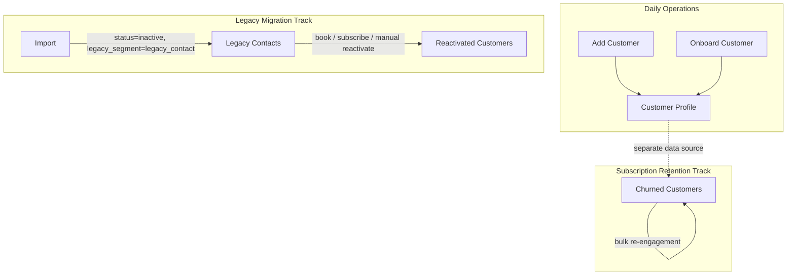

# Customer Lifecycle Audit Report

**Project:** CWP Detailers  
**Date:** 15 June 2026  
**Purpose:** Document the original customer lifecycle model before simplification  
**Scope:** Audit only — no code changes  
**Status:** Pre–Founder UX simplification baseline

---

## Executive Summary

The CWP platform treats customer lifecycle as **three parallel tracks**, not a single linear funnel:

| Track | Purpose | Primary surfaces |
|-------|---------|------------------|
| **Daily operations** | Create and run active customers | Add Customer, Onboard Customer, Customer Profile |
| **Legacy migration** | Move old phone contacts / Excel data into the new system | Import → Legacy Contacts → Reactivated |
| **Subscription retention** | Win back cancelled paying subscribers | Churned Customers |

The canonical domain model defines lifecycle states in `lib/customer-model/src/personas.ts`: `active`, `inactive`, `suspended`, `legacy_dormant` (`status=inactive` + `legacy_segment=legacy_contact`), and `reactivated` (`reactivated_at` set). Architecture docs describe a simplified narrative — **Lead → Active → Churned → Reactivated** (`docs/DATA_RELATIONSHIP_V1.md`) — but the implementation splits **subscription churn** (cancelled subscriptions) from **legacy dormant contacts** (imported phone-only records).

The Founder UX redesign (Phases 1, 1B, 2) did **not remove** any of these six capabilities. It **re-tiered navigation**: daily ops stay prominent; migration and retention tools moved to a collapsed **Legacy** sidebar section.

---

## Lifecycle Model Overview



**Key distinction:** Churned Customers reads from **cancelled subscriptions**, not from customer status or legacy segment. Legacy Contacts and Reactivated Customers operate on **customer records** with `legacy_segment` and `reactivated_at` fields.

---

## 1. Add Customer

### Original business use case

Create a **new active customer** for day-to-day franchise operations with minimal friction. Operators capture identity (name, phone), optional contact details (email, city, branch), and optionally provision a customer portal login in one step.

Typical scenarios:

- Walk-in or phone inquiry — staff creates the record before booking a service
- Call center receives a new lead who is ready to become a customer (distinct from Leads & CRM pipeline)
- Quick record creation when duplicate phone detection surfaces an existing customer link

UI copy reinforces this: primary CTA **"Add customer"**, dialog title **"New Customer"**, submit **"Create Customer"**. The API always sets `status: "active"`.

### Target user

| Role | Access |
|------|--------|
| **Admin / Superadmin** | Full access; primary CTA on Customer Profile list |
| **Manager** | `customers:create` — can use dialog and empty-state CTA |
| **Franchisee** | Same page (`Customers.tsx`) but without admin `PageActionHeader`; create still available via permission gate and empty state |
| **Call center / office staff** | Implicit via manager role and `customers:create` permission |

**Not intended for:** HQ-only migration staff (they use Import), or franchise owners doing bulk historical load.

### Difference from other options

| Compared to | Difference |
|-------------|------------|
| **Onboard Customer** | Minimal — identity only. No photo, vehicle, wallet, or post-setup service CTAs. |
| **Import** | Single manual record; always active. No Excel, no `legacy_segment`, no batch idempotency. |
| **Legacy Contacts** | Creates **new active** customers, not dormant imported contacts. |
| **Churned Customers** | Forward creation; churned is backward-looking on cancelled subscriptions. |
| **Leads & CRM** | Creates a **customer record** directly; leads are prospects in a sales pipeline. |

### Current implementation status

| Layer | Status | Location |
|-------|--------|----------|
| **Route** | Complete | `/admin/customers` (dialog on list page) |
| **UI** | Complete | `features/customers/pages/Customers.tsx`, `QuickCreateCustomerForm.tsx` |
| **API** | Complete | `POST /api/customers` — `artifacts/api-server/src/routes/customers.ts` |
| **DB** | Complete | `customers` table — `status` enum: `active \| inactive \| suspended` |
| **Permissions** | Complete | `customers:create`; seeded for admin, superadmin, manager, franchisee |
| **Verification** | Complete | `verify:tier1-customers`, `verify:tier2-customers` |
| **Feature flags** | None | Role/permission gated only |

Post–Founder UX: **primary CTA** on Customer Profile list (`PageActionHeader` with `data-testid="customer-profile-primary-cta"`).

### Still needed after Founder UX redesign?

**Yes — essential daily workflow.**

Founder UX Phase 1 explicitly elevated Add Customer as the primary entry point for franchise operations. Phase 2 verified the create flow PASS. This is the core “new customer walks in” path and must remain regardless of lifecycle simplification.

**Future simplification note:** Could merge UX with Onboard (see §2) into a single “Add customer” flow with optional “full setup” toggle, but the capability itself is non-negotiable.

---

## 2. Onboard Customer

### Original business use case

**Guided multi-step setup** for a new customer when the franchise wants a complete profile before first service — not just identity. Designed for branch staff onboarding a customer who will immediately receive services, wallet credit, or portal access.

Wizard steps (UI labels):

1. **Step 1 — Customer** — full create form with billing fields (`showBillingFields=true`)
2. **Step 2 — Profile photo**
3. **Step 3 — Vehicle** — model select + service address via location picker
4. **Step 4 — Wallet** — opening credit amount
5. **Onboarding complete** — CTAs: “Add first service” / “View services & plans”

This mirrors the operational reality: a CWP customer is not useful until they have at least one serviceable asset (vehicle or site) and often wallet/plan context.

### Target user

| Role | Access |
|------|--------|
| **Admin / Superadmin / Manager** | **Onboard** secondary button visible only when `basePath.startsWith("/admin")` |
| **Franchisee** | Shares `CustomersPage` but **does not see** the Onboard button |

Requires `customers:create`. Reuses `POST /api/customers`, vehicle creation, and `POST /api/customers/:id/wallet/credit`.

### Difference from other options

| Compared to | Difference |
|-------------|------------|
| **Add Customer** | Full guided flow: photo, vehicle, wallet, service next-steps. Step 1 includes GST/billing fields. |
| **Import** | Interactive, one customer at a time; creates operational profile immediately. |
| **Book Service** | Onboarding sets up **account foundation**; Book Service schedules work on an existing profile. |
| **Customer self-registration** | Admin-driven; default portal password `customer123` in quick form. |

### Current implementation status

| Layer | Status | Location |
|-------|--------|----------|
| **Route** | Complete (modal) | Triggered from `/admin/customers` — no dedicated URL |
| **UI** | Complete | `CustomerOnboardingWizard.tsx` (`data-testid="btn-onboard-customer"`) |
| **API** | Complete | Customer create + vehicle + wallet credit endpoints |
| **DB** | Complete | Writes to `customers`, `vehicles`, wallet ledger |
| **Verification** | Complete | `verify:tier2-customers`, `verify-customer-ui-backlog.ts` |
| **Feature flags** | None | Admin-only button visibility |

Outstanding gap (Phase 2 report): no **first-run guided tour** for franchise owners — the wizard exists but is not auto-suggested on first use.

### Still needed after Founder UX redesign?

**Yes — but as secondary / optional path.**

Founder UX kept Onboard as a **secondary action** beside the primary Add Customer CTA. It serves staff who need full setup in one sitting without navigating Customer Detail tabs afterward.

**Simplification opportunity:** Overlap with Add Customer + Customer Detail (Overview → add vehicle/wallet) creates duplicate paths. A future redesign could:

- Fold Onboard into Add Customer as “Quick add” vs “Full setup”
- Or redirect post-create to Customer Detail with a contextual checklist

The **business capability** (guided first-time setup) remains valuable; the **separate nav button** may be consolidated later.

---

## 3. Churned Customers

### Original business use case

Track **cancelled subscriptions** and run **bulk re-engagement campaigns** (WhatsApp/SMS-style messaging with `{name}` personalization). Franchise HQ and branch managers use this for subscription win-back — customers who were paying for a plan (e.g. daily cleaning) and cancelled.

UI copy: *"Cancelled subscriptions — select to send bulk re-engagement messages"*. Default template offers 10% off renewal.

**Critical implementation detail:** Data source is `subscriptions.status = 'cancelled'`, **not** `customers.status`. A customer can be `active` with a cancelled subscription, or have multiple subscription histories.

### Target user

| Portal | Role | Permission |
|--------|------|------------|
| **Admin** | admin, superadmin, manager | `churned:view` (route); `churned:edit` (bulk message, remarks) |
| **Franchisee** | franchisee | Route available at `/franchisee/churned`; API scoped by tenant + optional `branchId` |

Franchisee portal includes Churned in its simpler nav — appropriate for local retention work.

### Difference from other options

| Compared to | Difference |
|-------------|------------|
| **Legacy Contacts** | Churned = **former paying subscribers** who cancelled. Legacy = **imported dormant phone contacts** never fully onboarded. |
| **Reactivated Customers** | Churned targets subscription cancellations; Reactivated tracks **legacy contacts who returned**. |
| **Inactive customers** | Churned rows are **subscription records** (`subscriptionId`), not customer status filters. |
| **Leads & CRM** | Win-back on lost revenue; not prospect pipeline. |

### Current implementation status

| Layer | Status | Location |
|-------|--------|----------|
| **Routes** | Complete | `/admin/churned`, `/franchisee/churned` |
| **UI** | Complete | `pages/admin/ChurnedCustomers.tsx`, `pages/franchisee/ChurnedCustomers.tsx` |
| **API** | Complete | `GET /api/churned`, `PATCH /api/churned/:id/remark`, `POST /api/churned/bulk-message` |
| **DB** | Complete | `subscriptions.cancelledAt`, `cancellationRemark`, `messageSentAt` |
| **Messaging** | Partial | Bulk send logs recipients and marks `messageSentAt`; live WhatsApp API integration noted as TODO |
| **Nav** | Demoted | Legacy sidebar → **Churned Customers** (`adminNavConfig.ts`) |

Founder UX audit: **Pass — label understood** (unlike Legacy Contacts / Import jargon).

### Still needed after Founder UX redesign?

**Yes — for subscription businesses; demoted in nav, not removed.**

SCREEN_MAPPING_V2 marks Churned as **KEEP**. Founder UX moved it to collapsed Legacy section because it is **retention tooling**, not a daily morning check — but franchisees still need win-back on cancelled DCMS/plan subscriptions.

**Simplification opportunity:**

- Merge messaging into Communication Center smart segments (partially exists for other audiences)
- Rename for clarity: “Cancelled subscriptions” vs “Churned customers”
- Do **not** conflate with Legacy Contacts — different data model and business meaning

---

## 4. Reactivated Customers

### Original business use case

**Outcome tracking** for legacy dormant contacts who returned to active business. Answers: *“Did our re-engagement campaigns work?”*

Tracked when a former `legacy_contact` customer:

- Books a service (auto-trigger)
- Subscribes to a plan (auto-trigger)
- Is manually reactivated by staff
- Has status changed to `active` (auto-trigger)

UI copy: *"Former legacy contacts who came back — tracked when they book, subscribe, or are manually reactivated"*. Filter by All time / 7 / 30 / 90 days.

Auto-actions on reactivation (`customerReactivation.ts`):

- Sets `status=active`, `reactivatedAt=now`, clears `legacy_segment`
- Journey event `customer_reactivated`
- Queued welcome-back WhatsApp in communication timeline

### Target user

| Role | Access |
|------|--------|
| **Admin / Superadmin / Manager** | `/admin/customers/reactivated` — `customers:view` |
| **Manual reactivation API** | `customers:edit` — `POST /api/customers/:id/reactivate` |
| **Franchisee** | No dedicated Reactivated page |

Also surfaced in Communication Center as smart segment **“Reactivated Customers”** (`smartSegments.ts`).

### Difference from other options

| Compared to | Difference |
|-------------|------------|
| **Legacy Contacts** | Mutually exclusive states — reactivation clears `legacy_segment`. Legacy = still dormant; Reactivated = already returned. |
| **Churned Customers** | Reactivated = legacy migration win-back. Churned = subscription cancellation win-back. |
| **Add Customer** | State **transition** on existing record, not creation. |
| **Customer Profile list** | All customers shown; Reactivated is a **filtered historical analytics view**. |

### Current implementation status

| Layer | Status | Location |
|-------|--------|----------|
| **Route** | Complete | `/admin/customers/reactivated` |
| **UI** | Complete | `pages/admin/ReactivatedCustomers.tsx` |
| **API** | Complete | `GET /api/customers/reactivated`; auto-triggers in bookings, subscriptions, customers PATCH |
| **Core logic** | Complete | `artifacts/api-server/src/lib/customerReactivation.ts` |
| **DB** | Complete | Migration `023_customer_reactivation.sql` — `reactivated_at`, `legacy_segment` |
| **Customer model** | Complete | Persona `reactivated`, lifecycle `reactivated` in `personas.ts` / `profile.ts` |
| **Nav** | Demoted | Legacy sidebar → **Reactivated** |

### Still needed after Founder UX redesign?

**Conditionally yes — valuable during and shortly after migration; diminishing over time.**

Founder UX audit: **Fail for new users** (legacy jargon) — correctly hidden under Legacy as a **migration outcome view**.

| Phase | Recommendation |
|-------|----------------|
| **Active migration** (importing old contact lists) | Keep — measures campaign ROI |
| **Steady state** (no new legacy imports) | Could fold into Communication Center reports or Founder Dashboard KPI |
| **Long term** | Screen may be retired; **reactivation logic** (auto on book/subscribe) must remain |

Do not remove `tryReactivateLegacyCustomer` or `reactivated_at` tracking even if the dedicated list page is simplified away.

---

## 5. Legacy Contacts

### Original business use case

Manage **imported dormant phone-only contacts** for re-engagement **before** they become active customers. Represents the old CWP customer base stored as phone book entries — known phone numbers, often unknown or placeholder names, not yet using the new platform.

Import pattern (documented on Import page and in UI):

- `status=inactive`
- `legacy_segment=legacy_contact`
- `create_login=N`

Actions from this screen:

- Manual **Reactivate** per row
- Link to **Import** for more contacts
- Link to **Communication Center** for bulk campaign (audience: **“Legacy Contacts (Dormant)”**)

UI copy: *"Old customers imported from phone contacts — dormant segment for re-engagement campaigns"*.

Customer model persona (`personas.ts`): *"Imported dormant contact — re-engage or add a service"*.

### Target user

| Role | Access |
|------|--------|
| **Admin / Superadmin / Manager** | `customers:view` for list; `customers:edit` for manual reactivate |
| **Franchisee** | No Legacy Contacts route |
| **Marketing / HQ migration staff** | Primary users during platform cutover |

### Difference from other options

| Compared to | Difference |
|-------------|------------|
| **Customer Profile list** | Subset only: `inactive` + `legacy_segment=legacy_contact`. |
| **Churned Customers** | Legacy = never fully onboarded imports; Churned = cancelled **subscriptions**. |
| **Reactivated Customers** | Pre-return vs post-return states. |
| **Leads & CRM** | Legacy contacts are **existing imported records**, not new prospects. |
| **Import** | Import **creates** legacy contacts; Legacy Contacts **lists and acts on** them. |

### Current implementation status

| Layer | Status | Location |
|-------|--------|----------|
| **Route** | Complete | `/admin/customers/legacy-contacts` |
| **UI** | Complete | `pages/admin/LegacyContacts.tsx` |
| **API** | Complete | `GET /api/customers/legacy-contacts` — filters inactive + legacy_segment |
| **DB** | Complete | `customers.legacy_segment`, index `customers_legacy_segment_idx` |
| **Comms integration** | Complete | Segment `legacy_contacts` in `smartSegments.ts`, `audienceBuilder.ts` |
| **Nav** | Demoted | Legacy sidebar → **Legacy Contacts** |

Shows KPI cards: dormant count + all-time reactivated total (cross-link to outcome tracking).

### Still needed after Founder UX redesign?

**Yes during migration; optional afterward.**

Founder UX audit: **Fail for new users — legacy jargon** — intentionally moved to collapsed Legacy section with amber warning copy.

| Scenario | Need |
|----------|------|
| Franchise still importing old phone lists | **Required** — operational queue for campaigns |
| Migration complete, list empty | Page becomes low-traffic; segment logic in Communication Center may suffice |
| Greenfield franchise (no legacy data) | Never used — safe to ignore in nav |

**Simplification path:** After migration completes, merge list into Communication Center audience management only; keep API filters and reactivation triggers.

---

## 6. Import (Customer Migration)

### Original business use case

**Bulk Excel import** of legacy CWP customers into the new platform — especially phone-only dormant contacts and customers with historical billing metadata (wallet balance, dues, customer-since dates, operational notes).

Nav label: **Customer Import**. Page title: **Customer migration**.

Workflow:

1. Download sample template
2. Upload `.xlsx`
3. **Preview** (validation)
4. **Dry run** (simulate)
5. **Commit import**

Supports idempotent upsert by `legacy_customer_id`. Can create portal login accounts when `create_login=Y`. Primary migration path for franchise cutover from spreadsheets or old systems.

### Target user

| Role | Access |
|------|--------|
| **Admin / Superadmin / Manager** | `customers:create` — route and dry run/commit UI |
| **HQ / implementation staff** | Primary users during rollout |
| **Franchisee** | No import route |
| **Branch managers** | May run one-time branch contact import if permitted |

### Difference from other options

| Compared to | Difference |
|-------------|------------|
| **Add Customer** | Batch, Excel-driven, idempotent; can set inactive + legacy_segment. |
| **Onboard Customer** | Migration at scale vs guided single-customer setup. |
| **Legacy Contacts** | Import **creates** the dormant segment; Legacy Contacts **consumes** it. |
| **Churned Customers** | Import loads **customer identity and history**; churned tracks **subscription cancellations**. |

### Current implementation status

| Layer | Status | Location |
|-------|--------|----------|
| **Route** | Complete | `/admin/customers/migration` |
| **UI** | Complete | `pages/admin/CustomerMigration.tsx` |
| **API** | Complete | `GET /api/migration/customers/sample`, preview, import (`dryRun` query param) |
| **Engine** | Partial scope | `legacyImportEngine.ts` — **Customers sheet only (LM-6)** |
| **DB** | Complete | Customer migration fields + audit tables (`migration_batches`, `migration_entity_map`, `migration_row_log`) |
| **Verification** | Complete | `verify:migration-lm6` — 18/18 PASS |
| **Not yet implemented** | Planned | Vehicles, solar sites, packages, entitlements (LM-7+) |
| **Nav** | Demoted | Legacy sidebar → **Customer Import** |

Cross-links to Legacy Contacts workflow in amber info card on migration page.

### Still needed after Founder UX redesign?

**Yes for cutover period; one-time tool long term.**

Founder UX audit: **Fail for new users** — classified as **one-time migration tool**, moved to Legacy section. SCREEN_MAPPING_V2: **KEEP**.

| Phase | Recommendation |
|-------|----------------|
| **Platform rollout / branch onboarding** | **Required** — only scalable path for historical customer load |
| **Post-migration steady state** | Rarely opened; keep for corrections and new branch data loads |
| **LM-7+ completion** | Import becomes more valuable when vehicles/contracts import lands |

**Simplification path:** Hide deeper in Admin/Config after migration KPI hits zero; do not delete engine or audit tables (compliance and rollback).

---

## Cross-Cutting: Navigation After Founder UX

### Before (problem)

Legacy Contacts, Import, Reactivated, and Churned lived in or near the daily **Customers** submenu — exposing migration jargon to franchise owners every day (`FOUNDER_UX_AUDIT_REPORT_V1.md` §2.1).

### After (implemented)

```
Dashboard
Customers → Customer Profile          (/admin/customers)     [DAILY]
Operations → Book Service, Assign Service, Leads & CRM ...
Legacy (collapsed, amber)
  Legacy Module
    Legacy Daily Cleaning
    Legacy Contacts                   (/admin/customers/legacy-contacts)
    Customer Import                   (/admin/customers/migration)
    Reactivated                       (/admin/customers/reactivated)
    Churned Customers                 (/admin/churned)
```

Source: `artifacts/cwp-platform/src/components/layout/adminNavConfig.ts`

Daily customer hub tabs (in-page only): **Customer Profile**, **Bookings** — legacy lifecycle pages are **not** in hub tabs.

---

## Summary Matrix

| Feature | Original intent | Target user | vs others | Implementation | Still needed post–Founder UX? |
|---------|-----------------|-------------|-----------|----------------|------------------------------|
| **Add Customer** | Quick create active customer | Branch staff, managers | Minimal single record | **Complete** | **Yes — primary daily path** |
| **Onboard Customer** | Guided full setup (photo, vehicle, wallet) | Admin branch staff | Multi-step vs quick add | **Complete** | **Yes — secondary; may merge UX** |
| **Churned Customers** | Win-back cancelled subscriptions | Admin, franchisee managers | Subscription-based, not legacy | **Complete** (messaging partial) | **Yes — retention; nav demoted** |
| **Reactivated Customers** | Track legacy contacts who returned | Admin / HQ | Post-migration analytics | **Complete** | **Conditional — fade after migration** |
| **Legacy Contacts** | Re-engage imported dormant contacts | HQ, migration staff | Dormant queue vs active list | **Complete** | **Conditional — during migration** |
| **Import** | Bulk Excel legacy customer load | HQ, implementation | Batch vs manual create | **Partial** (customers LM-6 done) | **Yes during cutover; then rare** |

---

## Recommendations for Future Simplification

These are **documentation recommendations only** — no code changes in this audit.

1. **Preserve two churn concepts in documentation** — subscription cancellation (Churned) vs imported dormancy (Legacy Contacts). Merging them in UI would corrupt data semantics.

2. **Consolidate creation UX** — Add + Onboard overlap; consider one entry with “Quick” vs “Full setup” rather than two header buttons.

3. **Time-box Legacy nav visibility** — After migration KPIs stabilize, Legacy Contacts + Reactivated list pages could become Communication Center reports; keep backend reactivation automation.

4. **Complete LM-7+ import** — Import’s business value increases when vehicles and entitlements migrate, reducing manual post-import onboarding.

5. **Finish Churned messaging** — Bulk message currently logs dispatch; live WhatsApp integration would complete the original retention use case.

6. **Do not remove reactivation automation** — Even if Reactivated/Legacy list pages are retired, `tryReactivateLegacyCustomer` and journey/comms hooks must remain for imported contact workflows.

---

## Source References

| Document / code | Relevance |
|-----------------|-----------|
| `docs/FOUNDER_UX_AUDIT_REPORT_V1.md` | Original audit; daily vs migration split |
| `docs/FOUNDER_UX_SIMPLIFICATION_IMPLEMENTATION_REPORT.md` | Phase 1 nav restructure, Add customer CTA |
| `docs/FOUNDER_UX_PHASE_2_IMPLEMENTATION_REPORT.md` | Terminology, create/onboarding verification |
| `docs/FOUNDER_UX_PHASE_2_COMPLETION_REPORT.md` | Phase 2 complete; Legacy nav finalized |
| `docs/DATA_RELATIONSHIP_V1.md` | Lifecycle: Lead → Active → Churned → Reactivated |
| `docs/SCREEN_MAPPING_V2.md` | All six surfaces marked **KEEP** |
| `lib/customer-model/src/personas.ts` | Personas: legacy_contact, reactivated |
| `artifacts/api-server/src/lib/customerReactivation.ts` | Reactivation triggers and comms |
| `artifacts/cwp-platform/src/components/layout/adminNavConfig.ts` | Current nav structure |

---

*Audit complete. No code changes made. Use this document as the baseline before further customer lifecycle simplification.*
