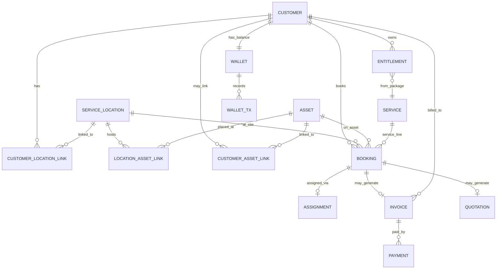
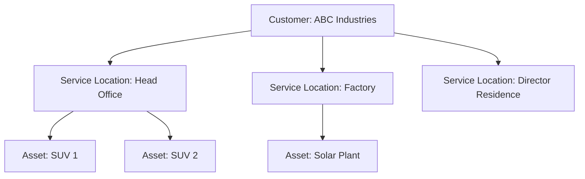
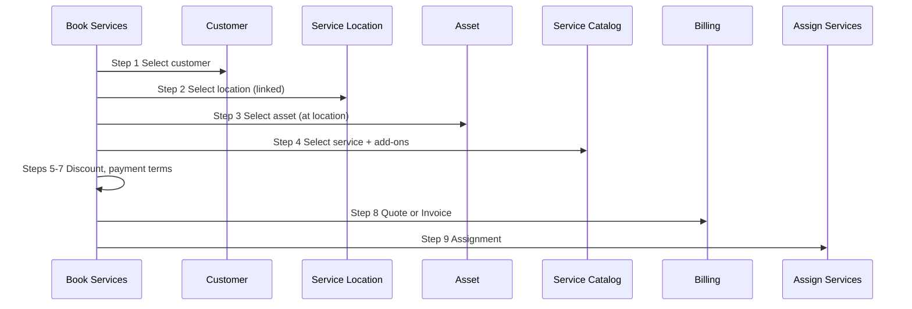
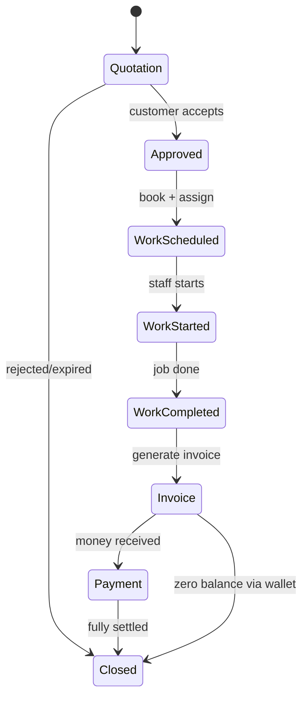

# Data Relationship Model V1

**Project:** CWP Detailers  
**Date:** 14 June 2026  
**Status:** Architecture Freeze — Documentation Only  
**Companion docs:** [`PRODUCTS_SERVICES_ADMIN_RESTRUCTURE_REPORT_V3.md`](./PRODUCTS_SERVICES_ADMIN_RESTRUCTURE_REPORT_V3.md), [`SCREEN_MAPPING_V2.md`](./SCREEN_MAPPING_V2.md)

---

## Purpose

Define the **complete domain relationship model** for the founder-approved architecture before any implementation. This document covers ownership, linking rules, lifecycle, and scalability for:

Customer · Service Location · Asset · Service · Booking · Assignment · Invoice · Payment · Wallet

**No code changes. No migrations. No schema edits in this phase.**

---

## 1. Entity Overview

| Entity | Role | Owns data? | Created in module |
|--------|------|------------|-------------------|
| **Customer** | Legal/commercial party (retail or corporate) | Profile, GST, commercial terms | Customers |
| **Service Location** | Physical site where work happens | Address, geo, site label | Service Locations (or Customers link view) |
| **Asset** | Serviceable object at a location | Vehicle, solar plant, future types | Assets |
| **Service** | Catalog item (plan, package, one-time) | Pricing, GST, add-ons | Services |
| **Booking** | Scheduled or recurring work instance | Status, schedule, line items | Book Services (runtime) |
| **Assignment** | Staff/route mapping to work | Staff, route order, assign mode | Assign Services |
| **Invoice** | Tax document for money owed | Line items, GST, totals | Billing & Finance (+ emit from Book Services) |
| **Payment** | Money received against invoice/customer | Amount, mode, reference | Billing & Finance |
| **Wallet** | Monetary adjustment ledger (₹ only) | Balance, credit/debit transactions | Billing & Finance |

### Explicitly NOT Wallet

| Concept | Storage | Relationship to Wallet |
|---------|---------|------------------------|
| Package wash credits | `customer_entitlements` | **None** — separate entitlement counter |
| Solar AMC visit credits | `customer_entitlements` | **None** |
| Loyalty points | Not in scope | **None** |
| Service visit quotas | DCMS subscription limits | **None** |

---

## 2. Wallet vs Entitlements (Founder Rule)

### Wallet — Monetary Adjustment Ledger Only

**Supported use cases:**

- Customer paid extra amount (overpayment → wallet credit)
- Advance payment adjustment
- Refund adjustment (credit to wallet instead of cash)
- Credit adjustment (goodwill / dispute resolution)
- Manual finance adjustment

**Worked example:**

```
Invoice A     = ₹900
Customer paid = ₹1,000
─────────────────────────
Wallet credit = ₹100   (overpayment stored as ₹ balance)

Later — Invoice B = ₹500
Wallet applied  = ₹100
Customer pays   = ₹400
─────────────────────────
Wallet balance  = ₹0
```

Wallet transactions are always **currency (₹)**. They never decrement wash counts or service visit quotas.

### Entitlements — Service Credits (Separate)

When a customer buys a **5-wash package**, the system creates `customer_entitlements` with `remainingWashes: 5`. Consuming a wash decrements entitlement — **not** wallet balance.

| Question | Wallet | Entitlement |
|----------|--------|-------------|
| Can pay an invoice? | Yes (₹) | No |
| Can redeem a wash? | No | Yes (count) |
| Shows on Customer 360? | Balance summary (₹) | Active Services summary |
| Managed in? | Billing & Finance | Book Services → runtime |

---

## 3. Core Relationship Diagram



---

## 4. Relationship Rules (Detailed)

### 4.1 Customer

| Rule | Description |
|------|-------------|
| **Ownership** | Customer record owns identity: name, phone, email, type (retail/corporate), GSTIN, branch |
| **Does not own** | Assets, service locations, bookings, invoices (has relationships, not embedded CRUD) |
| **Lifecycle** | Lead → Active → Churned → Reactivated |
| **Linking** | Many locations, many assets, many bookings, one wallet balance |

### 4.2 Service Location

| Rule | Description |
|------|-------------|
| **Ownership** | Independent master: label, address, geo coordinates, location type (office/factory/residence/parking/other) |
| **Cardinality** | One customer → **many** service locations |
| **Purpose** | Where staff travels to perform work; bookings **must** reference a service location |
| **Example** | Customer "ABC Industries" → Head Office, Factory, Director Residence |
| **Asset placement** | Assets are linked to a service location (SUV 1 at Head Office parking; Solar Plant at Factory) |
| **Lifecycle** | Active → Inactive (no delete if historical bookings exist) |



### 4.3 Asset

| Rule | Description |
|------|-------------|
| **Ownership** | Independent master record — **not** created inside Customer module |
| **Types (V1)** | Vehicle, Solar Site |
| **Types (future)** | Fleet equipment, genset, other serviceable assets |
| **Placement** | Linked to one primary service location; may have customer link for commercial ownership |
| **Customer link** | Explicit `customer_asset_links` — customer does not "own" asset CRUD |
| **Lifecycle** | Active → Transferred (relink) → Retired |
| **Booking** | Book Services selects asset **within** chosen service location |

| Asset Type | Key fields | Service lines |
|------------|------------|---------------|
| Vehicle | Reg no, make, model, color | Daily cleaning, doorstep wash |
| Solar Site | Panel count, capacity, roof type | Solar cleaning, solar AMC |

### 4.4 Service (Catalog)

| Rule | Description |
|------|-------------|
| **Ownership** | Catalog module — no customer FK |
| **Types** | DCMS plan, doorstep one-time, wash package, solar one-time, solar AMC |
| **Relationship** | Selected in Book Services Step 4; priced per asset/location context |
| **Lifecycle** | Draft → Active → Retired (existing catalog rows remain for history) |

### 4.5 Booking (Runtime Work Order)

| Rule | Description |
|------|-------------|
| **Ownership** | Created by Book Services; references customer + location + asset + catalog service |
| **Required FKs** | `customerId`, `serviceLocationId`, `assetId` (where applicable), `serviceCatalogRef` |
| **Variants** | One-time booking, DCMS subscription (recurring), entitlement consumption |
| **Lifecycle** | See §6 Billing & Work Lifecycle |
| **Billing link** | May originate from quotation; may generate invoice on completion |

### 4.6 Assignment

| Rule | Description |
|------|-------------|
| **Ownership** | Assign Services module |
| **Types** | Booking staff assign (`bookings.staffId`), DCMS route assign (`dcms_staff_assignments`) |
| **Modes** | Auto, manual, queue |
| **Relationship** | 1 booking/subscription → 0..1 active assignment (reassign allowed) |
| **Lifecycle** | Pending → Assigned → Reassigned → Completed |

### 4.7 Invoice

| Rule | Description |
|------|-------------|
| **Ownership** | Billing & Finance (created there or emitted from Book Services Step 8) |
| **Links** | `customerId`, optional `bookingId` / `quotationId`, line items |
| **Wallet** | Invoice may apply wallet balance at payment time (₹ offset) |
| **Lifecycle** | Draft → Issued → Partially Paid → Paid → Closed; Credit Note branches from Issued |

### 4.8 Payment

| Rule | Description |
|------|-------------|
| **Ownership** | Billing & Finance |
| **Links** | `invoiceId` and/or `customerId` |
| **Overpayment** | Excess vs invoice → wallet credit (₹) |
| **Lifecycle** | Recorded → Reconciled → (optional) Refunded to wallet |

### 4.9 Wallet

| Rule | Description |
|------|-------------|
| **Ownership** | Billing & Finance (ledger); summary on Customer 360 |
| **Balance** | Single ₹ balance per customer |
| **Transactions** | credit \| debit with reason code |
| **Never** | Wash count, visit count, loyalty points |

---

## 5. Book Services Context Chain

Every booking must resolve this chain:

```
Customer → Service Location → Asset → Service → [runtime]
```

| Step | Entity | Validation |
|------|--------|------------|
| 1 | Customer | Active customer; corporate GSTIN if B2B |
| 2 | Service Location | Must be linked to customer |
| 3 | Asset | Must be linked to selected service location |
| 4 | Service | Catalog item compatible with asset type |
| 5+ | Add-ons, discount, payment terms, quote/invoice, assignment | Business rules |



---

## 6. Billing & Work Lifecycle

### 6.1 Standard Lifecycle

```
Quotation → Approved → Work Scheduled → Work Started → Work Completed → Invoice → Payment → Closed
```

| Status | Definition | Module |
|--------|------------|--------|
| **Quotation** | Draft or sent price offer; no work committed | Billing & Finance / Book Services emit |
| **Approved** | Customer accepted quotation; may require advance | Book Services / Billing |
| **Work Scheduled** | Booking created with date/route | Book Services |
| **Work Started** | Staff en route or in progress | Service Updates |
| **Work Completed** | Service delivered; proof captured | Service Updates |
| **Invoice** | Tax invoice issued (may follow quotation conversion) | Billing & Finance |
| **Payment** | Full or partial payment recorded; wallet may apply | Billing & Finance |
| **Closed** | No outstanding balance for this work line | Billing & Finance |



### 6.2 Alternate Payment Flows

#### Full Advance

```
Approved → Payment (full) → Work Scheduled → … → Invoice (receipt/reconciliation) → Closed
```

Advance may credit wallet if overpaid; invoice issued after completion for compliance or marked paid-from-advance.

#### Partial Advance

```
Approved → Payment (partial) → Work Scheduled → … → Invoice → Payment (balance) → Closed
```

Outstanding tracked in Dues & Collections.

#### Post-Service Payment

```
Approved → Work Scheduled → … → Work Completed → Invoice → Payment → Closed
```

No payment required before work starts.

---

## 7. Customer 360 Read Models

Customer 360 does **not** own billing or asset CRUD. It displays **summaries**:

| Summary | Source entities | Fields shown |
|---------|-----------------|--------------|
| **Billing Summary** | Invoice, Payment, Wallet, Dues | Outstanding due, wallet ₹ balance, last invoice, last payment, Open Billing CTA |
| **Linked Locations** | Service Location links | Read-only list + link to Service Locations module |
| **Linked Assets** | Asset links | Read-only list + link to Assets module |
| **Active Services** | Bookings, DCMS subs, entitlements | Read-only + Book Service CTA |

---

## 8. Linking Tables (Proposed — Documentation Only)

These tables describe the **target model**. No migration in this phase.

| Table | Purpose |
|-------|---------|
| `service_locations` | Location master records |
| `customer_location_links` | Customer ↔ location (with effective dates) |
| `assets` | Unified asset master (or typed: vehicles, solar_sites) |
| `location_asset_links` | Location ↔ asset placement |
| `customer_asset_links` | Commercial link customer ↔ asset (optional if location implies customer) |
| `bookings.serviceLocationId` | Required on new bookings |
| `wallet_transactions` | ₹ credit/debit ledger |
| `customer_entitlements` | Package visit credits (unchanged concept) |

### Migration note (future implementation)

Today `vehicles.customerId` and `solar_sites` imply direct ownership. Target model introduces locations and link tables while preserving historical FKs until Phase 1b/2 migration scripts run.

---

## 9. Scalability & Future

| Area | V1 | Future |
|------|-----|--------|
| Asset types | Vehicle, Solar Site | Equipment, fleet, custom types |
| Service locations | Unlimited per customer | Geo-fencing, service area validation |
| Multi-branch | Branch on customer/booking | Franchisee-scoped locations |
| Wallet | ₹ ledger | Payment gateway auto-reconcile |
| Entitlements | Wash/solar packages | Subscription marketplace |
| Booking | 3 service lines | Additional lines reuse same chain |

---

## 10. Recommendation Register

Each architectural element with implementation metadata:

| # | Recommendation | Priority | Risk | Dependency |
|---|----------------|----------|------|------------|
| R1 | Introduce `service_locations` entity | **Critical** | Medium | Phase 1b |
| R2 | Introduce location ↔ customer link model | **Critical** | Medium | Phase 1b |
| R3 | Assets as independent masters | **Critical** | Medium | Phase 1b |
| R4 | Location ↔ asset placement links | **Critical** | Medium | Phase 1b |
| R5 | Book Services 9-step flow with location step | **Critical** | High | Phase 2 |
| R6 | Wallet ₹-only enforcement in UI + API docs | **Critical** | Low | Phase 2 |
| R7 | Entitlements remain separate from wallet | **Critical** | Low | Phase 2 |
| R8 | Customer 360 Billing Summary (read-only) | **High** | Low | Phase 2 |
| R9 | Billing lifecycle status enum | **High** | Medium | Phase 2 |
| R10 | Full / partial / post-service payment paths | **High** | Medium | Phase 2 |
| R11 | Billing & Finance as separate module | **High** | Low | Phase 1 |
| R12 | Customer module blocks service creation | **High** | Low | Phase 2 |
| R13 | Service Locations admin module | **High** | Medium | Phase 1b |
| R14 | Unified Assign Services | **High** | Medium | Phase 3 |
| R15 | Service Updates dashboard | **Medium** | Low | Phase 4 |
| R16 | Future asset types extensibility | **Low** | Low | Future |
| R17 | Franchisee-scoped locations | **Low** | High | Future |

---

## Document History

| Version | Date | Changes |
|---------|------|---------|
| 1.0 | 14 Jun 2026 | Initial domain relationship model — architecture freeze |

---

*Documentation only. No code, routes, migrations, or schema changes.*
