# Founder Acceptance Test

**Project:** CWP Detailers  
**Date:** 15 June 2026  
**Phase:** Post–Founder UX Phase 2 — live usability validation  
**Reference:** [`FOUNDER_UX_PHASE_2_COMPLETION_REPORT.md`](./FOUNDER_UX_PHASE_2_COMPLETION_REPORT.md)  
**Status:** **Acceptance testing complete — not signed off for franchise rollout**

---

## Purpose

Validate **real usability** in a running admin session — not code-path or static copy audits. Each workflow was walked through in the browser against `http://localhost:21456` with screenshots captured at decision points.

**Constraint honored:** No new development or features during this test.

---

## Test environment

| Item | Value |
|------|--------|
| App URL | `http://localhost:21456` |
| Build | Local dev (`pnpm dev`) |
| Session role | **Superadmin** (Tushar Saraswat) |
| Login | Per `logindetails.md` |
| Test customer created | **Founder Acceptance Test** — phone `9090909091`, customer id **14**, Varanasi service address, **no vehicle on file** |
| Secondary customer | **Prateek Khanna** (id 13) — used to reproduce empty service-address state |

**Caveat:** Phase 2 targets a **franchise branch owner**. This session used superadmin, so HQ-only affordances (catalog price editing, Legacy section) were visible. A follow-up pass under a branch-only role (`admin` / `manager`) is recommended before franchise sign-off.

**Screenshots:** [`founder-acceptance-screenshots/`](./founder-acceptance-screenshots/)

---

## Executive verdict

| # | Workflow | Verdict | Clicks to complete sale/booking | Blocker |
|---|----------|---------|----------------------------------|---------|
| 1 | New Customer | **Pass** | ~6 | None |
| 2 | Car Wash Booking | **Fail** | ~8 (stopped at step 3) | No vehicle on customer profile |
| 3 | Wash Package Sale | **Partial** | ~5 (catalog only) | Same vehicle gate in Book Service |
| 4 | Daily Cleaning Plan Sale | **Partial** | ~5 (catalog only) | Booking not completed |
| 5 | Solar Plan Sale | **Partial** | ~5 (catalog only) | Booking not completed |
| 6 | Staff Assignment | **Pass** (review) | ~4 | Queue empty for new test customer |
| 7 | Invoice & Payment Collection | **Partial** | ~6 (view only) | No invoice exists for test customer; payment flow not exercised |
| 8 | Complaint Review | **Pass** (review) | ~3 | Seed data contains terminology leak |

**Overall:** Navigation and catalog restructuring largely match the founder model. **Revenue workflows 2–5 cannot be completed end-to-end** for a newly created customer without first registering a vehicle — and the path to do that is not obvious from the booking wizard alone.

---

## Global findings

### What works (founder-aligned)

- Primary sidebar has **no Assets or Locations modules** — customer-first ops structure is visible.
- **Service Catalog** exposes three revenue lines: Car Wash (Services + Packages), Daily Cleaning (Plans), Solar Cleaning (three sellable products).
- Customer Profile uses **Overview / Profile / Bills / Communications** tabs.
- Book Service wizard step labels use **Service Address** and **Vehicle / Solar Site**.
- Staff screen uses **Role type** instead of category language.
- Billing invoice filter uses **Refund notes** (not Credit Notes).

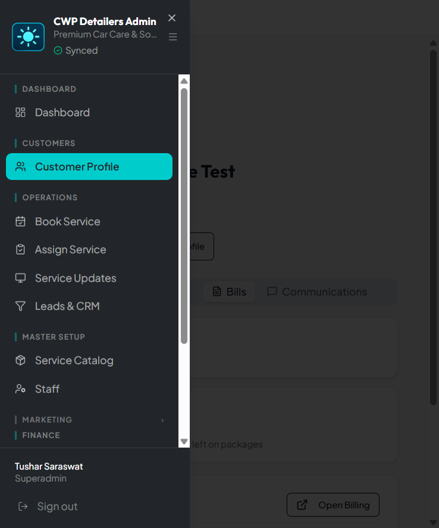

### Cross-cutting confusion points

1. **`?customerId=` deep link ignored** — Navigating to Book Service with a customer id in the URL still requires manual customer search/selection (extra clicks, breaks “Book Service” from profile).
2. **Vehicle registration not inline in booking** — Step 3 tells the user to ask HQ to register the car; no “Add vehicle” action on the wizard.
3. **New customer create form** — Service address can be captured at signup, but **vehicle is not** — yet car wash booking requires it immediately after.
4. **Dev footer on customer list** — “Powered by shared DataTable / Can primitives” reads as engineering jargon.
5. **Legacy section still visible to superadmin** — Expected for HQ; must be hidden or clearly non-franchise for branch roles.

### Cross-cutting terminology leaks

| Surface | Leak | Severity |
|---------|------|----------|
| Customer list subtitle | “services, **locations**, and bills” | Medium |
| Book Service header | “Select customer, **location**, vehicle…” | High |
| Book Service intro | “**contract**, billing document, **pending assignment queue**” | High |
| Book Service step 3 | “ask **HQ** to register the customer's car first” | Medium (franchise voice) |
| Customer Overview | “No service **contracts** yet”; “0 active plan**s**” spacing | Medium |
| Assign Service | “**All locations**”, “**Location**” filter, “**pending queue**” | High |
| Billing invoices table | “**Contract**” column | Medium |
| Billing actions | Duplicate “Record payment” / “Record Payment” | Low (UX) |
| Solar seed products | “12 Month Solar **AMC**”, “Annual maintenance **contract**” | Medium |
| Daily Cleaning catalog | Link: “Legacy daily cleaning operations (visits, routes)” | Low (HQ/legacy) |
| Complaints seed | Description “**clean card**” (typo / internal) | Low |
| Customer Bills tab | “Money balance only — not washes left on packages” | Positive clarification |

---

## Workflow 1 — New Customer

**Verdict: Pass**

### User journey

1. Open hamburger → **Customer Profile**
2. Click **New customer**
3. Fill name, phone (`9090909091`), city/service address (Varanasi)
4. Submit → success toast → land on new customer profile

### Screenshots

| Step | Image |
|------|-------|
| Create dialog | 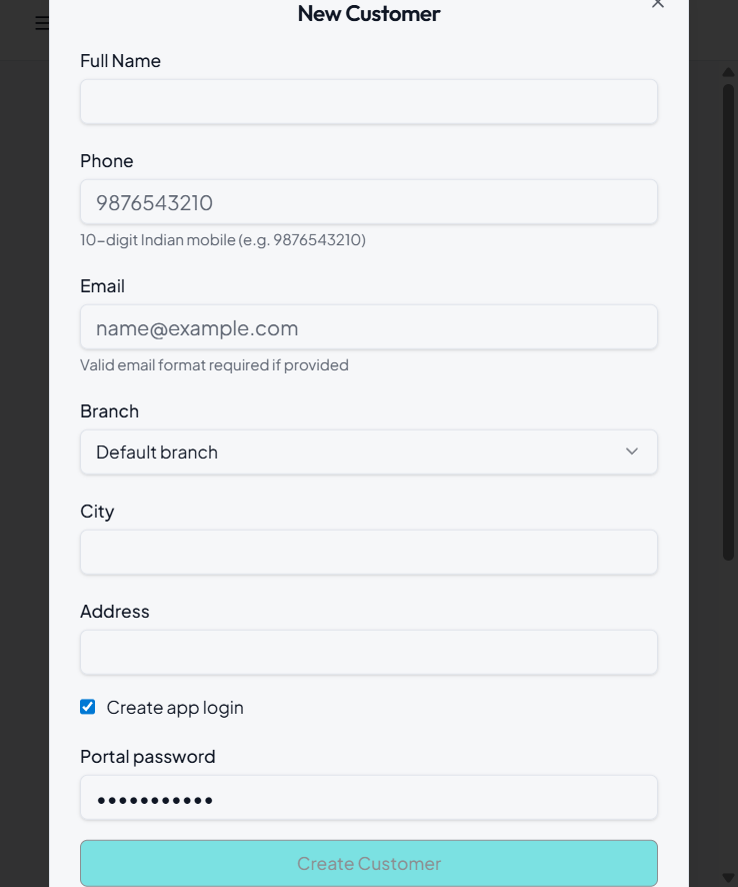 |
| Success | 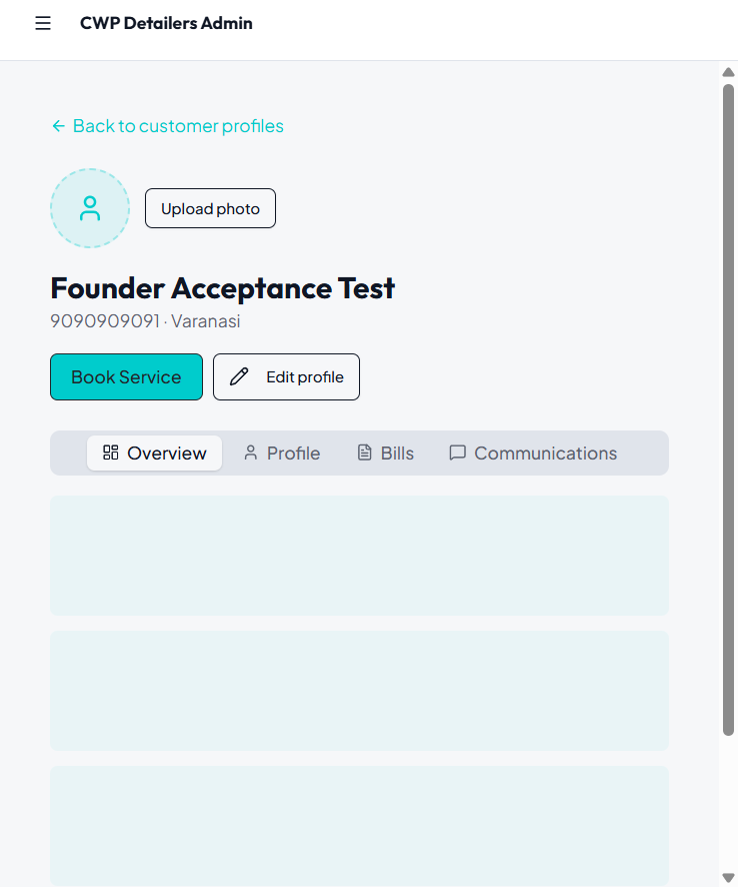 |
| Profile Overview | 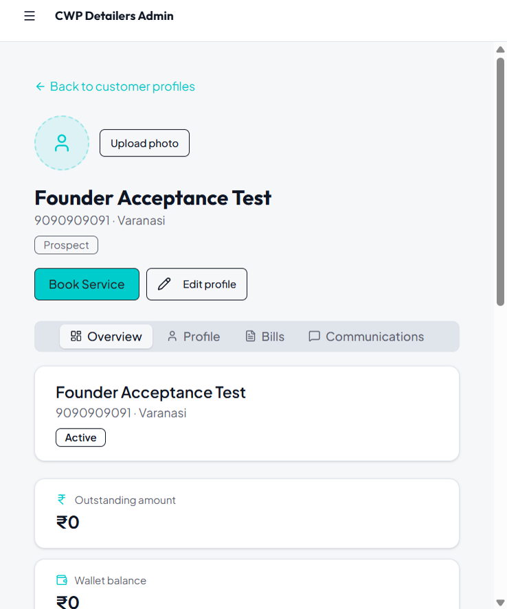 |

### Click count

| Action | Clicks |
|--------|--------|
| Nav → Customer Profile | 2 |
| New customer → open dialog | 1 |
| Fill form + Create | 1 |
| **Total to live profile** | **~6** |

### Confusion points

- List page subtitle still mentions “locations” — undermines customer-first messaging.
- After create, customer shows as **Prospect** with ₹0 balances — clear, but no guided “next step” beyond **Book Service** CTA.
- Portal password field exists on create form; not clearly explained to a non-technical owner.

### Terminology leaks

- Customer list: “locations” in subtitle.
- Overview: “No service contracts yet” (prefer “plans” or “active services”).

---

## Workflow 2 — Car Wash Booking

**Verdict: Fail** (could not reach service selection or confirmation)

### User journey (attempted)

1. From customer profile → **Book Service** (or Operations → Book Service)
2. Step 1 — Select customer: search “Founder Acceptance Test”, select
3. Step 2 — **Service Address**: Varanasi address from create form appears ✓
4. Step 3 — **Vehicle / Solar Site**: **empty** — blocked with message to register car via HQ
5. *(Did not reach)* Step 4 service picker (Foam Wash, etc.) or confirmation

**Secondary attempt (Prateek Khanna):** Blocked earlier at Step 2 — no service address on file.

### Screenshots

| Step | Image |
|------|-------|
| Step 1 — Customer | 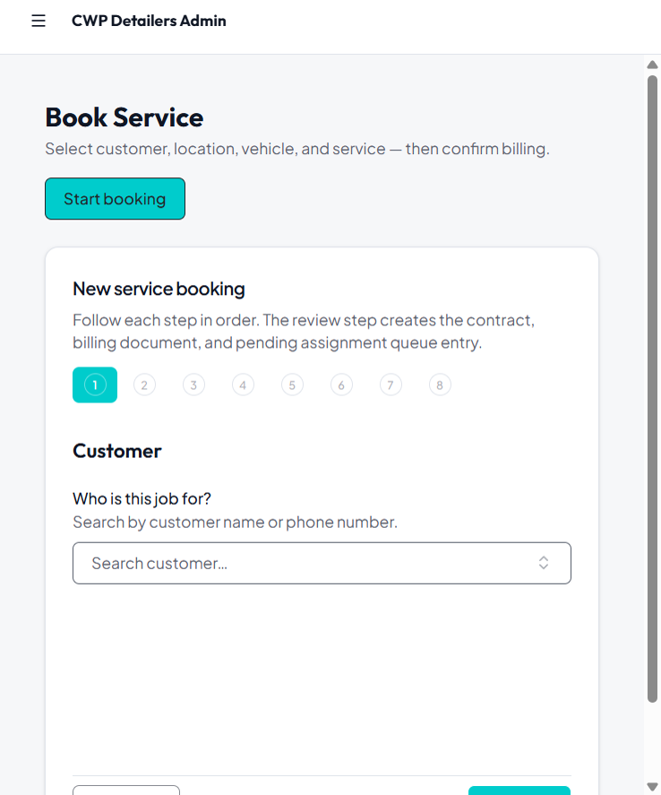 |
| Step 2 — Service address (Founder test) | 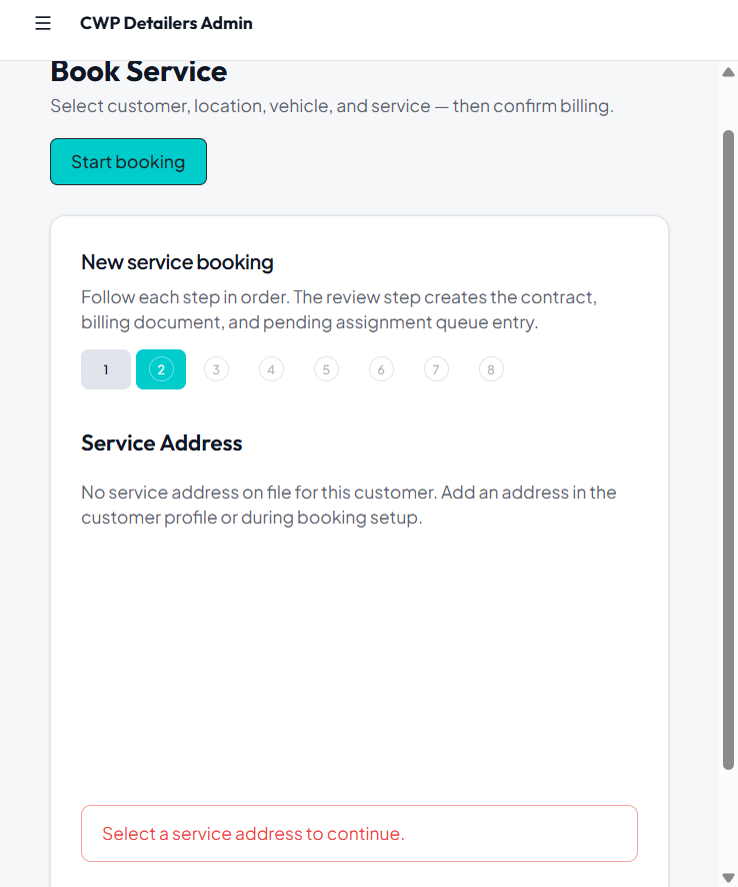 |
| Step 2 — Empty (Prateek) | 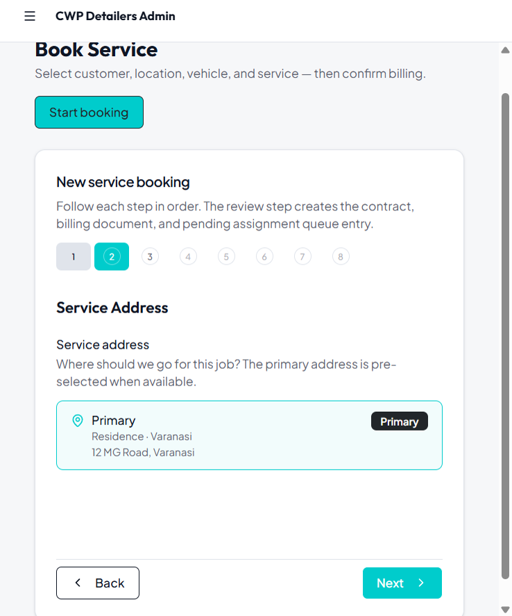 |
| Step 3 — Vehicle blocked | 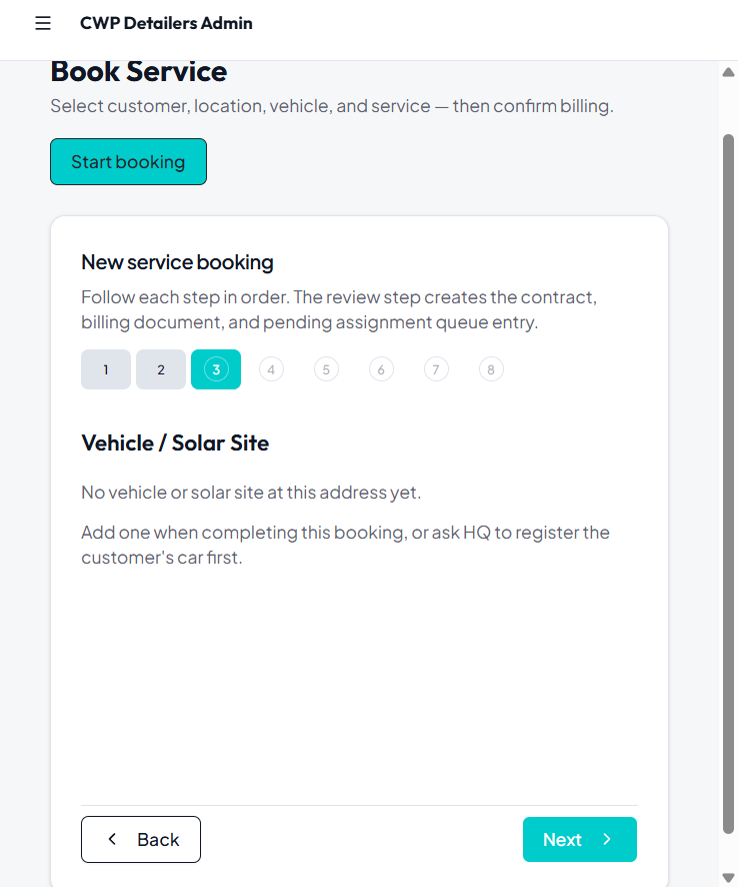 |

### Click count

| Action | Clicks |
|--------|--------|
| Nav / profile → Book Service | 1–2 |
| Customer search + select | 2 |
| Next through address step | 2 |
| Stopped at vehicle step | — |
| **Total before block** | **~8** |

### Confusion points

- Header still says “location” and mentions “contract” and “pending assignment queue” — reads like backend workflow, not a car wash booking.
- **`?customerId=14` does not pre-select customer** when opening Book Service from profile deep link.
- No inline **Add vehicle** on step 3; owner must discover Profile tab separately.
- “Ask HQ to register the customer's car” is wrong voice for a franchise owner booking locally.

### Terminology leaks

- “location”, “contract”, “pending assignment queue”, “HQ” (see global table).

---

## Workflow 3 — Wash Package Sale

**Verdict: Partial** — catalog validated; **sale not completed**

### User journey (completed portion)

1. Master Setup → **Service Catalog**
2. Revenue line: **Car Wash**
3. Sub-tab: **Packages**
4. Review 4 / 8 / 12 wash packages with plain-language inclusions

*(Not completed)* Book Service → select package → invoice/assignment — blocked by Workflow 2 vehicle gate.

### Screenshots

| Step | Image |
|------|-------|
| Car Wash catalog shell |  |
| Packages tab | 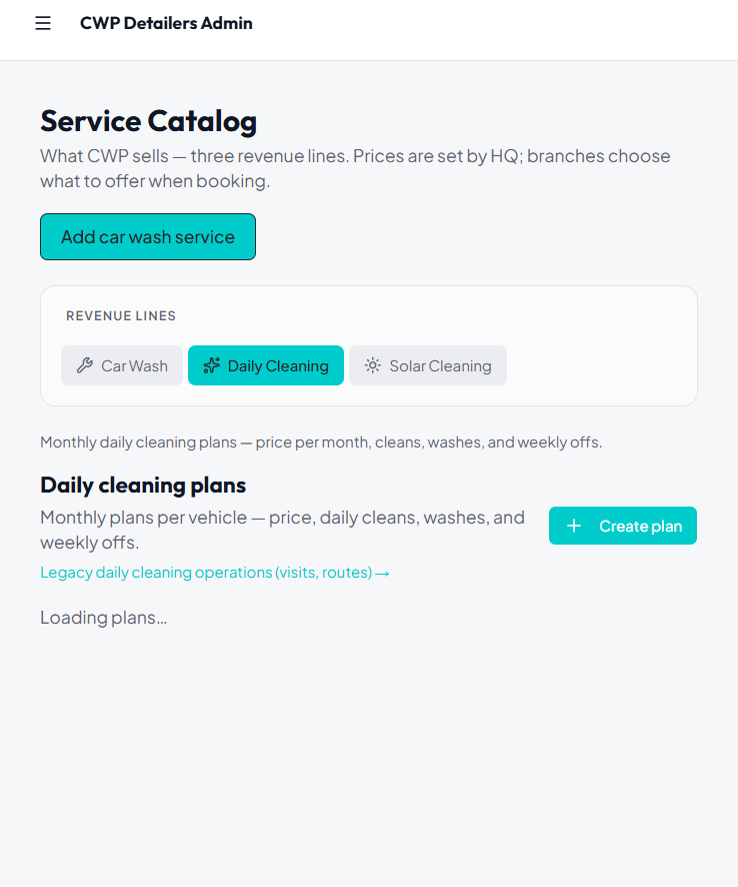 |

### Click count

| Action | Clicks |
|--------|--------|
| Nav → Service Catalog | 2 |
| Car Wash → Packages | 2 |
| **Catalog review only** | **~5** |
| Full sale (not reached) | +8+ est. |

### Confusion points

- Catalog clearly separates **Services** vs **Packages** — aligns with founder model ✓
- No obvious “Sell this package” from catalog — owner must know to use **Book Service** (discoverability).
- Cannot validate post-sale wallet/plan counters without completing booking.

### Terminology leaks

- Package cards generally clean (“washes included”).
- No forbidden “entitlement” visible on cards ✓

---

## Workflow 4 — Daily Cleaning Plan Sale

**Verdict: Partial** — catalog validated; **sale not completed**

### User journey (completed portion)

1. Service Catalog → **Daily Cleaning**
2. Review plan cards (e.g. Premium — ₹/month, daily cleans, washes, weekly offs)
3. HQ superadmin sees price edit controls (expected under Option A for HQ only)

*(Not completed)* Book Service → daily cleaning plan → billing cycle — blocked by vehicle/address prerequisites in booking path.

### Screenshots

| Step | Image |
|------|-------|
| Daily Cleaning plans | 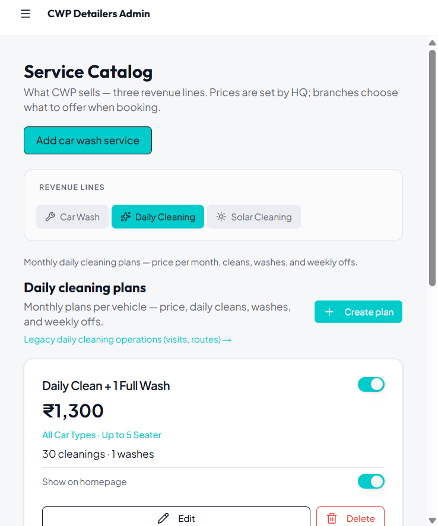 |
| Alternate capture | 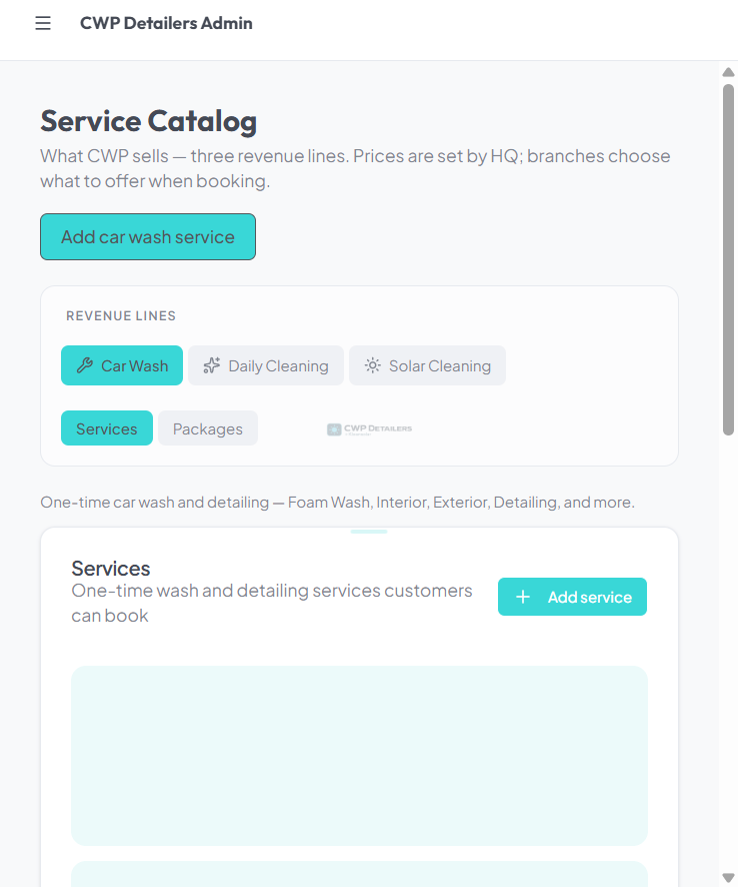 |

### Click count

| Action | Clicks |
|--------|--------|
| Nav → Catalog → Daily Cleaning | 3 |
| **Catalog review only** | **~5** |

### Confusion points

- “Daily Cleaning” label replaces DCMS in catalog ✓
- Footer link **“Legacy daily cleaning operations (visits, routes)”** exposes ops jargon to anyone who can see Legacy — acceptable for HQ, confusing for franchise if visible.
- Plan vs wash package distinction is visually clear ✓

### Terminology leaks

- “Legacy daily cleaning operations” — borderline internal.
- No “DCMS” on primary catalog surface ✓

---

## Workflow 5 — Solar Plan Sale

**Verdict: Partial** — catalog validated; **sale not completed**

### User journey (completed portion)

1. Service Catalog → **Solar Cleaning**
2. Confirm three sellable sections: One Time, 6 Month Plan, 12 Month Plan
3. No slab/matrix UI exposed ✓

*(Not completed)* Book Service solar path → confirmation.

### Screenshots

| Step | Image |
|------|-------|
| Solar catalog | 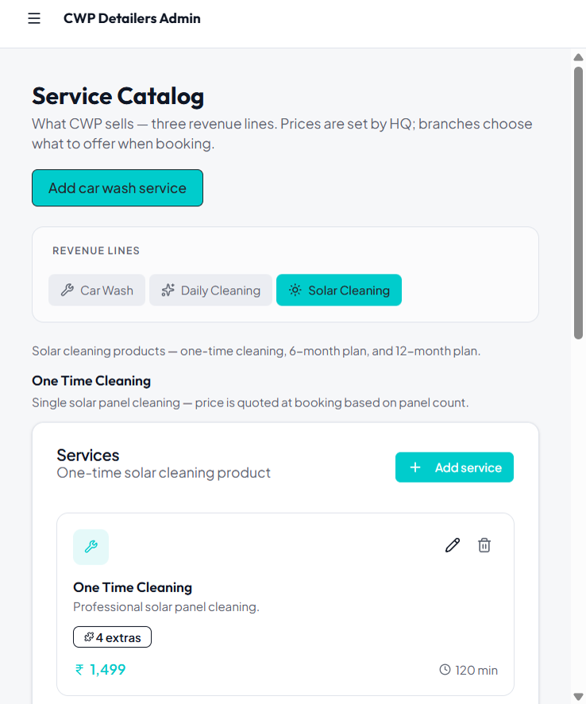 |
| Alternate capture | 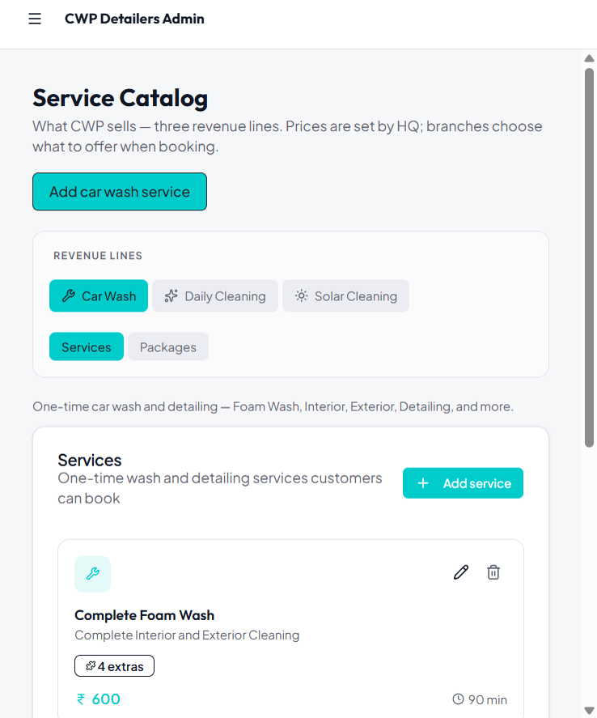 |

### Click count

| Action | Clicks |
|--------|--------|
| Nav → Catalog → Solar | 3 |
| **Catalog review only** | **~5** |

### Confusion points

- Product names use **AMC** and seed copy says “Annual maintenance **contract**” — founder sells “6 Month Plan / 12 Month Plan”; AMC/contract is engineer/insurance language.
- Slabs not shown — matches V3 ruling ✓

### Terminology leaks

- “AMC”, “contract” in solar product seed names/descriptions.

---

## Workflow 6 — Staff Assignment

**Verdict: Pass** (screens reviewed; no pending job for test customer)

### User journey

1. Master Setup → **Staff** — roster with role types
2. Operations → **Assign Service** — pending queue, location filter, assignment actions

No open car-wash job existed for Founder Acceptance Test customer, so assign-to-staff action was not exercised on live data.

### Screenshots

| Step | Image |
|------|-------|
| Staff roster | 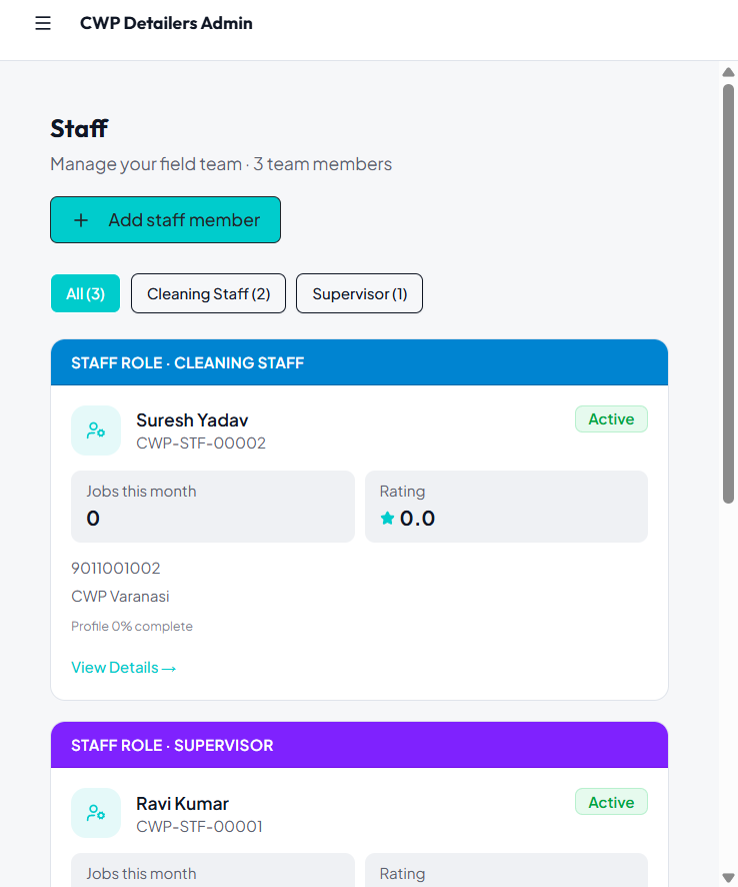 |
| Assign Service queue | 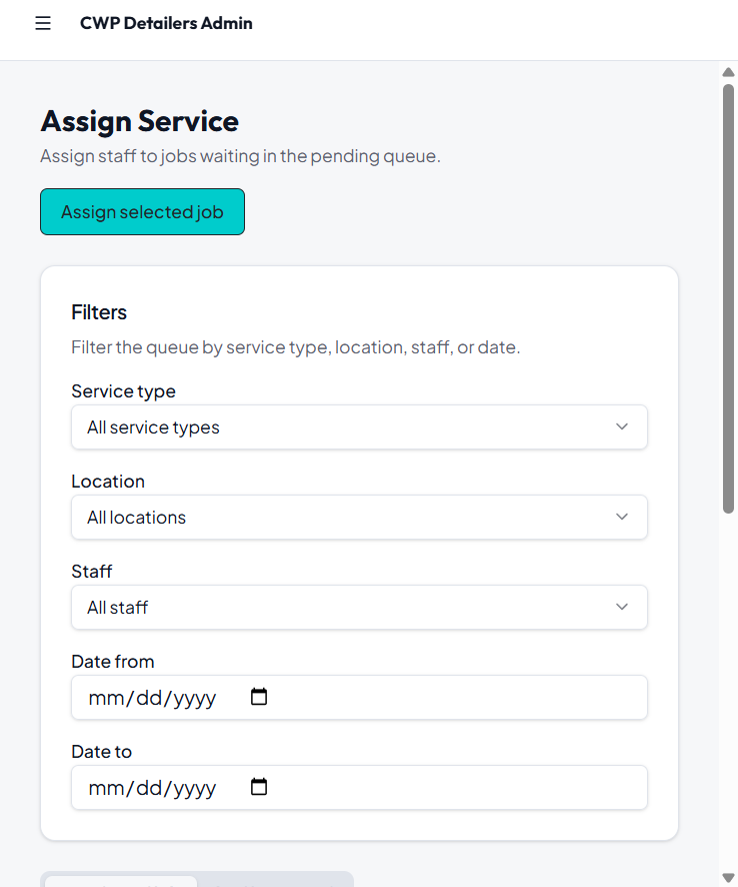 |

### Click count

| Action | Clicks |
|--------|--------|
| Staff page | 2 |
| Assign Service queue | 2 |
| **Review total** | **~4** |

### Confusion points

- Assign Service still framed as “**pending queue**” — backend language.
- Filter label **“All locations”** / column **“Location”** — should be service address or branch/city in franchise voice.
- Without a booking, owner cannot validate end-to-end assign → notify flow.

### Terminology leaks

- “Location”, “pending queue”, “All locations”.

---

## Workflow 7 — Invoice & Payment Collection

**Verdict: Partial** — billing surfaces reviewed; **no payment recorded**

### User journey (completed portion)

1. Finance → **Billing & Finance** → Invoices tab
2. Customer Profile → **Bills** tab for Founder Acceptance Test
3. Observed ₹0 outstanding, empty invoice/payment history, **Open Billing** CTA

*(Not completed)* Create invoice → Record payment → verify balance update — no invoice existed for test customer because booking workflows did not complete.

### Screenshots

| Step | Image |
|------|-------|
| Billing invoices | 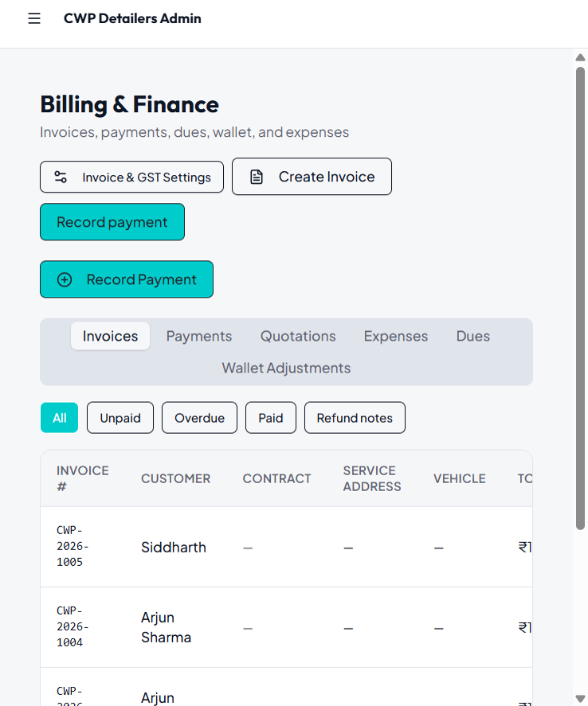 |
| Customer Bills tab |  |

### Click count

| Action | Clicks |
|--------|--------|
| Billing & Finance | 2 |
| Customer → Bills tab | 2 |
| Open Billing (not clicked through) | — |
| **View-only total** | **~6** |

### Confusion points

- Bills tab copy is helpful: wallet vs package washes clarified ✓
- Two similarly labeled payment buttons on billing page (“Record payment” vs “Record Payment”) — minor friction.
- **Contract** column on invoice list — forbidden vocabulary for franchise owner.
- Dependency chain: no booking → no invoice → payment flow untested in this session.

### Terminology leaks

- “Contract” column in billing.
- “Refund notes” label is correct ✓

---

## Workflow 8 — Complaint Review

**Verdict: Pass** (list and detail patterns reviewed)

### User journey

1. Support → **Complaints**
2. Review open vs resolved complaints, customer linkage, status filters

### Screenshots

| Step | Image |
|------|-------|
| Complaints list | 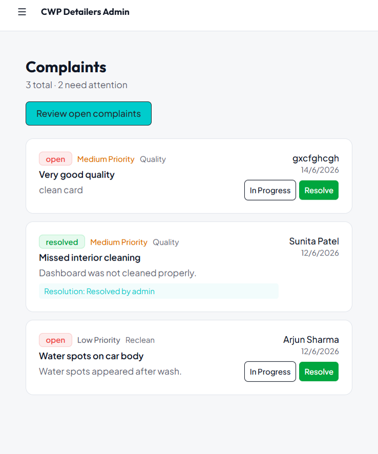 |

### Click count

| Action | Clicks |
|--------|--------|
| Nav → Complaints | 2 |
| Scan list / open row (optional) | 1 |
| **Review total** | **~3** |

### Confusion points

- Screen is approachable — customer-centric list ✓
- Seed complaint body text (“clean card”) looks like placeholder/typo — reduces trust in demo data.
- Could not tie complaint to Founder Acceptance Test (no complaints for new customer).

### Terminology leaks

- Seed data typo only; no Asset/DCMS/Matrix on list chrome ✓

---

## Recommended re-test checklist (before sign-off)

No coding authorized until founder reviews this report. After fixes (separate authorization), re-run:

1. **New customer → add vehicle on Profile tab → Book Service foam wash → confirm invoice**
2. Repeat booking for **8-wash package**, **daily cleaning plan**, **solar 6-month plan**
3. **Assign Service** on resulting pending job
4. **Record payment** on generated invoice; verify Bills tab updates
5. Full pass logged in as **branch manager** (not superadmin) to confirm Option A read-only catalog + hidden Legacy

---

## Sign-off gate

| Criterion | Met? |
|-----------|------|
| All 8 workflows completable without engineer help | **No** |
| Zero forbidden words in primary workflows | **No** |
| Customer → Book → Pay path under 15 clicks | **Not measured** (blocked) |
| Franchise role test | **Not run** |

**Recommendation:** Treat Phase 2 UX as **conditionally accepted for catalog/navigation**; **reject revenue workflow sign-off** until vehicle onboarding in booking is resolved and terminology leaks in Book Service / Assign Service / Billing are cleaned in a follow-up UX patch (explicitly authorized).

---

## Appendix — Screenshot index

| File | Workflow |
|------|----------|
| `00-sidebar-navigation.png` | Global nav |
| `01-new-customer-dialog.png` | 1 — New Customer |
| `01-new-customer-success.png` | 1 — New Customer |
| `01-customer-overview.png` | 1 — New Customer |
| `02-book-service-step1-customer.png` | 2 — Car Wash Booking |
| `02-car-wash-step2-service-address.png` | 2 — Car Wash Booking |
| `02-book-service-step2-service-address-empty.png` | 2 — Car Wash Booking |
| `02-car-wash-step3-vehicle.png` | 2 — Car Wash Booking |
| `03-wash-packages-catalog.png` | 3 — Wash Package |
| `04-service-catalog-car-wash.png` | 3 — Wash Package |
| `05-daily-cleaning-plans-catalog.png` | 4 — Daily Cleaning |
| `05-service-catalog-daily-cleaning.png` | 4 — Daily Cleaning |
| `06-solar-plans-catalog.png` | 5 — Solar |
| `06-service-catalog-solar.png` | 5 — Solar |
| `07-staff-page.png` | 6 — Staff |
| `07-assign-service-queue.png` | 6 — Staff Assignment |
| `08-billing-invoices.png` | 7 — Invoice & Payment |
| `08-customer-bills-tab.png` | 7 — Invoice & Payment |
| `09-complaints.png` | 8 — Complaint Review |
