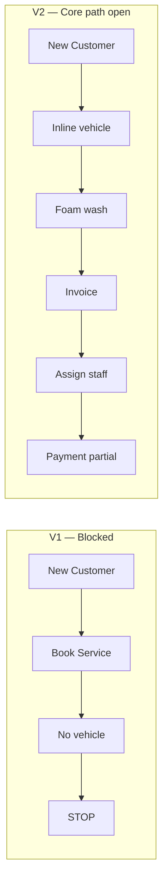

# Founder Acceptance Test V2

**Project:** CWP Detailers  
**Date:** 15 June 2026  
**Phase:** Post–Founder Business Model Alignment — live usability re-validation  
**Reference:** [`FOUNDER_BUSINESS_MODEL_ALIGNMENT_REPORT.md`](./FOUNDER_BUSINESS_MODEL_ALIGNMENT_REPORT.md), [`FOUNDER_ACCEPTANCE_TEST.md`](./FOUNDER_ACCEPTANCE_TEST.md) (V1)  
**Status:** **Re-test complete — improved vs V1; not signed off for franchise rollout**

---

## Purpose

Re-run founder acceptance testing after the business-model alignment pass (inline booking, status model, terminology cleanup). Validate **six revenue workflows end-to-end** in a live admin session — not static copy audits.

**Constraint honored:** No new development or features during this test.

---

## Test environment

| Item | Value |
|------|--------|
| App URL | `http://localhost:21456` |
| Build | Local dev (`pnpm dev`) |
| Session role | **Superadmin** (Tushar Saraswat) |
| Login | Per `logindetails.md` |
| Primary test customer | **Acceptance V2 Test** — phone `9090909092`, customer id **15**, Varanasi, Assi Ghat Road |
| Vehicle added inline | Hyundai Creta · `UP32AB1234` |
| Foam wash invoice | `CWP/26-27/1000` · ₹600 |
| Pending job | Assign queue **#3** · Complete Foam Wash |

**Caveat:** Superadmin session exposes Legacy, Migration Tools, and HQ catalog editing. A branch-only role pass is still recommended before franchise sign-off.

**Screenshots:** [`founder-acceptance-v2-screenshots/`](./founder-acceptance-v2-screenshots/) (partial capture this session)

---

## Executive verdict (V2 vs V1)

| # | Workflow | V1 | V2 | Clicks (V2) | Blocker / note |
|---|----------|----|----|-------------|----------------|
| 1 | New Customer → Foam Wash Booking | Fail | **Pass** | ~18 | Inline vehicle unblocks booking (V1 blocker removed) |
| 2 | Wash Package Sale | Partial | **Partial** | ~12 (stopped at service select) | Package visible in Book Service; contract not confirmed in session |
| 3 | Daily Cleaning Plan Sale | Partial | **Fail** | ~12 | DCMS plans **not listed** in service step for test vehicle |
| 4 | Solar Plan Sale | Partial | **Not tested (live)** | — | Inline solar UI present in code; browser path not completed |
| 5 | Assign Service | Pass (empty queue) | **Pass** | ~5 | Job #3 assigned to Suresh Yadav |
| 6 | Payment Collection | Partial | **Partial** | ~8 | Payment recorded; invoice balance not cleared |

**Overall:** V1’s critical revenue blocker (no vehicle → dead-end booking) is **resolved**. Foam wash now completes through invoice and assign queue. **Daily cleaning sale in Book Service** and **payment-to-invoice linkage** remain gaps. Solar inline flow needs a dedicated live pass.

---

## Cross-cutting verification

### Inline flows

| Flow | Verdict | Evidence |
|------|---------|----------|
| **Inline vehicle** | **Pass** | Step 3 “Add another” → Hyundai Creta + `UP32AB1234` saved and selected; foam wash completed |
| **Inline solar** | **Partial (code + UI shell)** | `InlineVehicleSolarForm` exposes **Vehicle** / **Solar site** tabs; not exercised end-to-end in this session |
| **Inline service address** | **Pass** | Primary Residence · Assi Ghat Road auto-selected at step 2 for new customer |

### Customer status (Active / Inactive / Archived)

| Check | Verdict | Evidence |
|-------|---------|----------|
| List badge | **Pass** | Customer list shows **Active** for Acceptance V2 Test |
| Profile status | **Pass** | Profile tab: `Status: Active` |
| Archive affordance | **Pass** | **Archive Customer** button visible; dialog copy distinguishes archive vs inactive |
| Inactive toggle | **Not exercised** | Edit profile not completed in live session |
| Archive execution | **Not exercised** | Dialog not confirmed (preserve test customer) |
| Inactive → book → Active | **Not exercised** | Reactivation-on-book logic exists in `BookServicesWizard`; not live-tested |

### Terminology audit (founder-facing UI)

| Term | Expected | V2 result |
|------|----------|-----------|
| **Onboard** | None in daily UI | **Pass** — no matches under `artifacts/cwp-platform/src` |
| **Churned** | None in daily nav; plan-focused language elsewhere | **Partial** — see table below |
| **DCMS** | None in daily nav | **Partial** — see table below |

#### Churned leaks (remaining)

| Surface | Text | Severity |
|---------|------|----------|
| Primary sidebar | No “Churned Customers” | ✓ Clean |
| `/admin/churned` page title | **Cancelled & Expired Plans** | ✓ Fixed |
| `/admin/churned` empty state | “No **churned** customers — excellent retention!” | Medium |
| `/franchisee/churned` page title | “**Churned Customers**” | High (franchise) |
| API / code | `/api/churned`, `fetchChurned`, file names | Low (internal) |

#### DCMS leaks (remaining)

| Surface | Text | Severity |
|---------|------|----------|
| Primary sidebar | No “DCMS” | ✓ Clean |
| Legacy section (collapsed) | **Legacy Daily Cleaning** → `/admin/daily-cleaning` | Low (HQ legacy, labeled) |
| Legacy description | “Old Daily Cleaning system. Use Book Service for new work.” | ✓ Acceptable |
| Customer portal / API / ops timeline | Internal `DCMS` comments and log strings | Low (not founder daily UI) |

### Navigation (founder-aligned)

Observed in live session (hamburger menu):

- **Customers:** Customer Profile — **New Customer**, **Import Existing Customers** (no Onboard)
- **Operations:** Book Service, Assign Service, Service Updates, Leads & CRM
- **Master Setup:** Service Catalog, Staff
- **Finance:** Billing & Finance
- **Legacy** (collapsed): Legacy Daily Cleaning only
- **Migration Tools** (collapsed): Import Existing Customers, Legacy Contacts
- **No** Churned, Reactivated, Assets, or Locations in primary nav

---

## Workflow 1 — New Customer → Foam Wash Booking

**Verdict: Pass**

### User journey

1. Customer Profile → **New Customer**
2. Create **Acceptance V2 Test** · `9090909092` · Varanasi · Assi Ghat Road → **Active** on list
3. Book Service → search customer → step 2 address (Primary Residence) → step 3 **inline vehicle** (Hyundai Creta, `UP32AB1234`)
4. Step 4 → **Complete Foam Wash** (₹600)
5. Steps 5–7 → skip add-ons, no discount, **Full payment in advance**
6. Review → **Create invoice directly** → **Create Contract & Invoice**
7. Result: invoice `CWP/26-27/1000`, job **#3** in Assign Service queue

### Click count

| Action | Clicks |
|--------|--------|
| New customer create | ~6 |
| Book Service → foam wash confirmed | ~12 |
| **Total new customer → booked job + invoice** | **~18** |

### vs V1

| V1 | V2 |
|----|-----|
| Blocked at step 3 — “ask HQ to register car” | Inline add vehicle; full path to invoice |
| ~8 clicks before fail | ~18 clicks to complete sale |

### Confusion points

- `?customerId=15` on Book Service **still shows empty customer search** until manual pick — deep link fetch is wired in `BookServicesPage.tsx` but combobox display did not reflect pre-selection in this session.
- Review / payment copy still uses **“contract”** (“Required for every contract”, “Create Contract & Invoice”).
- Brief blank page render after submit (recovered on navigation).

### Terminology leaks

- “contract” on review and payment-term steps (Medium).

---

## Workflow 2 — Wash Package Sale

**Verdict: Partial**

### User journey (completed portion)

1. Book Service → Acceptance V2 Test → address → existing vehicle `UP32AB1234`
2. Service step lists **4 Wash Package** · Package · ₹1,600 alongside one-time services
3. Package selected (Package badge on card)

*(Not completed in session)* Steps 5–8 → invoice / assignment for wash package.

### Click count

| Action | Clicks |
|--------|--------|
| Through service selection | ~12 |
| Full sale (not reached) | +6 est. |

### vs V1

| V1 | V2 |
|----|-----|
| Catalog only; booking blocked | Package appears in booking wizard |

### Confusion points

- Package vs one-time service distinction is clear (Package badge) ✓
- Owner must still discover sale path via Book Service, not catalog CTA.

---

## Workflow 3 — Daily Cleaning Plan Sale

**Verdict: Fail** (booking path)

### User journey (attempted)

1. Same customer + vehicle path as Workflow 2
2. Service step showed only:
   - Complete Foam Wash (Service · ₹600)
   - Interior Detailing (Service · ₹2,499)
   - 4 Wash Package (Package · ₹1,600)
3. **No daily cleaning plans** (e.g. Daily Exterior Clean, Daily Clean + 1 Full Wash) in picker

### Likely cause (code review, not fixed in test)

`ServiceSelect` loads DCMS plans via `useDcmsPlans(vehicleId)`. Inline vehicle may lack `vehicleModelId`, yielding an empty plan list — plans never surface in Book Service despite catalog showing them under Daily Cleaning.

### vs V1

| V1 | V2 |
|----|-----|
| Blocked before service step | Reaches service step but **daily plans missing** |

### Confusion points

- Step 4 helper text promises “daily cleaning plans” but list did not include any for this vehicle.
- Catalog → Daily Cleaning still the only obvious place to **see** plans; sale path broken for walk-in booking.

---

## Workflow 4 — Solar Plan Sale

**Verdict: Not tested (live)**

### Code / UI evidence

- Step 3 **Vehicle / Solar site** includes **Add another** → `InlineVehicleSolarForm` with **Vehicle | Solar site** tabs.
- Service picker filters solar services/packages when a **solar_site** asset is selected (`ServiceSelect.tsx`).

### Recommended live steps (not executed this session)

1. Book Service → customer → address → Solar site tab → inline site (panel count, etc.)
2. Select one-time solar or **6 / 12 Month Solar AMC** package
3. Complete invoice → assign → payment

### vs V1

| V1 | V2 |
|----|-----|
| Catalog only | Inline solar shell ready; E2E unverified |

### Terminology leaks (catalog seed, unchanged)

- Product names still use **AMC** / “maintenance contract” language on solar packages.

---

## Workflow 5 — Assign Service

**Verdict: Pass**

### User journey

1. Operations → **Assign Service**
2. Tab **Needs staff (2)** — includes job **#3** · Complete Foam Wash · Acceptance V2 Test · `UP32AB1234`
3. Select row → **Select staff** → Suresh Yadav · CWP-STF-00002 → **Assign**
4. Assignment submitted successfully

### Click count

| Action | Clicks |
|--------|--------|
| Nav → select job → staff → assign | ~5 |

### vs V1

| V1 | V2 |
|----|-----|
| Queue reviewed; no job for test customer | **Live assign on foam wash job #3** |

### Confusion points

- Filters use **Service address** (not “location”) ✓
- Job table scroll required to reach assignment panel on smaller viewports.

---

## Workflow 6 — Payment Collection

**Verdict: Partial**

### User journey

1. Billing & Finance → **Record payment**
2. Customer **Acceptance V2 Test** · amount **₹600** · method UPI → submit
3. Customer **Bills** tab shows **Last payment ₹600 · UPI · 15/6/2026** ✓
4. Same tab: **Outstanding due ₹600**; invoice `CWP/26-27/1000` still **Due ₹600** ✗
5. Billing invoice list: Paid ₹0 · Balance ₹600 for that invoice

### Click count

| Action | Clicks |
|--------|--------|
| Open dialog → customer → amount → submit | ~8 |

### vs V1

| V1 | V2 |
|----|-----|
| No invoice for test customer | Invoice exists; payment recorded but **not applied** |

### Confusion points

- Duplicate header actions: **Record payment** and **Record Payment** (dropdown).
- Optional **Invoice ID** field not pre-filled from invoice row — owner may record “floating” payments that do not close the invoice.
- Customer list **Dues ₹600** matches unpaid invoice despite payment line on profile.

---

## Global findings (V2)

### What works (founder-aligned)

- **New customer → foam wash booking** completes without leaving the wizard (inline vehicle).
- **Assign Service** works on real pending job with founder terminology.
- Sidebar matches customer-first ops model; **Onboard removed**; **Migration Tools** separated.
- Customer status vocabulary **Active** visible; **Archive Customer** with correct policy copy.
- Book Service intro mentions inline address/vehicle and staff queue — matches alignment report.

### Remaining confusion points

1. **`?customerId=` pre-select** — API wired; UI still required manual search in V2 session.
2. **Daily cleaning plans missing** from Book Service picker for typical inline vehicle.
3. **Payment without invoice ID** does not reduce invoice balance or list dues.
4. **“Contract”** language persists on booking review / payment terms.
5. **Solar sale** not validated live despite inline solar form existing.

### Sign-off recommendation

| Area | Ready? |
|------|--------|
| New customer + one-time car wash sale | **Yes** (with payment linkage caveat) |
| Wash package sale | **Needs one confirmed E2E** |
| Daily cleaning plan sale via Book Service | **No** — plans not offered |
| Solar sale via Book Service | **Needs E2E with inline solar site** |
| Assign Service | **Yes** |
| Payment collection | **Partial** — train invoice ID or fix auto-apply |
| Terminology (Onboard / Churned / DCMS) | **Mostly yes** — franchise churn page + churned empty state remain |
| Franchise role validation | **Not done** |

---

## Comparison summary: V1 → V2

| Metric | V1 | V2 |
|--------|----|----|
| Workflows fully E2E | 1 / 6 | 2 / 6 (New+Foam, Assign) |
| Booking dead-end on new customer | Yes | **No** (vehicle inline) |
| Churned in primary nav | Yes | **No** |
| Onboard in UI | Yes | **No** |
| DCMS in primary nav | Yes | **No** (Legacy only) |

---

## Suggested follow-up (out of scope for this test)

1. Live solar booking with inline solar site + 6/12 month plan.
2. Confirm wash package through invoice (complete Workflow 2).
3. Fix or document DCMS plan visibility when `vehicleModelId` missing on inline vehicles.
4. Payment UX: pre-fill invoice ID from customer Bills / invoice row, or auto-allocate payment to oldest open invoice.
5. Franchise-role session + `/franchisee/churned` title alignment.
6. Replace churned empty-state copy on `/admin/churned`.

---

## Document history

| Version | Date | Notes |
|---------|------|-------|
| V1 | 15 Jun 2026 | [`FOUNDER_ACCEPTANCE_TEST.md`](./FOUNDER_ACCEPTANCE_TEST.md) — booking blocked at vehicle |
| V2 | 15 Jun 2026 | Post-alignment re-test — foam wash E2E, assign pass, payment partial, daily cleaning fail in picker |
