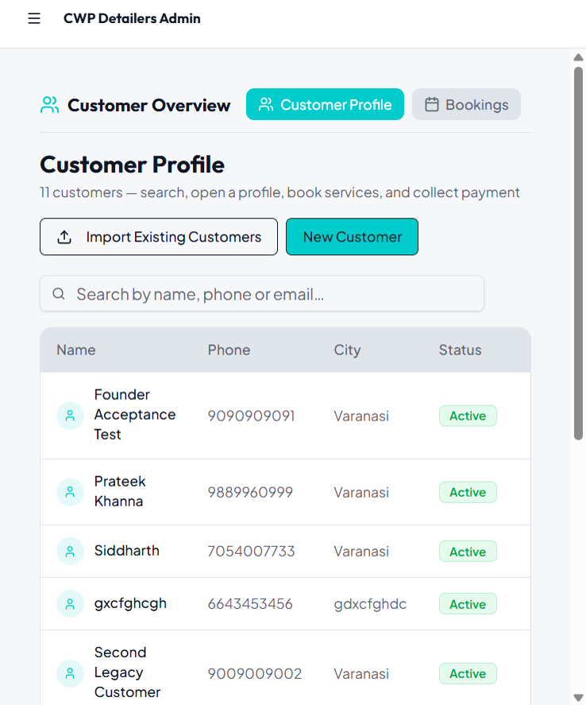
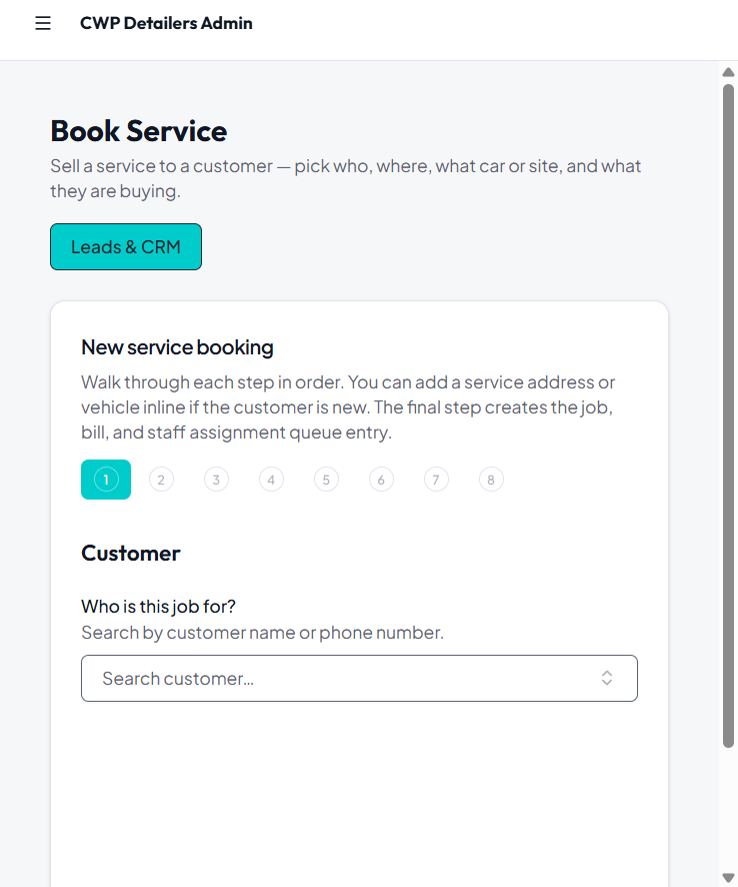

# Founder Business Model Alignment Report

**Project:** CWP Detailers  
**Date:** 15 June 2026  
**Priority:** CRITICAL — business model alignment (not UI polish)  
**Authorization:** Founder Business Model Correction & Customer Lifecycle Restructure  
**References:**  
- [`CUSTOMER_LIFECYCLE_AUDIT_REPORT.md`](./CUSTOMER_LIFECYCLE_AUDIT_REPORT.md)  
- [`FOUNDER_ACCEPTANCE_TEST.md`](./FOUNDER_ACCEPTANCE_TEST.md)  
- [`FOUNDER_UX_PHASE_2_COMPLETION_REPORT.md`](./FOUNDER_UX_PHASE_2_COMPLETION_REPORT.md)  
**Status:** **Implementation complete** (presentation + booking flow; API/schema unchanged)

---

## Executive Summary

CWP is a **service business**, not a CRM/ERP. Revenue flows:

**Lead → Customer → Service Sale → Staff Assignment → Execution → Invoice → Payment**

This pass realigns the admin product to that model:

| Founder decision | Implementation |
|------------------|----------------|
| Two customer entry points only (daily) | **New Customer** + **Import Existing Customers** — **Onboard removed** |
| Customer status: Active / Inactive / Archived | UI model + archive action (`suspended` → Archived in API) |
| No customer deletion | **Archive Customer** replaces delete; no delete API exposed |
| Churn ≠ customer status | **Churned Customers** removed from nav → **Cancelled & Expired Plans** in Analytics |
| Legacy Contacts = migration | Moved to **Migration Tools** (collapsed) |
| No Reactivated module | Route shows redirect; **Reactivated** badge on customer list |
| Booking never dead-ends | **Inline add service address** + **inline add vehicle/solar site** in Book Service wizard |
| Customer-first | Vehicles & addresses remain supporting data inside booking/profile |

**Acceptance test blocker resolved:** Founder Acceptance Test failed at vehicle step — booking now allows inline registration without leaving the wizard.

---

## 1. Screens Changed

| Screen / route | Change |
|----------------|--------|
| `/admin/customers` | Primary CTA **New Customer**; secondary **Import Existing Customers**; Onboard removed; founder status badges; Reactivated badge |
| `/admin/customers/:id` | Status Active/Inactive/Archived; **Archive Customer** button; no delete |
| `/admin/customers/migration` | Renamed copy → **Import Existing Customers**; migration-only framing |
| `/admin/customers/legacy-contacts` | Under Migration Tools; copy clarifies imported contacts |
| `/admin/customers/reactivated` | Deprecation page → Customer Profile |
| `/admin/churned` | Renamed **Cancelled & Expired Plans**; link from Analytics |
| `/admin/analytics` | New **Cancelled & Expired Plans** section |
| `/admin/book-services` | Founder copy; `customerId` pre-select; inline address/vehicle |
| `/admin/assign-services` | Service address terminology; jobs needing staff |
| `/admin/billing` (Invoices tab) | Column **Contract** → **Service** |
| `/admin/services` | **Advanced (GST)** tab label; three revenue lines unchanged |
| Sidebar `adminNavConfig.ts` | **Migration Tools** section; churn/reactivated removed from Legacy |
| Franchisee layout | Churned nav removed |

**Deleted:** `CustomerOnboardingWizard.tsx` (Onboard flow)

**New files:**

- `lib/customerStatus.ts` — Active / Inactive / Archived mapping  
- `book-services/components/InlineServiceAddressForm.tsx`  
- `book-services/components/InlineVehicleSolarForm.tsx`  
- `customers/components/ArchiveCustomerButton.tsx`

---

## 2. Workflows Changed

### 2.1 Customer acquisition (3 channels)

| Channel | Admin UX |
|---------|----------|
| **Lead conversion** | Leads & CRM → Convert (unchanged backend) |
| **Self-registration** | Website/app portal (unchanged) |
| **Walk-in / phone** | **New Customer** dialog on Customer Profile |
| **Migration / Banaras import** | **Import Existing Customers** (Migration Tools) — not daily ops |

### 2.2 Daily customer creation

**Before:** Add Customer + Onboard (confusing dual entry)  
**After:** **New Customer** only for manual creation



**Before (acceptance test):** [`founder-acceptance-screenshots/01-new-customer-dialog.png`](./founder-acceptance-screenshots/01-new-customer-dialog.png) — "Add customer" + separate Onboard button

### 2.3 Book Service (critical fix)

**Before:** Dead-end at step 3 — "ask HQ to register the customer's car"  
**After:**

- Step 2: **Add service address** inline if none on file  
- Step 3: **Add vehicle or solar site** inline if none at address  
- `?customerId=` pre-populates customer when profile link used  
- Inactive customer auto-set **Active** on successful booking (not archived)



**Before (acceptance test):** [`founder-acceptance-screenshots/02-car-wash-step3-vehicle.png`](./founder-acceptance-screenshots/02-car-wash-step3-vehicle.png) — blocked with no inline action

### 2.4 Staff assignment

Copy aligned to operations language: **jobs needing staff**, **service address** filter (not "pending queue" / "location").

### 2.5 Plan churn / retention

**Before:** **Churned Customers** in Legacy sidebar (implies customer churn)  
**After:** **Cancelled & Expired Plans** in Analytics + full report at `/admin/churned`

Churn = daily cleaning cancelled, solar AMC expired, wash package not renewed — **service status**, not customer status.

### 2.6 Revenue lines (catalog)

Unchanged structure from Phase 2 — verified aligned:

- Car Wash → Services + Packages  
- Daily Cleaning → Plans (Silver / Gold / Premium in seed data)  
- Solar → One Time / 6 Month / 12 Month  
- **Advanced (GST)** only under catalog (no pricing engines in founder nav)

---

## 3. Add Customer vs Onboard Resolution

| Item | Resolution |
|------|------------|
| **Onboard button** | Removed from Customer Profile |
| **CustomerOnboardingWizard** | Deleted |
| **Onboard / Onboarding copy** | Removed from founder-facing UI |
| **New Customer** | Single manual-create dialog (walk-in, phone, referral) |
| **Import Existing Customers** | Secondary CTA + Migration Tools nav |

Founder question *"Which button should I click?"* → **New Customer** for daily ops; **Import** only for migration.

---

## 4. Churned Customer Resolution

| Before | After |
|--------|-------|
| Sidebar: Churned Customers | Removed from primary & Legacy nav |
| Customer lifecycle confusion | Analytics card: **Cancelled & Expired Plans** |
| Page title "Churned Customers" | **Cancelled & Expired Plans** |
| Franchisee churned nav | Removed |

Deep link `/admin/churned` retained for bulk re-engagement messaging (plan win-back).

---

## 5. Legacy Contacts Resolution

| Before | After |
|--------|-------|
| Under Legacy Module with daily-cleaning ops | **Migration Tools** section (collapsed) |
| Implied daily workflow | Copy: imported contacts, not customers |
| Customer Hub nav on page | Back link to Migration Tools |

Pair with **Import Existing Customers** for Banaras migration.

---

## 6. Reactivated Customer Resolution

| Before | After |
|--------|-------|
| Dedicated **Reactivated** nav item | Removed |
| `/admin/customers/reactivated` list | Redirect explanation page |
| Reactivation tracking | **Reactivated** badge on customer list when `reactivatedAt` set |
| Inactive → books again | Auto **Active** on booking completion |

No standalone reactivation module — reactivation is an event on the customer timeline.

---

## 7. Customer Status Implementation

Founder model: **Active | Inactive | Archived**

| UI label | API value | Meaning |
|----------|-----------|---------|
| Active | `active` | Normal operations |
| Inactive | `inactive` | No recent activity; history preserved |
| Archived | `suspended` | Duplicate/test/merged — hidden from daily ops |

Implementation: `lib/customerStatus.ts` maps labels ↔ API enum (schema frozen).

Customer list and profile edit use founder labels. Profile view shows readable status.

---

## 8. Customer Deletion Policy Implementation

| Policy | Implementation |
|--------|----------------|
| No delete for customers with history | No delete UI; no `DELETE /customers` route |
| Archive instead | **Archive Customer** → sets `suspended` (Archived) |
| Superadmin hard delete | **Not implemented** — would require new API + safety checks (bookings, invoices, payments, complaints, wallet). Deferred until explicitly authorized. |

Archive dialog explains: use **Inactive** for paused customers; **Archive** for duplicates/tests.

---

## 9. Booking Flow Corrections

| Step | Behavior |
|------|----------|
| 1 Customer | Search; deep-link `customerId` pre-fills |
| 2 Service address | Select existing **or Add service address** inline |
| 3 Vehicle / solar site | Select existing **or Add vehicle or solar site** inline |
| 4–8 | Service, add-ons, discount, payment, review — unchanged logic |
| Complete | Copy: booking + bill + Assign Service queue (not "contract/pending queue") |

Components: `LocationSelect`, `AssetSelect`, `InlineServiceAddressForm`, `InlineVehicleSolarForm`

Review/confirmation copy updated in `ReviewSummaryStep`, `ContractCreatedStep`, `BookServicesPage`.

---

## 10. Service Catalog Corrections

| Area | Status |
|------|--------|
| Three revenue lines | ✓ Maintained |
| Services vs Packages | ✓ Car Wash sub-tabs |
| Daily Cleaning plans | ✓ DcmsPlansPanel |
| Solar sellable products | ✓ SolarCatalogPanel |
| Advanced | ✓ **Advanced (GST)** tab only |
| Hidden from founder nav | Categories, Matrix, Slabs, Pricing Models/Rules, City Pricing — still unreachable |

---

## 11. Remaining Gaps

| Gap | Severity | Notes |
|-----|----------|-------|
| Superadmin hard delete | Low | Not built; archive covers founder policy |
| `suspended` vs literal `archived` enum | Low | Schema frozen; UI maps correctly |
| Lead convert UX | Medium | Leads & CRM convert flow not re-walked in this pass |
| Solar product seed copy ("AMC", "contract") | Medium | Seed data strings; not booking-blocker |
| Branch-role acceptance re-test | High | Re-run `FOUNDER_ACCEPTANCE_TEST.md` workflows 2–8 |
| `AddCustomerServiceWizard` internal errors | Low | Pre-existing TS issues in unrelated file |
| Communication Center "Legacy Contacts" audience name | Low | Internal marketing segment label |

---

## 12. Screenshots Before / After

### Customer Profile entry

| | Screenshot |
|---|------------|
| **Before** | [`founder-acceptance-screenshots/01-new-customer-dialog.png`](./founder-acceptance-screenshots/01-new-customer-dialog.png) — Add customer + Onboard |
| **After** | [`founder-business-model-screenshots/after-01-customers-new-customer-import.png`](./founder-business-model-screenshots/after-01-customers-new-customer-import.png) — New Customer + Import Existing Customers |

### Book Service

| | Screenshot |
|---|------------|
| **Before (blocked)** | [`founder-acceptance-screenshots/02-car-wash-step3-vehicle.png`](./founder-acceptance-screenshots/02-car-wash-step3-vehicle.png) |
| **After (inline enabled)** | [`founder-business-model-screenshots/after-02-book-service-inline.png`](./founder-business-model-screenshots/after-02-book-service-inline.png) |

### Navigation (Phase 2 baseline)

| | Screenshot |
|---|------------|
| **Before acceptance** | [`founder-acceptance-screenshots/00-sidebar-navigation.png`](./founder-acceptance-screenshots/00-sidebar-navigation.png) — Legacy contained import/churn/reactivated |
| **After** | Migration Tools collapsed section; Legacy = Daily Cleaning ops only |

---

## Verification Checklist

Re-run founder acceptance paths:

- [ ] New Customer → Book Service → inline vehicle → foam wash → invoice  
- [ ] Wash package sale end-to-end  
- [ ] Daily cleaning plan sale end-to-end  
- [ ] Solar plan sale end-to-end  
- [ ] Assign Service on created job  
- [ ] Record payment  
- [ ] Complaint review  
- [ ] Confirm Migration Tools not in daily sidebar path for branch manager  
- [ ] Confirm Analytics shows cancelled plans count  

---

## File Index (implementation)

```
artifacts/cwp-platform/src/
  lib/customerStatus.ts
  components/layout/adminNavConfig.ts
  components/layout/FranchiseeLayout.tsx
  features/customers/pages/Customers.tsx
  features/customers/pages/CustomerDetail.tsx
  features/customers/components/ArchiveCustomerButton.tsx
  features/customers/components/ActiveServicesSummary.tsx
  features/book-services/components/
    LocationSelect.tsx
    AssetSelect.tsx
    InlineServiceAddressForm.tsx
    InlineVehicleSolarForm.tsx
    BookServicesWizard.tsx
    ReviewSummaryStep.tsx
    ContractCreatedStep.tsx
  pages/admin/
    BookServicesPage.tsx
    CustomerMigration.tsx
    LegacyContacts.tsx
    ReactivatedCustomers.tsx
    ChurnedCustomers.tsx
    AssignServicesPage.tsx
    Analytics.tsx
    ProductsAndPlans.tsx
  features/billing/components/InvoicesTab.tsx
```

**Removed:** `features/customers/components/CustomerOnboardingWizard.tsx`

---

## Sign-off Recommendation

Business model alignment for **customer lifecycle** and **booking dead-end** is implemented. Recommend **re-executing Founder Acceptance Test** (workflows 2–8) before franchise rollout sign-off.

Internal API names (`service-contracts`, `assetId`, etc.) remain unchanged — not shown in founder UI.
