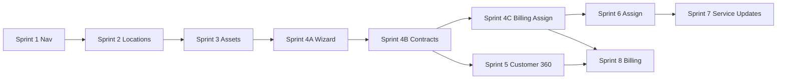

# Implementation Sequence V1

**Project:** CWP Detailers  
**Date:** 14 June 2026  
**Status:** Active — Sprint 3 complete; awaiting Sprint 3 review gate  
**Governing doc:** [`FINAL_ARCHITECTURE_SIGNOFF.md`](./FINAL_ARCHITECTURE_SIGNOFF.md)  
**Basis:**

- [`PRODUCTS_SERVICES_ADMIN_RESTRUCTURE_REPORT_V3.md`](./PRODUCTS_SERVICES_ADMIN_RESTRUCTURE_REPORT_V3.md)
- [`SCREEN_MAPPING_V2.md`](./SCREEN_MAPPING_V2.md)
- [`DATA_RELATIONSHIP_V1.md`](./DATA_RELATIONSHIP_V1.md)
- [`SERVICE_CONTRACT_MODEL_V1.md`](./SERVICE_CONTRACT_MODEL_V1.md)
- [`SERVICE_CONTRACT_REVIEW_V2.md`](./SERVICE_CONTRACT_REVIEW_V2.md)
- [`FINAL_ARCHITECTURE_SIGNOFF.md`](./FINAL_ARCHITECTURE_SIGNOFF.md)

---

## Dependency Chain Overview

| Sprint | Blocks | Blocked by |
|--------|--------|------------|
| 1 | 2, 8 (partial) | — |
| 2 | 3, 4A | 1 |
| 3 | 4A | 2 |
| 4A | 4B | 3 |
| 4B | 4C, 5 (partial) | 4A |
| 4C | 5, 6, 8 | 4B |
| 5 | 8 | 4B (partial), 4C for full E2E |
| 6 | 7 | 4C |
| 7 | — | 6 |
| 8 | — | 4C, 5 |

---

## Sprint 1 — Navigation Restructure

### Objective

Immediate admin clarity: rename modules, remove duplicate sidebar entries, add redirects — **zero backend schema changes**.

### Screens affected

| Screen | Action |
|--------|--------|
| Sidebar (`adminNavConfig.ts`) | Rename Products → Services, Invoices → Billing; remove standalone Quotations/Expenses; promote Service Updates placeholder |
| `/admin/products` | Redirect → `/admin/services` |
| `/admin/invoices` | Redirect → `/admin/billing` |
| `/admin/quotations`, `/admin/expenses` | Redirect → billing tabs |
| `/admin/operations-wall` | Redirect → `/admin/service-updates` |
| `ProductsAndPlans.tsx` | Page title → Services (tabs unchanged internally) |
| `ServiceCatalog.tsx` | Delete dead file |

### Components affected

- `adminNavConfig.ts`
- `AdminNavMenu.tsx`
- `App.tsx` (redirect routes only)
- `ProductsAndPlans.tsx` (labels)
- `DcmsAdminNav.tsx` (link text only)

### APIs affected

**None**

### Tables affected

**None**

### Migration required?

**No**

### Rollback strategy

Revert `adminNavConfig.ts`, `App.tsx` redirects, and page titles. Old routes still work if redirects removed.

### Risk level

**Low**

### Dependency chain

**None** — can start immediately.

### Acceptance criteria

- [x] Sidebar shows Services, Billing & Finance (no duplicate Quotations/Expenses)
- [x] `/admin/products` redirects to `/admin/services`
- [x] `/admin/invoices` redirects to `/admin/billing`
- [x] DCMS Operations nav still works (removed in Sprint 6/7)
- [x] No API or schema diff
- [x] Staff app unaffected

---

## Sprint 2 — Service Locations

### Objective

Introduce Service Locations as a core entity with customer links and **auto-created default location** on customer create.

### Screens affected

| Screen | Action |
|--------|--------|
| `/admin/service-locations` | **NEW** — directory, detail, create/edit |
| Customer create forms | Trigger default location creation |
| `CustomerMigration` | Backfill default location per imported customer |
| Customer 360 | Read-only linked locations (shell if Sprint 5 not done) |

### Components affected

- **NEW:** `ServiceLocationsPage.tsx`, `ServiceLocationDetail.tsx`, `ServiceLocationForm.tsx`
- `QuickCreateCustomerForm.tsx` — post-create hook
- `CustomerMigration.tsx` — backfill script hook
- `adminNavConfig.ts` — add Service Locations nav item

### APIs affected

| API | Action |
|-----|--------|
| **NEW** `GET/POST/PATCH /api/service-locations` | CRUD |
| **NEW** `GET/POST/DELETE /api/service-locations/:id/customer-links` | Link management |
| `POST /api/customers` | Side-effect: create default location |
| `routes/customers.ts` | Default location helper |

### Tables affected

| Table | Action |
|-------|--------|
| `service_locations` | **NEW** |
| `customer_location_links` | **NEW** |

### Migration required?

**Yes** — new tables + backfill default locations for existing customers from profile address.

### Rollback strategy

- Feature flag `ENABLE_SERVICE_LOCATIONS`  
- If rolled back: Book Services falls back to customer profile address (temporary bridge)  
- Drop new tables only if zero production links (pre-release safe)

### Risk level

**Medium**

### Dependency chain

**Sprint 1** (nav item for Service Locations)

### Acceptance criteria

- [x] CRUD service locations in admin
- [x] Link/unlink location to customer with effective dates
- [x] New customer auto-gets `Primary` default location (`isDefault: true`)
- [x] Migrated customers backfilled
- [x] `isAutoCreated` flag distinguishable
- [x] Book Services can list locations by `customerId` (API ready for Sprint 4)

## Sprint 2 Progress

- [x] Schema + migration 029
- [x] API routes + default location service
- [x] Customer create + import backfill
- [x] Admin module UI
- [x] Customer 360 read-only Locations tab
- [x] Completion report: `SPRINT_2_COMPLETION_REPORT.md`

---

## Sprint 3 — Assets

### Objective

Independent asset masters (vehicles, solar sites) with location placement and **ownership history** links.

### Screens affected

| Screen | Action |
|--------|--------|
| `/admin/assets` | **NEW** — directory, detail, create/edit |
| Customer 360 Vehicles tab | Deprecate CRUD → read-only link to Assets |
| `AddCustomerServiceWizard` | Remove inline solar create (stub until Sprint 4) |

### Components affected

- **NEW:** `AssetsPage.tsx`, `AssetDetail.tsx`, `VehicleForm.tsx`, `SolarSiteForm.tsx`
- `CustomerDetail.tsx` — remove vehicle CRUD; read-only linked assets
- `AddCustomerServiceWizard.tsx` — remove solar inline create

### APIs affected

| API | Action |
|-----|--------|
| `routes/vehicles.ts` | Refactor to asset-centric; location + customer links |
| `routes/solar-sites.ts` | Refactor similarly |
| **NEW** `GET/POST/PATCH /api/assets` | Unified list (optional facade) |
| **NEW** `/api/assets/:id/location-links` | Placement |
| **NEW** `/api/assets/:id/customer-links` | Ownership history (`linkType`, effective dates) |

### Tables affected

| Table | Action |
|-------|--------|
| `location_asset_links` | **NEW** |
| `customer_asset_links` | **NEW** (with `linkType`, `effectiveFrom`, `effectiveUntil`) |
| `vehicles` | Keep; add nullable `serviceLocationId` or use link table only |
| `solar_sites` | Keep; same |

### Migration required?

**Yes** — migrate `vehicles.customerId` → `customer_asset_links` + `location_asset_links`; default location from Sprint 2 used for placement.

### Rollback strategy

- Dual-read: keep `vehicles.customerId` populated during transition  
- Feature flag `ENABLE_ASSETS_MODULE`  
- Revert UI to Customer 360 Vehicles tab if needed

### Risk level

**Medium–High** (data migration)

### Dependency chain

**Sprint 2** (locations must exist for placement)

### Acceptance criteria

- [x] Asset CRUD outside Customer 360
- [x] Vehicle placed at service location
- [x] Solar site placed at service location
- [x] Ownership history preserved on transfer (close old link, open new)
- [x] Customer 360 shows read-only linked assets
- [x] Legacy `vehicles.customerId` dual-read works

## Sprint 3 Progress

- [x] Schema + migration 030
- [x] Unified assets API + link histories
- [x] Legacy vehicle/solar dual-read registration
- [x] Admin Assets module UI
- [x] Customer 360 read-only Assets tab
- [x] Wizard solar inline create removed
- [x] Completion report: `SPRINT_3_COMPLETION_REPORT.md`

---

## Sprint 4A — Book Services Wizard Shell

### Objective

Steps 1–8 UI: Customer → Service Location → Asset → Service → Add-ons → Discount → Payment Terms → Review Summary. No contract persistence yet (draft/shell only).

### Screens affected

| Screen | Action |
|--------|--------|
| `/admin/book-services` | **NEW** — wizard shell (steps 1–8, display-only review) |

### Components affected

- **NEW:** `BookServicesPage.tsx`, `BookServicesWizard.tsx`
- **NEW:** `CustomerSelect`, `LocationSelect`, `AssetSelect`, `ServiceSelect`, `AddOnSelect`, `DiscountStep`, `PaymentTermsStep`, `ReviewSummaryStep`
- `CustomerSearchSelect` — reused in step 1

### APIs affected

Read-only consumption of customers, locations, assets, catalog (no new write paths).

### Tables affected

**None**

### Migration required?

**No**

### Rollback strategy

Remove `/admin/book-services` route and nav entry.

### Risk level

**Medium**

### Dependency chain

**Sprint 3**

### Acceptance criteria

- [x] Wizard navigates steps 1–8 with validation
- [x] Location picker uses Service Locations API
- [x] Asset picker filtered by selected location
- [x] Service catalog loaded in step 4 (dynamic, no hardcoded names)
- [x] Default location pre-selected when `isDefault: true`
- [x] Review summary with estimated total (display only)
- [x] No contract/booking/invoice/assignment rows created
- [x] Completion report: `SPRINT_4A_COMPLETION_REPORT.md`

---

## Sprint 4B — Service Contract Layer

### Objective

Step 8 persistence — fulfillment mode branching per `SERVICE_CONTRACT_MODEL_V1` and `SERVICE_CONTRACT_REVIEW_V2`.

### Screens affected

| Screen | Action |
|--------|--------|
| `/admin/book-services` | Add step 8 contract creation |
| `/admin/daily-cleaning/subscriptions` | Remove sell UI — redirect to Book Services |
| Customer 360 | Prepare "Book Service" CTA (deep link) |

### Components affected

- **REFACTOR:** `AddCustomerServiceWizard.tsx` → contract logic absorbed
- `BookServicesWizard.tsx` — fulfillment branch (`one_time`, `contract_recurring`, `contract_credits`)

### APIs affected

| API | Action |
|-----|--------|
| `POST /api/customers/:id/services` (hub) | Route through Book Services |
| `routes/dcms.ts` | Accept `serviceLocationId` on subscription create |
| `routes/service-catalog.ts` | Entitlement grant with location + asset |
| `routes/bookings.ts` | Require `serviceLocationId` on new bookings |
| `customer_contracts` registry | Write on all contract types |

### Tables affected

| Table | Action |
|-------|--------|
| `bookings` | Add `serviceLocationId` column |
| `dcms_subscriptions` | Add `serviceLocationId` column |
| `customer_entitlements` | Add `serviceLocationId`, `assetId` if missing |
| `customer_contracts` | Write path enforced |

### Migration required?

**Yes** — additive columns only.

### Rollback strategy

- Feature flag `ENABLE_BOOK_SERVICES_CONTRACTS`  
- Keep `AddCustomerServiceWizard` behind flag until parity verified  

### Risk level

**High**

### Dependency chain

**Sprint 4A**

### Acceptance criteria

- [x] `one_time` → `bookings` + location + asset FKs
- [x] `contract_recurring` → `dcms_subscriptions` + registry (daily cleaning; solar AMC)
- [x] `contract_credits` → `customer_entitlements` + registry (wash packages only)
- [x] Solar AMC uses `contract_recurring` — not `contract_credits`
- [x] Wash package uses `contract_credits` — not wallet
- [x] `customer_contracts` registry updated for all types
- [x] Customer 360 Book Service CTA (no inline sell wizard)
- [x] Completion report: `SPRINT_4B_COMPLETION_REPORT.md`

---

## Sprint 4C — Quotation, Invoice & Assignment

### Objective

Steps 8–9 completion: quote/invoice emit to Billing & Finance; assignment handoff to Assign Services queue.

### Screens affected

| Screen | Action |
|--------|--------|
| `/admin/book-services` | Steps 8–9 (quote/invoice + assignment) |

### Components affected

- `CreateInvoiceDialog.tsx` — integrate
- `QuotationBuilder.tsx` — integrate (unified GST)
- `BookServicesWizard.tsx` — assignment queue handoff

### APIs affected

| API | Action |
|-----|--------|
| `routes/quotations.ts`, `routes/payments.ts` | Emit from wizard |
| Assignment queue endpoints | Handoff from step 9 |

### Tables affected

**None** (uses Sprint 4B writes)

### Migration required?

**No**

### Rollback strategy

Disable quote/invoice step via feature flag; contracts still created in 4B.

### Risk level

**Medium–High**

### Dependency chain

**Sprint 4B**

### Acceptance criteria

- [ ] Quotation/invoice appears in Billing & Finance
- [ ] One-time wash E2E: sell → invoice → assign
- [ ] Daily cleaning E2E: sell → contract → route assignment queue
- [ ] Assignment queues to Assign Services (Sprint 6 UI)
- [ ] Full 9-step flow complete per sign-off conditions

---

## Sprint 5 — Customer 360 Cleanup

### Objective

Customer module = identity + read-only summaries only. Billing Summary retained.

### Screens affected

| Screen | Action |
|--------|--------|
| `CustomerDetail.tsx` tabs | Restructure per SCREEN_MAPPING_V2 §4 |
| Services & Plans tab | **DELETE** → Active Services (read-only) |
| Billing tab | **RENAME** → Billing Summary |
| Wallet tab | **RENAME** → Wallet Summary (₹ read-only) |
| Vehicles tab | **REMOVE** → Linked Assets (read-only) |

### Components affected

- `CustomerDetail.tsx`
- `CustomerServicesTab.tsx` → `ActiveServicesSummary.tsx` (read-only)
- `AddCustomerServiceWizard.tsx` — **removed** from Customer 360
- `Customer360BillingPanels.tsx` → `BillingSummaryPanel.tsx`
- **NEW:** `LinkedLocationsSummary.tsx`, `LinkedAssetsSummary.tsx`, `WalletSummaryPanel.tsx`

### APIs affected

| API | Action |
|-----|--------|
| `GET /api/customers/:id/contracts` | Active Services summary (registry) |
| `GET /api/customers/:id/billing-summary` | **NEW** aggregated endpoint (optional) |
| `routes/customers.ts` | Remove or guard direct service-create from customer context |

### Tables affected

**None** (read-only consumption)

### Migration required?

**No**

### Rollback strategy

Restore Customer 360 tabs from git; re-enable wizard via flag.

### Risk level

**Medium**

### Dependency chain

**Sprint 4B** (Book Service CTA must work after contracts); partial read-only summaries can start after 4B

### Acceptance criteria

- [ ] No Add Service wizard in Customer 360
- [ ] Billing Summary shows: Outstanding Due, Wallet ₹, Last Invoice, Last Payment, Open Billing button
- [ ] Wallet Summary shows ₹ only — no wash credits
- [ ] Active Services reads `customer_contracts` registry
- [ ] Linked Locations + Linked Assets read-only with deep links
- [ ] Book Service CTA → `/admin/book-services?customerId=`

---

## Sprint 6 — Assign Services

### Objective

Unified assignment hub for bookings, DCMS routes, and pending queue.

### Screens affected

| Screen | Action |
|--------|--------|
| `/admin/assign-services` | **NEW** |
| `/admin/bookings` | Redirect → assign-services |
| `/admin/daily-cleaning/assignments` | Embed in assign-services |
| Customers hub Bookings nav | **Removed** |

### Components affected

- **NEW:** `AssignServicesPage.tsx`
- `Bookings.tsx` — extract assign flow
- `DcmsAssignmentsPage.tsx` — embed as section
- `adminNavConfig.ts` — remove Bookings from customer hub
- `CustomerHubAdminNav.tsx` — remove bookings tab

### APIs affected

| API | Action |
|-----|--------|
| `POST /api/bookings/:id/assign` | Unchanged |
| `routes/dcms.ts` assignment endpoints | Unchanged |
| **NEW** `GET /api/assignments/queue` | Unified pending queue |

### Tables affected

**None**

### Migration required?

**No**

### Rollback strategy

Restore `/admin/bookings` route and customer hub nav item.

### Risk level

**Medium**

### Dependency chain

**Sprint 4C** (contracts/bookings exist to assign)

### Acceptance criteria

- [ ] Single pending queue: unassigned bookings + unassigned DCMS subs
- [ ] Doorstep/solar assign works from unified page
- [ ] DCMS route assign works from unified page
- [ ] Bulk auto-assign action (if rules exist)
- [ ] Staff mobile app unchanged (same APIs)

---

## Sprint 7 — Service Updates

### Objective

Promote Operations Wall to Service Updates; unify DCMS visits + bookings timeline.

### Screens affected

| Screen | Action |
|--------|--------|
| `/admin/service-updates` | **NEW** (rename from operations-wall) |
| `/admin/daily-cleaning` dashboard | Merge KPIs |
| `/admin/daily-cleaning/visits` | Section in service-updates |
| `/admin/daily-cleaning/washes` | Section in service-updates |
| `/admin/daily-cleaning/staff-performance` | Section in service-updates |
| DCMS Operations sidebar | **Removed** |

### Components affected

- `OperationsWall.tsx` → `ServiceUpdatesPage.tsx`
- `DcmsDashboardPage.tsx` — KPI widgets merged
- `DcmsVisitsPage.tsx`, `DcmsWashHistoryPage.tsx`, `DcmsStaffPerformancePage.tsx` — embedded or linked sections
- `DcmsAdminNav.tsx` — simplify or remove

### APIs affected

| API | Action |
|-----|--------|
| `GET /api/operations/timeline` | Add service line labels; contract context |
| `routes/dcms.ts` visit endpoints | Read-only consumption |

### Tables affected

**None**

### Migration required?

**No**

### Rollback strategy

Restore Operations Wall route and DCMS nav.

### Risk level

**Low**

### Dependency chain

**Sprint 6**

### Acceptance criteria

- [ ] Unified today's timeline (bookings + DCMS visits)
- [ ] Labels use business terms (Daily Cleaning, not DCMS)
- [ ] Delayed/overdue counts visible
- [ ] Quick link to Assign Services for pending items
- [ ] DCMS Operations removed from sidebar

---

## Sprint 8 — Billing Consolidation

### Objective

Single Billing & Finance hub; wallet adjustments; lifecycle filters; GST unification.

### Screens affected

| Screen | Action |
|--------|--------|
| `/admin/billing` | Canonical hub (renamed from invoices) |
| `/admin/billing?tab=wallet-adjustments` | **NEW** |
| `/admin/billing?tab=dues` | Merged from `/admin/dues` |
| `QuotationBuilder.tsx` | Merge GST engine; remove standalone route |
| `Expenses.tsx` | Merge into billing tab |

### Components affected

- `Invoices.tsx` → `BillingFinancePage.tsx`
- `QuotationBuilder.tsx` — shared billing component
- `CreateCreditNoteDialog.tsx` — keep in billing hub
- `CreateInvoiceDialog.tsx` — GST from `invoiceGstEngine` only
- **NEW:** `WalletAdjustmentsTab.tsx`
- Customer 360 `BillingSummaryPanel.tsx` — wire to billing deep links

### APIs affected

| API | Action |
|-----|--------|
| `routes/payments.ts` | Invoice lifecycle status filters |
| `routes/quotations.ts` | Remove hardcoded 18% GST |
| `routes/wallet.ts` | Wallet adjustments; ₹-only validation messages |
| `routes/billing.ts` | Dues tab aggregation |

### Tables affected

**None** (optional `invoice.lifecycleStatus` enum additive later)

### Migration required?

**No** (optional additive status column)

### Rollback strategy

Restore standalone `/admin/quotations`, `/admin/expenses`, `/admin/dues`.

### Risk level

**Medium–High** (billing critical path)

### Dependency chain

**Sprint 4C** (quotes/invoices from Book Services) + **Sprint 5** (billing summary links)

### Acceptance criteria

- [ ] Single billing hub with tabs: Invoices, Payments, Quotations, Expenses, Dues, Wallet Adjustments
- [ ] No hardcoded 18% GST in quotation builder
- [ ] Wallet tab credits/debits ₹ only — clear copy
- [ ] Wallet overpayment flow documented and working
- [ ] Credit notes end-to-end
- [ ] Lifecycle filters: quotation → closed
- [ ] Customer 360 Open Billing lands on filtered billing view
- [ ] Book Services invoices appear in hub

---

## Sprint Summary Matrix

| Sprint | Objective | Migration? | Risk | Dependency |
|--------|-----------|------------|------|------------|
| 1 | Nav restructure | No | Low | None |
| 2 | Service Locations + default | **Yes** | Medium | Sprint 1 |
| 3 | Assets + ownership history | **Yes** | Medium–High | Sprint 2 |
| 4A | Book Services wizard shell (steps 1–8, review only) | No | Medium | Sprint 3 |
| 4B | Service contract persistence | **Yes** (additive) | High | Sprint 4A |
| 4C | Quote/invoice + assignment | No | Medium–High | Sprint 4B |
| 5 | Customer 360 cleanup | No | Medium | Sprint 4B |
| 6 | Assign Services | No | Medium | Sprint 4C |
| 7 | Service Updates | No | Low | Sprint 6 |
| 8 | Billing consolidation | No | Medium–High | Sprint 4C, 5 |

**Estimated duration:** 10–14 weeks with testing buffers.

---

## Pre-Implementation Gate

- [x] [`FINAL_ARCHITECTURE_SIGNOFF.md`](./FINAL_ARCHITECTURE_SIGNOFF.md) — Approved with Conditions
- [x] Sprint 4 split → 4A / 4B / 4C documented
- [x] **Sprint 1 started**

## Sprint 1 Progress

- [x] Sidebar: Services, Billing & Finance, Service Updates
- [x] Redirects: products→services, invoices→billing, quotations/expenses→billing tabs
- [x] `ProductsAndPlans.tsx` title → Services
- [x] Delete `ServiceCatalog.tsx`

## Sprint 4A Progress

- [x] Route `/admin/book-services` + sidebar nav
- [x] `BookServicesWizard` — 8 steps with validation
- [x] Read-only APIs only (no mutations in `features/book-services`)
- [x] Review summary + estimated total (display only)
- [x] Completion report: `SPRINT_4A_COMPLETION_REPORT.md`

## Sprint 4B Progress

- [x] Migration 031 — contract linkage columns
- [x] `POST /api/service-contracts` + three fulfillment modes
- [x] Registry writes for bookings, DCMS, subscriptions, entitlements
- [x] Book Services → Create Service Contract + success screen
- [x] Customer 360 Book Service CTA; DCMS inline sell retired
- [x] No billing / assignment / wallet on Book Services path
- [x] Completion report: `SPRINT_4B_COMPLETION_REPORT.md`

---

## Document History

| Version | Date | Changes |
|---------|------|---------|
| 1.0 | 14 Jun 2026 | Initial 8-sprint implementation sequence |
| 1.1 | 14 Jun 2026 | Sprint 4 → 4A/4B/4C; Sprint 1 implementation started |

---

*Documentation only. No code, migrations, routes, or component changes.*
