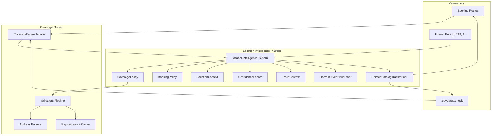

# Location Intelligence Platform — Architecture Freeze (Phase 1.2 Final)

**Status:** FROZEN — foundation for Phase 2 Structured Address System  
**Version:** `LocationIntelligenceV1` / `CoverageStrategyV1`  
**Date:** July 2026

---

## Executive Summary

The Coverage Engine has been elevated into the permanent **Location Intelligence Platform**. Coverage validation is now one module inside a larger platform that future capabilities (Address System, Booking, Pricing, ETA, Workforce, Analytics, AI) must depend on.

This pass is **additive only**:
- No database changes
- No API contract breaks
- No UI changes
- Legacy imports (`lib/serviceability`, `lib/coverage`) continue to work

---

## Platform Hierarchy

```
Location Intelligence Platform (LocationIntelligenceV1)
├── Address Resolution          → parsers/ (Google, Manual, Composite)
├── Coverage Engine             → policies + validators pipeline
├── Geographic Resolution       → repositories + geography hierarchy
├── Catalog Layer               → ServiceCatalogTransformer (API only)
├── Domain Events               → publish-only EventPublisher
├── LocationContext             → standard I/O object
├── Confidence Scoring          → ConfidenceScorer
├── Correlation / Tracing       → TraceContext (requestId, traceId, validationId)
├── Metrics                     → LocationMetrics + CoverageMetrics
├── Extension Interfaces        → stubs (Branch, Franchise, ETA, Pricing, …)
└── Versioning                  → V1 markers; V2+ implementable without replacing V1
```

---

## Module Layout

```
artifacts/api-server/src/lib/
├── location-intelligence/          ← NEW permanent platform
│   ├── LocationIntelligencePlatform.ts   Main facade
│   ├── LocationContext.ts                Standard location object
│   ├── versioning.ts
│   ├── catalog/
│   │   └── ServiceCatalogTransformer.ts
│   ├── confidence/
│   │   └── ConfidenceScorer.ts
│   ├── correlation/
│   │   └── TraceContext.ts
│   ├── domain/
│   │   ├── CoverageResultCore.ts         Engine output (no catalog)
│   │   ├── CoverageResultBuilder.ts
│   │   ├── entities.ts
│   │   ├── entityMappers.ts
│   │   ├── events/
│   │   │   ├── types.ts
│   │   │   └── EventPublisher.ts
│   │   └── geography/
│   │       └── Hierarchy.ts
│   ├── extensions/
│   │   └── interfaces.ts
│   ├── metrics/
│   │   └── LocationMetrics.ts
│   └── policies/
│       ├── CoveragePolicy.ts
│       ├── BookingPolicy.ts
│       └── types.ts
│
├── coverage/                       ← Coverage module (backward compat barrel)
│   ├── CoverageEngine.ts           Delegates to platform
│   ├── validators/, parsers/, repositories/, …
│   └── index.ts                    Re-exports platform symbols
│
└── serviceability/                 ← Legacy alias → coverage
```

---

## Architecture Diagram



---

## LocationContext Specification

Standard input/output for all location modules.

| Field | Type | Description |
|-------|------|-------------|
| `address.formatted` | string? | Raw address text |
| `address.placeId` | string? | Google place ID |
| `address.parsed` | ParsedAddressComponents | Structured parse result |
| `coordinates` | `{ latitude, longitude }` \| null | GPS |
| `postalCode` | string? | Resolved PIN |
| `serviceArea` | `{ id, name }` \| null | Service area from master |
| `city` | CitySummary \| null | Resolved city |
| `state` | `{ name, code? }` \| null | State |
| `country` | string? | Country |
| `branch` | `{ id, name? }` \| null | Reserved — Phase 3+ |
| `franchise` | `{ id, name? }` \| null | Reserved — Phase 3+ |
| `coverageStatus` | CoverageStatusLabel | AVAILABLE, UNAVAILABLE, … |
| `confidenceScore` | number | 0–100 resolution quality |
| `resolvedBy` | LocationResolvedBy | pin_master, google_city, city_slug, … |
| `validationId` | string | coverageValidationId |
| `metadata.version` | string | `LocationIntelligenceV1` |

Build via `buildLocationContext()` or receive inside `CoverageResult.locationContext`.

---

## Confidence Scoring

| Score | Resolution Method |
|-------|-------------------|
| 100 | GPS + Google Address Components + PIN |
| 95 | Google Address Components |
| 90 | PIN master chain / PIN-only |
| 70 | Manual address + GPS (no structured components) |
| 50 | City resolution (google city, city_id, city_name) |
| 25 | Legacy `citySlug` fallback |
| 0 | Unknown / unresolved |

Stored on `LocationContext.confidenceScore` and `CoverageResult.confidenceScore`.

---

## Domain Events (Publish Only)

Events are published via `locationDomainEventPublisher`. **No consumers** are registered in this freeze.

| Event | When |
|-------|------|
| `LocationResolved` | After every validation (success or failure) |
| `CoverageValidated` | Successful coverage check |
| `CoverageRejected` | Failed coverage check |
| `CoverageCacheHit` | Repository cache hit during validation |
| `CoverageCacheMiss` | Repository cache miss |
| `CoverageDemandDetected` | Failed check in unserved area (expansion signal) |
| `BookingCoverageValidated` | Booking path success |
| `BookingCoverageRejected` | Booking path failure |

All events include: `traceId`, `requestId`, `coverageValidationId`, `bookingId?`, `version`, `timestamp`.

Subscribe example (Phase 3+):
```typescript
import { locationDomainEventPublisher } from "@workspace/api-server/lib/location-intelligence";

locationDomainEventPublisher.subscribe(event => {
  if (event.type === "CoverageDemandDetected") { /* analytics */ }
});
```

---

## Policy Layer

Validators are wrapped as independently testable policies:

| Policy | Status | Role |
|--------|--------|------|
| `CoveragePolicy` | Active | Address → PIN → ServiceArea → City → Service |
| `BookingPolicy` | Active | Delegates to CoveragePolicy (booking extension point) |
| `PricingPolicy` | Stub | Phase 3+ |
| `ExpansionPolicy` | Stub | Phase 3+ |
| `WorkforcePolicy` | Stub | Phase 3+ |

Individual policies: `addressPolicy`, `pinPolicy`, `serviceAreaPolicy`, `cityPolicy`, `servicePolicy`.

---

## Catalog Separation

**Coverage Engine returns `CoverageResultCore`** (no service lists):

```
CoverageResultCore
├── coverageStatus
├── locationContext
├── serviceAvailability { serviceId, available, cityId }
├── confidenceScore
└── correlation
```

**Catalog layer** (`ServiceCatalogTransformer`) attaches:
- `availableServices`
- `comingSoonServices`
- `unavailableServices`

Existing `/coverage/check` and booking HTTP responses are unchanged. Additive fields (`confidenceScore`, `locationContext`) may appear on internal results.

---

## Validation Pipeline

```
Request (CoverageRequest)
  → createInitialState (parse address, build TraceContext)
  → CoveragePolicy.execute / BookingPolicy.execute
      1. AddressValidator    — requires coordinates
      2. PinValidator          — extract/resolve PIN
      3. ServiceAreaValidator  — PIN active in master
      4. CityValidator         — city resolution priority chain
      5. ServiceValidator      — service availability + catalog load
  → buildCoverageResultCore
  → ServiceCatalogTransformer.attachCatalog (legacy CoverageResult)
  → publish domain events
  → emit metrics
```

### City Resolution Priority
1. PIN master chain (highest confidence)
2. Parsed Google city
3. `citySlug` (legacy)
4. `cityId`
5. `cityName`

---

## Repository Layer

Repositories return **domain entities** via mapper functions (raw row types retained for internal compat):

| Repository | Entity | Methods |
|------------|--------|---------|
| `CityRepository` | `CityEntity` | `findEntityById/Slug/Name` |
| `PinRepository` | `PinResolutionEntity` | `findEntityByPincode` |

Mappers live in `domain/entityMappers.ts` — business layer never sees Drizzle rows.

### Caching
- 5-minute TTL in-process cache
- Admin CRUD invalidates affected namespaces
- Cache hit/miss events collected per validation via `beginAccessCollection` / `endAccessCollection`

---

## Extension Interfaces (Prepared, Not Implemented)

Located in `extensions/interfaces.ts`:

- `BranchResolver`
- `FranchiseResolver`
- `WorkforceResolver`
- `EtaResolver`
- `PricingResolver`
- `HolidayResolver`
- `OperatingHoursResolver`
- `InventoryResolver`
- `RecommendationResolver`

Register on `locationExtensionRegistry` in Phase 3+.

---

## Geographic Hierarchy (Interfaces Only)

Future hierarchy model in `domain/geography/Hierarchy.ts`:

```
Country → State → Region → City → Zone → Service Area → PIN Code → Micro Area → Street → Building
```

`buildGeographyHierarchyFromMaster()` maps current master data to this model without DB changes.

---

## Correlation IDs

Every validation produces:

| ID | Source |
|----|--------|
| `traceId` | `x-request-id` header or UUID |
| `requestId` | Same as traceId or explicit |
| `coverageValidationId` | Unique per validation |
| `bookingId` | When validating for booking |

Flows through logs, metrics, events, and `CoverageResult.correlation`.

---

## Metrics

Structured log events (no dashboards yet):

| Event | Purpose |
|-------|---------|
| `coverage_validation` | Success/failure summary |
| `coverage_demand_signal` | Blocked booking demand |
| `location_resolution` | Confidence + resolvedBy |
| `location_validation_performance` | Latency |
| `location_cache_metrics` | Hit/miss counts |

---

## Versioning

```typescript
LOCATION_INTELLIGENCE_VERSION = "LocationIntelligenceV1"
COVERAGE_STRATEGY_VERSION = "CoverageStrategyV1"
```

Future `LocationIntelligenceV2` can implement parallel strategies without breaking V1 consumers.

---

## Backward Compatibility

| Import Path | Status |
|-------------|--------|
| `lib/serviceability/*` | Re-exports coverage |
| `lib/coverage/*` | Unchanged public API |
| `coverageEngine.check()` | Works |
| `coverageEngine.validateForBooking()` | Works |
| `validateServiceability()` | Deprecated alias |
| `POST /api/coverage/check` | Unchanged response shape |
| `POST /api/serviceability/check` | Alias unchanged |
| Booking 422 responses | Unchanged |

New optional fields on `CoverageResult`: `locationContext`, `confidenceScore`, `version`, `correlation.traceId`.

---

## Performance Notes

- Single pipeline execution — no duplicate validator runs
- Repository caching with TTL + targeted invalidation
- Address parsed once in `createInitialState`
- Cache access collected per-request (no global state leakage)
- Catalog loaded only when city resolves (ServiceValidator)
- Platform delegates to existing validators — zero duplicate DB query paths

---

## Testing

```bash
pnpm --filter @workspace/api-server run test:coverage
```

**30 tests passing** across:
- Coverage engine (6)
- Cache (5)
- Parsers (4)
- Correlation (3)
- Location Intelligence platform (12): confidence, LocationContext, events, policies, entities, trace

---

## Future Integration Guide (Phase 2+)

### Phase 2 — Structured Address System
Build on top of `LocationContext`. Persist parsed components using platform parsers. Do not bypass coverage validation.

### Phase 3 — New Capabilities
1. Implement resolver interface (e.g. `EtaResolver`)
2. Register on `locationExtensionRegistry`
3. Subscribe to domain events for analytics/notifications
4. Consume/produce `LocationContext` — never raw address strings

### Example: New Module Integration
```typescript
import {
  locationIntelligencePlatform,
  type LocationContext,
} from "../lib/location-intelligence";

async function checkEta(request: CoverageRequest) {
  const result = await locationIntelligencePlatform.validateCoverage(request);
  const ctx: LocationContext = result.locationContext!;
  // Pass ctx to ETA resolver when implemented
}
```

---

## Remaining Work for Phase 2

| Item | Phase |
|------|-------|
| Structured address DB tables | Phase 2 |
| Address persistence / normalization | Phase 2 |
| Frontend address component storage | Phase 2 |
| Branch / Franchise resolvers | Phase 3 |
| Pricing / ETA / Workforce modules | Phase 3 |
| Event consumers (Analytics, AI) | Phase 3 |
| Redis-backed distributed cache | Phase 3 |
| Geographic hierarchy DB model | Phase 3+ |
| Dashboards for metrics | Phase 3+ |

---

## Related Documentation

- [Address/Google Maps/Booking Audit](./ADDRESS_GOOGLE_MAPS_BOOKING_AUDIT_REPORT.md)
- [Phase 1 Serviceability](./SERVICEABILITY_VALIDATION_PHASE1.md)
- [Phase 1.2 Coverage Engine](./COVERAGE_ENGINE_PHASE1_2.md)

---

**Architecture freeze complete.** The Location Intelligence Platform is the stable foundation for all future location-related development.
