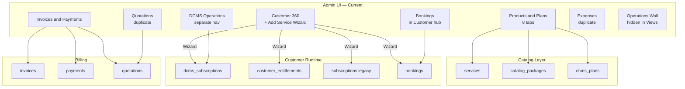
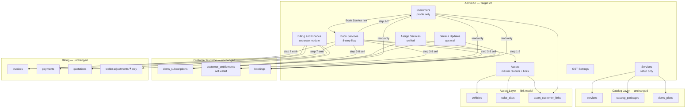
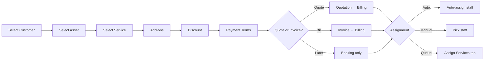

# Products & Services — Admin Restructure Report

**Project:** CWP Detailers  
**Date:** 14 June 2026  
**Version:** 2.0 — Founder Decisions Incorporated  
**Status:** Superseded by [`PRODUCTS_SERVICES_ADMIN_RESTRUCTURE_REPORT_V3.md`](./PRODUCTS_SERVICES_ADMIN_RESTRUCTURE_REPORT_V3.md) — do not use for new work  
**Author:** Engineering audit based on current codebase review  
**Companion:** [`SCREEN_MAPPING_V1.md`](./SCREEN_MAPPING_V1.md) — superseded by [`SCREEN_MAPPING_V2.md`](./SCREEN_MAPPING_V2.md)

---

## Table of Contents

1. [Executive Summary](#1-executive-summary)
2. [Business Context & Target Flow](#2-business-context--target-flow)
3. [Current Implementation Inventory](#3-current-implementation-inventory)
4. [Current User Journeys (As Built)](#4-current-user-journeys-as-built)
5. [Root Causes of Confusion](#5-root-causes-of-confusion)
6. [Current vs Target Architecture](#6-current-vs-target-architecture)
7. [Target Admin Tab Structure (Detailed)](#7-target-admin-tab-structure-detailed)
8. [Terminology Glossary](#8-terminology-glossary)
9. [GST Architecture (3 Levels)](#9-gst-architecture-3-levels)
10. [Data Layer Reference](#10-data-layer-reference)
11. [File & Route Inventory](#11-file--route-inventory)
12. [Part-by-Part Implementation Plan](#12-part-by-part-implementation-plan)
13. [Risks & Migration Notes](#13-risks--migration-notes)
14. [Future Scope (Out of Current Phase)](#14-future-scope-out-of-current-phase)
15. [Founder Decisions — Resolved](#15-founder-decisions--resolved)
16. [Appendix: Architecture Diagrams](#16-appendix-architecture-diagrams)
17. [Screen Mapping Reference](#17-screen-mapping-reference)

---

## 1. Executive Summary

The admin panel for products and services has grown into a **technically correct but operationally confusing** system. The backend supports daily car cleaning (DCMS), doorstep vehicle wash, and solar panel cleaning — but the admin UI mixes **catalog setup**, **customer service creation**, **staff assignment**, and **billing** across multiple overlapping entry points.

### Key Problems

| Problem | Impact |
|---------|--------|
| **Mixed concerns** | Services are created from Customer 360 instead of a dedicated booking flow |
| **Confusing names** | "DCMS", "Products & Plans", "Entitlements", "Packages" don't match business language |
| **Duplicate pages** | Quotations, Expenses, and billing exist in 2–3 places each |
| **Split assignment** | Bookings assign and DCMS assign are separate nav items with the same word "assignment" |
| **GST scattered** | Catalog GST, invoice GST, and per-item GST live in different settings screens |
| **No Book Services tab** | The most important operational flow has no dedicated home |

### Recommended Direction

Reorganize admin into **seven clear operational modules** aligned with how the business actually runs:

1. **Services** — Catalog setup only, no customer linkage  
2. **Assets** — Independent master records (vehicles, solar sites), linked to customers  
3. **Customers** — Profile, type, GST, communications only — **no service creation**  
4. **Book Services** — Customer → Asset → Service → Add-ons → Discount → Payment Terms → Quote/Invoice → Assignment  
5. **Assign Services** — Auto/manual staff assignment for all service lines  
6. **Service Updates** — Live dashboard for work status and completion  
7. **Billing & Finance** — Separate finance hub; Book Services may generate quotations/invoices into it  

### Founder Decisions Locked (June 2026)

| Decision | Ruling |
|----------|--------|
| **Wallet** | Monetary adjustment ledger only — **not** a wash-credit or service-credit system |
| **Assets** | Core module in current phase — independent master records, then linked to customers |
| **Book Services flow** | Customer → Asset → Service → Add-ons → Discount → Payment Terms → Quote/Invoice → Assignment |
| **Billing** | Separate **Billing & Finance** module; Book Services emits quotes/invoices but does not replace finance hub |
| **Customers** | Must not create services directly; deep-link to Book Services instead |
| **Implementation** | No code until architecture docs approved; see `SCREEN_MAPPING_V1.md` |

---

## 2. Business Context & Target Flow

### 2.1 Customer Entry Points

A customer enters the system through one of these paths:

- **New lead** converted to customer  
- **Existing running customer** migrated into the platform  
- **Old EFT-out customer** migrated without existing services  

### 2.2 Three Service Lines

| # | Service Line | Variants | Add-ons |
|---|--------------|----------|---------|
| 1 | **Daily Car Cleaning Services** | Recurring plan per vehicle | Yes |
| 2 | **Doorstep Vehicle Wash** | One-time wash OR prepaid package | Yes |
| 3 | **Solar Panel Cleaning Services** | One-time OR 6/12 month AMC OR planned schedule | Usually no |

### 2.3 Payment & Billing Rules

- Customer may pay: **Full advance**, **Partial payment**, or **Post-service payment**  
- Billing lifecycle: **Quotation → Service complete → Invoice**  
- **Credit notes** supported for adjustments  
- **Discounts** at two levels:
  - Full invoice / quotation value  
  - Per service line item  
- Discount type: **Percentage** or **Fixed amount**

### 2.4 Customer Types (GST)

| Type | Rule |
|------|------|
| **Normal (Retail / B2C)** | Default; no GSTIN required |
| **Corporate (B2B)** | Customer provides GSTIN → classified as corporate → eligible for GST input credit on their end |

> **Future:** Coupon codes, payment gateway integration, bill delivery via WhatsApp / SMS / Email / Customer portal.

### 2.5 Target End-to-End Flow

```
Lead / Old Customer / Migrated Customer
        │
        ▼
Customer Create or Migrate (profile only — no services, no assets owned here)
        │
        ▼
Assets (optional first-time setup)
  • Create vehicle or solar site as independent master record
  • Link asset to customer
        │
        ▼
Book Services
  • Step 1: Choose customer
  • Step 2: Choose asset (vehicle / solar site) — or create & link inline
  • Step 3: Choose service line & catalog item
  • Step 4: Add-ons (where applicable)
  • Step 5: Discount (line-level OR invoice-level; % or fixed)
  • Step 6: Payment terms (full / partial / post-service)
  • Step 7: Generate quotation OR invoice → records land in Billing & Finance
  • Step 8: Assignment mode (auto / manual / queue)
        │
        ▼
Assign Services
  • Auto-assign or manual assign staff
  • Route planning (daily cleaning)
        │
        ▼
Service Updates Dashboard
  • Who got assigned (auto vs manual)
  • Staff started work or not
  • Completion status
        │
        ▼
Billing & Finance (separate module)
  • Quotation converted to invoice on service completion
  • Credit note if needed
  • Payment recorded
  • Wallet adjustments (monetary only — not service credits)
  • (Future) Bill sent via WhatsApp / SMS / Email / Portal
```

### 2.6 Wallet vs Service Credits (Founder Rule)

| Concept | What it is | Where it lives |
|---------|------------|----------------|
| **Wallet** | Monetary balance adjustments (₹ credit/debit for refunds, goodwill, overpayment) | Customer Detail (summary) + Billing & Finance (full ledger) |
| **Prepaid package credits** | Wash-count or visit-count entitlements from purchased packages | `customer_entitlements` — created via Book Services, consumed at job time |
| **NOT allowed** | Treating wallet as wash credits, service credits, or package balance | — |

Admin UI must never label wallet transactions as "wash credits" or conflate wallet with entitlements.

---

## 3. Current Implementation Inventory

### 3.1 Admin Sidebar Navigation (Current)

Defined in: `artifacts/cwp-platform/src/components/layout/adminNavConfig.ts`

#### Operations Section

| Nav Item | Route | Purpose |
|----------|-------|---------|
| Dashboard | `/admin/dashboard` | Overview |
| Leads & CRM | `/admin/leads` | Lead management |
| **Customers** (group) | See below | Customer hub |
| **Products & Plans** | `/admin/products` | Unified catalog (8 tabs) |
| **DCMS Operations** | `/admin/daily-cleaning` | Daily cleaning field ops |
| Staff | `/admin/staff` | Staff management |
| **Invoices & Payments** | `/admin/invoices` | Billing hub (4 tabs) |
| **Quotations** | `/admin/quotations` | Standalone quotation builder |
| **Expenses** | `/admin/expenses` | Standalone expenses |
| Dues & Collections | `/admin/dues` | Outstanding dues |
| Complaints | `/admin/complaints` | Support tickets |

#### Customers Hub Sub-Nav

| Tab | Route |
|-----|-------|
| Customer 360 | `/admin/customers` (+ `/admin/customers/:id`) |
| Bookings | `/admin/bookings` |
| Legacy Contacts | `/admin/customers/legacy-contacts` |
| Reactivated | `/admin/customers/reactivated` |
| Import | `/admin/customers/migration` |
| Churned | `/admin/churned` |

#### Products & Plans Tabs (`?tab=` query param)

Route: `/admin/products`  
File: `artifacts/cwp-platform/src/pages/admin/ProductsAndPlans.tsx`

| Tab | Label | Purpose |
|-----|-------|---------|
| `services` | Services | One-time bookable services |
| `packages` | Packages | Prepaid wash/solar credit bundles |
| `dcms-plans` | DCMS Plans | Daily car cleaning plan templates |
| `pricing` | City Pricing | Location-based rate matrix |
| `solar` | Solar Slabs | Panel-count-based solar pricing |
| `categories` | Categories | Service category taxonomy |
| `homepage` | Homepage CMS | Marketing visibility on website |
| `settings` | GST | Catalog-level GST defaults |

**Hidden / legacy links:**
- `/admin/subscriptions` — Legacy contracts (monthly wash, solar AMC); linked only via small text on Products page  
- `/admin/catalog`, `/admin/services` — Redirect to `/admin/products`

#### DCMS Operations Sub-Nav

| Tab | Route |
|-----|-------|
| Dashboard | `/admin/daily-cleaning` |
| Subscriptions | `/admin/daily-cleaning/subscriptions` |
| Visits | `/admin/daily-cleaning/visits` |
| Wash History | `/admin/daily-cleaning/washes` |
| Assignments | `/admin/daily-cleaning/assignments` |
| Staff Performance | `/admin/daily-cleaning/staff-performance` |

#### Customer 360 Detail Tabs

File: `artifacts/cwp-platform/src/features/customers/pages/CustomerDetail.tsx`

| Tab | Content |
|-----|---------|
| Overview | Summary, personas, B2B billing info |
| **Services & Plans** | Active contracts + **Add Service wizard** |
| Profile | Name, phone, email, address, GSTIN |
| Wallet | Balance and transactions |
| Billing | Invoices, payments (customer-scoped) |
| Vehicles | Vehicle registry |
| Communications | Timeline, preferences |
| Support | Complaints |

#### Settings

| Item | Route |
|------|-------|
| Invoice & GST | `/admin/settings/invoice-billing` |
| Brand Identity | `/admin/settings/brand` |
| Business Info | `/admin/settings/business` |

#### Views (Not in main ops flow)

| Item | Route |
|------|-------|
| Operations Wall | `/admin/operations-wall` |
| Founder Dashboard | `/admin/founder` |

---

## 4. Current User Journeys (As Built)

### 4.1 Journey A — Add Service from Customer Profile (Primary today, wrong place)

**Entry:** Customer 360 → Services & Plans tab → "Add Service"  
**Component:** `AddCustomerServiceWizard.tsx` (~730 lines)

```
Step 1: Pick product
  • Daily car cleaning
  • Car wash package
  • One-time car wash
  • One-time solar cleaning
  • Solar AMC

Step 2: Configure
  • Select vehicle or solar site
  • Choose plan / package / service
  • Schedule date/time (for bookings)
  • Select add-ons
  • Assign staff (optional)

Step 3: Done
  • Backend creates DCMS subscription / entitlement / booking
  • Contract registry refreshed
```

**Backend flows triggered:**

| Wizard Product | Backend Flow | Creates |
|----------------|--------------|---------|
| Daily car cleaning | `dcms_subscription` | `dcms_subscriptions` + optional staff assign |
| Car wash package | `grant_package` | `customer_entitlements` |
| One-time car wash | `booking` | `bookings` row |
| One-time solar cleaning | `booking` | `bookings` with `solarSiteId` |
| Solar AMC | `grant_package` | Package entitlements (6/12 month) |

### 4.2 Journey B — Bookings List & Assignment

**Entry:** Customers hub → Bookings (`/admin/bookings`)

```
• Filter by status, customer
• Open booking detail
• Assign staff (POST /bookings/:id/assign)
• Transition status: confirmed → en_route → in_progress → complete
• Upload proof photos
• Reschedule
```

Used for: One-time doorstep wash and solar jobs.  
**Not used for:** Daily car cleaning visits (those use DCMS visits).

### 4.3 Journey C — DCMS Daily Cleaning Operations

**Entry:** DCMS Operations (`/admin/daily-cleaning`)

```
1. Setup plans: Products & Plans → DCMS Plans tab
2. Sell subscription: Customer wizard OR DCMS Subscriptions page
3. Assign staff route: DCMS → Assignments
4. Field execution: Staff app daily route → visit photos → dcms_visits
5. Monitor: Visits, wash history, staff performance
```

Completely separate operational universe from doorstep bookings.

### 4.4 Journey D — Billing (Fragmented)

**Three entry points:**

1. `/admin/invoices` — Invoices, Payments, Quotations, Expenses tabs  
2. `/admin/quotations` — Standalone quotation builder  
3. Customer 360 → Billing tab — Customer-scoped view  

**Invoice creation:** `CreateInvoiceDialog` → `POST /invoices` (GST via `invoiceGstEngine.ts`)  
**Credit note:** `CreateCreditNoteDialog` → `POST /invoices/:id/credit-note`  
**Quotation:** Standalone builder uses **hardcoded 18% GST** — not the full invoice engine  
**PDF:** `GET /invoices/:id/pdf`  
**Settings:** `/admin/settings/invoice-billing`

### 4.5 Journey E — Operations Monitoring

**Entry:** Operations Wall (`/admin/operations-wall`)

```
• Today's timeline across bookings + DCMS visits
• Live status filter
• Delayed/overdue counts
• Open complaints sidebar
• Auto-refresh every 30 seconds
```

Good foundation for "Service Updates" dashboard but not prominently placed in main nav flow.

---

## 5. Root Causes of Confusion

### 5.1 Naming Mismatch (Technical vs Business)

| Business Term | Current Code / UI Label | Problem |
|---------------|------------------------|---------|
| Daily Car Cleaning | "DCMS", "DCMS Plans", `daily_cleaning` | Staff don't understand "DCMS" |
| Doorstep Vehicle Wash | "Doorstep Car Wash", "One-time car wash", "Single Wash", "Packages" | Four names for one service line |
| Solar Panel Cleaning | "Solar Cleaning", "Solar Slabs", "Solar AMC", "One Time Cleaning" | Scattered across tabs |
| Service catalog item | "Products & Plans" | Unclear if product = service or plan |
| Customer types | "B2B persona", "Legacy contact", "Transactional" | CRM jargon mixed with service terms |
| Staff assignment | Bookings assign + DCMS assignments | Same word, different systems |
| Booking a service | Customer wizard + Bookings page + DCMS subscriptions | Three entry points |

### 5.2 Separation of Concerns Violations

| Required Rule | Current Violation |
|---------------|-------------------|
| Services tab = setup only, no customer | ✅ Products page is customer-free |
| Customer tab = profile only, no service create | ❌ `CustomerServicesTab` has full Add Service wizard + 5 quick actions |
| Assets = independent masters, linked to customers | ❌ Vehicles/solar sites created only inside Customer 360 |
| Book Services = dedicated tab with Asset step | ❌ Does not exist; wizard lives inside Customer 360 |
| Wallet = monetary adjustments only | ⚠️ Wallet tab exists but must not be used for service/wash credits |
| Assign Services = unified tab | ❌ Split between Bookings and DCMS Assignments |
| Billing = separate module; Book Services emits docs | ❌ Billing is separate sidebar item(s); no unified Book Services emitter |

### 5.3 Duplicate Admin Pages

| Feature | Location 1 | Location 2 | Notes |
|---------|-----------|-----------|-------|
| Quotations | `/admin/invoices` (tab) | `/admin/quotations` (sidebar) | Different GST logic |
| Expenses | `/admin/invoices` (tab) | `/admin/expenses` (sidebar) | Same data, two nav items |
| Service catalog | `ProductsAndPlans.tsx` | `ServiceCatalog.tsx` | Legacy file, not routed |
| Subscriptions | DCMS Operations | `/admin/subscriptions` | Hidden "Legacy contracts" link |
| Add service | Customer 360 wizard | DCMS Subscriptions page | Two ways to sell daily cleaning |

### 5.4 Dual Subscription Systems

| System | Table | Types | Visibility |
|--------|-------|-------|------------|
| **DCMS** | `dcms_subscriptions` | `daily_cleaning` | DCMS Operations nav |
| **Legacy** | `subscriptions` | `monthly_wash`, `solar_amc`, `detailing_plan` | Hidden legacy page |
| **Unified view** | `customer_contracts` | Aggregates all | Contract registry in customer hub |

Admin must understand three layers to see one customer's full picture.

### 5.5 Four Catalog Concepts in One Page

| Concept | Storage | Business Meaning |
|---------|---------|------------------|
| Services | `services` table | One-off bookable items |
| Packages | `catalog_packages` | Prepaid credit bundles |
| DCMS Plans | `dcms_plans` | Daily cleaning templates |
| Legacy Plans | `service_plans` | Old plan model (still in schema) |

All crammed into "Products & Plans" with 8 tabs.

### 5.6 GST Configuration Split

| Layer | Location | Controls |
|-------|----------|----------|
| Catalog defaults | Products & Plans → GST tab | Default rate, pricing type |
| Per-item rates | `services.gstRate`, packages, addons | Line-item GST |
| Invoice engine | `invoiceGstEngine.ts` | CGST/SGST/IGST, SAC, place of supply |
| Company profile | Settings → Invoice & GST | GSTIN, bank, signature |
| Customer GST | `customers.gstin`, `billingName` | B2B snapshot on invoice |

Easy to configure one layer and forget another.

### 5.7 Incomplete Payment & Discount Wiring

- Invoice engine supports invoice-level and line-level discounts ✅  
- Quotation builder uses separate, simpler logic ❌  
- "Full / Partial / Post-service" is not a clear booking-time choice ❌  
- Auto-invoice on service completion is not clearly wired ❌  

---

## 6. Current vs Target Architecture

### 6.1 Navigation Comparison

```
CURRENT                              TARGET (v2 — Founder Approved)
─────────────────────────────────    ─────────────────────────────────
Products & Plans (8 mixed tabs)  →   Services (3 service lines, setup only)
Vehicles/Solar in Customer 360   →   Assets (independent masters + customer links)
Customers (hub + bookings)       →   Customers (profile + linking only)
  └─ Bookings inside Customers     →   Book Services (8-step flow incl. Asset)
  └─ Add Service in Customer 360   →   Book Services (Customer module blocked)
DCMS Operations                  →   Assign Services + Service Updates
Operations Wall                  →   Service Updates (enhanced ops wall)
Invoices + Quotations + Expenses →   Billing & Finance (separate module)
Wallet in Customer 360           →   Wallet = ₹ adjustments only (not credits)
Settings → Invoice & GST         →   GST Settings (founder + franchisee levels)
```

### 6.2 Concern Mapping

| Concern | Current Location(s) | Target Location |
|---------|---------------------|-----------------|
| Create service/plan | Products & Plans | Services tab (by service line) |
| Create asset (vehicle/solar) | Customer 360 → Vehicles | **Assets module** (master record) |
| Link asset to customer | Implicit (vehicle.customerId) | **Assets module** → Customer Links |
| Customer profile | Customer 360 | Customers tab |
| Book service for customer | Customer 360 wizard | **Book Services tab** (starts with Customer → Asset) |
| Assign staff | Bookings + DCMS Assignments | **Assign Services tab** |
| Track work status | Operations Wall + DCMS Visits | **Service Updates tab** |
| Create invoice/quotation | Invoices + Customer Billing + Wizard | **Book Services step 7** → records in **Billing & Finance** |
| Wallet monetary adjustment | Customer 360 Wallet tab | Customer summary + **Billing & Finance** ledger |
| Prepaid wash/package credits | Entitlements (wizard today) | Book Services → `customer_entitlements` (not Wallet) |
| GST company settings | Settings → Invoice & GST | GST Settings (Level 1) |
| GST customer profile | Customer profile fields | Customers → Corporate type |
| GST on services | Products → GST tab + per-item | Services → per-item fields |

---

## 7. Target Admin Tab Structure (Detailed)

### 7.1 Tab 1: Services (`/admin/services`)

**Purpose:** Catalog setup only. Zero customer data. Zero booking actions.

```
Services
│
├── Daily Car Cleaning
│   ├── Plans (pricing, visit frequency, duration)
│   └── Add-ons
│
├── Doorstep Vehicle Wash
│   ├── One-time Services (Single Wash, Premium Wash, etc.)
│   ├── Packages (5-wash, 10-wash prepaid credits)
│   └── Add-ons
│
└── Solar Panel Cleaning
    ├── One-time Service
    ├── AMC Plans (6 month / 12 month)
    └── Panel-based Pricing (slabs)
```

**Shared configuration (secondary sections):**

- City Pricing — location-based rate overrides  
- Default GST Settings — catalog-wide defaults  
- Homepage CMS — website visibility (marketing team)  
- Categories — internal taxonomy (minimal admin exposure)

**Remove / rename from current UI:**

- "Products & Plans" page title → **Services**  
- "DCMS Plans" tab → **Daily Car Cleaning → Plans**  
- "Packages" tab → contextual under Doorstep Wash  
- "Solar Slabs" tab → **Solar → Panel Pricing**  
- "Legacy contracts" link → remove or move to migration tool  

---

### 7.2 Tab 2: Assets (`/admin/assets`) — NEW CORE MODULE

**Purpose:** Independent master records for serviceable physical assets. Assets exist before customer linkage and may be relinked over time (e.g. vehicle sold to new owner).

```
Assets
│
├── Asset Directory (all vehicles + solar sites)
├── Asset Detail
│   ├── Master fields (reg no, make/model, panel count, location, photos)
│   ├── Customer Links (0..n active links with date range)
│   └── Service history (read-only link to Service Updates)
│
├── Create / Edit Asset
└── Link to Customer (explicit link action — not implicit on customer create)
```

**Asset types (V1):**

| Type | Current storage | Target model |
|------|-----------------|--------------|
| Vehicle | `vehicles` table (customerId FK today) | Asset master + `asset_customer_links` |
| Solar Site | `solar_sites` table | Asset master + `asset_customer_links` |

**Rules:**

- Customer 360 shows **linked assets read-only** — no create/edit vehicle/solar inline  
- Book Services Step 2 picks from linked assets or creates asset then links  
- Assets module is **not** future scope — ships with Book Services phase  

**Code to extract:**

- Vehicle CRUD from `CustomerDetail.tsx` → Assets pages  
- Solar site create from `AddCustomerServiceWizard.tsx` → Assets API + Book Services inline create  

---

### 7.3 Tab 3: Customers (`/admin/customers`)

**Purpose:** Customer identity and relationships only. **No service creation. No asset master CRUD.**

```
Customers
│
├── Customer 360 (list + detail)
│   ├── Profile (name, phone, email, address, branch)
│   ├── Customer Type: Retail | Corporate
│   ├── GST Details (mandatory for Corporate)
│   ├── Linked Assets (read-only + link to Assets module)
│   ├── Wallet Summary (₹ balance — monetary adjustments only)
│   ├── Active Services (read-only + "Book Service" deep link)
│   ├── Billing Summary (read-only + link to Billing & Finance)
│   └── Communications / Support
│
├── Legacy Contacts
├── Reactivated
├── Churned
└── Import / Migration
```

**Remove from Customer 360:**

- "Services & Plans" tab with Add Service wizard  
- Quick action buttons: Daily cleaning, Wash package, One-time wash, etc.  
- Vehicles tab CRUD (moved to Assets)  
- Contract registry technical view (replace with "Active Services" read-only list)  
- Any UI implying wallet holds wash/service credits  

**Keep (enhance):**

- Customer Type field: **Retail** vs **Corporate**  
- Corporate → GSTIN + billing name mandatory  
- "Book Service" button → `/admin/book-services?customerId=X`  

---

### 7.4 Tab 4: Book Services (`/admin/book-services`) — NEW

**Purpose:** Single operational entry point for selling and booking any service. Emits quotations/invoices into **Billing & Finance** but does not replace that module.

```
Step 1: Select Customer
  • Search existing customer
  • OR quick-create new customer (minimal profile fields only)

Step 2: Select Asset
  • Pick linked vehicle or solar site
  • OR create new asset + link to customer (via Assets API)

Step 3: Select Service Line & Item
  • Daily Car Cleaning → Plan
  • Doorstep Wash → One-time service OR Package (entitlement — not wallet)
  • Solar → One-time OR AMC plan

Step 4: Add-ons
  • Applicable add-ons for selected service

Step 5: Discount
  • Line-level OR invoice-level
  • Percentage or fixed amount

Step 6: Payment Terms
  • Full advance
  • Partial payment (amount + balance due)
  • Post-service payment
  • GST breakdown preview (from invoice engine)

Step 7: Quote / Invoice
  • Create Quotation (draft / sent) → appears in Billing & Finance
  • OR Create Pro-forma Invoice → appears in Billing & Finance
  • OR Confirm booking only (payment pending)

Step 8: Assignment
  • Auto-assign staff (by rules)
  • Manual staff selection
  • Send to assignment queue (Assign Services tab)
```

**Code to reuse / refactor:**

| Existing Component | Role in Book Services |
|--------------------|----------------------|
| `AddCustomerServiceWizard.tsx` | Steps 3–4 configure logic — refactored with Asset step |
| `CreateInvoiceDialog.tsx` | Step 7 invoice generation |
| `QuotationBuilder.tsx` | Step 7 quotation generation (unified GST engine) |
| `CustomerSearchSelect` | Step 1 customer picker |
| Asset picker (new) | Step 2 — from Assets module |
| Catalog APIs | Step 3 service/plan fetch |
| `invoiceGstEngine.ts` | Step 6–7 GST preview (same engine everywhere) |

**Customer 360 change:** Replace wizard with **"Book Service"** button → `/admin/book-services?customerId=X`.

---

### 7.5 Tab 5: Assign Services (`/admin/assign-services`) — NEW unified view

**Purpose:** All staff assignment in one place across all service lines.

```
Assign Services
│
├── Pending Queue
│   • Unassigned bookings (doorstep + solar)
│   • Unassigned daily cleaning subscriptions
│   • Auto-assign failures
│
├── Daily Car Cleaning Routes
│   • Current DCMS assignments view
│   • Route order, staff mapping
│
├── Doorstep & Solar Jobs
│   • Assigned / unassigned bookings
│   • Manual assign action
│
└── Bulk Actions
    • Auto-assign all pending
    • Reassign staff
```

**Code to reuse:**

| Existing | Section |
|----------|---------|
| `DcmsAssignmentsPage.tsx` | Daily Car Cleaning Routes |
| `Bookings.tsx` assign flow | Doorstep & Solar Jobs |
| `StaffAssignSelect` | All manual assign dialogs |
| `roleSlugForBookingService` | Role filtering |

**Remove from Customer hub:** Bookings sub-nav moves here.

---

### 7.6 Tab 6: Service Updates (`/admin/service-updates`)

**Purpose:** Live operational dashboard — who is doing what, right now.

```
Service Updates Dashboard
│
├── Today's Work (all service lines unified timeline)
├── Status Pipeline
│   Pending → Assigned → En Route → In Progress → Complete
├── Auto-Assign Log
│   • Who was auto-assigned
│   • Why auto-assign failed
├── Alerts
│   • Delayed jobs
│   • Overdue visits
│   • Missed DCMS visits
├── Staff Live Status
└── Completion Stats (today / week)
```

**Existing foundation:**

- `OperationsWall.tsx` — timeline + stats + auto-refresh  
- `/api/operations/timeline` — unified booking + DCMS data  
- Enhance with auto-assign log and clearer service line labels

**Nav change:** Promote from "Views" section to main Operations section.

---

### 7.7 Tab 7: Billing & Finance (Separate Module — Founder Approved)

**Purpose:** All money-related admin in one hub. **Separate from Book Services** — finance team can operate without booking context. Book Services **writes into** this module when generating quotes/invoices.

```
Billing & Finance (/admin/billing)
│
├── Invoices
├── Quotations (including those created from Book Services)
├── Credit Notes
├── Payments Received
├── Dues & Collections
├── Expenses
└── Wallet Adjustments (monetary ₹ credit/debit — NOT wash/service credits)
```

**Changes:**

- Remove standalone `/admin/quotations` and `/admin/expenses` from sidebar  
- Merge quotation builder GST logic with `invoiceGstEngine`  
- Customer 360 Billing tab → read-only summary + links to Billing hub  
- Wallet tab in Customer 360 → balance summary only; full adjustment ledger in Billing  
- Prepaid package entitlements (`customer_entitlements`) visible in Active Services / Billing context — never in Wallet  

**Relationship to Book Services:**

| Action | Book Services | Billing & Finance |
|--------|---------------|-------------------|
| Create quotation during booking | ✅ Step 7 | ✅ Record appears in Quotations tab |
| Create invoice during booking | ✅ Step 7 | ✅ Record appears in Invoices tab |
| Record payment / credit note | ❌ | ✅ Finance hub only |
| Wallet ₹ adjustment | ❌ | ✅ Finance hub (with customer filter) |
| View all invoices without booking context | ❌ | ✅ Primary finance workflow |  

---

## 8. Terminology Glossary

Standardized labels for admin UI. Internal code/table names can remain unchanged in early phases.

| Old (Code / Current UI) | New (Admin UI Label) | Internal Code (Keep for now) |
|-------------------------|----------------------|------------------------------|
| Products & Plans | **Services** | — |
| DCMS / DCMS Plans | **Daily Car Cleaning → Plans** | `dcms_plans`, `dcms_*` |
| Packages | **Doorstep Wash → Packages** | `catalog_packages` |
| Services (catalog tab) | **Doorstep Wash → One-time Services** | `services` table |
| Solar Slabs | **Solar → Panel-based Pricing** | `solar_slabs` |
| Customer 360 → Services & Plans | **Remove** — use Book Services | — |
| Bookings (in customer hub) | **Assign Services → Jobs** | `bookings` |
| DCMS Operations | **Assign Services** (daily section) + **Service Updates** | `dcms_*` |
| B2B persona / badge | **Corporate Customer** | `gstin`-based detection |
| Default customer | **Retail Customer** | no GSTIN |
| Contract Registry | **Active Services** (read-only in customer detail) | `customer_contracts` |
| Entitlements | **Prepaid Credits** (package visits — not Wallet) | `customer_entitlements` |
| Wallet | **Monetary Wallet** (₹ adjustments only) | `customers.walletBalance`, wallet transactions |
| Vehicles / Solar Sites | **Assets** (master records) | `vehicles`, `solar_sites` → Assets module |
| Legacy subscriptions | **Retire after migration** | `subscriptions` |
| One-time car wash | **Doorstep Wash (One-time)** | `one_time_wash` flow |
| Car wash package | **Doorstep Wash (Package)** | `wash_package` flow |
| Solar AMC | **Solar Cleaning (AMC Plan)** | `solar_amc` flow |
| Add-ons | **Add-ons** (keep) | `service_addons` |
| City Pricing | **City Pricing** (keep) | `service_pricing` |

---

## 9. GST Architecture (3 Levels)

### Level 1: Business / Franchisee GST Profile

**Who:** Founder or franchisee entity issuing the invoice  
**Where (current):** Settings → Invoice & GST (`/admin/settings/invoice-billing`)  
**Fields:** Company GSTIN, legal name, address, state code, bank details, default SAC code, signature, terms  

**Gap:** Franchisee-level override not yet implemented. Currently single supplier profile.

**Target:**

```
GST Settings
├── Founder / Head Office Profile (default)
└── Franchisee Profiles (future — per franchisee GSTIN override)
```

---

### Level 2: Customer GST Profile

**Who:** Customer receiving the invoice  
**Where (current):** Customer profile — `gstin`, `billingName` fields; B2B persona inferred  

**Target:**

| Customer Type | GSTIN | Billing Name | Invoice Behavior |
|---------------|-------|--------------|------------------|
| **Retail (Normal)** | Optional | Optional | B2C invoice; no GSTIN on PDF unless provided |
| **Corporate** | **Required** | **Required** | B2B invoice; GSTIN on PDF; customer gets input credit |

**Implementation note:** Add explicit `customerType: 'retail' | 'corporate'` field rather than inferring only from GSTIN presence. Auto-set corporate when GSTIN is entered.

---

### Level 3: Product / Service GST Fields

**Who:** Each catalog item  
**Where (current):**

- Per-item: `services.gstRate`, `catalog_packages.gstRate`, `service_addons.gstRate`  
- Defaults: Products & Plans → GST tab → `catalog_settings`  

**Fields per service/plan/addon:**

- GST rate (%)  
- HSN/SAC code (default `998533` for car wash)  
- Pricing type: inclusive / exclusive  

**Invoice engine:** `invoiceGstEngine.ts` computes CGST/SGST/IGST split based on supplier state vs customer place of supply.

---

## 10. Data Layer Reference

### 10.1 Catalog Tables

| Table | File | Purpose |
|-------|------|---------|
| `services` | `lib/db/src/schema/services.ts` | One-off bookable services |
| `service_categories` | `lib/db/src/schema/service-management.ts` | Category taxonomy |
| `service_pricing` | `lib/db/src/schema/service-management.ts` | City/vehicle matrix pricing |
| `catalog_packages` | `lib/db/src/schema/service-catalog.ts` | Prepaid packages |
| `service_addons` | `lib/db/src/schema/service-catalog.ts` | Add-on items |
| `solar_slabs` | `lib/db/src/schema/service-catalog.ts` | Solar panel count pricing |
| `catalog_settings` | `lib/db/src/schema/service-catalog.ts` | Default GST/pricing |
| `dcms_plans` | `lib/db/src/schema/dcms.ts` | Daily cleaning plan templates |

### 10.2 Customer & Asset Tables

| Table | Purpose |
|-------|---------|
| `customers` | Profile, GSTIN, wallet balance (₹ only), dues |
| `vehicles` | Vehicle asset masters (today: customerId FK — migrate to link model) |
| `solar_sites` | Solar asset masters |
| `asset_customer_links` | **(New)** Explicit customer ↔ asset links with effective dates |

### 10.3 Customer Runtime Tables

| Table | Purpose |
|-------|---------|
| `dcms_subscriptions` | Active daily cleaning contracts |
| `customer_entitlements` | Prepaid wash/solar visit credits (**not Wallet**) |
| `subscriptions` | Legacy monthly wash / solar AMC |
| `customer_contracts` | Unified contract registry view |
| `bookings` | One-time scheduled jobs (reference `assetId` after Assets migration) |

### 10.4 Billing Tables

| Table | Purpose |
|-------|---------|
| `invoices` | Tax invoices, credit notes, debit notes |
| `payments` | Payment records |
| `quotations` | Pre-invoice quotes |
| `expenses` | Operational expenses |

### 10.5 Domain Model (Shared)

File: `lib/customer-model/src/products.ts`

Defines admin wizard products and backend flow mapping:

```typescript
SERVICE_PRODUCTS = {
  daily_cleaning    → flow: dcms_subscription
  wash_package      → flow: grant_package
  one_time_wash     → flow: booking
  one_time_solar    → flow: booking
  solar_amc         → flow: grant_package
}
```

File: `lib/customer-model/src/personas.ts`

Computed customer personas (legacy_contact, daily_cleaning, b2b, prospect, etc.)

---

## 11. File & Route Inventory

> **Full per-screen mapping:** See [`SCREEN_MAPPING_V1.md`](./SCREEN_MAPPING_V1.md) for KEEP / MOVE / MERGE / DELETE / RENAME on every admin screen.

### 11.1 Admin Pages

| Path | File | Status |
|------|------|--------|
| `/admin/products` | `pages/admin/ProductsAndPlans.tsx` | Active — rename to Services |
| `/admin/customers` | `features/customers/pages/Customers.tsx` | Active |
| `/admin/customers/:id` | `features/customers/pages/CustomerDetail.tsx` | Active — remove service wizard |
| `/admin/bookings` | `features/bookings/pages/Bookings.tsx` | Active — move to Assign Services |
| `/admin/invoices` | `pages/admin/Invoices.tsx` | Active — consolidate billing |
| `/admin/quotations` | `pages/admin/QuotationBuilder.tsx` | Duplicate — merge |
| `/admin/expenses` | `pages/admin/Expenses.tsx` | Duplicate — merge |
| `/admin/daily-cleaning/*` | `features/daily-cleaning/pages/*` | Active — embed in Assign/Updates |
| `/admin/operations-wall` | `pages/admin/OperationsWall.tsx` | Active — rename Service Updates |
| `/admin/subscriptions` | `pages/admin/Subscriptions.tsx` | Legacy — retire |
| `/admin/settings/invoice-billing` | `pages/admin/InvoiceBillingSettings.tsx` | Active |
| — | `pages/admin/ServiceCatalog.tsx` | **Dead file** — delete |

### 11.2 Key Components to Refactor

| Component | Lines | Action |
|-----------|-------|--------|
| `AddCustomerServiceWizard.tsx` | ~730 | Move to Book Services; add customer picker + payment terms |
| `CustomerServicesTab.tsx` | ~400 | Replace with read-only Active Services summary |
| `Customer360BillingPanels.tsx` | — | Read-only + deep links |
| `CreateInvoiceDialog.tsx` | — | Integrate into Book Services step 5 |
| `CreateCreditNoteDialog.tsx` | — | Keep in Billing hub |
| `QuotationBuilder.tsx` | — | Merge GST engine; deprecate standalone |
| `DcmsAssignmentsPage.tsx` | — | Embed in Assign Services |
| `OperationsWall.tsx` | — | Enhance → Service Updates |

### 11.3 API Routes

| Domain | Route File | Key Endpoints |
|--------|-----------|---------------|
| Services CRUD | `routes/services.ts` | `/services` |
| Catalog | `routes/service-catalog.ts` | `/catalog/*` |
| Customers | `routes/customers.ts` | `/customers/:id/services` (hub) |
| Bookings | `routes/bookings.ts` | `/bookings`, `/bookings/:id/assign` |
| DCMS | `routes/dcms.ts` | `/daily-cleaning/*` |
| Invoices | `routes/payments.ts` | `/invoices`, `/invoices/:id/pdf` |
| Quotations | `routes/quotations.ts` | `/quotations`, `/quotations/:id/convert` |
| Operations | `routes/operations.ts` | `/operations/timeline` |
| Billing | `routes/billing.ts` | `/billing/health`, `/billing/dues` |

### 11.4 Billing Backend

| File | Purpose |
|------|---------|
| `lib/billing/invoiceGstEngine.ts` | GST computation, CGST/SGST/IGST |
| `lib/billing/invoiceService.ts` | Invoice CRUD, credit notes |
| `lib/billing/invoiceBillingSettings.ts` | Company GST profile |
| `lib/billing/invoicePdfGenerator.ts` | PDF generation |
| `lib/gst.ts`, `lib/gstin.ts` | GST utilities |

---

## 12. Part-by-Part Implementation Plan

### Phase 0: Alignment & Sign-off (Complete)

- [x] Founder approves terminology glossary (Section 8)  
- [x] Billing = separate **Billing & Finance** module (Book Services emits into it)  
- [x] Assets = core module (not future scope)  
- [x] Wallet = monetary adjustments only  
- [x] Book Services flow = Customer → Asset → Service → Add-ons → Discount → Payment Terms → Quote/Invoice → Assignment  
- [x] Screen mapping document: `SCREEN_MAPPING_V1.md`  

**Deliverable:** Approved architecture docs. No code.

---

### Phase 1: Navigation Restructure (Low risk — UI only)

**Goal:** Immediate clarity without backend changes.

- [ ] Rename sidebar: "Products & Plans" → **Services**  
- [ ] Reorganize Services page tabs under 3 service line headings  
- [ ] Remove standalone Quotations and Expenses from sidebar (keep routes, redirect to Billing)  
- [ ] Remove "Legacy contracts" link from Products page  
- [ ] Promote Operations Wall → **Service Updates** in Operations section  
- [ ] Add **Assets** and **Book Services** placeholder nav entries (disabled or "coming soon")  
- [ ] Delete dead file `ServiceCatalog.tsx`  

**Files:** `adminNavConfig.ts`, `ProductsAndPlans.tsx`, `App.tsx`  
**Risk:** Low  
**Duration:** 2–3 days  

---

### Phase 1b: Assets Module (Medium — schema + UI)

**Goal:** Independent asset masters with customer linking.

- [ ] Introduce `asset_customer_links` (or equivalent link model)  
- [ ] Create `/admin/assets` list + detail + create/edit  
- [ ] Extract vehicle CRUD from Customer 360 → Assets  
- [ ] Extract solar site create from wizard → Assets API  
- [ ] Customer 360: replace Vehicles tab with read-only Linked Assets  

**Files:** New Assets pages, customer schema migration, `CustomerDetail.tsx`  
**Risk:** Medium — data migration for existing vehicles  
**Duration:** 4–5 days  

---

### Phase 2: Book Services Tab (Core — Medium effort)

**Goal:** Single entry point for selling any service with founder-approved 8-step flow.

- [ ] Create `/admin/book-services` route and page  
- [ ] Refactor `AddCustomerServiceWizard`:
  - Step 1: Customer search/select  
  - Step 2: Asset picker (linked assets + inline create)  
  - Steps 3–8: Service → Add-ons → Discount → Payment Terms → Quote/Invoice → Assignment  
  - Integrate quotation/invoice generation → **Billing & Finance**  
- [ ] Remove wizard from Customer 360  
- [ ] Add "Book Service" button on Customer 360 → deep link with `customerId`  
- [ ] Unify GST preview using `invoiceGstEngine` everywhere  

**Files:** New `BookServicesPage.tsx`, refactor wizard, billing dialogs  
**Risk:** Medium — test all 5 product flows  
**Duration:** 5–7 days  

---

### Phase 3: Assign Services Tab (Medium effort)

**Goal:** One assignment hub for all service lines.

- [ ] Create `/admin/assign-services` route  
- [ ] Unified pending queue (unassigned bookings + DCMS)  
- [ ] Embed DCMS assignments as "Daily Car Cleaning Routes" section  
- [ ] Embed booking assign as "Doorstep & Solar Jobs" section  
- [ ] Remove Bookings from Customer hub sub-nav  
- [ ] Basic auto-assign rules UI  

**Files:** New page, `Bookings.tsx`, `DcmsAssignmentsPage.tsx`, `adminNavConfig.ts`  
**Risk:** Medium  
**Duration:** 4–5 days  

---

### Phase 4: Service Updates Dashboard (Low–Medium)

**Goal:** Prominent live ops view.

- [ ] Rename Operations Wall → Service Updates  
- [ ] Add service line labels (not "DCMS visit" — use "Daily Cleaning")  
- [ ] Add auto-assign log section  
- [ ] Add quick links to Assign Services for pending items  

**Files:** `OperationsWall.tsx`, operations API  
**Risk:** Low  
**Duration:** 2–3 days  

---

### Phase 5: Customer Tab Cleanup (Low effort)

**Goal:** Customer = identity only. No service creation. No asset CRUD.

- [ ] Add `customerType: retail | corporate` field (schema + UI)  
- [ ] Corporate → mandatory GSTIN + billing name validation  
- [ ] Replace Services & Plans tab with read-only Active Services  
- [ ] Wallet tab → monetary summary only; label clearly as ₹ adjustments  
- [ ] Remove any wash-credit / service-credit language from Wallet UI  
- [ ] Billing tab → read-only summary with links to Billing & Finance  

**Files:** `CustomerDetail.tsx`, customer schema, `QuickCreateCustomerForm.tsx`  
**Risk:** Low — additive schema change  
**Duration:** 3–4 days  

---

### Phase 6: Billing Consolidation (Medium)

**Goal:** One billing system, one GST engine. Separate module from Book Services.

- [ ] Create unified `/admin/billing` hub (rename from Invoices page)  
- [ ] Add Wallet Adjustments tab (monetary only)  
- [ ] Merge `QuotationBuilder` into shared billing component  
- [ ] Remove hardcoded 18% GST from quotation builder  
- [ ] Accept quotations/invoices created from Book Services into same hub  
- [ ] Hook: service complete → prompt/trigger invoice creation  
- [ ] Verify credit note flow end-to-end  

**Files:** `Invoices.tsx`, `QuotationBuilder.tsx`, booking complete handler  
**Risk:** Medium — billing is critical path  
**Duration:** 4–5 days  

---

### Phase 7: GST & Franchisee Levels (Later)

- [ ] Franchisee-level GST profile table  
- [ ] Per-franchisee invoice settings override  
- [ ] CA export / GSTR-ready reports  

**Risk:** Medium — multi-tenant complexity  
**Duration:** 1–2 weeks  

---

### Phase 8: Legacy Cleanup (After stable)

- [ ] Migrate `subscriptions` (legacy) data to entitlements/DCMS  
- [ ] Remove `/admin/subscriptions` page  
- [ ] Remove `service_plans` usage if fully replaced  
- [ ] Update franchisee portal nav to match admin structure  

---

### Recommended Priority Order

| Priority | Phase | Why |
|----------|-------|-----|
| 1 | Phase 1 | Immediate nav clarity, zero backend risk |
| 2 | Phase 1b | Assets required before Book Services Step 2 |
| 3 | Phase 2 | Fixes biggest UX problem + founder flow |
| 4 | Phase 3 | Unifies assignment confusion |
| 5 | Phase 5 | Cleans customer tab |
| 6 | Phase 4 | Enhances ops visibility |
| 7 | Phase 6 | Billing consistency |
| 8 | Phase 7–8 | GST franchisee + legacy retirement |

**Estimated total for Phases 1–6:** 4–5 weeks of focused development.

---

## 13. Risks & Migration Notes

| Risk | Severity | Mitigation |
|------|----------|------------|
| Existing DCMS subscriptions break | High | Don't change backend tables in Phases 1–3; UI/navigation only |
| Migrated customer contracts lost | High | `customer_contracts` registry stays; read-only view in customer detail |
| Staff mobile app affected | Medium | Staff app uses same APIs; admin UI changes don't affect field staff |
| Franchisee portal out of sync | Medium | Plan franchisee nav update in Phase 8 |
| Legacy subscriptions orphaned | Low | Hide in Phase 1; migrate in Phase 8 |
| Billing regression during GST merge | High | Phase 6 needs thorough testing; keep old quotation route as fallback temporarily |
| User retraining needed | Medium | Provide glossary + short Loom/video for admin staff |

### Data Migration Strategy

- **No big-bang migration required** for Phases 1–6  
- Backend tables (`dcms_*`, `bookings`, `customer_entitlements`, `subscriptions`) remain as-is  
- UI reads from same APIs; only entry points and labels change  
- Legacy `subscriptions` table: data preserved, UI hidden until Phase 8 migration script  

---

## 14. Future Scope (Out of Current Phase)

These are acknowledged requirements but **not in Phases 1–8.**  
**Note:** Assets module is **in current phase** (Phase 1b) — not listed here.

| Feature | Notes |
|---------|-------|
| **Coupon codes** | Needs `coupons` table, validation in pricing engine, Book Services discount step |
| **Payment gateway** | Razorpay/PhonePe integration; webhook → auto-mark invoice paid |
| **Bill delivery** | WhatsApp / SMS / Email / Customer portal notification on invoice create |
| **Customer self-booking** | Customer portal `BookService.tsx` exists; align with admin Book Services flow |
| **Auto-invoice on completion** | Workflow rule: booking status = complete → generate invoice if post-service payment |
| **CA / GSTR exports** | Phase 7 GST franchisee work enables this |
| **Advanced Service Updates** | Map view, staff GPS, customer live tracking |
| **Additional asset types** | Beyond vehicles and solar (e.g. fleet equipment) — extend Assets module later |

---

## 15. Founder Decisions — Resolved

All items from v1.0 Section 15 are **approved** as of June 2026:

### Decision 1: Terminology — ✅ Approved

| Item | Approved Label |
|------|----------------|
| Products & Plans | Services |
| DCMS | Daily Car Cleaning |
| B2B | Corporate Customer |
| Default customer | Retail Customer |
| Wallet | Monetary adjustments only (not wash/service credits) |

### Decision 2: Billing Location — ✅ Option A

**Billing & Finance** remains a **separate sidebar module** (`/admin/billing`).  
Book Services Step 7 generates quotations/invoices that **appear in** Billing & Finance.

### Decision 3: DCMS Operations Nav — ✅ Option A

Remove DCMS Operations as standalone nav. Sub-routes move to **Assign Services** and **Service Updates**.

### Decision 4: Customer Type Field — ✅ Option A

Explicit dropdown: **Retail / Corporate** with mandatory GSTIN for Corporate.

### Decision 5: Assets Module — ✅ Core (New)

Assets is a **core module in current phase**, not deferred. Independent masters linked to customers.

### Decision 6: Book Services Flow — ✅ Approved

```
Customer → Asset → Service → Add-ons → Discount → Payment Terms → Quote/Invoice → Assignment
```

### Decision 7: Customer Service Creation — ✅ Blocked

Customer module must **not** create services. All selling flows through Book Services.

### Decision 8: Phase Start — ✅ Ready

Begin with **Phase 1 (Navigation Restructure)** after architecture doc sign-off. No code until then.

---

## 16. Appendix: Architecture Diagrams

### A. Current Architecture (Problem State)



### B. Target Architecture (v2 — Founder Approved)



### C. Target Book Services Flow (Founder Approved)



### D. Service Line → Code Mapping

| Service Line | Catalog Setup | Runtime Record | Assignment System |
|--------------|---------------|----------------|-------------------|
| Daily Car Cleaning | `dcms_plans` + addons | `dcms_subscriptions` | `dcms_staff_assignments` |
| Doorstep Wash (one-time) | `services` + addons | `bookings` | `bookings.staffId` |
| Doorstep Wash (package) | `catalog_packages` | `customer_entitlements` | Consumed via bookings |
| Solar (one-time) | `services` + solar slabs | `bookings` + `solarSiteId` | `bookings.staffId` |
| Solar (AMC) | `catalog_packages` | `customer_entitlements` | Scheduled visits / bookings |

---

## 17. Screen Mapping Reference

Per-screen classification (KEEP / MOVE / MERGE / DELETE / RENAME) with future destinations:

**→ [`SCREEN_MAPPING_V1.md`](./SCREEN_MAPPING_V1.md)**

---

## Document History

| Version | Date | Changes |
|---------|------|---------|
| 1.0 | 15 Jun 2026 | Initial analysis report — no code changes |
| 2.0 | 14 Jun 2026 | Founder decisions incorporated: Assets core module, 8-step Book Services flow, Wallet monetary-only rule, Billing & Finance separate module, `SCREEN_MAPPING_V1.md` added |

---

*End of report v2.0. Architecture approved for Phase 1 implementation. No code changes in this revision.*
