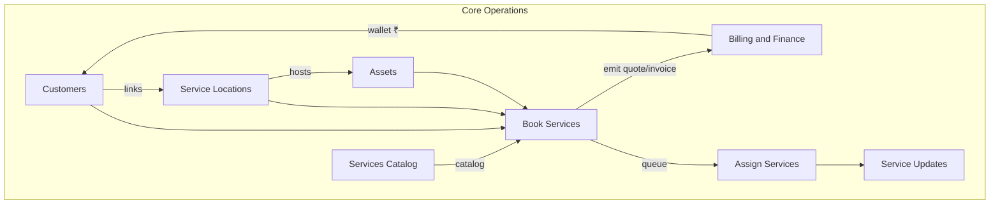
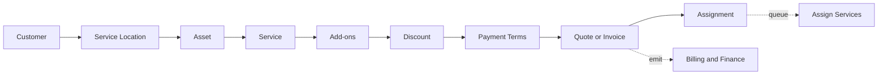
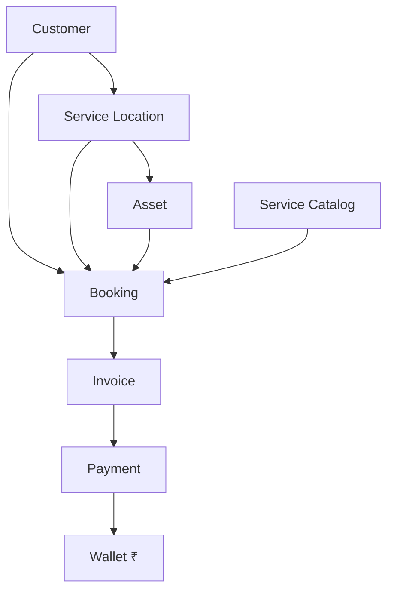
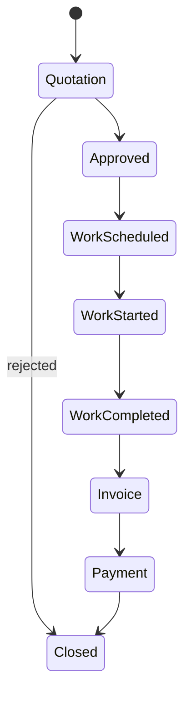

# Products & Services — Admin Restructure Report V3

**Project:** CWP Detailers  
**Date:** 14 June 2026  
**Version:** 3.0 — Architecture Freeze  
**Status:** Documentation Only — No Code Changes  
**Supersedes:** [`PRODUCTS_SERVICES_ADMIN_RESTRUCTURE_REPORT.md`](./PRODUCTS_SERVICES_ADMIN_RESTRUCTURE_REPORT.md) (v2.0)  
**Companion docs:**

- [`SCREEN_MAPPING_V2.md`](./SCREEN_MAPPING_V2.md) — per-screen KEEP / MOVE / MERGE / DELETE / RENAME  
- [`DATA_RELATIONSHIP_V1.md`](./DATA_RELATIONSHIP_V1.md) — domain entity relationships & lifecycle  
- [`ARCHITECTURE_VALIDATION_REPORT_V1.md`](./ARCHITECTURE_VALIDATION_REPORT_V1.md) — final pre-implementation validation  
- [`SERVICE_CONTRACT_MODEL_V1.md`](./SERVICE_CONTRACT_MODEL_V1.md) — contract layer (required before Sprint 4)  
- [`IMPLEMENTATION_SEQUENCE_V1.md`](./IMPLEMENTATION_SEQUENCE_V1.md) — 8-sprint execution plan  

---

## Table of Contents

1. [Executive Summary](#1-executive-summary)
2. [Founder-Approved Architecture (V3)](#2-founder-approved-architecture-v3)
3. [Wallet System](#3-wallet-system)
4. [Assets Module](#4-assets-module)
5. [Service Locations](#5-service-locations)
6. [Book Services Flow](#6-book-services-flow)
7. [Customer 360 Rules](#7-customer-360-rules)
8. [Billing Lifecycle](#8-billing-lifecycle)
9. [Target Module Structure](#9-target-module-structure)
10. [Current vs Target](#10-current-vs-target)
11. [GST Architecture](#11-gst-architecture)
12. [Data Layer (Target)](#12-data-layer-target)
13. [Implementation Phases](#13-implementation-phases)
14. [Recommendation Register](#14-recommendation-register)
15. [Risks & Migration Notes](#15-risks--migration-notes)
16. [Future Scope](#16-future-scope)
17. [Architecture Diagrams](#17-architecture-diagrams)
18. [Document History](#18-document-history)

---

## 1. Executive Summary

The CWP admin panel requires a **navigation and domain separation** refactor before further feature work. The backend largely supports three service lines (daily car cleaning, doorstep wash, solar cleaning), but the UI conflates catalog setup, customer identity, asset management, booking, assignment, and billing.

### V3 adds to V2

| Addition | Impact |
|----------|--------|
| **Service Locations** | New core entity — bookings occur at a location, not just on an asset |
| **Wallet clarification** | Documented ₹-only ledger with worked examples; entitlements strictly separate |
| **Customer 360 Billing Summary** | Billing visibility **retained** on Customer 360 (summary only) |
| **Billing lifecycle** | Explicit status chain + alternate payment flows |
| **DATA_RELATIONSHIP_V1** | Frozen domain model before implementation |
| **Priority / Risk / Dependency** | Every recommendation tagged for implementation planning |

### Eight Target Operational Modules

1. **Services** — Catalog setup only  
2. **Service Locations** — Site masters + customer links  
3. **Assets** — Vehicle / solar / future types + location placement  
4. **Customers** — Identity + read-only summaries (no service creation)  
5. **Book Services** — 9-step operational flow  
6. **Assign Services** — Unified staff assignment  
7. **Service Updates** — Live ops dashboard  
8. **Billing & Finance** — Separate finance hub  

**No code. No migrations. No route renames in application until Phase 1 kickoff.**

---

## 2. Founder-Approved Architecture (V3)

All decisions below are **locked** for architecture freeze:

| # | Decision | Ruling |
|---|----------|--------|
| 1 | Wallet | Monetary adjustment ledger (₹) only — not loyalty, wash credits, or service credits |
| 2 | Assets | Core module — independent masters; customers link, not own |
| 3 | Service Locations | Core entity — one customer, many locations; bookings reference location |
| 4 | Book Services flow | Customer → Service Location → Asset → Service → Add-ons → Discount → Payment Terms → Quote/Invoice → Assignment |
| 5 | Billing module | Separate **Billing & Finance**; Book Services emits quotes/invoices into it |
| 6 | Customer 360 billing | **Billing Summary** retained (due, wallet ₹, last invoice/payment, Open Billing CTA) |
| 7 | Customer service creation | **Blocked** in Customer module — Book Services only |
| 8 | Entitlements | Package visit credits remain `customer_entitlements` — never wallet |

---

## 3. Wallet System

### 3.1 What Wallet Is

A **per-customer ₹ balance** used for monetary adjustments only.

**Supported use cases:**

- Customer paid extra amount (overpayment)
- Advance payment adjustment
- Refund adjustment (credit to wallet)
- Credit adjustment (goodwill / dispute)
- Manual finance adjustment

### 3.2 What Wallet Is NOT

| Not Wallet | Correct system |
|------------|----------------|
| Loyalty points | Not in V1 scope |
| Wash credits (5-wash package) | `customer_entitlements` |
| Solar AMC visit credits | `customer_entitlements` |
| DCMS visit quota | `dcms_subscriptions` limits |
| Service coupons | Future coupons table |

### 3.3 Worked Example

```
Invoice A       = ₹900
Customer paid   = ₹1,000
────────────────────────
Wallet credit   = ₹100        ← overpayment stored as ₹

Later:
New Invoice B   = ₹500
Wallet applied  = ₹100
Customer pays   = ₹400
────────────────────────
Wallet balance  = ₹0
```

### 3.4 UI Placement

| Surface | Shows | CRUD |
|---------|-------|------|
| Customer 360 → Wallet Summary | ₹ balance, last few transactions | Read-only |
| Customer 360 → Billing Summary | Due, wallet ₹, last invoice/payment | Read-only |
| Billing & Finance → Wallet Adjustments | Full ledger, credit/debit forms | **Full management** |

| Recommendation | Priority | Risk | Dependency |
|----------------|----------|------|------------|
| Document wallet as ₹-only in all admin copy | Critical | Low | Phase 2 |
| Move wallet CRUD to Billing & Finance | Critical | Medium | Phase 2 |
| Prevent wallet from decrementing entitlements | Critical | Low | Phase 2 |
| Wallet apply at invoice payment | High | Medium | Phase 2 |

---

## 4. Assets Module

### 4.1 Structure

```
Assets (/admin/assets)
├── Vehicles
├── Solar Sites
└── Future Asset Types (extensible registry)
```

### 4.2 Rules

| Rule | Detail |
|------|--------|
| Independent masters | Assets exist before customer or location links |
| Customer does not own CRUD | Customer 360 shows linked assets read-only |
| Location placement | Each asset is placed at a **service location** |
| Book Services | Step 3 selects asset **filtered by Step 2 location** |
| Transfer | Asset may be relinked to new location/customer over time |

### 4.3 Migration from Today

| Today | Target |
|-------|--------|
| `vehicles.customerId` direct FK | Asset master + `location_asset_links` + `customer_asset_links` |
| Solar site inline create in wizard | Assets module CRUD |
| Customer 360 Vehicles tab | Read-only Linked Assets + deep link to Assets |

| Recommendation | Priority | Risk | Dependency |
|----------------|----------|------|------------|
| Assets directory + detail pages | Critical | Medium | Phase 1b |
| Extract vehicle CRUD from Customer 360 | Critical | Medium | Phase 1b |
| Extract solar CRUD from wizard | Critical | Medium | Phase 1b |
| Location placement links | Critical | Medium | Phase 1b |
| Future asset type registry | Low | Low | Future |

---

## 5. Service Locations

### 5.1 Why

One customer may operate at many physical sites:

- Multiple houses  
- Multiple offices  
- Multiple factories  
- Multiple solar installations  
- Multiple parking locations  

**Service bookings must occur against a service location** — not only against an asset or customer address field.

### 5.2 Example

```
Customer: ABC Industries

Service Locations:
  ├── Head Office
  ├── Factory
  └── Director Residence

Assets:
  ├── SUV 1        (at Head Office)
  ├── SUV 2        (at Head Office)
  └── Solar Plant  (at Factory)
```

### 5.3 Entity Fields (Target — Documentation Only)

| Field | Purpose |
|-------|---------|
| `label` | Head Office, Factory, etc. |
| `address` | Full service address |
| `latitude` / `longitude` | Geo for routing |
| `locationType` | office \| factory \| residence \| parking \| other |
| `isActive` | Soft retire |

### 5.4 Relationship Rules

| Relationship | Cardinality | Rule |
|--------------|-------------|------|
| Customer ↔ Location | 1 : N | Via `customer_location_links` |
| Location ↔ Asset | 1 : N | Via `location_asset_links` |
| Booking → Location | N : 1 | **Required** on all new bookings |
| Booking → Asset | N : 1 | Asset must belong to selected location |

| Recommendation | Priority | Risk | Dependency |
|----------------|----------|------|------------|
| `service_locations` entity | Critical | Medium | Phase 1b |
| Service Locations admin module | Critical | Medium | Phase 1b |
| Customer ↔ location links | Critical | Medium | Phase 1b |
| Book Services Step 2 (location picker) | Critical | High | Phase 2 |
| Customer 360 linked locations summary | High | Low | Phase 2 |

---

## 6. Book Services Flow

### 6.1 Nine Steps (Founder Approved)

```
Step 1: Customer          — search or quick-create (profile only)
Step 2: Service Location  — pick linked location or create + link
Step 3: Asset             — pick asset at location or create + place
Step 4: Service           — catalog item (plan / package / one-time)
Step 5: Add-ons           — applicable add-ons
Step 6: Discount          — line-level or invoice-level (% or fixed)
Step 7: Payment Terms     — full advance | partial advance | post-service
Step 8: Quote / Invoice   — emit to Billing & Finance
Step 9: Assignment        — auto | manual | queue → Assign Services
```

### 6.2 V2 → V3 Change

V2 flow was Customer → Asset → Service → …  
**V3 inserts Service Location between Customer and Asset.**

### 6.3 Component Reuse (Future Implementation)

| Existing | V3 role |
|----------|---------|
| `AddCustomerServiceWizard.tsx` | Refactor into steps 4–9 logic |
| `CustomerSearchSelect` | Step 1 |
| Location picker (new) | Step 2 |
| Asset picker (new) | Step 3 |
| `CreateInvoiceDialog.tsx` | Step 8 |
| `QuotationBuilder.tsx` | Step 8 (unified GST) |
| `invoiceGstEngine.ts` | Steps 7–8 |

| Recommendation | Priority | Risk | Dependency |
|----------------|----------|------|------------|
| `/admin/book-services` route + wizard shell | Critical | High | Phase 2 |
| Location step with link validation | Critical | High | Phase 2 |
| Asset filtered by location | Critical | High | Phase 2 |
| Remove wizard from Customer 360 | Critical | Medium | Phase 2 |
| Deep link `?customerId=&locationId=` | High | Low | Phase 2 |
| Unified GST in quote + invoice | High | Medium | Phase 2 |

---

## 7. Customer 360 Rules

### 7.1 What Customer 360 Owns

- Profile (Retail / Corporate, GSTIN)  
- Communications preferences  
- Support / complaints (customer-scoped)  
- **Read-only summaries** with deep links  

### 7.2 What Customer 360 Does NOT Own

- Service creation (no Add Service wizard)  
- Asset CRUD (→ Assets module)  
- Service Location CRUD (→ Service Locations module)  
- Full billing management (→ Billing & Finance)  
- Wallet adjustment forms (→ Billing & Finance)  

### 7.3 Customer 360 Tabs (Target)

| Tab | Type | Content |
|-----|------|---------|
| Overview | Summary | Persona, quick stats, CTAs |
| Profile | CRUD | Identity, type, GST |
| **Billing Summary** | Read-only | Outstanding due, wallet ₹, last invoice, last payment, **Open Billing** |
| **Wallet Summary** | Read-only | ₹ balance, recent transactions (3–5) |
| Linked Service Locations | Read-only | List + link to Service Locations |
| Linked Assets | Read-only | List + link to Assets |
| Active Services | Read-only | Contracts, bookings, entitlements + **Book Service** CTA |
| Communications | CRUD | Timeline, preferences |
| Support | Read-only | Complaints |

### 7.4 Billing Summary (Explicit — V3)

Customer 360 **retains billing visibility**. It does **not** become billing-blind.

| Field | Source | Action on click |
|-------|--------|-----------------|
| Outstanding Due | Dues API | Open Billing → filtered dues |
| Wallet Balance (₹) | Wallet API | Open Billing → wallet tab |
| Last Invoice | Invoices API | Open Billing → invoice detail |
| Last Payment | Payments API | Open Billing → payment detail |
| Open Billing | — | `/admin/billing?customerId=X` |

| Recommendation | Priority | Risk | Dependency |
|----------------|----------|------|------------|
| Billing Summary panel (replace full billing tab) | Critical | Low | Phase 2 |
| Wallet Summary (₹ read-only) | Critical | Low | Phase 2 |
| Remove Add Service wizard | Critical | Medium | Phase 2 |
| Book Service CTA deep link | High | Low | Phase 2 |
| Linked locations/assets read-only | High | Low | Phase 2 |

---

## 8. Billing Lifecycle

### 8.1 Standard Lifecycle

```
Quotation → Approved → Work Scheduled → Work Started → Work Completed → Invoice → Payment → Closed
```

| Status | Definition |
|--------|------------|
| **Quotation** | Price offer; no work committed |
| **Approved** | Customer accepted; payment terms locked |
| **Work Scheduled** | Booking/subscription scheduled |
| **Work Started** | Staff en route or in progress |
| **Work Completed** | Service delivered |
| **Invoice** | Tax document issued |
| **Payment** | Money received; wallet may offset ₹ |
| **Closed** | Zero outstanding for this work line |

### 8.2 Alternate Payment Paths

#### Full Advance

Payment collected at or before **Approved** → work proceeds → invoice reconciles advance → **Closed**.

#### Partial Advance

Partial payment at **Approved** → work proceeds → invoice for balance → final payment → **Closed**.

#### Post-Service Payment

No payment before work → **Work Completed** → **Invoice** → **Payment** → **Closed**.

### 8.3 Module Ownership

| Lifecycle stage | Primary module |
|-----------------|----------------|
| Quotation, Invoice, Payment, Closed | Billing & Finance |
| Approved, payment terms | Book Services |
| Work Scheduled → Completed | Service Updates + Assign Services |

| Recommendation | Priority | Risk | Dependency |
|----------------|----------|------|------------|
| Lifecycle status enum (document + API contract) | High | Medium | Phase 2 |
| Full advance flow | High | Medium | Phase 2 |
| Partial advance + dues tracking | High | Medium | Phase 2 |
| Post-service invoice trigger | High | Medium | Phase 2 |
| Lifecycle filters in Billing hub | Medium | Low | Phase 2 |

---

## 9. Target Module Structure

```
Operations
│
├── Dashboard
├── Leads & CRM
│
├── Customers (/admin/customers)
│   ├── Customer 360 + Billing Summary
│   ├── Legacy / Reactivated / Churned / Import
│   └── NO service creation
│
├── Service Locations (/admin/service-locations)     ← NEW V3
│   ├── Location directory
│   ├── Create / edit location
│   └── Customer links
│
├── Assets (/admin/assets)
│   ├── Vehicles
│   ├── Solar Sites
│   └── Future types
│
├── Services (/admin/services)
│   ├── Daily Car Cleaning (plans, add-ons)
│   ├── Doorstep Wash (one-time, packages)
│   └── Solar (one-time, AMC, panel pricing)
│
├── Book Services (/admin/book-services)             ← 9-step flow
│
├── Assign Services (/admin/assign-services)
│   ├── Pending queue
│   ├── Daily cleaning routes
│   └── Doorstep & solar jobs
│
├── Service Updates (/admin/service-updates)
│   ├── Today's timeline
│   ├── Visits / wash history
│   └── Staff performance
│
├── Billing & Finance (/admin/billing)             ← SEPARATE MODULE
│   ├── Invoices
│   ├── Quotations
│   ├── Payments
│   ├── Dues & Collections
│   ├── Expenses
│   ├── Wallet Adjustments (₹ only)
│   └── Credit Notes
│
├── Complaints
└── Staff
```

---

## 10. Current vs Target

### 10.1 Gap Summary

| Gap | Severity |
|-----|----------|
| No Service Locations entity | Critical |
| Assets embedded in Customer 360 | Critical |
| Service creation in Customer 360 | Critical |
| No Book Services module | Critical |
| Wallet semantics undefined in UI | High |
| Billing duplicated across 3 nav items | High |
| DCMS vs Bookings assignment split | High |
| Customer 360 billing was at risk of over-stripping | Resolved in V3 — summary retained |

### 10.2 Navigation Map

See [`SCREEN_MAPPING_V2.md`](./SCREEN_MAPPING_V2.md) for complete per-screen actions.

---

## 11. GST Architecture

Unchanged from v2 — three levels:

1. **Level 1:** Business / franchisee GST profile (`/admin/settings/invoice-billing`)  
2. **Level 2:** Customer GST (Retail vs Corporate)  
3. **Level 3:** Per catalog item GST (Services module)  

| Recommendation | Priority | Risk | Dependency |
|----------------|----------|------|------------|
| Corporate mandatory GSTIN validation | High | Low | Phase 2 |
| Unify quotation GST with invoiceGstEngine | High | Medium | Phase 2 |
| Franchisee GST profiles | Low | High | Future |

---

## 12. Data Layer (Target)

Full relationship rules: [`DATA_RELATIONSHIP_V1.md`](./DATA_RELATIONSHIP_V1.md)

### 12.1 New / Evolved Tables (Documentation Only)

| Table | Purpose |
|-------|---------|
| `service_locations` | Site masters |
| `customer_location_links` | Customer ↔ location |
| `location_asset_links` | Location ↔ asset placement |
| `customer_asset_links` | Commercial customer ↔ asset |
| `wallet_transactions` | ₹ ledger (existing concept, clarified scope) |
| `customer_entitlements` | Package credits (**not wallet**) |

### 12.2 Booking Required Context (New Bookings)

```
customerId + serviceLocationId + assetId + serviceCatalogRef
```

---

## 13. Implementation Phases

| Phase | Scope | Priority | Risk | Dependency |
|-------|-------|----------|------|------------|
| **0** | Architecture freeze (this doc set) | Critical | Low | None |
| **1** | Nav restructure, rename Services/Billing, remove duplicate sidebar | High | Low | Phase 0 |
| **1b** | Service Locations + Assets modules (schema design + UI) | Critical | Medium | Phase 1 |
| **2** | Book Services 9-step + Customer 360 cleanup + Billing Summary | Critical | High | Phase 1b |
| **3** | Assign Services unified hub | High | Medium | Phase 2 |
| **4** | Service Updates (Operations Wall promotion) | Medium | Low | Phase 3 |
| **5** | Billing consolidation + lifecycle + wallet tab | High | Medium | Phase 2 |
| **6** | Legacy subscription retirement | Medium | High | Future |

**Estimated Phases 1–5:** 5–6 weeks focused development after architecture sign-off.

---

## 14. Recommendation Register

Complete tagged list for implementation planning:

| ID | Recommendation | Priority | Risk | Dependency |
|----|----------------|----------|------|------------|
| R01 | Freeze architecture (V3 docs) | Critical | Low | None |
| R02 | Service Locations entity + module | Critical | Medium | Phase 1b |
| R03 | Assets entity + module | Critical | Medium | Phase 1b |
| R04 | Location ↔ asset placement model | Critical | Medium | Phase 1b |
| R05 | Book Services 9-step wizard | Critical | High | Phase 2 |
| R06 | Wallet ₹-only semantics | Critical | Low | Phase 2 |
| R07 | Entitlements separate from wallet | Critical | Low | Phase 2 |
| R08 | Customer 360 Billing Summary | Critical | Low | Phase 2 |
| R09 | Customer 360 Wallet Summary | Critical | Low | Phase 2 |
| R10 | Block service creation in Customer 360 | Critical | Medium | Phase 2 |
| R11 | Billing & Finance separate module | Critical | Medium | Phase 1 |
| R12 | Billing lifecycle statuses | High | Medium | Phase 2 |
| R13 | Full / partial / post-service flows | High | Medium | Phase 2 |
| R14 | Rename Products → Services | High | Low | Phase 1 |
| R15 | Merge duplicate billing nav items | High | Low | Phase 1 |
| R16 | Assign Services unified hub | High | Medium | Phase 3 |
| R17 | Service Updates dashboard | Medium | Low | Phase 4 |
| R18 | GST engine unification in quotations | High | Medium | Phase 2 |
| R19 | Corporate customer type field | High | Low | Phase 2 |
| R20 | Future asset types | Low | Low | Future |
| R21 | Franchisee location scoping | Low | High | Future |
| R22 | Legacy subscriptions retirement | Medium | High | Future |

---

## 15. Risks & Migration Notes

| Risk | Severity | Mitigation |
|------|----------|------------|
| `vehicles.customerId` migration breaks reports | High | Dual-read period; link tables added alongside legacy FKs |
| Service Location backfill for existing bookings | High | Default location from customer address for historical rows |
| Wallet confused with entitlements in UI | Medium | V3 copy rules; separate tabs |
| Billing regression during GST merge | High | Parallel quotation route until Phase 5 verified |
| Phase 2 blocked without Phase 1b | Critical | Enforce phase order in sprint planning |

**No big-bang migration required for Phase 1.** Phases 1b–2 introduce new tables and UI with backward-compatible reads.

---

## 16. Future Scope

**Not in Phases 1–5** (Assets and Service Locations **are** in current phase):

| Feature | Priority | Risk | Dependency |
|---------|----------|------|------------|
| Coupon codes | Medium | Medium | Future |
| Payment gateway | High | High | Future |
| Bill delivery (WA/SMS/email) | Medium | Medium | Future |
| Customer self-booking alignment | Medium | Medium | Future |
| CA / GSTR exports | Low | High | Future |
| GPS / map in Service Updates | Low | Medium | Future |
| Additional asset types beyond vehicle/solar | Low | Low | Future |

---

## 17. Architecture Diagrams

### 17.1 Module Dependency



### 17.2 Book Services Flow (V3)



### 17.3 Domain Context (Booking)



### 17.4 Billing Lifecycle



---

## 18. Document History

| Version | Date | Changes |
|---------|------|---------|
| 1.0 | 15 Jun 2026 | Initial analysis |
| 2.0 | 14 Jun 2026 | Founder decisions: Assets, wallet, 8-step flow, Billing separate |
| 3.0 | 14 Jun 2026 | Service Locations, 9-step flow, Billing Summary rule, billing lifecycle, DATA_RELATIONSHIP_V1, priority/risk/dependency on all recommendations, architecture freeze |
| 3.1 | 14 Jun 2026 | Post-validation: links to ARCHITECTURE_VALIDATION_REPORT_V1, SERVICE_CONTRACT_MODEL_V1, IMPLEMENTATION_SEQUENCE_V1 |

---

*End of report v3.0. Architecture frozen for implementation. No code changes in this revision.*
