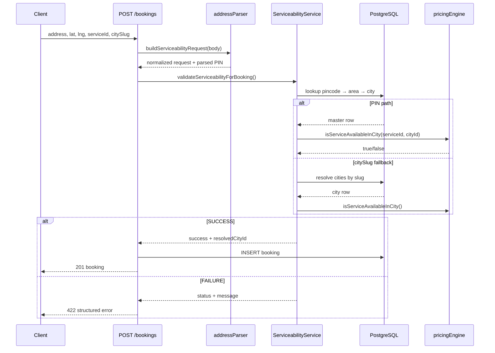

# Serviceability Validation — Phase 1

**Project:** CWP Detailers  
**Date:** 16 July 2026  
**Status:** Implemented (backend only — no UI or schema changes)

---

## Summary

Phase 1 adds a reusable **Serviceability Validation Engine** that runs before every booking creation. It uses existing master data (`pincodes`, `service_areas`, `cities`, `service_city_availability`) and does **not** introduce new database tables or frontend changes.

---

## Validation Flow

```
Booking request (address, lat, lng, placeId, serviceId?, citySlug?)
        │
        ▼
buildServiceabilityRequest()  ← optional addressComponents / pincode accepted
        │
        ▼
parseGoogleAddressComponents()  ← in-memory only (Phase 2 persists)
        │
        ▼
Extract PIN from components or address text
        │
        ├── PIN found ──► lookup pincodes → service_areas → cities
        │                      │
        │                      ├── PIN/area inactive → SERVICE_AREA_NOT_SUPPORTED
        │                      ├── city inactive     → CITY_NOT_AVAILABLE
        │                      └── serviceId set     → isServiceAvailableInCity()
        │
        └── PIN missing ──► citySlug / cityId / cityName fallback
                               │
                               ├── city not found → PIN_NOT_FOUND
                               ├── city inactive  → CITY_NOT_AVAILABLE
                               └── serviceId set  → isServiceAvailableInCity()
        │
        ▼
SUCCESS → booking insert (cityId stamped when resolved)
FAILURE → HTTP 422 structured response + warn log
```

---

## Where Validation Runs

| Entry point | File | Method |
|---|---|---|
| Customer / admin direct booking | `artifacts/api-server/src/routes/bookings.ts` | `POST /bookings` |
| Admin Book Services wizard | `artifacts/api-server/src/lib/contracts/serviceContractService.ts` | `createOneTimeContract()` |
| Service contracts API | `artifacts/api-server/src/routes/service-contracts.ts` | catches `ServiceabilityValidationError` |
| Staff walk-in booking | `artifacts/api-server/src/lib/staff/walkInService.ts` | before `bookings` insert |
| Walk-in API | `artifacts/api-server/src/routes/staff-walk-in.ts` | `POST /staff/walk-in/resolve` |
| Lead conversion booking | `artifacts/api-server/src/routes/leads.ts` | convert handler |

**Not validated:** `POST /bookings/:id/regenerate-occurrences` (clones an already-validated parent booking).

---

## Core Module

```
artifacts/api-server/src/lib/serviceability/
├── types.ts                    # Status enum, request/result types
├── addressParser.ts            # PIN extraction, Google component parsing
├── serviceabilityService.ts    # validateServiceability()
├── serviceabilityErrors.ts     # ServiceabilityValidationError
├── index.ts                    # Public exports
├── addressParser.test.ts
└── serviceabilityService.test.ts
```

---

## API Response (failure)

**HTTP 422**

```json
{
  "success": false,
  "status": "SERVICE_NOT_AVAILABLE",
  "message": "This service is currently unavailable in your city."
}
```

### Status codes

| Status | Meaning |
|---|---|
| `SUCCESS` | Validation passed (not returned over HTTP) |
| `PIN_NOT_FOUND` | No PIN in address and city could not be resolved |
| `CITY_NOT_FOUND` | Reserved — city fallback returns `PIN_NOT_FOUND` when unresolved |
| `CITY_NOT_AVAILABLE` | City master exists but `is_active = false` |
| `SERVICE_NOT_AVAILABLE` | No active `service_city_availability` row for service + city |
| `SERVICE_AREA_NOT_SUPPORTED` | PIN not in master or PIN/area inactive |
| `INVALID_ADDRESS` | Missing address text or invalid lat/lng |

Existing error shapes (`{ error: "..." }`) are unchanged for non-serviceability failures.

---

## Backward Compatibility

- **No new required request fields.** Existing payloads `{ address, locationLat, locationLng, placeId, citySlug }` continue to work.
- **Optional** (ignored by current UI): `addressComponents`, `postalCode`, `pincode`.
- **City fallback:** When PIN is absent from address text, `citySlug` (already sent as `"varanasi"` by customer app) resolves the city for validation.
- **No database migrations.**

---

## Logging

Blocked bookings emit a structured warn log:

```json
{
  "event": "booking_serviceability_blocked",
  "customerId": 42,
  "serviceId": 3,
  "pincode": "221005",
  "cityId": 7,
  "cityName": "Varanasi",
  "status": "SERVICE_NOT_AVAILABLE"
}
```

---

## Tests

```bash
pnpm --filter @workspace/api-server run test:serviceability
```

Covers: valid/invalid PIN, active/disabled city, available/unavailable service, missing address/coordinates, Google component parsing, citySlug fallback.

---

## Sequence Diagram



---

## Remaining Work (Phase 2+)

- Persist structured address components to database
- Unified `addresses` table
- PIN-wise service availability (not just city-level)
- Location-first UX gate + serviceability preview API
- Server-side geocode cache
- Admin bulk PIN import/export
- `GET /api/coverage/check` public endpoint

---

*See also: [ADDRESS_GOOGLE_MAPS_BOOKING_AUDIT_REPORT.md](./ADDRESS_GOOGLE_MAPS_BOOKING_AUDIT_REPORT.md)*
