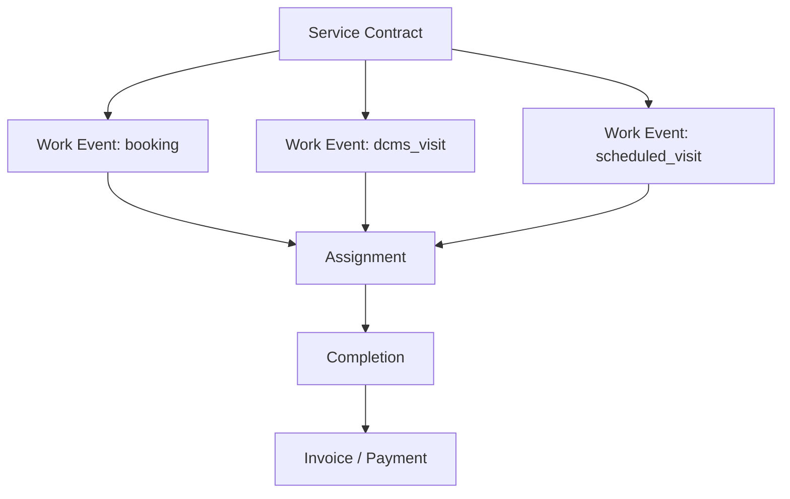
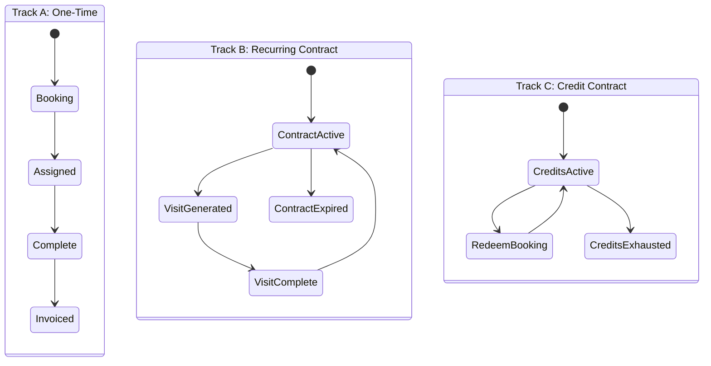

# Service Contract Model V1

**Project:** CWP Detailers  
**Date:** 14 June 2026  
**Status:** Architecture Validation — Documentation Only  
**Triggered by:** Final architecture validation (Service Contracts Layer review)  
**Companion:** [`ARCHITECTURE_VALIDATION_REPORT_V1.md`](./ARCHITECTURE_VALIDATION_REPORT_V1.md), [`DATA_RELATIONSHIP_V1.md`](./DATA_RELATIONSHIP_V1.md)

---

## 1. Problem Statement

V3 architecture chains:

```
Customer → Service Location → Asset → Service → Booking
```

This is **correct for one-time doorstep wash and one-time solar cleaning**, but **incorrect as the only runtime model** for:

| Offering | Nature | Example |
|----------|--------|---------|
| Daily Car Cleaning | Time-bound plan with daily visit generation | 12 months, 365 visits, UP32AB1234 |
| Solar AMC | Time-bound plan with scheduled visit quota | 12 months, 24 visits, ABC Industries |
| Wash Package | Credit-based prepaid contract | 5 washes, no fixed calendar end |
| One-time wash/solar | Single work order | One booking |

Treating a 12-month daily cleaning plan as a single "booking" will cause **major rework** in assignment, billing, renewals, and Service Updates.

---

## 2. Recommendation (Founder-Level)

**Introduce Service Contract as an explicit domain layer** between Service selection and work events.

### Target chain (complete)

```
Customer
  → Service Location
  → Asset
  → Service (catalog)
  → Service Contract        ← NEW explicit layer
  → Work Events             (bookings | visits | scheduled jobs)
  → Assignments
  → Invoice / Payment
```

### V3 Book Services flow (unchanged steps, clarified outcome)

Book Services Step 4 selects a **catalog service**. Step 8 outcome depends on service **fulfillment mode**:

| Fulfillment mode | What Book Services creates | What generates work |
|------------------|---------------------------|---------------------|
| `one_time` | Work Event (`bookings`) directly | Single job |
| `contract_recurring` | Service Contract → first work events | Scheduler generates visits |
| `contract_credits` | Service Contract (`entitlements`) | Redemption creates work event |

---

## 3. Service Contract Definition

A **Service Contract** is a **customer-facing commercial agreement** to deliver a catalog service against a specific asset at a service location for a defined period or credit pool.

### Core fields (logical — documentation only)

| Field | Purpose |
|-------|---------|
| `contractId` | Primary key |
| `customerId` | Billing party |
| `serviceLocationId` | Where service is performed |
| `assetId` | Vehicle or solar site |
| `catalogServiceRef` | Plan / package / AMC from Services module |
| `fulfillmentMode` | `one_time` \| `contract_recurring` \| `contract_credits` |
| `startDate` | Contract start |
| `endDate` | Contract end (nullable for credit-only) |
| `allocatedUnits` | Total visits/washes/cleanings |
| `usedUnits` | Consumed |
| `remainingUnits` | Balance |
| `status` | draft \| active \| paused \| completed \| expired \| cancelled |
| `quotationId` / `invoiceId` | Billing linkage |
| `branchId` / `franchiseeId` | Tenancy |

---

## 4. Mapping to Existing Codebase (No Migration Yet)

The codebase **already implements** service contracts under different names. V1 model **unifies terminology** without requiring immediate schema merge.

| Business concept | Existing table | Fulfillment mode |
|------------------|----------------|------------------|
| Daily Car Cleaning plan | `dcms_subscriptions` | `contract_recurring` |
| Wash package | `customer_entitlements` | `contract_credits` |
| Solar AMC | `customer_entitlements` (or legacy `subscriptions`) | `contract_credits` or `contract_recurring` |
| One-time wash/solar | `bookings` | `one_time` (no contract row, or short-lived contract) |
| Unified read model | `customer_contracts` | Registry aggregating all sources |

### Registry pattern (keep)

`customer_contracts` remains the **read-model registry** for Customer 360 Active Services:

```
sourceSystem: dcms | entitlement | subscription
sourceId: → underlying contract table
```

**Do not** make `customer_contracts` the write path — each source system keeps its write logic until a future consolidation phase.

---

## 5. Work Events (Children of Contracts)

| Work event | Parent contract | Table | Assignment |
|------------|-----------------|-------|------------|
| Doorstep one-time job | Optional short contract | `bookings` | `bookings.staffId` |
| Daily cleaning visit | `dcms_subscriptions` | `dcms_visits` | `dcms_staff_assignments` |
| Package wash redemption | `customer_entitlements` | `bookings` (linked) | `bookings.staffId` |
| Solar AMC visit | `customer_entitlements` | `bookings` or future `scheduled_visits` | `bookings.staffId` |



---

## 6. Examples

### 6.1 Daily Car Cleaning

```
Customer:    Rahul Sharma
Location:    Home — Sector 4
Asset:       UP32AB1234
Service:     12-Month Daily Plan
Contract:    dcms_subscriptions
  Start:     1 July
  End:       30 June
  Visits:    365 allocated
Work events: dcms_visits (1 per day, generated by scheduler)
Assignment:  dcms_staff_assignments (route)
Invoice:     May be annual invoice at contract start OR monthly — payment terms from Book Services
```

### 6.2 Solar AMC

```
Customer:    ABC Industries
Location:    Factory
Asset:       Solar Plant (500 panels)
Service:     12-Month Solar AMC
Contract:    customer_entitlements (or future unified contract)
  Start:     1 July
  End:       30 June
  Visits:    24 allocated
Work events: bookings or scheduled_visits (24 over year)
Assignment:  per visit
Invoice:     Per AMC quotation at Book Services
```

### 6.3 One-Time Wash

```
Customer → Location → Asset → Service (Premium Wash)
No long-lived contract (or ephemeral contract row)
Work event: single booking
Assignment → Complete → Invoice
```

---

## 7. Lifecycle Models (Three Tracks)

### Track A — Ad-hoc (One-Time)

```
Book Services → Work Event (booking) → Assignment → Complete → Invoice → Payment → Closed
```

### Track B — Contract Recurring (Daily Cleaning)

```
Book Services → Service Contract (active)
  → Scheduler generates Work Events (visits)
  → Assignment (route)
  → Complete visit
  → Invoice per payment terms (advance / periodic / end)
  → Renewal before expiry
```

### Track C — Contract Credits (Package / AMC)

```
Book Services → Service Contract (credit pool)
  → Redemption creates Work Event
  → Assignment → Complete
  → Invoice at purchase (package) or per visit (AMC variant)
```



---

## 8. Book Services Step 8 Clarification

When Book Services completes, it must branch on `fulfillmentMode`:

| Mode | Step 8 creates | Step 9 assigns |
|------|----------------|----------------|
| `one_time` | `bookings` row | staff on booking |
| `contract_recurring` | `dcms_subscriptions` + registry row | route assignment queue |
| `contract_credits` | `customer_entitlements` + registry row | n/a until redemption |

Quotation/Invoice in Step 7 links to **contract** (not individual visit) for recurring/credit modes.

---

## 9. DATA_RELATIONSHIP_V1 Gap & Patch

`DATA_RELATIONSHIP_V1.md` should treat **Booking** as **Work Event** umbrella term. Recommended addendum:

| Entity | Relationship |
|--------|--------------|
| Service Contract | 1 customer + 1 location + 1 asset + 1 catalog service |
| Service Contract | 1 → N Work Events |
| Work Event | booking OR dcms_visit OR scheduled_visit |
| Invoice | May link to contract and/or work event |

**Priority:** Critical — document before Sprint 4.  
**Risk:** Low if terminology-only; Medium if schema unification attempted too early.  
**Dependency:** Sprint 4 (Book Services).

---

## 10. Implementation Strategy

### Phase A (Sprint 4 — recommended)

- **Do not** merge `dcms_subscriptions` and `entitlements` into one table yet  
- **Do** add `serviceLocationId` to contract creation paths where missing  
- **Do** route all contract creation through Book Services  
- **Do** use `customer_contracts` registry for Customer 360 Active Services  
- **Do** label UI as "Service Contract" not "subscription" or "entitlement"  

### Phase B (Future)

- Optional unified `service_contracts` table with typed extensions  
- Solar AMC scheduled visit generator  
- Renewal workflow  

---

## 11. Acceptance Criteria (Architecture)

- [ ] Daily cleaning sold only via Book Services creates `dcms_subscriptions` + registry  
- [ ] Package sold creates `customer_entitlements` + registry — not wallet  
- [ ] One-time creates `bookings` with location + asset FKs  
- [ ] Customer 360 Active Services reads registry — not three separate UIs  
- [ ] Service Updates shows visits and bookings under contract context  
- [ ] Billing links invoice to contract where applicable  

---

## Document History

| Version | Date | Changes |
|---------|------|---------|
| 1.0 | 14 Jun 2026 | Initial service contract model from validation review |

---

*Documentation only. No code, migrations, or schema changes.*
