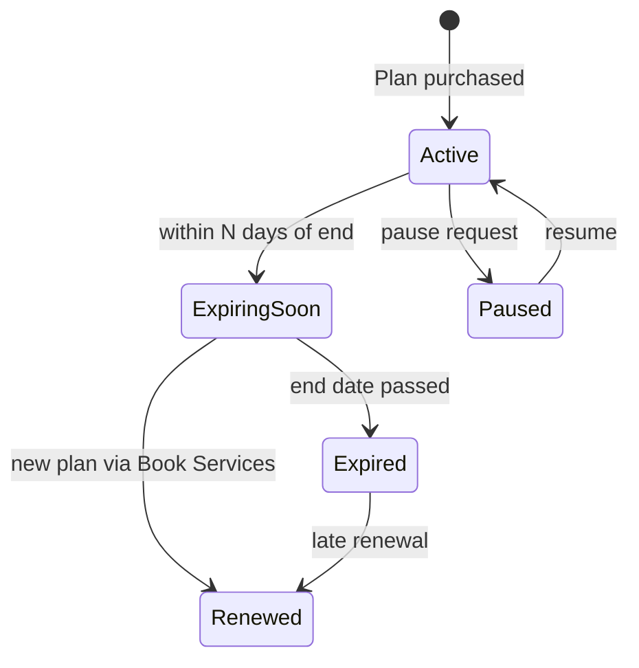

# Service Contract Review V2

**Project:** CWP Detailers  
**Date:** 14 June 2026  
**Version:** 2.0 — Final Pre-Development Review  
**Status:** Documentation Only  
**Reviews:** [`SERVICE_CONTRACT_MODEL_V1.md`](./SERVICE_CONTRACT_MODEL_V1.md) against all architecture docs  
**Output:** [`FINAL_ARCHITECTURE_SIGNOFF.md`](./FINAL_ARCHITECTURE_SIGNOFF.md)

---

## Executive Summary

| Question | Answer |
|----------|--------|
| Is SERVICE_CONTRACT_MODEL_V1 complete? | **Yes, with one clarification** (Solar AMC fulfillment mode) |
| Is it practical for CWP operations? | **Yes** — maps to existing `dcms_subscriptions`, `customer_entitlements`, `bookings`, `customer_contracts` |
| Does it fit all service types long-term? | **Yes** — all six product families fit three fulfillment tracks |
| Is terminology operationally clear? | **Partially** — internal model is sound; **admin UI needs business labels** (see §1) |
| New modules required? | **No** — renewal, portal, and staff app extend existing model |
| Can Sprint 1 start? | **Yes** |

**Overall:** Model is **approved for implementation** subject to conditions in FINAL_ARCHITECTURE_SIGNOFF.md.

---

## 1. Terminology Validation

### 1.1 Problem

Internal terms (`Contract`, `Booking`, `Visit`, `Entitlement`, `Subscription`) are accurate for engineering but confuse admin staff, franchisees, and field teams. The codebase already mixes DCMS jargon with business language.

### 1.2 Recommendation — Dual-layer terminology

Keep **internal domain names** stable in code/schema. Use **business labels** in all human-facing UI (admin, staff app, customer portal, franchise portal).

| Internal (code / docs) | Admin UI label | Staff app label | Customer portal label | When to use |
|------------------------|----------------|-----------------|----------------------|-------------|
| **Service Contract** (registry row) | **Active Plan** | — | **My Plans** | Any sold plan/package/AMC |
| `dcms_subscriptions` | **Daily Cleaning Plan** | **Daily Plan** | **Daily Cleaning** | Recurring daily cleaning |
| `customer_entitlements` (wash) | **Wash Package** | **Package** | **Wash Package** | 5-wash / 10-wash prepaid |
| `customer_entitlements` (solar) | **Solar AMC Plan** | **AMC Plan** | **Solar AMC** | 6/12-month solar |
| **Service Schedule** (logical) | **Service Schedule** | **My Route** | **Schedule** | Recurring visit generation (daily + AMC) |
| `dcms_visits` | **Visit** | **Visit** | **Visit** | Daily cleaning field event |
| `bookings` (one-time) | **Job** | **Job** | **Booking** | Single doorstep/solar job |
| `bookings` (package redeem) | **Job** (from package) | **Job** | **Booking** | Wash redeemed from package |
| **Assignment** | **Assignment** | **Assigned to you** | — | Staff mapping |
| `fulfillmentMode: one_time` | One-Time Service | Job | One-time booking | |
| `fulfillmentMode: contract_recurring` | Plan with Schedule | Route / visits | Scheduled service | Daily + Solar AMC |
| `fulfillmentMode: contract_credits` | Prepaid Package | Package balance | Remaining washes | Multi-wash only |

**Drop from admin UI:** "Contract", "Entitlement", "DCMS", "Subscription" (except developer docs).

### 1.3 Business flow labels (founder examples mapped)

#### Daily Car Cleaning

```
Customer buys:     Daily Cleaning Plan        (catalog: dcms_plans)
System creates:    Active Plan + Service Schedule   (dcms_subscriptions + registry)
System generates:  Visits                     (dcms_visits)
Assigned to:       Staff                      (dcms_staff_assignments)
```

#### Doorstep Wash (one-time)

```
Customer buys:     One-Time Service           (catalog: services)
System creates:    Job                        (bookings)
Assigned to:       Staff                      (bookings.staffId)
```

#### Solar AMC

```
Customer buys:     Solar AMC Plan             (catalog: catalog_packages)
System creates:    Active Plan + Service Schedule   (entitlement/subscription + registry)
System generates:  Jobs                       (bookings or scheduled_visits — see §2)
Assigned to:       Staff                      (per job)
```

#### Wash Package

```
Customer buys:     Wash Package               (catalog: catalog_packages)
System creates:    Wash Package (prepaid)     (customer_entitlements — NOT wallet)
Customer redeems:  Job per wash               (bookings linked to entitlement)
```

### 1.4 Terminology decision

| Priority | Risk | Dependency |
|----------|------|------------|
| **High** | Low | Sprint 1 (admin copy), Sprint 4 (wizard labels) |

Add glossary to V3 report appendix during Sprint 1 — **no new module**.

---

## 2. Service Contract Completeness — All Service Types

### 2.1 Fit matrix

| Service line | Product variant | Catalog source | Fulfillment mode | Runtime storage | Fits? |
|--------------|-----------------|----------------|------------------|-----------------|-------|
| **Daily Car Cleaning** | Monthly plan | `dcms_plans` | `contract_recurring` | `dcms_subscriptions` | ✅ |
| | Quarterly plan | `dcms_plans` | `contract_recurring` | `dcms_subscriptions` | ✅ |
| | Half-yearly plan | `dcms_plans` | `contract_recurring` | `dcms_subscriptions` | ✅ |
| | Annual plan | `dcms_plans` | `contract_recurring` | `dcms_subscriptions` | ✅ |
| **Doorstep Wash** | One-time wash | `services` | `one_time` | `bookings` | ✅ |
| | Multi-wash package | `catalog_packages` | `contract_credits` | `customer_entitlements` | ✅ |
| **Solar Cleaning** | One-time cleaning | `services` + solar slabs | `one_time` | `bookings` | ✅ |
| | 6-month AMC | `catalog_packages` | `contract_recurring` | `customer_entitlements` + scheduled jobs | ✅* |
| | 12-month AMC | `catalog_packages` | `contract_recurring` | `customer_entitlements` + scheduled jobs | ✅* |
| | Custom AMC | `catalog_packages` (custom validity) | `contract_recurring` | Same | ✅* |

\* Solar AMC **architecturally fits** `contract_recurring` with a visit scheduler generating jobs. **Implementation gap:** scheduler not built today — staff manually create jobs until post–Sprint 4B automation. This is a **delivery sequencing** issue, not an architecture flaw.

### 2.2 Clarification required (V1 ambiguity)

V1 listed Solar AMC under both `contract_credits` and `contract_recurring`.

**V2 ruling:**

| Product | Correct mode | Reason |
|---------|--------------|--------|
| Wash package | `contract_credits` | Customer redeems when they want; no fixed calendar |
| Solar AMC | `contract_recurring` | Fixed period + allocated visit count over schedule |
| Daily cleaning | `contract_recurring` | Calendar-driven daily visits |

`contract_credits` = **prepaid pool, customer-initiated redemption**.  
`contract_recurring` = **time-bound plan, system-initiated visit/job generation**.

### 2.3 Identified gaps (none architectural)

| Gap | Severity | Resolution | When |
|-----|----------|------------|------|
| Solar AMC auto-scheduler | Medium | Generate N jobs across AMC period | Post Sprint 4B (manual jobs interim) |
| `serviceLocationId` on DCMS subs | Medium | Additive column at contract create | Sprint 4B |
| Custom AMC visit frequency rules | Low | Catalog metadata `visitsPerMonth` | Future config |
| Unified `service_contracts` table | Low | Optional Phase B | Not required for V1 |

**No new domain entity required.** All types fit three fulfillment tracks.

---

## 3. Renewal Workflow

### 3.1 Target lifecycle

```
Plan Purchased → Active → Expiring Soon → Expired → Renewed (new plan)
```

### 3.2 Architecture support

| Capability | Supported? | Mechanism |
|------------|------------|-----------|
| Status tracking | ✅ | `customer_contracts.status` includes `expiring`, `expired`; DCMS `dcms_subscriptions.status` |
| Expiring Soon | ✅ | Derived: `endDate - N days` on contract registry |
| Auto reminders | ✅ | Communication Center audiences on `expiring` contracts |
| Renewal offers | ✅ | Quotation linked to customer + prior plan context |
| Customer portal renewal | ✅ | Portal "Renew" → same Book Services API chain |
| Franchise renewals | ✅ | Franchisee portal + `franchiseeId` on contract |
| Renewal record | ✅ | New `dcms_subscriptions` / entitlement + registry; optional `renewedFromContractId` (future FK) |



### 3.3 Recommendation

| Priority | Risk | Dependency |
|----------|------|------------|
| **Medium** | Low | Post Sprint 4B (not blocking Sprint 1) |

Renewal is **workflow on existing contract model** — not a new module. Implement reminders in Communication Center; renewal UX in Book Services + Customer Portal when those surfaces are built.

---

## 4. Customer Portal Compatibility

### 4.1 Required portal features vs architecture

| Portal feature | Data source | Redesign needed? |
|----------------|-------------|------------------|
| View active plans | `customer_contracts` registry | **No** |
| Remaining washes | `customer_entitlements.remaining` | **No** |
| Upcoming visits | `dcms_visits` (scheduled) + future AMC schedule | **No** |
| Visit / job history | `dcms_visits` + `bookings` | **No** |
| Download invoices | `invoices` PDF API | **No** |
| Renewal request | Book Services API (customer context) | **No** |

### 4.2 Portal read API (conceptual — doc only)

```
GET /api/portal/my-plans        → customer_contracts + summaries
GET /api/portal/my-plans/:id    → contract detail + remaining units
GET /api/portal/upcoming        → visits + jobs next 7 days
GET /api/portal/history         → completed visits + jobs
```

Service Contract layer **improves** portal consistency — one "My Plans" feed instead of three silos.

| Priority | Risk | Dependency |
|----------|------|------------|
| Medium | Low | Post Sprint 5 (Customer 360 registry) |

---

## 5. Staff App Compatibility

### 5.1 Required staff features vs architecture

| Staff feature | Current implementation | Contract model impact |
|---------------|------------------------|----------------------|
| Today's visits | `dcms_visits` + daily route API | **No redesign** — visits remain |
| Today's jobs | `bookings` API | **No redesign** |
| Route planning | `dcms_staff_assignments` | **No redesign** |
| Auto assignment | Booking assign + DCMS assign APIs | Unified in Sprint 6 — same APIs |
| GPS attendance | `dcms_subscription_locations` radius | Extend to service locations later — optional |
| Job completion | Visit complete + booking complete | **No redesign** |

### 5.2 Additive enhancement (optional)

Attach `contractRegistryId` or `sourceContractId` to work events for staff app context ("Daily Plan — UP32AB1234"). **Additive field — not blocking.**

Staff app continues calling **visits** and **jobs** endpoints. Internal contract layer is admin/portal aggregation.

| Priority | Risk | Dependency |
|----------|------|------------|
| Low | Low | Sprint 6+ optional metadata |

---

## 6. Sprint Plan Refinement — Split Sprint 4?

### 6.1 Current Sprint 4 scope (monolithic)

Single sprint delivers: 9-step wizard + 3 fulfillment branches + quotation/invoice + assignment queue + registry writes.

**Risk:** High — too many integration points for one sprint.

### 6.2 Recommendation — **Split into 4A, 4B, 4C**

#### Sprint 4A — Book Services Wizard Shell

**Scope:** Steps 1–4 + Steps 5–7 UI (no persistence beyond draft)

```
Customer → Service Location → Asset → Service → Add-ons → Discount → Payment Terms
```

| Pros | Cons |
|------|------|
| Validates UX early with real location/asset data | No end-to-end sell yet |
| Lower risk; demo-able | Team may feel "incomplete" until 4B |
| Unblocks QA on picker components | |

**Migration:** None beyond Sprints 2–3  
**Risk:** Medium

---

#### Sprint 4B — Service Contract Layer

**Scope:** Step 8 persistence — fulfillment mode branching

| Mode | Creates |
|------|---------|
| `one_time` | `bookings` + location/asset FKs |
| `contract_recurring` | `dcms_subscriptions` + registry |
| `contract_credits` | `customer_entitlements` + registry |

Plus: remove Customer 360 wizard; retire DCMS subscription sell page.

| Pros | Cons |
|------|------|
| Core domain correctness isolated | Cannot invoice until 4C |
| Each fulfillment mode testable independently | Requires 4A pickers |
| Maps 1:1 to SERVICE_CONTRACT_MODEL_V1 | |

**Migration:** Additive columns (`serviceLocationId`)  
**Risk:** High (domain) but bounded

---

#### Sprint 4C — Quotation, Invoice & Assignment

**Scope:** Step 8 quote/invoice emit + Step 9 assignment handoff

| Pros | Cons |
|------|------|
| Billing integration tested separately | Depends on 4B contracts existing |
| Can ship one-time wash E2E first (simplest mode) | Longer total elapsed time |
| Parallel with Sprint 5 Customer 360 shell | |

**Migration:** No  
**Risk:** Medium–High (billing path)

---

### 6.3 Comparison: monolithic vs split

| Factor | Monolithic Sprint 4 | Split 4A/4B/4C |
|--------|---------------------|----------------|
| Calendar time | 1 sprint (~2 weeks) | 3 sprints (~4–5 weeks) |
| Risk concentration | Very high | Distributed |
| Early value | All-or-nothing | 4A demo; 4B daily cleaning sell; 4C full E2E |
| Rollback | Hard | Per-sub-sprint flags |
| **Recommendation** | — | **Split ✅** |

### 6.4 Revised dependency chain

```
Sprint 3 → 4A → 4B → 4C → Sprint 5 / 6 / 8
```

Sprint 5 Customer 360 can start **read-only summaries** after 4B (Active Plans from registry).

---

## 7. SERVICE_CONTRACT_MODEL_V1 Patch List (Doc Only)

| # | Patch | Type |
|---|-------|------|
| P1 | Solar AMC = `contract_recurring` only | Clarification |
| P2 | Admin UI glossary (§1.2) | Terminology |
| P3 | "Service Schedule" as logical label for recurring generation | Terminology |
| P4 | Wash package stays `contract_credits` | Confirmation |
| P5 | Renewal = new plan via Book Services, not in-place mutation | Workflow |
| P6 | Split Sprint 4 → 4A/4B/4C in IMPLEMENTATION_SEQUENCE | Planning |

No new modules. No schema merge in V1.

---

## 8. Final Assessment

| Criterion | Pass? |
|-----------|-------|
| All CWP service types fit | ✅ |
| Long-term without rework | ✅ (if Solar AMC mode clarified + scheduler planned) |
| Terminology workable for staff | ✅ (with UI glossary) |
| Portal compatible | ✅ |
| Staff app compatible | ✅ |
| Renewal supportable | ✅ (workflow, not new entity) |
| Sprint 1 safe to start | ✅ |

---

## Document History

| Version | Date | Changes |
|---------|------|---------|
| 2.0 | 14 Jun 2026 | Final service contract review — terminology, completeness, renewal, portal/staff, sprint split |

---

*Documentation only. No code, migrations, or schema changes.*
