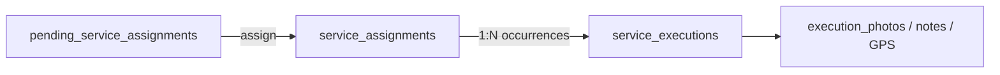

# Sprint 7 Planning — Service Execution

**Project:** CWP Detailers  
**Date:** 15 June 2026  
**Status:** Planning only — **not authorized for implementation**  
**Prerequisite:** Sprint 6 approved with conditions (this document satisfies the planning gate)

**Governing docs:** [`FINAL_ARCHITECTURE_SIGNOFF.md`](./FINAL_ARCHITECTURE_SIGNOFF.md), [`IMPLEMENTATION_SEQUENCE_V1.md`](./IMPLEMENTATION_SEQUENCE_V1.md), [`DATA_RELATIONSHIP_V1.md`](./DATA_RELATIONSHIP_V1.md), [`SPRINT_6_COMPLETION_REPORT.md`](./SPRINT_6_COMPLETION_REPORT.md)

---

## 1. Sprint 6 Approval Conditions (Carry Forward)

Sprint 6 is **approved with conditions**. These constraints govern Sprint 7:

| Condition | Sprint 7 implication |
|-----------|---------------------|
| Do not redesign Sprint 6 | Assignment APIs, tables, and `/admin/assign-services` remain unchanged |
| Mark legacy assignment paths deprecated | Done — see §8; remove only after execution migration |
| `pending_service_assignments` = long-term operational queue | All new enqueue adapters write here; no parallel queues |
| Before Sprint 7 **completion**, all service sources enqueue | §4 is a **hard gate** before Sprint 7 sign-off |
| Do not merge execution into `service_assignments` | §3 — execution is a separate domain model |
| Execution = its own domain | New tables, APIs, and UI; read-only link from assignment |

---

## 2. Domain Separation (Founder Rules)

Assignment and execution are **different bounded contexts**. Sprint 6 ends at **Assigned**. Sprint 7 begins at **Started**.

```text
ASSIGNMENT DOMAIN (Sprint 6 — frozen)
  pending_service_assignments  →  service_assignments
  Status: pending → assigned

EXECUTION DOMAIN (Sprint 7 — new)
  service_executions (+ child records)
  Status: scheduled → started → completed | missed | cancelled | rescheduled
```

**Forbidden:** Adding `startedAt`, `completedAt`, photos, GPS, or visit status columns to `service_assignments`.

**Required:** `service_executions.service_assignment_id` FK (nullable during legacy bridge only).

---

## 3. Proposed Execution Domain Model

### 3.1 Core entity: `service_executions`

| Column | Purpose |
|--------|---------|
| `id` | PK |
| `service_assignment_id` | FK → `service_assignments.id` (required for new flow) |
| `contract_id` | Denormalized audit |
| `customer_id` | Tenant scope |
| `service_location_id` | Location anchor |
| `asset_id` | Optional |
| `assigned_staff_id` | Staff at execution time |
| `scheduled_date` | Operational date |
| `scheduled_time` | Optional slot |
| `status` | `scheduled`, `started`, `completed`, `missed`, `cancelled`, `rescheduled` |
| `started_at` | Execution start |
| `completed_at` | Execution end |
| `cancellation_reason` | Text |
| `rescheduled_from_id` | Self-FK for reschedule chain |
| Tenant cols | `company_id`, `franchisee_id`, `branch_id` |
| Timestamps | `created_at`, `updated_at` |

### 3.2 Child / evidence tables (separate from assignment)

| Table | Purpose |
|-------|---------|
| `service_execution_photos` | Before/after/proof URLs |
| `service_execution_notes` | Technician + customer notes |
| `service_execution_checklist_items` | Optional checklist completion |
| `service_execution_location_logs` | GPS / geo events (Sprint 7+) |

Legacy tables (`bookings`, `dcms_visits`) remain during bridge; new work writes to execution domain first, with optional sync adapters.

### 3.3 Relationship diagram



One assignment may produce many executions (recurring DCMS, AMC visit credits). One-time services: typically 1:1.

---

## 4. Prerequisite Gate — Pending Enqueue Adapters

**Must complete before Sprint 7 sign-off.** Canonical enqueue: `enqueuePendingServiceAssignment()` in `pendingAssignmentEnqueue.ts`.

| Source | Current state | Sprint 7 prerequisite work |
|--------|---------------|----------------------------|
| Book Services → contract billing | ✅ Live | None |
| DCMS subscription activate/renew | ❌ Legacy `dcms_staff_assignments` | Contract registry row + enqueue on subscription active |
| Solar AMC / entitlements | ❌ No enqueue | Contract + enqueue on entitlement activation |
| Wash packages / subscriptions | ❌ No enqueue | Contract + enqueue on package activation |
| Legacy one-time bookings | ❌ `bookings.staffId` direct assign | Bridge: confirm booking → contract + enqueue OR migrate booking to contract-first |

**Rule:** No product line may bypass `pending_service_assignments`. Legacy paths stay deprecated until their adapter is live and ops validates Assign Services queue.

---

## 5. Sprint 7 Objectives

### 5.1 Execution engine

- Create execution schema (§3) via migration `034+`
- APIs: start, complete, miss, cancel, reschedule, list today's work, get detail
- Staff app consumes execution APIs (not assignment APIs) for field work
- Admin **Service Updates** (`/admin/service-updates`) — unified live ops timeline

### 5.2 UI consolidation (from IMPLEMENTATION_SEQUENCE_V1)

| Screen | Action |
|--------|--------|
| `/admin/service-updates` | Canonical ops dashboard (from Operations Wall) |
| `/admin/daily-cleaning/visits` | Embed or link under Service Updates |
| `/admin/daily-cleaning/washes` | Embed or link under Service Updates |
| `/admin/daily-cleaning/staff-performance` | Embed or link under Service Updates |
| DCMS Operations sidebar | Simplify; deprecate duplicate assign entry |
| `/admin/assign-services` | **Unchanged** — link from Service Updates for pending items |

### 5.3 Legacy bridge (transitional)

| Legacy | Bridge strategy |
|--------|-------------------|
| `bookings` status transitions | Dual-write to `service_executions` OR read-through adapter |
| `dcms_visits` | Link visit completion to `service_execution_id` |
| `POST /api/bookings/:id/assign` | Remove after enqueue + assign migration |
| `POST /api/daily-cleaning/assignments` | Remove after DCMS enqueue adapter |

Bridge is **temporary**. Target state: assignment → execution only through canonical entities.

---

## 6. API Surface (Planned — Not Implemented)

### Execution (new router `service-executions.ts`)

| Method | Path | Action |
|--------|------|--------|
| `GET` | `/api/service-executions/today` | Staff + admin today's work |
| `GET` | `/api/service-executions/:id` | Detail + evidence |
| `POST` | `/api/service-executions/:id/start` | Started |
| `POST` | `/api/service-executions/:id/complete` | Completed + photos |
| `POST` | `/api/service-executions/:id/miss` | Missed |
| `POST` | `/api/service-executions/:id/cancel` | Cancelled |
| `POST` | `/api/service-executions/:id/reschedule` | New execution row linked |

### Assignment (Sprint 6 — frozen)

No new endpoints. Optional: spawn first `scheduled` execution when assignment created — decision at Sprint 7 kickoff (default: separate scheduler).

### Operations timeline

| Method | Path | Action |
|--------|------|--------|
| `GET` | `/api/operations/timeline` | Extend with execution domain + business labels |

---

## 7. Staff App (Sprint 7 Scope)

| Today (legacy) | Target |
|----------------|--------|
| DCMS staff assignments list | List `service_executions` for logged-in staff |
| Booking start/complete on `bookings` | Start/complete on `service_executions` |
| Visit photo on `dcms_visits` | Photo on `service_execution_photos` |

Staff app must **not** write assignment state. It reads assignments only to show context; actions mutate execution only.

---

## 8. Deprecated Paths (Marked in Sprint 6.1)

| Path | Deprecation |
|------|-------------|
| `POST /api/bookings/:id/assign` | HTTP `Deprecation` header + `@deprecated` |
| `PATCH /api/bookings/:id` with `staffId` | Documented in `LEGACY_ASSIGNMENT_PATHS` |
| `GET/POST /api/daily-cleaning/assignments` | HTTP `Deprecation` header |
| `GET /api/daily-cleaning/staff/assignments` | HTTP `Deprecation` header |
| `dcmsStaffAssignmentsTable` writes via `assignStaff()` | JSDoc `@deprecated` |
| `/admin/daily-cleaning/assignments` | UI banner + nav label "Legacy" |

Removal target: after enqueue adapters live **and** execution bridge validated.

---

## 9. Implementation Phases (Suggested)

### Phase A — Schema + execution CRUD (no staff app)

- Migration for `service_executions` + evidence tables
- Execution service + admin APIs
- Unit/integration tests for state machine

### Phase B — Pending enqueue adapters

- DCMS, solar, wash, legacy booking bridges (§4)
- Verify unified pending queue populated for each product line

### Phase C — Service Updates UI

- Operations Wall → Service Updates
- Timeline from executions + pending/assigned counts

### Phase D — Staff app + legacy bridge

- Staff execution flows
- Dual-write or read-through for `bookings` / `dcms_visits`
- Deprecation sunset for legacy assign APIs

---

## 10. Acceptance Criteria (Draft — for Sprint 7 Authorization)

- [ ] `service_executions` exists; **no** execution columns on `service_assignments`
- [ ] All product lines enqueue to `pending_service_assignments` (§4 gate)
- [ ] Staff can start/complete work via execution APIs
- [ ] Service Updates shows unified timeline (bookings + DCMS + contract work)
- [ ] Legacy assign APIs still work but marked deprecated until sunset
- [ ] Customer 360 remains read-only for execution controls
- [ ] Assignment flow unchanged from Sprint 6

---

## 11. Risks

| Risk | Mitigation |
|------|------------|
| Dual-write drift (bookings vs executions) | Idempotent execution IDs; reconciliation job |
| Recurring services (DCMS) 1:N executions | Assignment once; cron generates scheduled executions |
| Premature legacy removal | Keep deprecated paths until §4 gate green |
| Scope creep into assignment | Code review gate: no execution fields on `service_assignments` |

---

## 12. Next Step

**Await explicit Sprint 7 authorization** before Phase A implementation. This document is the planning deliverable following Sprint 6 conditional approval.

Recommended authorization packet:

1. Approve §3 execution schema
2. Confirm §4 enqueue gate is mandatory pre-sign-off
3. Prioritize Phase A vs B order (schema-first recommended)
4. Confirm staff app scope for Sprint 7 vs 7B
