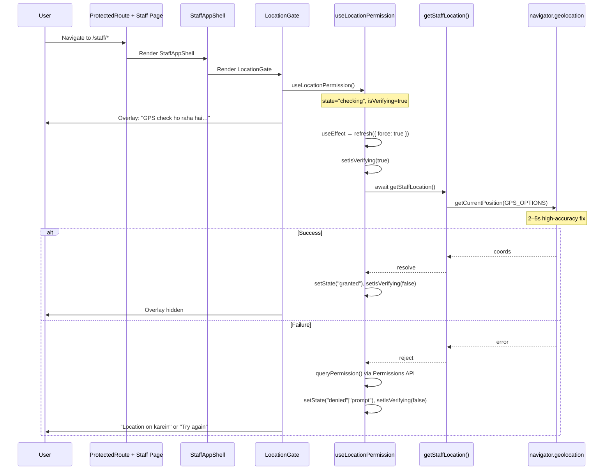

# Staff Portal GPS Implementation Audit Report

**Project:** CWP Detailers  
**Date:** 7 July 2026  
**Version:** 1.0  
**Scope:** Staff Portal (`/staff/*`) — read-only code audit  
**Status:** Inspection only — **no code changes made**

---

## Executive Summary

GPS in the Staff Portal is **gate-based**, not continuous. A `LocationGate` overlay blocks staff UI until a one-shot `getCurrentPosition()` succeeds. That gate is mounted **inside every staff page's `StaffAppShell`**, so **each route navigation remounts the gate and requests GPS again** with `maximumAge: 0` (always fresh).

There is **no `watchPosition()`**, **no global store**, and **three duplicate GPS helpers** besides the canonical `getStaffLocation()`.

The ~3 second "GPS check ho raha hai…" delay is expected: high-accuracy, zero-cache GPS acquisition on mobile.

**Primary finding:** Per-page `StaffAppShell` architecture causes redundant GPS reads on every tab switch, producing slow navigation and unnecessary battery use.

---

## 1. Where is GPS Initialized?

| Layer | File | Component / Function |
|-------|------|----------------------|
| **Entry point** | `artifacts/cwp-platform/src/components/layout/StaffAppShell.tsx` | `StaffAppShell` wraps children in `<LocationGate>` |
| **Gate UI** | `artifacts/cwp-platform/src/lib/location/LocationGate.tsx` | `LocationGate` |
| **Permission logic** | `artifacts/cwp-platform/src/lib/location/useLocationPermission.ts` | `useLocationPermission` hook |
| **GPS read** | `artifacts/cwp-platform/src/lib/location/getStaffLocation.ts` | `getStaffLocation()` |
| **Options** | `artifacts/cwp-platform/src/lib/location/constants.ts` | `GPS_OPTIONS`, `GPS_RECHECK_INTERVAL_MS` |

### Mount Tree

```
ProtectedRoute (auth only — no GPS)
  └── StaffDashboard / StaffDailyClean / StaffBookings / StaffProfile / etc.
        └── StaffAppShell
              └── LocationGate
                    └── useLocationPermission()  ← GPS initialized here on mount
                          └── getStaffLocation()
                                └── navigator.geolocation.getCurrentPosition()
```

### Pages Using StaffAppShell (and therefore LocationGate)

- `pages/staff/Dashboard.tsx`
- `pages/staff/DailyClean.tsx`
- `pages/staff/Bookings.tsx`
- `pages/staff/Profile.tsx`
- `pages/staff/Jobs.tsx`
- `pages/staff/Earnings.tsx`
- `components/staff/StaffAccountGate.tsx` (loading / error states — **nested extra shell**)

`/staff/login` does **not** use `StaffAppShell` or `LocationGate`.

---

## 2. Which API is Being Used?

| API | Used? | Where |
|-----|-------|-------|
| `navigator.geolocation.getCurrentPosition()` | **Yes** | Primary path everywhere |
| `watchPosition()` | **No** | Not used anywhere in codebase |
| `clearWatch()` | **No** | N/A |
| Permissions API (`navigator.permissions.query`) | **Yes, fallback only** | `useLocationPermission.ts` → `queryPermission()` — called only when `getStaffLocation()` **throws** |
| Custom wrapper | **Yes** | `getStaffLocation()` in `getStaffLocation.ts` |

### Additional Duplicate Wrappers (Staff Portal)

| Function | File | Used For |
|----------|------|----------|
| `getStaffGps()` | `hooks/useStaffJobsData.ts` | Job transitions, geo-tagged photo uploads |
| `getGps()` | `features/daily-cleaning/lib/cameraCapture.ts` | DCMS visit photo capture, walk-in DCMS |
| Inline `getCurrentPosition` | `components/staff/StaffWalkInPanel.tsx` | Walk-in resolve |

`components/shared/LocationPicker.tsx` also calls `getCurrentPosition` but is **admin/customer UI**, not Staff Portal.

---

## 3. When is GPS Verification Running?

| Trigger | Running? | Details |
|---------|----------|---------|
| **App startup (PWA boot)** | **No** | No global GPS on `main.tsx` / `App.tsx` |
| **Staff login page** | **No** | `/staff/login` has no `LocationGate` |
| **First staff page after login** | **Yes** | First `StaffAppShell` mount triggers gate |
| **Every route change** | **Yes** | Each staff page owns its own `StaffAppShell`; old page unmounts, new one remounts `LocationGate` |
| **Every page mount** | **Yes** | Same reason — per-page shell, not a shared layout |
| **Before every protected page** | **Partially** | `ProtectedRoute` only checks auth/roles; GPS runs when the staff **page component** mounts `StaffAppShell` |
| **Before every API call** | **No** | Only location-sensitive mutations |
| **Before attendance only** | **No** | Gate runs on **every** staff tab; attendance adds a **second** GPS read on button tap |
| **Tab visibility change** | **Sometimes** | `visibilitychange` → `refresh()` if not throttled |
| **User taps "Enable location"** | **Yes** | `refresh({ force: true })` |

### Action-Based GPS (Separate from Gate)

| Action | Function | File |
|--------|----------|------|
| Shift check-in | `markAttendanceWithLocation()` | `lib/location/staffLocationApi.ts` |
| Booking status: en_route, in_progress, completed | `transitionBookingWithLocation()` | `lib/location/staffLocationApi.ts` |
| Execution start/complete | `getStaffGps()` | `hooks/useStaffJobsData.ts` |
| Geo-tagged photo upload | `getStaffGps()` | `hooks/useStaffJobsData.ts` |
| DCMS visit photo | `getGps()` | `features/daily-cleaning/lib/cameraCapture.ts` |
| Walk-in resolve | inline `getCurrentPosition` | `components/staff/StaffWalkInPanel.tsx` |
| Walk-in DCMS photo | `getGps()` | `StaffWalkInPanel.tsx` |

---

## 4. What Causes "GPS check ho raha hai…" — Call Stack & Flow

### Condition (Exact)

From `LocationGate.tsx`:

- Modal overlay renders when `!isReady` (`state !== "granted"`).
- The specific string **"GPS check ho raha hai…"** appears when `isVerifying === true` and device is supported.

### Execution Flow

```
StaffPage mount
  → StaffAppShell render
    → LocationGate render
      → useLocationPermission()
        → useEffect (mount)
          → refresh({ force: true })
            → setIsVerifying(true)          // modal text = "GPS check ho raha hai…"
            → getStaffLocation()
              → navigator.geolocation.getCurrentPosition(success, error, GPS_OPTIONS)
                → success callback
                  → setState("granted")
                  → setIsVerifying(false)   // modal dismissed
```

### Failure Path (Permissions API)

```
refresh()
  → getStaffLocation() throws
    → queryPermission()
      → navigator.permissions.query({ name: "geolocation" })
    → setState("denied" | "prompt" | "granted")
    → setIsVerifying(false)                 // modal stays but text changes
```

### Sequence Diagram



---

## 5. How Many Location Requests in One Session?

### Example: Login → Dashboard → Daily Clean → Bookings → Profile

**Passive navigation only** (`getCurrentPosition` from `LocationGate`):

| Step | GPS Calls | Why |
|------|-----------|-----|
| Login (`/staff/login`) | **0** | No `LocationGate` |
| Dashboard (first load) | **1–2** | `StaffAccountGate` may mount its own `StaffAppShell` during `scopeLoading`, then main `StaffAppShell` mounts after load |
| Dashboard → Daily Clean | **+1** | New page, new `LocationGate` |
| Daily Clean → Bookings | **+1** | New page |
| Bookings → Profile | **+1 to +2** | Same `StaffAccountGate` double-mount risk on Profile |

**Typical total for that navigation path: 4–6 `getCurrentPosition` calls**, each with fresh GPS (`maximumAge: 0`).

**Not counted:** in-tab job selection on Bookings (`?job=` via `replaceState`) does **not** remount `StaffAppShell` → **no extra GPS**.

### Action-Based Additions (If User Performs Them)

| User Action | Extra GPS Calls |
|-------------|-----------------|
| Mark attendance on Profile | +1 (`markAttendanceWithLocation`) |
| Start/complete a booking job | +1 (`transitionBookingWithLocation` or `getStaffGps`) |
| Upload geo-tagged photo | +1 (`getStaffGps`) |
| Complete DCMS visit photo | +1 (`getGps`) |
| Walk-in customer resolve | +1 (inline) |
| Walk-in DCMS photo | +1 (`getGps`) |

---

## 6. Is `watchPosition()` Used?

**No.** Zero usages of `watchPosition` or `clearWatch` anywhere in the codebase.

---

## 7. Every `getCurrentPosition()` Call Site (Staff-Relevant)

| # | File | Function | Trigger |
|---|------|----------|---------|
| 1 | `lib/location/getStaffLocation.ts` | `getStaffLocation()` | `LocationGate` mount, visibility refresh, attendance, booking transitions |
| 2 | `hooks/useStaffJobsData.ts` | `getStaffGps()` | Execution start/complete, geo photo upload |
| 3 | `features/daily-cleaning/lib/cameraCapture.ts` | `getGps()` | DCMS visit capture |
| 4 | `components/staff/StaffWalkInPanel.tsx` | inline | Walk-in resolve |
| 5 | `components/staff/StaffWalkInPanel.tsx` | `getGps()` | Walk-in DCMS photo |

---

## 8. Request Options

### Canonical Gate / Attendance / Bookings (`GPS_OPTIONS`)

```typescript
// artifacts/cwp-platform/src/lib/location/constants.ts
export const GPS_OPTIONS: PositionOptions = {
  enableHighAccuracy: true,
  timeout: 20_000,
  maximumAge: 0,
};
```

| Option | Gate / `getStaffLocation` | `getStaffGps` / `getGps` / Walk-in Inline |
|--------|---------------------------|-------------------------------------------|
| `enableHighAccuracy` | **true** | **true** |
| `timeout` | **20,000 ms** | **15,000 ms** |
| `maximumAge` | **0** (explicit) | **0** (browser default when omitted) |

---

## 9. Fresh Fix vs Cached?

**Always fresh for the gate.** `maximumAge: 0` means the browser must not return a cached position for `getStaffLocation()`.

The 60-second throttle in `useLocationPermission` only skips a **re-check within the same `LocationGate` instance** — it does **not** help across route changes because the hook remounts and calls `refresh({ force: true })`.

On mount, `force: true` **always bypasses** the throttle.

---

## 10. Is GPS Status Stored Globally?

| Mechanism | Used for GPS? |
|-----------|---------------|
| React Context | **No** |
| Zustand (`lib/store.ts`, `lib/authFlowStore.ts`) | **No** |
| Redux | **No** |
| React Query | **No** (only for staff/booking data, not GPS permission) |
| Session / local storage | **No** |
| **Local React state** | **Yes** — `useState` in `useLocationPermission` (`state`, `isVerifying`) |
| **Refs** | `lastCheckedAtRef` — throttle timestamp only, lost on unmount |

GPS permission state is **ephemeral per `LocationGate` mount** — not shared across staff tabs.

---

## 11. Does Route Navigation Trigger GPS Verification Again?

**Yes.** Each staff page imports and renders its **own** `StaffAppShell`. Wouter swaps page components on navigation → full unmount/remount → new `useLocationPermission` → `refresh({ force: true })` → new `getCurrentPosition`.

There is **no shared staff layout** above the route level that would preserve `LocationGate` across tabs.

---

## 12. Polling or Interval Checking?

| Mechanism | GPS-Related? |
|-----------|--------------|
| `GPS_RECHECK_INTERVAL_MS = 60_000` | Throttle only — not polling |
| `visibilitychange` listener | Re-check when tab becomes visible (respects 60s throttle unless `force`) |
| `useStaffJobsData` `refetchInterval: 30_000` | **API data polling** — not GPS |
| `connectivityService` `setInterval` | Network status — not GPS |

**No GPS polling interval exists.**

---

## 13. Why ~3 Seconds?

Likely causes, in order:

1. **`enableHighAccuracy: true`** — prefers GPS chip / satellite over Wi‑Fi/cell; typically 2–5s on Android PWA.
2. **`maximumAge: 0`** — no cached fix; every gate mount waits for a new acquisition.
3. **Per-navigation remount** — user sees the full acquisition delay on every tab switch, not a one-time startup cost.
4. **Cold start after unmount** — previous page's granted state is discarded; no warm GPS session is reused at the app level.
5. **Modal blocks on entire promise** — overlay stays until `getCurrentPosition` resolves; UI does not show partial/cached state.
6. **Not the timeout** — timeout is 15–20s; ~3s is normal fix time, not a timeout failure.

---

## 14. Recommended Architecture

### Problems Today

1. **Per-page `StaffAppShell`** → GPS gate remounts on every tab.
2. **Fresh high-accuracy fix on every mount** → slow navigation, battery drain.
3. **Four duplicate GPS helpers** → inconsistent timeouts/options.
4. **Gate conflates permission check with field-action GPS** → blocking overlay for navigation.
5. **No location cache** → action flows re-acquire GPS even seconds after gate passed.

### Recommended Design

```
┌─────────────────────────────────────────────────────────┐
│  StaffLayout (single mount, survives route changes)      │
│    └── LocationProvider (Zustand or Context)             │
│          ├── permissionState: granted | denied | ...     │
│          ├── lastFix: { lat, lng, accuracy, at }         │
│          └── watchId?: number (optional background)      │
│    └── StaffAppShell (nav only, no GPS logic)            │
│          └── {children} — no gate remount on tab switch  │
└─────────────────────────────────────────────────────────┘
```

| Concern | Recommendation |
|---------|----------------|
| **Fast page navigation** | Hoist `LocationGate` / provider to **one staff layout** wrapping all `/staff/*` routes in `App.tsx`; never remount on tab change |
| **Permission vs fix** | Split: Permissions API / one-time prompt for **permission**; defer high-accuracy fix to **actions** |
| **Cached location** | Keep `lastFix` in memory (5–30 min `maximumAge` for navigation); use `maximumAge: 0` only for attendance / geofenced actions |
| **Background monitoring** | Optional `watchPosition` with `enableHighAccuracy: false` while app is foreground; `clearWatch` on `visibilitychange → hidden` |
| **Action-based verification** | Gate checks permission only; `getStaffLocation({ fresh: true })` only for attendance, job transitions, photos |
| **Minimum battery** | No GPS on route change; no `maximumAge: 0` on navigation; stop watch when backgrounded |
| **PWA compatible** | Single service module; persist `permissionState` + coarse `lastFix` in `sessionStorage`; revalidate on `visibilitychange` with 60s+ throttle |
| **Code consolidation** | Delete `getStaffGps`, `getGps`, inline walk-in GPS; one `staffGps.ts` with shared options profiles: `NAV_CACHE`, `ACTION_FRESH` |

### Suggested Flow After Refactor

```
App open (staff authenticated)
  → StaffLayout mounts once
  → Check permission (Permissions API, no GPS yet) — instant
  → If granted: optionally read cached fix or low-accuracy watch — non-blocking
  → User navigates Dashboard ↔ Daily Clean ↔ Bookings — zero new GPS
  → User taps "Check in" / "Start job"
  → getStaffLocation({ fresh: true, highAccuracy: true }) — 1 fix, action-scoped
```

### Quick Wins (Lowest Effort)

1. Move `LocationGate` from per-page `StaffAppShell` to a **single staff route wrapper**.
2. Change gate check to **Permissions API first**; only call `getCurrentPosition` if permission unknown.
3. Use `maximumAge: 30_000` for gate re-checks; reserve `maximumAge: 0` for geofenced actions.
4. Consolidate all GPS reads into `getStaffLocation()`.

---

## File Reference Map

```
artifacts/cwp-platform/src/
├── lib/location/
│   ├── LocationGate.tsx          # Modal UI ("GPS check ho raha hai…")
│   ├── useLocationPermission.ts  # Hook: mount + visibility refresh
│   ├── getStaffLocation.ts       # Canonical getCurrentPosition wrapper
│   ├── staffLocationApi.ts       # Attendance + booking transitions
│   ├── constants.ts              # GPS_OPTIONS, GPS_RECHECK_INTERVAL_MS
│   └── types.ts
├── components/layout/StaffAppShell.tsx   # Wraps LocationGate
├── hooks/useStaffJobsData.ts             # Duplicate getStaffGps()
├── features/daily-cleaning/lib/cameraCapture.ts  # Duplicate getGps()
└── components/staff/StaffWalkInPanel.tsx # Inline + getGps()
```

---

## Answers Checklist

| # | Question | Answer |
|---|----------|--------|
| 1 | Where is GPS initialized? | `StaffAppShell` → `LocationGate` → `useLocationPermission` → `getStaffLocation` |
| 2 | Which API? | `getCurrentPosition()` primary; Permissions API fallback; no `watchPosition`; custom `getStaffLocation()` wrapper |
| 3 | When does verification run? | On staff page mount and tab visibility — **not** on login, app boot, every API call, or attendance-only |
| 4 | What causes the modal? | `!isReady && isVerifying` in `LocationGate`; triggered by `useEffect → refresh({ force: true }) → getStaffLocation()` |
| 5 | Session location count? | **4–6** passive calls for Login→Dashboard→Daily Clean→Bookings→Profile; more per field action |
| 6 | `watchPosition()`? | **No** |
| 7 | Multiple `getCurrentPosition()`? | **Yes** — 5 call sites (see section 7) |
| 8 | Options? | Gate: `highAccuracy=true, timeout=20s, maximumAge=0`; actions: `highAccuracy=true, timeout=15s` |
| 9 | Fresh or cached? | **Fresh fix every gate mount** (`maximumAge: 0`) |
| 10 | Global storage? | **Local React state only** in `useLocationPermission` — no global store |
| 11 | Route navigation retriggers? | **Yes** — each route remounts `LocationGate` |
| 12 | Polling? | **No GPS polling**; 60s throttle + visibility listener only |
| 13 | Why ~3 seconds? | High-accuracy + zero cache + per-navigation remount ≈ 2–5s typical |
| 14 | Best architecture? | Single layout provider, permission-only gate, cached nav fix, action-fresh GPS, optional background watch |

---

*End of report.*
