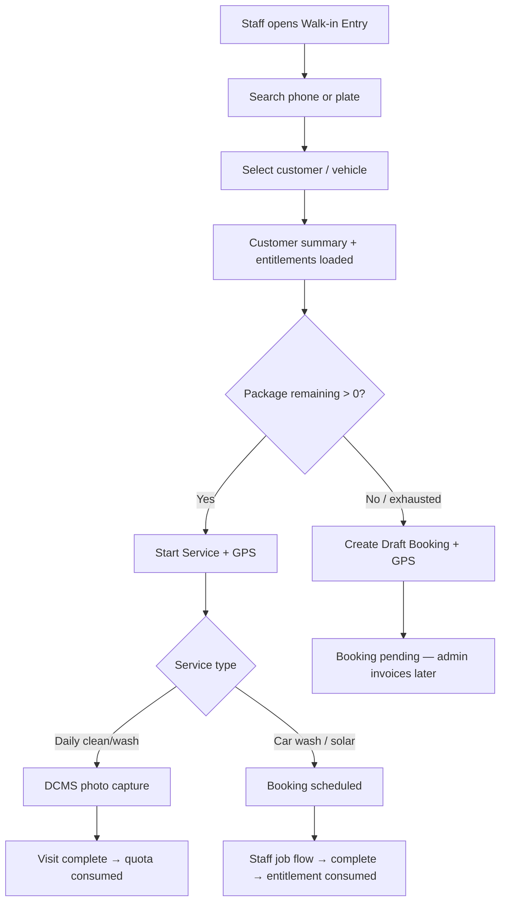

# Walk-in Entry Module Redesign — Verification Report

## 1. Architecture

The Staff Walk-in Entry module is a **customer-centric** layer on top of the existing Admin Booking System. Staff search for a customer; the API returns subscription entitlements from `getCustomerServicesHub`. Staff start a service (package consumption path) or create a draft booking (payment pending). No duplicate booking engine, invoice, or payment logic was introduced.

```
Staff Portal (StaffWalkInPanel)
        │
        ▼
GET /api/staff/walk-in/customer/:id  ──► getWalkInCustomerContext()
        │                                      │
        │                                      ▼
        │                              getCustomerServicesHub()
        │                              (entitlements, DCMS, legacy subs)
        ▼
POST /api/staff/walk-in/resolve  ──► resolveWalkInJob()
        │                                      │
        ├─ daily_clean / daily_wash ──────────► DCMS visit (photo + quota)
        │
        └─ car_wash / solar / draft ──────────► bookings table (existing)
                                                    │
                                                    ▼
                                            Admin Booking System
                                            (invoice, payment, assign)
```

## 2. Files Changed

| File | Change |
|------|--------|
| `artifacts/api-server/src/lib/staff/walkInService.ts` | Customer context API, entitlement cards, audit logging, branch/customer validation, `forceDraft` |
| `artifacts/api-server/src/routes/staff-walk-in.ts` | Enhanced customer endpoint, `accuracy` + `forceDraft` on resolve |
| `artifacts/cwp-platform/src/features/staff-walk-in/api.ts` | New types, improved error messages |
| `artifacts/cwp-platform/src/components/staff/StaffWalkInPanel.tsx` | Full UI redesign — customer-centric entitlements |

## 3. Booking APIs Reused

| API | Usage |
|-----|-------|
| `POST /api/staff/walk-in/resolve` | Creates or reuses `bookings` row via `resolveWalkInJob()` |
| `POST /api/bookings/:id/transition` | Existing job lifecycle after walk-in booking resolve |
| `findExistingWalkInBooking()` | Dedup today's active booking per customer + service type |
| `tenantStamp()` | Tenant scoping on booking insert |
| `findEligibleEntitlement()` | Entitlement validation before scheduled booking |

Draft bookings use `status: "pending"` — same as admin-created pending bookings.

## 4. Subscription APIs Reused

| Source | Usage |
|--------|-------|
| `getCustomerServicesHub()` | Single read model for entitlements, DCMS, legacy subscriptions |
| `customer_entitlements` | Wash/cleaning/solar credits with `validUntil`, `remainingCredits` |
| `dcms_subscriptions` | Daily clean/wash remaining counts |
| `subscriptions` (legacy) | Car wash / solar AMC remaining visits |

## 5. Database Reused (No New Schema)

| Table | Role |
|-------|------|
| `bookings` | Walk-in bookings + draft (`pending`) |
| `customer_entitlements` | Package credits |
| `entitlement_consumption_log` | Consumed on booking completion (existing) |
| `dcms_subscriptions` / `dcms_visits` | Daily clean walk-in path |
| `subscriptions` | Legacy package linkage |
| `staff_location_logs` | Walk-in GPS audit via `recordStaffLocation()` |
| `customers`, `vehicles`, `branches` | Customer summary header |

## 6. No Duplicate Logic Confirmation

- **No** new booking tables or status machines
- **No** invoice or payment link generation in walk-in flow
- **No** duplicate entitlement engine — uses `entitlementEngine` on completion
- **No** new pricing logic — admin handles pricing after draft
- Walk-in resolve **inserts into existing `bookings`** or returns DCMS visit handoff

## 7. Walk-in Flow Diagram



## 8. Package Consumption Flow

1. Staff taps **Start Service** on an active entitlement card
2. Fresh GPS captured (`getStaffLocation("action")`)
3. `POST /staff/walk-in/resolve` validates customer + branch access
4. **DCMS path**: returns `mode: "dcms"` → staff takes photo → `POST /daily-cleaning/visits/complete` decrements quota
5. **Booking path**: creates `scheduled` booking with `entitlementId` or `subscriptionId`
6. On job **completion** (`POST /bookings/:id/transition` → `completed`), existing engines consume credits:
   - `consumeEntitlementOnCompletion()` → `entitlement_consumption_log`
   - `decrementOnCompletion()` for legacy subscriptions

## 9. Draft Booking Flow

1. Staff taps **Create Draft Booking** (exhausted package or no package)
2. Fresh GPS captured
3. `resolveWalkInJob({ forceDraft: true })` creates booking with:
   - `status: "pending"`
   - `notes: "Staff walk-in — draft booking, payment pending"`
   - No `amount`, no invoice, no payment link
4. Admin Booking System handles pricing, discount, invoice, payment, assignment

## 10. Permission Handling Flow

| Layer | Behavior |
|-------|----------|
| `guardResource("staff")` | Requires `staff:view` for walk-in endpoints |
| `requireStaff()` | Ensures `role === "staff"` + `staffId` present |
| `assertWalkInCustomerAccess()` | Customer active, branch match |
| Frontend `formatWalkInError()` | Maps `Permission denied` → actionable message with resource/action |

Backend errors surfaced verbatim: inactive customer, wrong branch, package exhausted, location required, etc.

## 11. Error Handling Flow

```
API error { error, resource?, action? }
        │
        ▼
walkInFetch → formatWalkInError()
        │
        ▼
Toast: title + description (backend message)
```

Examples now shown to staff:
- "Customer belongs to another branch — walk-in entry not allowed for your branch"
- "Package exhausted — no remaining cleaning visits. Create a draft booking instead."
- "You do not have permission to view staff."

## 12. Screens Before vs After

### Before (service-centric)
- Service type pills: Car wash, Solar clean, Daily clean, Daily wash
- Staff chose service before seeing package
- Quota shown as generic label ("No active package — draft booking...")
- Generic "Permission denied" errors
- No customer header (name, membership, branch)
- No remaining count / expiry per service
- Single "Start entry" button

### After (customer-centric)
- **Header card**: Vehicle, registration, customer name, ID, membership badge, branch
- **Active packages**: Per-service cards with remaining, expiry, status
- **Today's eligible services**: Recommended vs optional list
- **Per-card actions**: "Start Service" (active) or "Create Draft Booking" (exhausted/inactive)
- **No active package** empty state with draft CTA
- Backend error messages surfaced in toasts
- Multi-vehicle picker when customer has multiple vehicles

## GPS & Audit

Both **Start Service** and **Create Draft Booking** capture fresh GPS (latitude, longitude, accuracy) and log to `staff_location_logs` via `recordStaffLocation()` with metadata:
- `walkInAction`: `start_service` | `create_draft_booking`
- `customerId`, `serviceKind`, `bookingId` / `subscriptionId`
